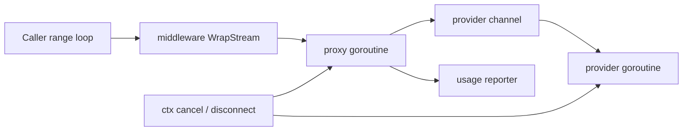
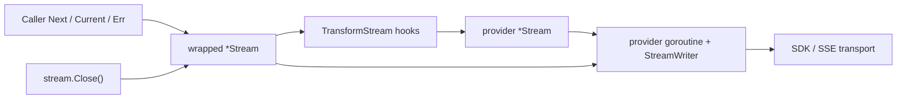

# Stream Type And Middleware Redesign

## Goal

Replace channel-based streaming in `meridian-llm-go` with a pull-based `*Stream` so:

- middleware wraps iteration without proxy goroutines
- transport errors move out of `StreamEvent` and into `stream.Err()`
- providers still emit AG-UI events plus Meridian metadata
- early `Close()` and context cancellation shut down cleanly

## Problem

The current shape has two different concerns collapsed into one channel:

- payload delivery: AG-UI events, blocks, final metadata
- transport lifecycle: cancellation, body close, parse failure, reporter failure

That forces middleware to proxy the channel just to observe terminal metadata. The current usage-metering middleware does exactly that, which is how the goroutine leak and double-reporting edge cases appeared. Any future stream middleware would have to repeat the same pattern.

## Decisions

| Question | Decision | Rationale |
|---|---|---|
| Stream cursor API | `Next()`, `Current()`, `Err()`, `Close()` | Matches `bufio.Scanner`, `sql.Rows`, and Anthropic's `ssestream`; middleware can wrap iteration synchronously |
| Transport errors | Out-of-band via `stream.Err()` | Keeps payload and transport failure separate; AG-UI `RUN_ERROR` stays as a normal protocol event |
| `StreamEvent.Error` | Remove it from the primary API | Two error paths is the bug factory; terminal transport errors should not be in-band |
| Channel exposure | Do not expose the internal channel | Keeps buffering and shutdown private; avoids reintroducing channel-coupled middleware |
| Channel compatibility | Add an explicit legacy adapter helper | Lets channel-based callers migrate incrementally without polluting the core API |
| Middleware stream wrapping | Keep provider-level `WrapStream`, but wrap returned `*Stream` with `TransformStream(...)` | Preserves gate/short-circuit behavior while removing proxy goroutines |
| Provider authoring | Add `NewPushStream(...)` and `StreamWriter` | Providers still need a safe write side; this centralizes cancellation-aware emission |
| `EventEmitter` target | `StreamSink` / `StreamWriter`, not `chan<- StreamEvent` | Makes emission context-aware and compatible with `stream.Close()` |
| Fan-out | Not supported | Stream is single-consumer by design; fan-out is a separate buffering policy |
| Helper surface | Keep only `TransformStream(...)` and the legacy channel adapter | `ProxyStream` is no longer a core pattern once middleware is pull-based |

## Before And After

### Before



### After



The important change is structural: middleware no longer owns a goroutine. Only the provider owns transport-reading goroutines, and those goroutines are tied to `StreamWriter.Context()` plus `stream.Close()`.

## Public API

### `streaming.go`

```go
package llmprovider

import (
    "context"

    "github.com/ag-ui-protocol/ag-ui/sdks/community/go/pkg/core/events"
)

type StreamEvent struct {
    Event                  events.Event `json:"event,omitempty"`
    Block                  *Block       `json:"block,omitempty"`
    Metadata               *StreamMetadata `json:"metadata,omitempty"`
    GenerationIDDiscovered *GenerationIDEvent `json:"generationIDDiscovered,omitempty"`
}

type StreamMetadata struct {
    Model            string
    InputTokens      int
    OutputTokens     int
    StopReason       string
    GenerationID     string
    ResponseMetadata map[string]any
}

type GenerationIDEvent struct {
    GenerationID string
    Model        string
    Provider     string
}

// Stream is a single-consumer cursor over StreamEvent values.
// The zero value is invalid; callers obtain it from StreamResponse or helpers.
type Stream struct {
    nextFn    func() bool
    currentFn func() StreamEvent
    errFn     func() error
    closeFn   func() error
}

func (s *Stream) Next() bool
func (s *Stream) Current() StreamEvent
func (s *Stream) Err() error
func (s *Stream) Close() error

// StreamWriter is the provider-side write handle used by NewPushStream.
// It is safe for exactly one producer goroutine.
type StreamWriter struct {
    // unexported
}

// Context returns the stream-owned child context.
// Providers must use this instead of the original ctx so stream.Close()
// shuts them down even when the caller context is still alive.
func (w *StreamWriter) Context() context.Context

// Emit delivers one event or returns the context error if the stream was closed.
func (w *StreamWriter) Emit(event StreamEvent) error

// Close finishes the stream successfully. Idempotent.
// The first terminal call wins.
func (w *StreamWriter) Close() error

// CloseWithError finishes the stream with a terminal transport error. Idempotent.
// The first terminal call wins.
func (w *StreamWriter) CloseWithError(err error) error

// NewPushStream creates a Stream backed by a provider-owned producer goroutine.
// Close cancels the child context and waits for the producer to exit.
func NewPushStream(
    ctx context.Context,
    buffer int,
    produce func(*StreamWriter),
) *Stream
```

### `provider.go`

```go
package llmprovider

import "context"

type Provider interface {
    GenerateResponse(ctx context.Context, req *GenerateRequest) (*GenerateResponse, error)
    StreamResponse(ctx context.Context, req *GenerateRequest) (*Stream, error)
    Name() ProviderID
    SupportsModel(model string) bool
}
```

### `middleware.go`

```go
package llmprovider

import "context"

type StreamFunc func(ctx context.Context, req *GenerateRequest) (*Stream, error)

type GenerateFunc func(ctx context.Context, req *GenerateRequest) (*GenerateResponse, error)

type ProviderCallInfo struct {
    Provider ProviderID
}

type ProviderMiddleware interface {
    WrapStream(info ProviderCallInfo, next StreamFunc) StreamFunc
    WrapGenerate(info ProviderCallInfo, next GenerateFunc) GenerateFunc
}

type WrappedProvider interface {
    Provider
    Unwrap() Provider
}

func WrapProvider(provider Provider, middleware ...ProviderMiddleware) Provider
```

### Stream transform helper

```go
package llmprovider

type StreamInterceptor struct {
    // OnEvent runs once for each upstream event before the caller sees it.
    // Returning an error suppresses that event, closes upstream, and becomes Err().
    OnEvent func(StreamEvent) (StreamEvent, error)

    // OnDone runs once after a clean upstream EOF.
    OnDone func() error

    // OnErr runs once after an upstream transport error.
    // Returning nil preserves the upstream error.
    // Returning non-nil replaces it.
    OnErr func(error) error

    // OnClose runs once when the caller closes the wrapper early.
    OnClose func() error
}

// TransformStream wraps a Stream without spawning goroutines.
// All interceptor hooks run in the caller goroutine that invoked Next or Close.
func TransformStream(upstream *Stream, interceptor StreamInterceptor) *Stream
```

### Legacy channel adapter

```go
package llmprovider

import "context"

// LegacyStreamEvent preserves the old channel consumption shape for transitional callers.
// New code should use *Stream directly.
type LegacyStreamEvent struct {
    Event StreamEvent
    Err   error
}

func StreamResponseChan(
    ctx context.Context,
    provider Provider,
    req *GenerateRequest,
) (<-chan LegacyStreamEvent, error)

func StreamChan(
    ctx context.Context,
    stream *Stream,
) <-chan LegacyStreamEvent
```

`StreamChan(...)` is the only place that should spin a proxy goroutine after this redesign. It is explicit, transitional, and outside the middleware path.
When `stream.Err()` is non-nil, the adapter sends one final `LegacyStreamEvent{Err: err}` before closing the channel.

## Stream Semantics

- `Stream` is single-consumer. Concurrent `Next()` calls are unsupported.
- `Current()` is valid only after `Next()` returns `true`.
- `Err()` is checked after `Next()` returns `false`.
- Natural completion: the caller sees zero or more events, then `Next() == false`, then `Err() == nil`.
- Transport failure: the caller sees zero or more events, then `Next() == false`, then `Err() != nil`.
- Early caller stop: `Close()` cancels the stream-owned child context, waits for provider shutdown, and returns any close error. A caller-initiated `Close()` should not turn into a synthetic transport error.
- `Metadata` remains the last in-band event on successful completion. There is still at most one metadata event per stream.
- AG-UI `RUN_ERROR` remains an ordinary `StreamEvent.Event`. It is not coupled to `stream.Err()`.
- Provider implementations must pass `w.Context()` into any SDK or HTTP call that blocks on streaming reads. `stream.Close()` only works if the transport is bound to the child context.

## Middleware Composition

Provider-level composition stays the same: first middleware listed is outermost, gates still happen before provider start, and middleware can still short-circuit by returning its own `*Stream`.

The difference is what happens after `next(...)` returns:

```go
func (m *myMiddleware) WrapStream(info ProviderCallInfo, next StreamFunc) StreamFunc {
    return func(ctx context.Context, req *GenerateRequest) (*Stream, error) {
        stream, err := next(ctx, req)
        if err != nil {
            return nil, err
        }

        return TransformStream(stream, StreamInterceptor{
            OnEvent: func(event StreamEvent) (StreamEvent, error) {
                // inspect / rewrite / fail
                return event, nil
            },
        }), nil
    }
}
```

That is the core design win. Middleware logic runs in the same pull path as the caller. No channel proxy. No forwarding race. No hidden buffer or close ownership.

## Usage Metering

### Current shape

Today `usage_metering.go` must:

- gate before start
- call `next(...)`
- create a proxy channel
- spawn a goroutine
- forward every event
- intercept metadata
- possibly swap metadata for `StreamEvent{Error: err}`

That is exactly the pattern reviewers flagged as leak-prone.

### Proposed shape

```go
func (m *usageMeteringMiddleware) WrapStream(info ProviderCallInfo, next StreamFunc) StreamFunc {
    if m.gate == nil && m.reporter == nil {
        return next
    }

    return func(ctx context.Context, req *GenerateRequest) (*Stream, error) {
        scope, _ := UsageScopeFromContext(ctx)

        if m.gate != nil {
            decision, err := m.gate.CheckUsage(ctx, UsageGateRequest{
                Provider: info.Provider,
                Model:    req.Model,
                Request:  req,
                Scope:    scope,
            })
            if err != nil {
                return nil, err
            }
            if !decision.Allowed {
                return nil, &UsageDeniedError{
                    Code:     decision.Code,
                    Reason:   decision.Reason,
                    Scope:    scope,
                    Metadata: decision.Metadata,
                }
            }
        }

        stream, err := next(ctx, req)
        if err != nil || m.reporter == nil {
            return stream, err
        }

        var reported bool
        return TransformStream(stream, StreamInterceptor{
            OnEvent: func(event StreamEvent) (StreamEvent, error) {
                if event.Metadata == nil || reported {
                    return event, nil
                }

                reported = true
                report := UsageReport{
                    Provider:         info.Provider,
                    Model:            event.Metadata.Model,
                    Scope:            scope,
                    InputTokens:      event.Metadata.InputTokens,
                    OutputTokens:     event.Metadata.OutputTokens,
                    StopReason:       event.Metadata.StopReason,
                    GenerationID:     event.Metadata.GenerationID,
                    ResponseMetadata: event.Metadata.ResponseMetadata,
                }
                if err := m.reporter.ReportUsage(ctx, report); err != nil {
                    return StreamEvent{}, err
                }

                return event, nil
            },
        }), nil
    }
}
```

Why this fixes the two known failure modes:

- no proxy goroutine exists, so there is nothing left to leak in middleware
- metadata reporting happens exactly when the caller advances past the metadata event
- reporter failure suppresses metadata delivery and becomes `stream.Err()`
- there is no path where metadata is forwarded and then separately replaced by an in-band error event

## EventEmitter Redesign

`EventEmitter` should move from raw channels to a context-aware sink:

```go
package llmprovider

import (
    "context"

    "github.com/ag-ui-protocol/ag-ui/sdks/community/go/pkg/core/events"
)

type StreamSink interface {
    Context() context.Context
    Emit(StreamEvent) error
}

type EventEmitter struct {
    sink StreamSink
}

func NewEventEmitter(sink StreamSink) *EventEmitter

func (e *EventEmitter) TextMessageStart(messageID, role string) error
func (e *EventEmitter) TextMessageContent(messageID, delta string) error
func (e *EventEmitter) TextMessageEnd(messageID string) error
func (e *EventEmitter) ThinkingStart(title *string) error
func (e *EventEmitter) ThinkingTextMessageStart() error
func (e *EventEmitter) ThinkingTextMessageContent(delta string) error
func (e *EventEmitter) ThinkingTextMessageEnd() error
func (e *EventEmitter) ThinkingEnd() error
func (e *EventEmitter) ToolCallStart(toolCallID, toolCallName string, parentMessageID *string) error
func (e *EventEmitter) ToolCallArgs(toolCallID, delta string) error
func (e *EventEmitter) ToolCallEnd(toolCallID string) error
func (e *EventEmitter) ToolCallResult(messageID, toolCallID, content string) error
func (e *EventEmitter) RunStarted(threadID, runID string) error
func (e *EventEmitter) RunFinished(threadID, runID string) error
func (e *EventEmitter) RunError(message string, runID *string) error
func (e *EventEmitter) StepStarted(stepName string) error
func (e *EventEmitter) StepFinished(stepName string) error
func (e *EventEmitter) Block(block *Block) error
func (e *EventEmitter) Metadata(metadata *StreamMetadata) error
func (e *EventEmitter) GenerationIDDiscovered(generationID, model, provider string) error
func (e *EventEmitter) EmitEvent(event events.Event) error
```

Key changes:

- `EventEmitter.Error(err)` goes away
- transport errors use `writer.CloseWithError(err)`
- every emit method returns `error` so provider loops can stop on cancellation or early `Close()`
- `StreamWriter` implements `StreamSink`

This keeps AG-UI payloads on the event path and transport failure on the stream lifecycle path.

## Provider Implementation Pattern

### Standard pattern

```go
func (p *Provider) StreamResponse(ctx context.Context, req *llmprovider.GenerateRequest) (*llmprovider.Stream, error) {
    if err := p.validate(req); err != nil {
        return nil, err
    }

    return llmprovider.NewPushStream(ctx, 16, func(w *llmprovider.StreamWriter) {
        emitter := llmprovider.NewEventEmitter(w)
        streamCtx := w.Context()

        defer w.Close()

        if err := p.produce(streamCtx, req, emitter); err != nil {
            _ = w.CloseWithError(err)
            return
        }
    }), nil
}
```

Provider rules:

- use `w.Context()`, not the original `ctx`
- emit payload events only through `EventEmitter` or `w.Emit(...)`
- never emit transport failure as a `StreamEvent`
- call `w.CloseWithError(err)` for parse failures, HTTP failures after start, idle timeouts, or middleware-induced close handling

### Anthropic

- Replace `eventChan := make(chan ...)` plus outer goroutine with `NewPushStream(...)`.
- Replace `eventChan <- StreamEvent{Error: ...}` with `w.CloseWithError(...)`.
- Keep Anthropic SDK accumulation logic and AG-UI transformation exactly as today.
- If the SDK still needs an internal helper goroutine for idle-timeout select logic, keep it provider-local and tie it to `w.Context()`. Middleware is no longer involved.

### OpenRouter

- Replace the returned channel with `NewPushStream(...)`.
- `streamEvents(...)` and `streamResponsesEvents(...)` should emit through `EventEmitter` / `StreamWriter`.
- SSE read errors, idle timeouts, and body-close failures become `CloseWithError(...)`.
- The current scanner/body-close goroutines can stay provider-local if needed, but they should be scoped to `w.Context()` and disappear when `stream.Close()` is called.

### Lorem

- Replace `make(chan ...)` and the outer goroutine with `NewPushStream(...)`.
- `streamTextBlock`, `streamThinkingBlock`, and tool streaming helpers should return early on emitter error.
- No `Error(...)` emission path remains; cancellation simply returns through `w.Context()`.

## Proxy Helpers

`ProxyStream` is no longer a core abstraction and should not be added.

What remains useful:

- `NewPushStream(...)` for providers that naturally produce events from a goroutine
- `TransformStream(...)` for middleware that decorates pull-based iteration
- `StreamChan(...)` only as a compatibility bridge

That is enough surface for the known use cases without growing an Rx-style pipeline library.

## Implementation Notes

### New internal files

- `stream.go`: `Stream`, `TransformStream`, wrapper implementations
- `stream_writer.go`: `StreamWriter`, `NewPushStream`, producer coordination
- `legacy_streaming.go`: `LegacyStreamEvent`, `StreamResponseChan`, `StreamChan`

### Existing files to update

- `provider.go`
- `middleware.go`
- `usage_metering.go`
- `streaming.go`
- `event_emitter.go`
- `providers/anthropic/streaming.go`
- `providers/openrouter/streaming.go`
- `providers/openrouter/responses_streaming.go`
- `providers/lorem/provider.go`
- docs and examples that currently range over `<-chan StreamEvent`

### Verification targets

- middleware composition order still matches `WrapProvider(...)`
- `Close()` stops provider goroutines even if caller stops reading before EOF
- `UsageReporter` failure appears as `stream.Err()` and metadata is not delivered
- AG-UI `RUN_ERROR` still travels as a normal `StreamEvent.Event`
- no middleware path spawns goroutines
- legacy channel adapter preserves old integration points during migration

## Migration Checklist

1. Change `Provider.StreamResponse` and `StreamFunc` to return `*Stream`.
2. Remove `StreamEvent.Error` from the primary streaming model.
3. Add `Stream`, `StreamWriter`, `NewPushStream`, and `TransformStream`.
4. Rewrite `EventEmitter` to target `StreamSink` and return `error`.
5. Update `WrapProvider` and `wrappedProvider` to use `*Stream`.
6. Rewrite `usage_metering.go` to use `TransformStream` instead of proxy channels.
7. Migrate Anthropic, OpenRouter, and Lorem providers to `NewPushStream`.
8. Add `legacy_streaming.go` with `StreamResponseChan(...)`.
9. Update examples and docs to use:

```go
stream, err := provider.StreamResponse(ctx, req)
if err != nil {
    return err
}
defer stream.Close()

for stream.Next() {
    event := stream.Current()
    // handle event
}
if err := stream.Err(); err != nil {
    return err
}
```

10. Add regression tests for early close, context cancel, reporter failure, and middleware short-circuit streams.
