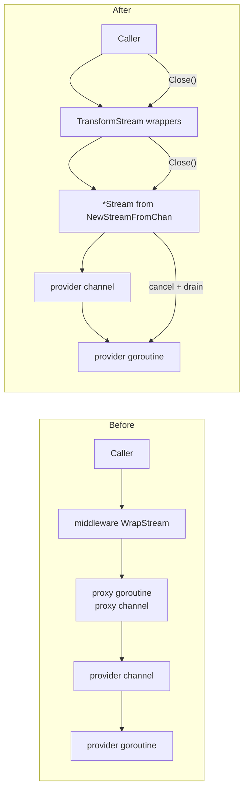
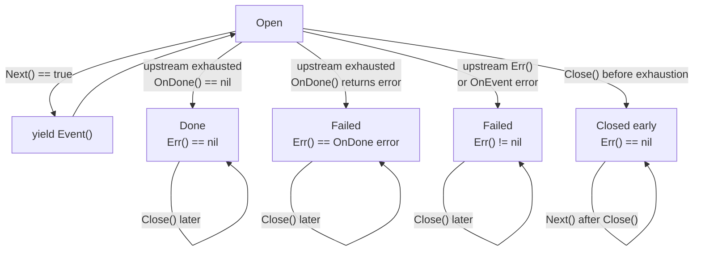
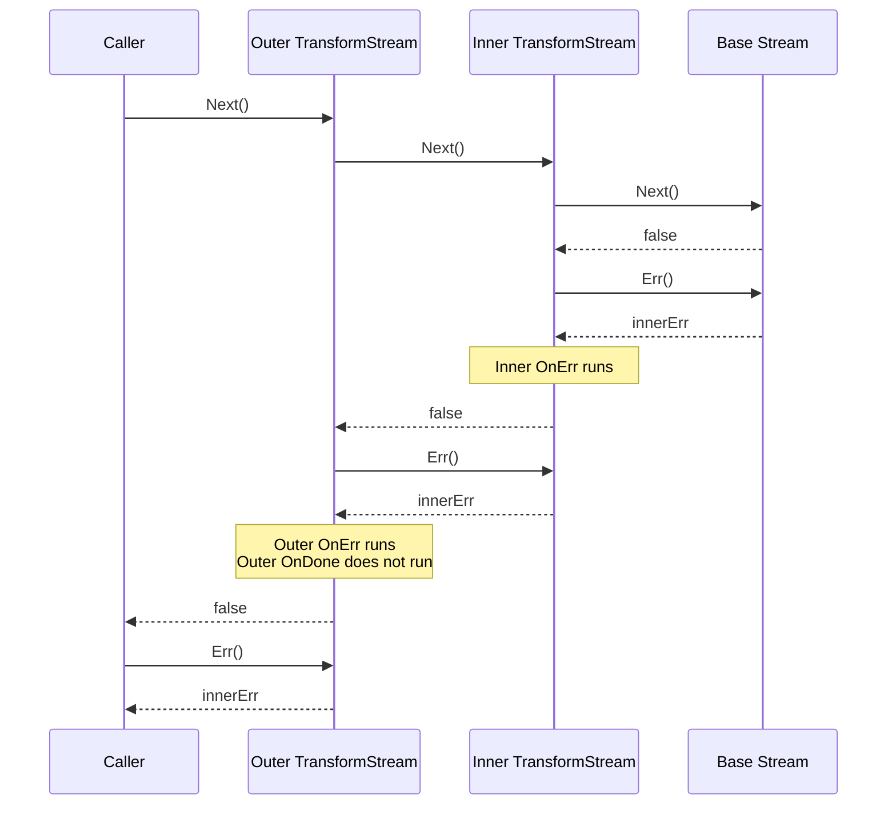

# Final Stream Type Design

## Goal

Replace channel-shaped public streaming in `meridian-llm-go` with a pull-based `*Stream` so middleware can wrap iteration without proxy goroutines, while keeping provider internals and `EventEmitter` mostly unchanged.

This is the decided hybrid:

- Consumer API: scanner-style `Next()`, `Event()`, `Err()`, `Close()`
- Middleware API: `TransformStream(upstream, StreamInterceptor{...})`
- Provider authoring API: `NewStreamFromChan(ctx, ch, cancel)` around the provider's existing event channel
- `EventEmitter`: unchanged for now
- `StreamEvent.Error`: kept as an internal transport field from provider channel to `NewStreamFromChan`; consumers of `*Stream` use `stream.Err()`

## Non-Goals

- No fan-out or multi-consumer stream support
- No retry middleware inside `TransformStream`
- No `NewPushStream` / `StreamWriter` in this change

## Consumer Shape

```go
stream, err := provider.StreamResponse(ctx, req)
if err != nil {
    return err
}
defer stream.Close()

for stream.Next() {
    ev := stream.Event()
    // handle ev
}
if err := stream.Err(); err != nil {
    return err
}
```

## Decisions

| Topic | Decision | Rationale |
|---|---|---|
| Consumer API | Scanner-style `Next()`, `Event()`, `Err()`, `Close()` | Matches `bufio.Scanner`, `sql.Rows`, and Anthropic's `ssestream`; middleware can wrap iteration synchronously. |
| Event accessor name | `Event()`, not `Current()` | Reads better at call sites and was explicitly requested. |
| Provider bridge | `NewStreamFromChan(ctx, ch, cancel)` | Keeps provider goroutines and `EventEmitter` intact while centralizing consumer-facing shutdown semantics. |
| Middleware wrapper | `TransformStream` with `StreamInterceptor` | Eliminates middleware proxy goroutines and keeps composition local to `Next()` / `Close()`. |
| Transport errors | Surface through `stream.Err()` | Removes the consumer-facing dual error path. |
| `StreamEvent.Error` | Keep exported but document as internal transport only | Providers still emit in-band terminal errors on their internal channel; `NewStreamFromChan` converts them to `Err()`. |
| `EventEmitter` | Leave unchanged | Minimizes provider churn in this pass. |
| Panic containment | Provider goroutines must recover and emit `StreamEvent{Error: ...}`; `NewStreamFromChan` also recovers its own receive/drain paths | Go cannot recover a panic across goroutines. The crash boundary must be in the producer goroutine, but the stream wrapper should still defend its own code. |
| `OnEvent` error contract | Non-nil error ignores the returned event, closes upstream, and becomes `stream.Err()` | Makes interception failures deterministic and stops upstream work immediately. |
| `OnDone` vs `OnClose` | Mutually exclusive terminal states | Clean exhaustion and early caller stop mean different things; middleware must observe them distinctly. |
| `OnDone` returning error | The error becomes `stream.Err()` | Lets middleware convert clean completion into a failure when settlement/reporting fails. |
| Multi-layer transform errors | Outer wrapper sees `Next() == false`, `Err() == innerErr`, so outer `OnErr` runs | Makes wrapper composition predictable. |
| `Close()` semantics | Idempotent; `Next()` after `Close()` returns `false`; `*Stream` satisfies `io.Closer` | Matches normal Go resource semantics. |
| Backward compat | None | v0.0.X with single consumer, no compatibility promises. |
| Retry support | Not supported in `TransformStream` | There is no replay buffer; once an event is consumed or an upstream error occurs, a middleware wrapper cannot restart the stream safely. |
| Tests | Add `StreamFromSlice(events, err)` | Makes middleware and terminal-state tests synchronous and deterministic. |
| Future emitter improvement | Sticky-error `EventEmitter.Err()` pattern | Valuable, but not required to land the stream redesign. |
| Future push API | If `NewPushStream` is ever added later, its producer function should return `error` | A void producer is too easy to misuse and makes completion semantics fragile. |
| Future iterator adapter | `Seq() iter.Seq[StreamEvent]` can be added later | Nice ergonomics, but not required for the core redesign. |

## Architecture

### Before / After



### Stream Lifecycle



`OnDone` and `OnClose` are mutually exclusive:

- If `Next()` reaches clean exhaustion first, `OnDone` runs once and `OnClose` never runs, even if `Close()` is called later.
- If `Close()` wins before clean exhaustion, `OnClose` runs once and `OnDone` never runs.

### Middleware Composition



## Public Types And Implementations

### `streaming.go`

```go
package llmprovider

import "github.com/ag-ui-protocol/ag-ui/sdks/community/go/pkg/core/events"

type StreamEvent struct {
    Event                  events.Event        `json:"event,omitempty"`
    Block                  *Block              `json:"block,omitempty"`
    Metadata               *StreamMetadata     `json:"metadata,omitempty"`
    GenerationIDDiscovered *GenerationIDEvent  `json:"generationIDDiscovered,omitempty"`

    // Internal transport field: provider goroutine -> NewStreamFromChan only.
    // Consumers of *Stream should ignore this and use stream.Err().
    Error error `json:"error,omitempty"`
}

type StreamMetadata struct {
    Model            string
    InputTokens      int
    OutputTokens     int
    StopReason       string
    GenerationID     string
    ResponseMetadata map[string]any
}

type GenerationIDEvent struct {
    GenerationID string
    Model        string
    Provider     string
}
```

### `stream.go`

```go
package llmprovider

import (
    "context"
    "errors"
    "fmt"
    "io"
    "runtime/debug"
    "sync"
)

type Stream struct {
    nextFn  func() bool
    eventFn func() StreamEvent
    errFn   func() error
    closeFn func() error
}

func (s *Stream) Next() bool        { return s.nextFn() }
func (s *Stream) Event() StreamEvent { return s.eventFn() }
func (s *Stream) Err() error        { return s.errFn() }
func (s *Stream) Close() error      { return s.closeFn() }

var _ io.Closer = (*Stream)(nil)

func NewStream(
    next func() bool,
    event func() StreamEvent,
    errFn func() error,
    closeFn func() error,
) *Stream {
    if next == nil || event == nil || errFn == nil || closeFn == nil {
        panic("llmprovider: NewStream requires non-nil callbacks")
    }
    return &Stream{
        nextFn:  next,
        eventFn: event,
        errFn:   errFn,
        closeFn: closeFn,
    }
}

type streamTerminal uint8

const (
    streamOpen streamTerminal = iota
    streamDone
    streamFailed
    streamClosed
)

type StreamPanicError struct {
    Recovered any
    Stack     []byte
}

func (e *StreamPanicError) Error() string {
    return fmt.Sprintf("llmprovider: stream panic: %v", e.Recovered)
}

func NewStreamPanicError(recovered any) error {
    return &StreamPanicError{
        Recovered: recovered,
        Stack:     debug.Stack(),
    }
}

type chanStreamState struct {
    ctx    context.Context
    cancel context.CancelFunc
    ch     <-chan StreamEvent

    mu       sync.Mutex
    current  StreamEvent
    err      error
    terminal streamTerminal

    terminalOnce     sync.Once
    closeOnce        sync.Once
    producerDoneOnce sync.Once
    drainOnce        sync.Once
    done             chan struct{}
}

func (s *chanStreamState) setCurrent(ev StreamEvent) {
    s.mu.Lock()
    s.current = ev
    s.mu.Unlock()
}

func (s *chanStreamState) currentEvent() StreamEvent {
    s.mu.Lock()
    defer s.mu.Unlock()
    return s.current
}

func (s *chanStreamState) setTerminal(kind streamTerminal, err error) {
    s.terminalOnce.Do(func() {
        s.mu.Lock()
        s.terminal = kind
        s.err = err
        s.mu.Unlock()
    })
}

func (s *chanStreamState) terminalState() streamTerminal {
    s.mu.Lock()
    defer s.mu.Unlock()
    return s.terminal
}

func (s *chanStreamState) terminalErr() error {
    s.mu.Lock()
    defer s.mu.Unlock()
    return s.err
}

func (s *chanStreamState) markProducerDone() {
    s.producerDoneOnce.Do(func() {
        close(s.done)
    })
}

func (s *chanStreamState) startDrain() {
    s.drainOnce.Do(func() {
        go func() {
            defer s.markProducerDone()
            defer func() {
                if r := recover(); r != nil {
                    s.setTerminal(streamFailed, NewStreamPanicError(r))
                    s.cancel()
                }
            }()
            for range s.ch {
            }
        }()
    })
}

// NewStreamFromChan wraps a provider-owned event channel.
//
// Required provider contract:
//   - ctx must be the provider-owned child context used by the transport
//   - cancel must cancel that child context
//   - the producer goroutine must close ch on exit
//   - the producer goroutine must recover panics and emit StreamEvent{Error: ...}
//
// Why the explicit producer-side recover? Because Go cannot recover a panic
// from a different goroutine. NewStreamFromChan recovers its own receive/drain
// paths, but the provider goroutine is still the crash boundary for transport code.
func NewStreamFromChan(ctx context.Context, ch <-chan StreamEvent, cancel context.CancelFunc) *Stream {
    if ctx == nil || ch == nil || cancel == nil {
        panic("llmprovider: NewStreamFromChan requires non-nil ctx, ch, and cancel")
    }

    state := &chanStreamState{
        ctx:      ctx,
        cancel:   cancel,
        ch:       ch,
        terminal: streamOpen,
        done:     make(chan struct{}),
    }

    next := func() (ok bool) {
        defer func() {
            if r := recover(); r != nil {
                state.setTerminal(streamFailed, NewStreamPanicError(r))
                state.cancel()
                ok = false
            }
        }()

        if state.terminalState() != streamOpen {
            return false
        }

        // The two-level select gives channel reads priority. If an event
        // is already buffered, it is delivered even when ctx is simultaneously
        // cancelled. Only when the channel would block does ctx.Done() take effect.
        select {
        case ev, open := <-state.ch:
            if !open {
                state.markProducerDone()
                state.setTerminal(streamDone, nil)
                return false
            }

            if ev.Error != nil {
                state.setTerminal(streamFailed, ev.Error)
                state.cancel()
                return false
            }

            state.setCurrent(ev)
            return true
        default:
            select {
            case ev, open := <-state.ch:
                if !open {
                    state.markProducerDone()
                    state.setTerminal(streamDone, nil)
                    return false
                }

                if ev.Error != nil {
                    state.setTerminal(streamFailed, ev.Error)
                    state.cancel()
                    return false
                }

                state.setCurrent(ev)
                return true
            case <-state.ctx.Done():
                state.setTerminal(streamFailed, state.ctx.Err())
                return false
            }
        }
    }

    closeFn := func() error {
        state.closeOnce.Do(func() {
            state.setTerminal(streamClosed, nil)
            state.cancel()
            state.startDrain()
            <-state.done
        })
        return nil
    }

    return NewStream(
        next,
        state.currentEvent,
        state.terminalErr,
        closeFn,
    )
}

func StreamFromSlice(events []StreamEvent, terminalErr error) *Stream {
    var (
        mu       sync.Mutex
        current  StreamEvent
        index    int
        closed   bool
        closeOnce sync.Once
    )

    next := func() bool {
        mu.Lock()
        defer mu.Unlock()

        if closed || index >= len(events) {
            return false
        }

        current = events[index]
        index++
        return true
    }

    event := func() StreamEvent {
        mu.Lock()
        defer mu.Unlock()
        return current
    }

    errFn := func() error {
        mu.Lock()
        defer mu.Unlock()
        // Terminal error is preserved even after Close().
        // This matches NewStreamFromChan behavior where Close()
        // after clean exhaustion preserves the terminal state.
        if index >= len(events) {
            return terminalErr
        }
        return nil
    }

    closeFn := func() error {
        closeOnce.Do(func() {
            mu.Lock()
            closed = true
            mu.Unlock()
        })
        return nil
    }

    return NewStream(next, event, errFn, closeFn)
}

type StreamInterceptor struct {
    // OnEvent runs for each upstream event before the caller sees it.
    // If OnEvent returns a non-nil error, the returned StreamEvent is ignored,
    // upstream is closed, and the error becomes stream.Err().
    OnEvent func(StreamEvent) (StreamEvent, error)

    // OnDone runs exactly once after clean upstream exhaustion.
    // If it returns a non-nil error, that error becomes stream.Err()
    // even though upstream completed cleanly.
    OnDone func() error

    // OnErr runs exactly once after upstream failure.
    // The return value, if non-nil, replaces the upstream error.
    // Return nil to pass through unchanged.
    OnErr func(error) error

    // OnClose runs exactly once when Close() wins before clean exhaustion.
    // It never runs after OnDone.
    OnClose func() error
}

type transformState struct {
    mu       sync.Mutex
    current  StreamEvent
    err      error
    closeErr error
    terminal streamTerminal

    terminalOnce sync.Once
    closeOnce    sync.Once
}

func (s *transformState) setCurrent(ev StreamEvent) {
    s.mu.Lock()
    s.current = ev
    s.mu.Unlock()
}

func (s *transformState) currentEvent() StreamEvent {
    s.mu.Lock()
    defer s.mu.Unlock()
    return s.current
}

func (s *transformState) setTerminal(kind streamTerminal, err error) {
    s.terminalOnce.Do(func() {
        s.mu.Lock()
        s.terminal = kind
        s.err = err
        s.mu.Unlock()
    })
}

func (s *transformState) terminalState() streamTerminal {
    s.mu.Lock()
    defer s.mu.Unlock()
    return s.terminal
}

func (s *transformState) terminalErr() error {
    s.mu.Lock()
    defer s.mu.Unlock()
    return s.err
}

func (s *transformState) appendCloseErr(err error) {
    if err == nil {
        return
    }

    s.mu.Lock()
    defer s.mu.Unlock()

    if s.closeErr == nil {
        s.closeErr = err
        return
    }
    s.closeErr = errors.Join(s.closeErr, err)
}

func (s *transformState) getCloseErr() error {
    s.mu.Lock()
    defer s.mu.Unlock()
    return s.closeErr
}

func TransformStream(upstream *Stream, interceptor StreamInterceptor) *Stream {
    state := &transformState{terminal: streamOpen}

    next := func() (ok bool) {
        defer func() {
            if r := recover(); r != nil {
                _ = upstream.Close()
                state.setTerminal(streamFailed, NewStreamPanicError(r))
                ok = false
            }
        }()

        if state.terminalState() != streamOpen {
            return false
        }

        if !upstream.Next() {
            if state.terminalState() == streamClosed {
                return false
            }

            if err := upstream.Err(); err != nil {
                finalErr := err
                if interceptor.OnErr != nil {
                    if replacement := interceptor.OnErr(err); replacement != nil {
                        finalErr = replacement
                    }
                }
                state.setTerminal(streamFailed, finalErr)
                return false
            }

            if interceptor.OnDone != nil {
                if err := interceptor.OnDone(); err != nil {
                    state.setTerminal(streamFailed, err)
                    return false
                }
            }

            state.setTerminal(streamDone, nil)
            return false
        }

        ev := upstream.Event()
        if interceptor.OnEvent != nil {
            transformed, err := interceptor.OnEvent(ev)
            if err != nil {
                _ = upstream.Close()
                state.setTerminal(streamFailed, err)
                return false
            }
            ev = transformed
        }

        state.setCurrent(ev)
        return true
    }

    closeFn := func() error {
        state.closeOnce.Do(func() {
            if state.terminalState() == streamOpen {
                state.setTerminal(streamClosed, nil)
                func() {
                    defer func() {
                        if r := recover(); r != nil {
                            state.appendCloseErr(NewStreamPanicError(r))
                        }
                    }()
                    if interceptor.OnClose != nil {
                        state.appendCloseErr(interceptor.OnClose())
                    }
                }()
            }
            state.appendCloseErr(upstream.Close())
        })
        return state.getCloseErr()
    }

    return NewStream(
        next,
        state.currentEvent,
        state.terminalErr,
        closeFn,
    )
}
```

### `provider.go`

```go
package llmprovider

import "context"

type Provider interface {
    GenerateResponse(ctx context.Context, req *GenerateRequest) (*GenerateResponse, error)
    StreamResponse(ctx context.Context, req *GenerateRequest) (*Stream, error)
    Name() ProviderID
    SupportsModel(model string) bool
}
```

### `middleware.go`

```go
package llmprovider

import "context"

type StreamFunc func(ctx context.Context, req *GenerateRequest) (*Stream, error)

type GenerateFunc func(ctx context.Context, req *GenerateRequest) (*GenerateResponse, error)

type ProviderCallInfo struct {
    Provider ProviderID
}

type ProviderMiddleware interface {
    WrapStream(info ProviderCallInfo, next StreamFunc) StreamFunc
    WrapGenerate(info ProviderCallInfo, next GenerateFunc) GenerateFunc
}

type WrappedProvider interface {
    Provider
    Unwrap() Provider
}

func WrapProvider(provider Provider, middleware ...ProviderMiddleware) Provider {
    if len(middleware) == 0 {
        return provider
    }

    info := ProviderCallInfo{
        Provider: provider.Name(),
    }

    streamFn := StreamFunc(provider.StreamResponse)
    generateFn := GenerateFunc(provider.GenerateResponse)

    for i := len(middleware) - 1; i >= 0; i-- {
        streamFn = middleware[i].WrapStream(info, streamFn)
        generateFn = middleware[i].WrapGenerate(info, generateFn)
    }

    return &wrappedProvider{
        base:       provider,
        streamFn:   streamFn,
        generateFn: generateFn,
    }
}

type wrappedProvider struct {
    base       Provider
    streamFn   StreamFunc
    generateFn GenerateFunc
}

func (w *wrappedProvider) GenerateResponse(ctx context.Context, req *GenerateRequest) (*GenerateResponse, error) {
    return w.generateFn(ctx, req)
}

func (w *wrappedProvider) StreamResponse(ctx context.Context, req *GenerateRequest) (*Stream, error) {
    return w.streamFn(ctx, req)
}

func (w *wrappedProvider) Name() ProviderID {
    return w.base.Name()
}

func (w *wrappedProvider) SupportsModel(model string) bool {
    return w.base.SupportsModel(model)
}

func (w *wrappedProvider) Unwrap() Provider {
    return w.base
}
```

### `usage_metering.go`

```go
package llmprovider

import (
    "context"
    "fmt"
)

type usageMeteringMiddleware struct {
    gate     UsageGate
    reporter UsageReporter
}

func NewUsageMeteringMiddleware(gate UsageGate, reporter UsageReporter) ProviderMiddleware {
    return &usageMeteringMiddleware{
        gate:     gate,
        reporter: reporter,
    }
}

func (m *usageMeteringMiddleware) WrapGenerate(info ProviderCallInfo, next GenerateFunc) GenerateFunc {
    if m.gate == nil && m.reporter == nil {
        return next
    }

    return func(ctx context.Context, req *GenerateRequest) (*GenerateResponse, error) {
        scope, _ := UsageScopeFromContext(ctx)

        if m.gate != nil {
            decision, err := m.gate.CheckUsage(ctx, UsageGateRequest{
                Provider: info.Provider,
                Model:    req.Model,
                Request:  req,
                Scope:    scope,
            })
            if err != nil {
                return nil, err
            }
            if !decision.Allowed {
                return nil, &UsageDeniedError{
                    Code:     decision.Code,
                    Reason:   decision.Reason,
                    Scope:    scope,
                    Metadata: decision.Metadata,
                }
            }
        }

        resp, err := next(ctx, req)
        if err != nil {
            return nil, err
        }

        if m.reporter != nil {
            report := UsageReport{
                Provider:         info.Provider,
                Model:            resp.Model,
                Scope:            scope,
                InputTokens:      resp.InputTokens,
                OutputTokens:     resp.OutputTokens,
                StopReason:       resp.StopReason,
                ResponseMetadata: resp.ResponseMetadata,
            }
            if err := m.reporter.ReportUsage(ctx, report); err != nil {
                return nil, err
            }
        }

        return resp, nil
    }
}

func (m *usageMeteringMiddleware) WrapStream(info ProviderCallInfo, next StreamFunc) StreamFunc {
    if m.gate == nil && m.reporter == nil {
        return next
    }

    return func(ctx context.Context, req *GenerateRequest) (*Stream, error) {
        scope, _ := UsageScopeFromContext(ctx)

        if m.gate != nil {
            decision, err := m.gate.CheckUsage(ctx, UsageGateRequest{
                Provider: info.Provider,
                Model:    req.Model,
                Request:  req,
                Scope:    scope,
            })
            if err != nil {
                return nil, err
            }
            if !decision.Allowed {
                return nil, &UsageDeniedError{
                    Code:     decision.Code,
                    Reason:   decision.Reason,
                    Scope:    scope,
                    Metadata: decision.Metadata,
                }
            }
        }

        stream, err := next(ctx, req)
        if err != nil {
            return nil, err
        }

        if m.reporter == nil {
            return stream, nil
        }

        reported := false

        return TransformStream(stream, StreamInterceptor{
            OnEvent: func(ev StreamEvent) (StreamEvent, error) {
                if ev.Metadata == nil || reported {
                    return ev, nil
                }

                reported = true
                report := UsageReport{
                    Provider:         info.Provider,
                    Model:            ev.Metadata.Model,
                    Scope:            scope,
                    InputTokens:      ev.Metadata.InputTokens,
                    OutputTokens:     ev.Metadata.OutputTokens,
                    StopReason:       ev.Metadata.StopReason,
                    GenerationID:     ev.Metadata.GenerationID,
                    ResponseMetadata: ev.Metadata.ResponseMetadata,
                }

                if err := m.reporter.ReportUsage(ctx, report); err != nil {
                    return StreamEvent{}, err
                }
                return ev, nil
            },
        }), nil
    }
}

func (e *UsageDeniedError) Error() string {
    if e.Code != "" {
        return fmt.Sprintf("usage denied [%s]: %s", e.Code, e.Reason)
    }
    return fmt.Sprintf("usage denied: %s", e.Reason)
}
```

Why this rewrite fixes the original issues:

- No proxy goroutine in middleware
- No proxy channel
- Reporter failure is a normal `OnEvent` failure path: metadata is suppressed, upstream is closed, `stream.Err()` returns the reporter error
- A later wrapper still sees this as an upstream error, so its `OnErr` runs

## Behavioral Contract

- `Stream` is single-consumer. Concurrent `Next()` calls are unsupported.
- `Event()` is valid only after `Next()` returns `true`.
- `Err()` is only meaningful after `Next()` returns `false`.
- `Close()` is idempotent.
- `Next()` after `Close()` returns `false`.
- `Close()` discards unread buffered events by draining the provider channel.
- `Close()` does not synthesize a transport error. A caller-initiated early stop leaves `Err() == nil`.
- `Metadata` remains the last in-band success event.
- AG-UI `RUN_ERROR` remains an ordinary `StreamEvent.Event`; it is not coupled to `stream.Err()`.
- `TransformStream` cannot implement retry middleware, because it has no replay buffer and cannot restart an already-consumed upstream stream.

### Concurrency Contract

Stream is single-consumer. Next() must not be called concurrently with itself. However, Close() MAY be called from a different goroutine while Next() is blocked — this is the standard shutdown pattern (e.g., HTTP handler cancellation while the executor is iterating).

Implementation requirement: NewStreamFromChan and TransformStream must serialize terminal state transitions with a mutex so that Close() racing with Next() at EOF produces a deterministic result. The rule is: whichever goroutine sets the terminal state first wins. If Next() reaches clean EOF and sets streamDone before Close() runs, OnDone fires and OnClose is skipped. If Close() sets streamClosed before Next() observes EOF, OnClose fires and OnDone is skipped. The terminalOnce in the implementation ensures exactly one transition.

## Provider Migration Pattern

### Minimal Lorem Diff

Before:

```go
func (p *Provider) StreamResponse(ctx context.Context, req *llmprovider.GenerateRequest) (<-chan llmprovider.StreamEvent, error) {
    eventChan := make(chan llmprovider.StreamEvent, 10)

    go func() {
        defer close(eventChan)
        emitter := llmprovider.NewEventEmitter(eventChan)
        // ...
        emitter.Metadata(&llmprovider.StreamMetadata{...})
    }()

    return eventChan, nil
}
```

After:

```go
func (p *Provider) StreamResponse(ctx context.Context, req *llmprovider.GenerateRequest) (*llmprovider.Stream, error) {
    ctx, cancel := context.WithCancel(ctx)
    eventChan := make(chan llmprovider.StreamEvent, 10)

    go func() {
        defer close(eventChan)
        defer func() {
            if r := recover(); r != nil {
                eventChan <- llmprovider.StreamEvent{Error: llmprovider.NewStreamPanicError(r)}
            }
        }()

        emitter := llmprovider.NewEventEmitter(eventChan)
        // ...
        emitter.Metadata(&llmprovider.StreamMetadata{...})
    }()

    return llmprovider.NewStreamFromChan(ctx, eventChan, cancel), nil
}
```

Important details:

- The provider creates the child context and passes that child context to every blocking transport read.
- The provider goroutine owns the panic recovery boundary. This is mandatory; `NewStreamFromChan` cannot recover a panic in a different goroutine.
- The recover defer must run before `close(eventChan)`. The order above is correct because defers run LIFO.
- `EventEmitter` stays unchanged.

### Anthropic / OpenRouter Pattern

The same migration applies to `providers/anthropic/streaming.go` and `providers/openrouter/streaming.go`:

1. Change `StreamResponse` return type to `(*Stream, error)`.
2. Create `ctx, cancel := context.WithCancel(ctx)` before starting the streaming goroutine.
3. Keep `EventEmitter` writes to `eventChan`.
4. Add the standard `defer recover -> eventChan <- StreamEvent{Error: ...}` wrapper around the producer goroutine.
5. Return `NewStreamFromChan(ctx, eventChan, cancel)`.

## EventEmitter Future Note

Do not change `EventEmitter` in this pass.

Recommended future improvement:

```go
emitter.TextMessageStart(id, role) // still void
emitter.TextMessageContent(id, delta)
emitter.TextMessageEnd(id)
if err := emitter.Err(); err != nil {
    return err
}
```

That follows the `bufio.Writer` sticky-error pattern: keep the convenience API, store the first send failure internally, and let providers check once at a boundary.

## Backend Adapter Strategy

Backend adapters consume `*Stream` directly. Update `domain/services/llm/provider.go` `StreamResponse` to return `*Stream`. Update `mstream_adapter.go` and `tool_executor.go` to iterate with `Next()`/`Event()`/`Err()`.

### Backend Executor Adapter

The backend executor (mstream_adapter.go) uses a 5-way select loop multiplexing keepalive, drain timer, control commands, context cancellation, and stream events. stream.Next() is blocking and cannot participate in Go select.

The adapter wraps *Stream back into a channel at the adapter boundary:

```go
// In the backend adapter — terminal consumer, not middleware
libStream, err := a.provider.StreamResponse(ctx, libReq)
if err != nil { return nil, err }

backendEventCh := make(chan domainllm.StreamEvent)
go func() {
    defer close(backendEventCh)
    defer libStream.Close()
    for libStream.Next() {
        backendEventCh <- convertFromLibraryEvent(libStream.Event())
    }
    if err := libStream.Err(); err != nil {
        backendEventCh <- domainllm.StreamEvent{Error: err}
    }
}()
```

This adapter goroutine is justified because:
- It is the terminal consumer, not middleware passthrough
- It translates between different StreamEvent types (library vs domain)
- The executor needs select-based multiplexing for keepalive/cancel/drain
- A translation goroutine would exist regardless of the stream API
- Cross-cutting concerns (metering, logging) are handled by library middleware, not the executor

### Domain Type Boundary

The backend domain Provider interface keeps its own StreamResponse returning <-chan domainllm.StreamEvent. The library *Stream is consumed only at the adapter boundary. Domain isolation is preserved — the domain layer never imports the library directly.

## Implementation Plan

### Files To Create Or Modify

| Order | File | Change |
|---|---|---|
| 1 | `meridian-llm-go/streaming.go` | Keep `StreamEvent` types; update comments so `Error` is internal transport-only. |
| 2 | `meridian-llm-go/stream.go` | Add `Stream`, `NewStream`, `StreamFromSlice`, `StreamPanicError`, `NewStreamFromChan`, `TransformStream`, and internal state helpers. |
| 3 | `meridian-llm-go/provider.go` | Change `StreamResponse` to return `*Stream`. |
| 4 | `meridian-llm-go/middleware.go` | Change `StreamFunc`, `WrapProvider`, and `wrappedProvider` to `*Stream`. |
| 5 | `meridian-llm-go/usage_metering.go` | Rewrite `WrapStream` around `TransformStream`. |
| 6 | `meridian-llm-go/providers/lorem/provider.go` | Wrap existing channel with `NewStreamFromChan`; add producer panic recovery. |
| 7 | `meridian-llm-go/providers/anthropic/streaming.go` | Same migration; ensure transport uses child context and panic recovery wrapper. |
| 8 | `meridian-llm-go/providers/openrouter/streaming.go` | Same migration. |
| 9 | `meridian-llm-go/providers/openrouter/responses_streaming.go` | Keep emitting in-band `StreamEvent.Error`; no emitter API change. |
| 10 | `meridian-llm-go/middleware_test.go` | Rewrite tests from channel consumption to `*Stream` / `StreamFromSlice`. |
| 11 | `meridian-llm-go/usage_metering_test.go` | Same. |
| 12 | `meridian-llm-go/providers/lorem/provider_test.go` | Same. |
| 13 | `meridian-llm-go/examples/middleware-metering/main.go` | Update example to `stream.Next()` / `stream.Event()` / `stream.Err()`. |
| 14 | `backend/internal/service/llm/adapters/anthropic_adapter.go` | Consume `*Stream` directly; update domain interfaces and adapters. |
| 15 | `backend/internal/service/llm/adapters/openrouter_adapter.go` | Same. |
| 16 | `backend/internal/service/llm/adapters/lorem_adapter.go` | Same. |

### Recommended Order Of Work

1. Land the library stream core (`stream.go`, `provider.go`, `middleware.go`).
2. Update `usage_metering.go` and its tests to prove middleware works without proxy goroutines.
3. Migrate the lorem provider and tests first as the reference implementation.
4. Migrate Anthropic and OpenRouter providers with the same pattern.
5. Update examples.
6. Update backend adapters and domain interfaces to consume `*Stream` directly.

## Testing Requirements

### Unit Tests For Stream Core

- `NewStreamFromChan` clean completion: events then `Err() == nil`
- `NewStreamFromChan` in-band error conversion: `StreamEvent.Error` becomes `Err()`
- `NewStreamFromChan` external context cancellation: `Err() == ctx.Err()`
- `NewStreamFromChan` early `Close()`: idempotent, waits for `done`, `Next()` returns `false`, unread events are discarded
- `NewStreamFromChan` drain path: producer goroutine is unblocked after `Close()`
- `NewStreamFromChan` panic conversion helper: producer-side recover emits `*StreamPanicError`
- `StreamFromSlice`: deterministic iteration, terminal error after exhaustion, `Close()` suppresses terminal error

### Unit Tests For TransformStream

- `OnEvent` pass-through
- `OnEvent` transform
- `OnEvent` error: returned event ignored, upstream closed, `Err()` matches interceptor error
- `OnDone` success
- `OnDone` error: `Err()` matches `OnDone` error despite clean upstream EOF
- `OnErr` pass-through: returning `nil` preserves upstream error
- `OnErr` replacement: returning non-nil replaces upstream error
- `OnClose` fires once on early close
- `OnDone` and `OnClose` mutual exclusion
- Multi-layer composition: inner error causes outer `OnErr`, not outer `OnDone`

### Middleware Tests

- Usage metering reports once on metadata event
- Reporter failure suppresses metadata and becomes `stream.Err()`
- Gate denial still fails before provider start
- No goroutine leak regression in the middleware layer

### Provider Tests

- Lorem streaming still emits expected AG-UI events, blocks, metadata
- Provider context cancellation stops streaming promptly
- Producer panic wrapper surfaces `*StreamPanicError` as terminal error
- Anthropic / OpenRouter stream tests still emit final metadata and tool-related events correctly

### Backend Adapter Tests

- Adapter converts `libStream.Event()` correctly via `Next()`/`Event()`/`Err()`
- Adapter forwards terminal `libStream.Err()` as backend error
- Executor tests updated to iterate on `*Stream` directly

## Migration Checklist

### Phase 1: Library Core

- Add `stream.go`
- Update `provider.go`
- Update `middleware.go`
- Update `streaming.go` docs/comments
- Rewrite `usage_metering.go`
- Update library unit tests

### Phase 2: Library Providers

- Migrate lorem provider first
- Migrate Anthropic provider
- Migrate OpenRouter provider
- Add the standard producer panic-recovery wrapper in each streaming goroutine
- Update examples

### Phase 3: Backend

- Update all backend adapters and domain interfaces to consume `*Stream` directly
- Remove channel-based streaming from backend domain
- Update `backend/internal/domain/services/llm/provider.go` to expose `*Stream`
- Update `backend/internal/service/llm/adapters/{anthropic,openrouter,lorem}_adapter.go`
- Update `mstream_adapter.go`, `tool_executor.go`, and related tests to iterate with `Next()`/`Event()`/`Err()`

## Open Notes

- `*Stream` already satisfies `io.Closer`; call sites should keep using `defer stream.Close()`.
- `iter.Seq` is a reasonable future adapter, but not part of this change.
- If `NewPushStream` is ever introduced later, the producer signature should be `func(*StreamWriter) error`, not `func(*StreamWriter)`.
- `TransformStream` is intentionally not a general stream-processing framework; it is a synchronous wrapper for single-consumer iteration.
