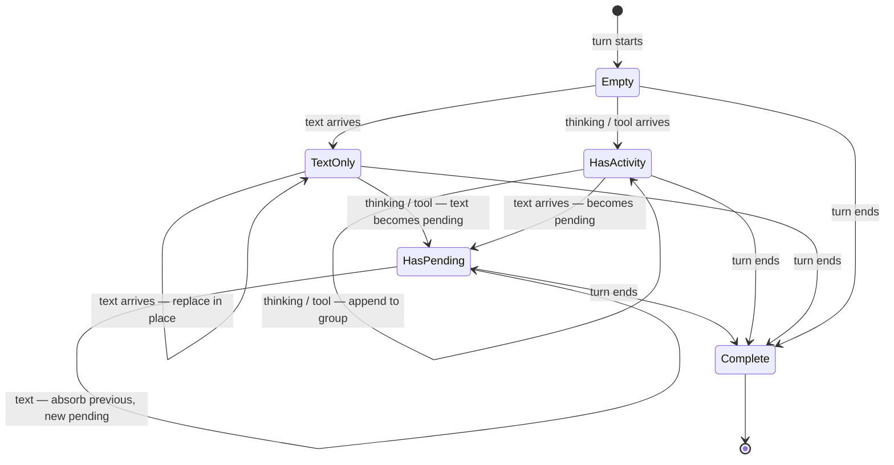

# Activity Stream Rendering Model

**Status:** draft

## Problem

The current `groupThinkingAndTools` algorithm groups consecutive thinking blocks and tool interactions into a collapsible "thinking group." Any non-thinking, non-tool block -- including text blocks -- breaks the group. This made sense when the model produced one thinking phase followed by one response, but models actually interleave short narration text between thinking/tool blocks:

```
thinking  ->  text "Let me check..."  ->  tool Read  ->  thinking  ->
text "Now I'll update..."  ->  tool Edit  ->  text "Here's what I changed"
```

The current algorithm produces three separate groups with narration fragments between them:

```
 [thinking group 1]
 "Let me check..."
 [thinking group 2]
 "Now I'll update..."
 [thinking group 3]
 "Here's what I changed"
```

This creates a clunky interleaved display. The narration fragments are not the AI's substantive response -- they're status updates. But the algorithm treats them identically to the final response, fragmenting the activity log and flooding the conversation with noise.

## Design: Pending Text Absorption

### Core Insight

Not all text blocks are equal. During a tool-using turn, intermediate text blocks are narration -- "Let me check the current state...", "Now I'll update that section..." -- while the final text block is the substantive response. The rendering model should reflect this distinction without requiring the backend to classify text blocks.

### The Algorithm

**Rule**: text is absorbed by default. The latest text block is always the visible one.

1. Thinking blocks go into the activity group. Always.
2. Tool blocks go into the activity group. Always.
3. When a text block arrives, it becomes the **pending text** -- the currently visible text below the activity group.
4. When a NEW text block arrives, the previous pending text is **absorbed** into the activity group as narration. The new text becomes the pending text.
5. When the turn completes, the final pending text remains as the substantive response.

The writer never sees text vanish. It is always **replaced** by the next text. From the writer's perspective, the AI's visible response updates in place -- a natural pattern during streaming. After the turn completes, there is exactly one activity group and one response.

### Why This Works

- **No classification needed**: The algorithm doesn't need to know if a text block is narration or a real response. Positional logic handles it -- the last text is always the one that matters.
- **No animation needed**: Text replacement happens fast during streaming. Adding fade/slide animation would draw attention to something that should feel like a background status update, and add perceived latency.
- **Graceful for text-only turns**: If the model produces only text with no tools, there's no activity group. The text renders normally. The algorithm is a no-op for simple responses.

### Streaming Behavior Trace

Walk through the exact sequence of SSE events for a typical tool-using turn:

```
1. thinking arrives
   Activity group: [thinking]
   Visible text: (none)

2. text_1 "Let me check the current state..." arrives
   Activity group: [thinking]
   Visible text: text_1

3. tool_use Read arrives
   Activity group: [thinking, Read]
   Visible text: text_1 (unchanged -- tool goes to group, not text)

4. tool_result arrives
   Activity group: [thinking, Read + result]
   Visible text: text_1

5. text_2 "I see the chapter structure. Let me update..." arrives
   Activity group: [thinking, Read + result, text_1 (absorbed)]
   Visible text: text_2 (text_1 replaced, not removed)

6. tool_use Edit arrives
   Activity group: [thinking, Read + result, text_1, Edit]
   Visible text: text_2

7. tool_result arrives
   Activity group: [thinking, Read + result, text_1, Edit + result]
   Visible text: text_2

8. text_3 "Here's what I changed to improve the pacing..." arrives
   Activity group: [thinking, Read + result, text_1, Edit + result, text_2 (absorbed)]
   Visible text: text_3

9. Turn completes (stop_reason received)
   Activity group: [thinking, Read, text_1, Edit, text_2] (collapsed)
   Visible text: text_3 (the substantive response, rendered as normal markdown)
```

### Pending Text State Machine



**States**:
- **Empty**: No blocks processed yet
- **TextOnly**: Only text blocks so far, no activity group needed
- **HasActivity**: Activity group has content, but no pending text yet
- **HasPending**: Activity group has content AND there's a visible pending text

## Rename: Thinking Group to Activity Group

The current "thinking group" name is misleading. The group contains thinking, narration text, tool calls, and will eventually contain agent sub-thread spawns. It's the model's **activity log** -- the full record of work done to produce the response.

| Before | After |
|--------|-------|
| `thinkingGroup` (kind) | `activityGroup` (kind) |
| `ThinkingGroupItem` | `ActivityGroupItem` |
| `ThinkingGroupBlock` | `ActivityGroupBlock` |
| `groupThinkingAndTools()` | `groupIntoActivityStream()` |
| `expandedThinkingGroups` (UI store) | `expandedActivityGroups` (UI store) |
| `toggleThinkingGroup()` | `toggleActivityGroup()` |
| `thinking-group:{id}` (groupId prefix) | `activity-group:{id}` (groupId prefix) |

The `ThinkingGroupItem` union type gains a new variant:

```
type ActivityGroupItem =
  | { kind: "thinking"; block: TurnBlock }
  | { kind: "tool"; interaction: ToolInteraction }
  | { kind: "narration"; block: TurnBlock }      // NEW: absorbed text
```

## Activity Group: Collapsed vs Expanded

### Collapsed View (Default)

The collapsed activity group shows a **smart summary header** instead of "Thinking...":

```
 Activity   read 2 files, edited 1                    done  v
```

The summary is generated from the tools in the group -- same type-aware counting from [tool-call-design.md](tool-call-design.md)'s grouped tool calls section. During streaming, the summary updates live:

```
 Activity   read 1 file                                ...  v
```

When no tools are present yet (only thinking):

```
 Activity   thinking...                                ...  v
```

**Pending text position (collapsed)**: Rendered BELOW the activity group as a normal paragraph. This is the writer's current view of the AI's response. It looks like a regular text block in the conversation.

```
 Activity   read 2 files, edited 1                    done  v

 I see the chapter structure. Let me update the pacing...
```

### Expanded View

When the writer expands the activity group, they see the full play-by-play timeline:

```
 Activity   read 2 files, edited 1                    done  ^
 ┌──────────────────────────────────────────────────────────┐
 │  Brain  Analyzing the chapter structure for pacing...    │
 │                                                          │
 │  BookOpen  Read chapter-5.md                          +  │
 │  BookOpen  Read chapter-6.md                          +  │
 │                                                          │
 │  "Let me check the current state..."                     │  <- absorbed narration
 │                                                          │
 │  PencilSimple  Edited chapter-5.md                    +  │
 │                                                          │
 │  "I see the chapter structure. Let me update..."         │  <- absorbed narration
 │                                                          │
 │  I've updated the pacing in the transition scene...      │  <- pending text (during stream)
 └──────────────────────────────────────────────────────────┘
```

**Pending text position (expanded)**: Rendered INSIDE the group at the bottom. This prevents layout jumps -- if the pending text were below the group while expanded, absorbing it would cause the group to grow and the text to disappear simultaneously, creating a jarring visual shift.

**Absorbed narration styling**: Muted, italic, smaller text. Visually distinct from thinking blocks (which are also muted but not italic) and from the pending text (which uses normal text styling).

### Layout Position Summary

| State | Group collapsed | Group expanded |
|-------|----------------|----------------|
| During streaming | Text below group | Text inside group (bottom) |
| After turn complete | Text below group | No text inside group (all narration absorbed, final text below) |

The "after turn complete + expanded" case: the final response stays below the group even when expanded. Only intermediate narration lives inside. This keeps the final response visually consistent whether the group is open or closed.

## Tool Prominence

Some tool results are important enough to **promote** out of the activity group as visible cards in the conversation. Others stay collapsed inside the group. This aligns with [tool-call-design.md](tool-call-design.md)'s visual hierarchy:

| Tool Type | Prominence | Where It Renders |
|-----------|-----------|-----------------|
| Document Edit | **Promoted** | Card below activity group |
| Agent Spawn | **Promoted** | Expandable card below activity group |
| Document Read | Collapsed | Inside activity group (compact line) |
| Search | Collapsed | Inside activity group |
| Code Execution | Collapsed | Inside activity group |
| Thinking | Collapsed | Inside activity group |

Promoted tools render between the activity group and the pending text:

```
 Activity   read 2 files, edited 1                    done  v

 +----------------------------------------------------------+
 | PencilSimple  Edited chapter-5.md       Pending Review    |
 |   +12 lines, -4 lines, 3 hunks                           |
 |   [diff preview]                                          |
 |   [Accept All]  [Reject All]  [Review in Editor ->]      |
 +----------------------------------------------------------+

 Here's what I changed to improve the pacing in the
 transition scene between the sparring and meditation...
```

**Implementation note**: Promoted tools are still tracked in the activity group's item list (for the expanded view and the smart summary count). But the rendering layer also emits them as standalone items in the render list, positioned after the group. The grouping algorithm marks them with a `promoted: true` flag; `AssistantTurn` renders them outside the group.

## Agent Sub-Thread Expansion

Agent tool calls (thread spawns) promote out of the activity group as expandable cards. From [agents-work-item-ux.md](../layouts/agents-work-item-ux.md), clicking into an agent thread reveals a conversational view. In the activity stream, the agent card shows a compact summary with drill-in:

```
 Activity   read 2 files, spawned 1 agent              done  v

 +----------------------------------------------------------+
 | UserCircle  Research: historical accuracy     Complete  v |
 |   "The Qing dynasty court protocols described in         |
 |    chapter 7 are mostly accurate, with one exception..." |
 +----------------------------------------------------------+

 Based on the research, I've updated the court scene to
 fix the protocol error...
```

**Expanded agent card**: Reveals a nested activity stream -- the agent's own thinking, tools, and response. This is a recursive structure: the agent's stream is rendered by the same `ActivityGroupBlock` component, fed by the agent thread's blocks.

```
 +----------------------------------------------------------+
 | UserCircle  Research: historical accuracy     Complete  ^ |
 |  ┌────────────────────────────────────────────────────┐  |
 |  │ Activity  read 3 files, searched 1           done  │  |
 |  └────────────────────────────────────────────────────┘  |
 |                                                          |
 |  The Qing dynasty court protocols described in           |
 |  chapter 7 are mostly accurate, with one exception:     |
 |  the kowtow sequence should be three kneelings and      |
 |  nine prostrations, not the reverse...                   |
 +----------------------------------------------------------+
```

Each agent stream is an independent instance of the same rendering model, receiving its own block array from the agent thread's data. The recursion terminates naturally -- agents that don't spawn sub-agents produce simple activity group + response.

## Design Decisions

### D1: Absorb-and-replace over hide-and-show

**Decision**: Intermediate text is replaced by the next text, not hidden retroactively.

**Rationale**: Hiding text that was already visible creates a jarring "something disappeared" moment. Replacement during streaming feels natural -- the writer sees the status update evolve, not vanish. This is the same pattern as a loading indicator that updates its message.

### D2: Positional classification over semantic classification

**Decision**: The last text block is the response; all others are narration. No model-side or backend-side classification.

**Rationale**: We can't predict which text block will be the last one until the turn ends. But we don't need to -- the algorithm works identically during streaming and after completion. Adding a `is_narration` flag to the API would create a contract that's hard to enforce across model providers and versions. Position is a property of the data we already have.

### D3: Activity group over thinking group

**Decision**: Rename "thinking group" to "activity group" and expand the concept to include absorbed narration.

**Rationale**: The group already contains tools, not just thinking. With narration added, "thinking" describes less than half the content. "Activity" accurately describes the group's purpose: it's the log of what the model did. This also avoids confusion with the `thinking` block type (extended thinking), which is one item kind inside the group, not the group itself.

### D4: Conditional pending text position based on expanded state

**Decision**: Pending text renders below the group when collapsed, inside the group when expanded.

**Rationale**: When collapsed, the pending text should look like a normal response -- no visual distinction from a text-only turn. When expanded, the pending text must be inside the group to prevent layout jumps during absorption. The user who expands the group is watching the play-by-play and expects to see the full timeline including the current text.

### D5: No animation for text replacement

**Decision**: Text replacement during streaming happens instantly, with no fade or slide transition.

**Rationale**: Animation would draw attention to each replacement event. During a fast tool-using turn, the model might produce 3-5 intermediate texts in quick succession. Animating each replacement would create a flickering, attention-demanding experience. The goal is for narration to feel like a calm background status update, not a visual event. Streaming text already has its own natural animation -- characters appearing progressively.

### D6: Promoted tools render outside the group

**Decision**: High-importance tools (edits, agent spawns) render as standalone cards between the activity group and the response text, not exclusively inside the group.

**Rationale**: An edit requiring accept/reject should never be hidden inside a collapsed group. The writer must see it to act on it. Keeping a reference inside the group maintains the complete activity log for expanded view, while the promoted rendering ensures the writer sees what needs attention without expanding anything.

### D7: Smart summary header over thinking preview

**Decision**: The collapsed activity group header shows a type-aware tool summary ("read 2 files, edited 1") instead of the last thinking snippet.

**Rationale**: The thinking preview ("...analyzing pacing in the transition scene") tells the writer what the AI was thinking about, not what it did. The tool summary ("read 2 files, edited 1") tells the writer what actions were taken. Actions are more useful -- they answer "what happened?" rather than "what was the AI thinking?" The thinking content is available in the expanded view for writers who want the detail.

## Implementation Notes

### Scope

Frontend-only. No changes to API, SSE, block types, stores, or backend.

### Files to Modify

| File | Change |
|------|--------|
| `toolGrouping.ts` | Replace `groupThinkingAndTools()` with `groupIntoActivityStream()`. Add `narration` kind to item union. Track pending text. |
| `toolGrouping.ts` | Update `AssistantRenderItem` union: rename `thinkingGroup` to `activityGroup`, add `narration` item kind, add `pendingText` field. |
| `ThinkingGroupBlock.tsx` | Rename to `ActivityGroupBlock.tsx`. Update header to smart summary. Handle narration items. Handle pending text position. |
| `AssistantTurn.tsx` | Update to use new `activityGroup` kind. Render promoted tools outside group. |
| `useUIStore.ts` | Rename `expandedThinkingGroups` to `expandedActivityGroups`, `toggleThinkingGroup` to `toggleActivityGroup`. |
| `blockIdentity.ts` | Update `getThinkingGroupReactKey` to `getActivityGroupReactKey`. |

### Algorithm Change: `groupIntoActivityStream()`

The new function replaces both `groupThinkingAndTools()` and `groupStandaloneTools()`. It runs a single pass over `AssistantRenderItem[]` and produces the final render list:

```
Input:  [block, block, toolInteraction, block, toolInteraction, block, ...]
Output: [activityGroup, promoted-tool, block(pending-text), ...]
```

Key logic:
1. Thinking blocks and tool interactions always extend the current activity group.
2. Text blocks either become the pending text (first text) or trigger absorption of the previous pending text (subsequent texts).
3. When the loop ends, flush the activity group and leave the final pending text as a standalone block.
4. Promoted tools are emitted both in the group items AND as standalone render items after the group.

### Migration Path

1. Add `narration` kind to `ActivityGroupItem` type
2. Implement `groupIntoActivityStream()` alongside existing functions
3. Update `AssistantTurn` to call new function
4. Rename `ThinkingGroupBlock` to `ActivityGroupBlock`, update rendering
5. Update UI store (rename state/actions)
6. Remove old `groupThinkingAndTools()` and `groupStandaloneTools()`
7. Update imports across all consumers

### Edge Cases

- **Text-only turn** (no thinking/tools): No activity group created. Text renders as normal blocks. Algorithm is a no-op.
- **Single text block**: Same as text-only. No absorption occurs.
- **Tools with no text**: Activity group exists but no pending text. Group shows with smart summary, nothing below it.
- **Empty thinking blocks**: Treated as thinking (added to group). Common during streaming start.
- **Turn with error**: Error rendering unchanged. Activity group shows error badge on the relevant tool. Final text (if any) still renders.

## Cross-References

- [Tool Call Display Design](tool-call-design.md) -- visual hierarchy, tool renderers, smart summary header
- [Agents Work Item UX](../layouts/agents-work-item-ux.md) -- agent thread drill-in, nested stream rendering
- [Threads](threads.md) -- base thread architecture, SSE streaming, data model
