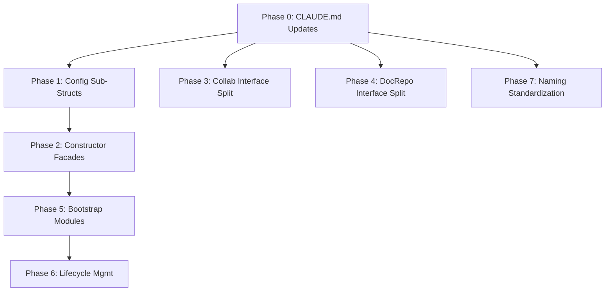

# Backend Structural Refactor Design

Comprehensive refactor addressing constructor explosion, main.go monolith, naming inconsistencies, interface bloat, lifecycle gaps, and CLAUDE.md gaps. Designed for incremental shipping and to unblock upcoming features (work items, agents/skills, agent tools, auth enrichment).

## Problem Statement

Three independent reviews (billing, architecture, spawn difficulty audit) converged on the same structural issues:

1. Constructors are too wide (27 positional params) making testing fragile
2. `main.go` is a 614-line monolith that every new domain must touch
3. Naming is inconsistent (`Store` vs `Repository`, `mock*` vs `fake*` vs `test*`)
4. `domain/services/` contains interfaces but sounds like implementations
5. Background goroutines leak on shutdown
6. CLAUDE.md is missing critical patterns that cause agent errors

The refactor must unblock four upcoming features without a big-bang rewrite.

---

## 1. Package Restructure

### Decision: Keep `domain/services/`, Document It

Renaming `domain/services/` to `domain/contracts/` was considered and rejected:

- **Churn cost**: 35+ interface definitions, 50+ import sites, every agent's mental model resets
- **Go convention**: Go's standard library uses package names for what the package *provides*, not what it *is*. `domain/services/` provides service interfaces. That's fine.
- **Root cause**: The confusion isn't the name, it's the lack of documentation. Agents read `services/` and assume implementations live there.
- **ROI**: A two-line CLAUDE.md addition fixes the confusion. A rename creates a week of merge conflicts.

What *does* change: the collab interface file, which packs 16 interfaces into one 195-line file.

### Collab Interface Split

Current state: `domain/services/collab/collab.go` has 16 interfaces.

Split into purpose-aligned files:

```
domain/services/collab/
  session.go          -- DocumentSessionProvider, SyncSession, DocumentContentLoader
  state.go            -- DocumentStateStore, CheckpointStore, ProjectedStateBuilder
  update_log.go       -- UpdateLogStore (with UpdateLogEntry type)
  bookmark.go         -- BookmarkStore (with Bookmark type)
  proposal.go         -- ProposalStore, ProposalService, ProposalRuntime (with request/result types)
  presence.go         -- OwnerTabPresenceTracker, StatusMirror
  resolver.go         -- DocumentResolver, AutoapplyResolver
  restore.go          -- RestoreService (with RestoreResult)
```

Rules:
- Each file groups interfaces by the concern they serve, not by who implements them
- Types that are only used by one interface live in the same file
- No file exceeds ~60 lines

### New Domain Packages for Upcoming Features

```
domain/services/workitem/    -- WorkItemService, WorkItemStore (from work-items.md design)
domain/services/agents/      -- SkillResolver, AgentCatalogService, AgentImportService (from file-first-agents-skills.md)
domain/repositories/workitem/ -- WorkItemStore (if kept separate from service interface)
```

These are already designed in the feature docs. The refactor creates the package structure; feature work fills it.

---

## 2. DI Refactor: Breaking main.go

### Approach: Module Initializers

Replace the monolithic `main()` with domain-scoped module initializers. Each module owns its own wiring and returns what other modules need.

This is not a DI framework. It's plain Go functions that return structs. The key insight is that main.go currently mixes three concerns:

1. **Infrastructure** (pool, logger, config, JWT verifier)
2. **Domain wiring** (repos + services + cross-domain deps)
3. **HTTP wiring** (handlers, routes, middleware)

Split into:

```go
// cmd/server/main.go -- reduced to ~80 lines
func main() {
    cfg := config.Load()
    infra := bootstrap.NewInfrastructure(cfg)
    defer infra.Close()

    app := bootstrap.NewApplication(cfg, infra)
    defer app.Close()

    server := bootstrap.NewHTTPServer(cfg, infra, app)
    server.ListenAndServe()
}
```

```
internal/bootstrap/
  infrastructure.go   -- pool, logger, JWT verifier, table names
  repos.go            -- all repository construction
  services.go         -- all service construction (domain wiring)
  handlers.go         -- all handler construction
  routes.go           -- route registration
  background.go       -- job queue, periodic jobs, compaction worker
  server.go           -- HTTP server, middleware chain, graceful shutdown
```

### Infrastructure Struct

```go
type Infrastructure struct {
    Pool        *pgxpool.Pool
    Logger      *slog.Logger
    JWTVerifier *auth.JWTVerifier
    Tables      *postgres.TableNames
    RepoConfig  *postgres.RepositoryConfig
    TxManager   repositories.TransactionManager
}
```

### Application Struct

```go
type Application struct {
    // Domain services (what handlers need)
    Docsystem    DocsystemServices
    LLM          LLMServices
    Collab       CollabServices
    Billing      BillingServices
    Skills       SkillServices
    Auth         AuthServices
    Preferences  PreferencesServices

    // Background workers (need lifecycle management)
    JobQueue         jobs.JobQueue
    CompactionWorker *serviceCollab.CompactionWorker
    StreamRegistry   *mstream.Registry
}
```

Each domain group is a small struct:

```go
type DocsystemServices struct {
    Project  docsysSvc.ProjectService
    Document docsysSvc.DocumentService
    Folder   docsysSvc.FolderService
    Tree     docsysSvc.TreeService
    Favorite docsysSvc.FavoriteService
    Import   docsysSvc.ImportService
}
```

### Why Not a DI Container / Wire

- Go convention: explicit wiring is idiomatic. Containers hide dependencies.
- Agent readability: agents can grep for "who creates X" and find the answer in one file.
- Compile-time safety: missing dependencies are compile errors, not runtime panics.

### Constructor Refactor: Facade Structs

The 27-parameter `streaming.NewService()` and 20-parameter `SetupServices()` are the worst offenders.

Replace positional parameters with grouped dependency structs:

```go
// Deps groups dependencies by concern, not alphabetically
type StreamingDeps struct {
    // Persistence
    TurnWriter    llmRepo.TurnWriter
    TurnReader    llmRepo.TurnReader
    TurnNavigator llmRepo.TurnNavigator
    ThreadRepo    llmRepo.ThreadRepository
    TxManager     repositories.TransactionManager

    // Domain services
    ProjectRepo  docsysRepo.ProjectRepository
    DocumentSvc  docsysSvc.DocumentService
    FolderSvc    docsysSvc.FolderService
    NamespaceSvc docsysSvc.NamespaceService
    SkillService skillSvc.ProjectSkillService

    // Auth
    Validator  ThreadValidator
    Authorizer services.ResourceAuthorizer

    // LLM pipeline
    ProviderGetter       LLMProviderGetter
    SystemPromptResolver llmSvc.SystemPromptResolver
    MessageBuilder       llmSvc.MessageBuilder
    ToolLimitResolver    llmSvc.ToolLimitResolver
    CapabilityRegistry   *capabilities.Registry
    FormatterRegistry    *formatting.FormatterRegistry
    TokenFinalizer       tokens.TokenFinalizer
    MutationStrategy     tools.DocumentMutationStrategy

    // Billing
    AdmissionChecker billingSvc.CreditAdmissionChecker
    Settler          billingSvc.CreditSettler
    SettlementMode   billingmodel.CreditSettlementMode

    // Infrastructure
    Registry *mstream.Registry
    Config   *config.Config
    JobQueue jobs.JobQueue
    Logger   *slog.Logger
}

func NewService(deps StreamingDeps) llmSvc.StreamingService {
    // validate required deps...
    return &Service{
        turnWriter:    deps.TurnWriter,
        // ...
    }
}
```

Benefits:
- Adding a new dependency is one field addition, not a signature change across all callers
- Test setup: `StreamingDeps{TurnWriter: mockWriter, ...}` with zero-value defaults for unused fields
- Named fields make call sites self-documenting

The same pattern applies to `SetupServices()` -- it becomes `NewLLMServices(deps LLMServicesDeps)`.

### Config Sub-Structs with Validation

Current `Config` has 47 flat fields. Group by concern:

```go
type Config struct {
    Server   ServerConfig
    Database DatabaseConfig
    Auth     AuthConfig
    LLM      LLMConfig
    Billing  BillingConfig
    Search   SearchConfig
    Logging  LoggingConfig
}

type ServerConfig struct {
    Port        string
    Environment string
    CORSOrigins string
    TablePrefix string
}

type DatabaseConfig struct {
    URL      string
    MaxConns int
    MinConns int
}

type LLMConfig struct {
    AnthropicAPIKey   string
    OpenRouterAPIKey  string
    DefaultProvider   string
    DefaultModel      string
    MaxToolRounds     int
    SoftCancelTimeout time.Duration
    IdleTimeout       time.Duration
    StreamDebugLogs   bool
    MaxConcurrentStreamsFree int
    MaxConcurrentStreamsPaid int
}

type BillingConfig struct {
    StripeSecretKey     string
    StripeWebhookSecret string
}

type LoggingConfig struct {
    Level    string
    ToFile   bool
    Dir      string
    MaxFiles int
}

// Validate checks required fields and returns structured errors
func (c *Config) Validate() error {
    var errs []string
    if c.Database.URL == "" {
        errs = append(errs, "SUPABASE_DB_URL is required")
    }
    if c.Auth.SupabaseURL == "" {
        errs = append(errs, "SUPABASE_URL is required")
    }
    if c.LLM.AnthropicAPIKey == "" && c.LLM.OpenRouterAPIKey == "" {
        errs = append(errs, "at least one LLM provider key is required")
    }
    if len(errs) > 0 {
        return fmt.Errorf("config validation: %s", strings.Join(errs, "; "))
    }
    return nil
}
```

The `Config` sub-structs also help with dependency injection: services that only need LLM config receive `LLMConfig`, not the entire `Config`. This narrows the blast radius of config changes.

---

## 3. Interface Splits

### DocumentRepository: 12 Methods

Current interface mixes CRUD, path resolution, search, and recursive traversal. Split following ISP:

```go
// DocumentReader -- read operations
type DocumentReader interface {
    GetByID(ctx context.Context, id, projectID string) (*docsystem.Document, error)
    GetByIDOnly(ctx context.Context, id string) (*docsystem.Document, error)
    GetByPath(ctx context.Context, path string, projectID string) (*docsystem.Document, error)
    ListByFolder(ctx context.Context, folderID *string, projectID string) ([]docsystem.Document, error)
    GetAllMetadataByProject(ctx context.Context, projectID string) ([]docsystem.Document, error)
}

// DocumentWriter -- mutation operations
type DocumentWriter interface {
    Create(ctx context.Context, doc *docsystem.Document) error
    Update(ctx context.Context, doc *docsystem.Document) error
    Delete(ctx context.Context, id, projectID string) error
    DeleteAllByProject(ctx context.Context, projectID string, skipSystemFolders bool) error
}

// DocumentPathResolver -- path computation
type DocumentPathResolver interface {
    GetPath(ctx context.Context, doc *docsystem.Document) (string, error)
}

// DocumentSearcher -- search operations
type DocumentSearcher interface {
    SearchDocuments(ctx context.Context, options *docsystem.SearchOptions) (*docsystem.SearchResults, error)
}

// DocumentTraverser -- recursive operations
type DocumentTraverser interface {
    GetAllByFolderRecursive(ctx context.Context, folderID, projectID string) ([]docsystem.Document, error)
}

// DocumentRepository -- composite for callers that need everything (backward compat)
type DocumentRepository interface {
    DocumentReader
    DocumentWriter
    DocumentPathResolver
    DocumentSearcher
    DocumentTraverser
}
```

Migration path:
- The composite `DocumentRepository` stays, so existing code doesn't break
- New code and refactored code should depend on the narrowest interface they need
- Upcoming features (agents/skills file resolution) should depend on `DocumentReader` + `DocumentPathResolver`, not the full repository

### Collab Interfaces

Already addressed in section 1. The 16-interface file splits into 8 purpose-aligned files.

### Config

Already addressed in section 2 with sub-structs.

---

## 4. Naming Standardization

### Store vs Repository: Decision

**Use `Store` for everything new. Don't rename existing `Repository` interfaces.**

Rationale:
- Billing already uses `Store` consistently (`CreditStore`, `GenerationBillingStore`)
- Collab already uses `Store` consistently (`DocumentStateStore`, `UpdateLogStore`, `BookmarkStore`, `ProposalStore`)
- Only docsystem and LLM use `Repository` (`DocumentRepository`, `ThreadRepository`, etc.)
- Renaming 6 repository interfaces plus all their implementations and callers is not worth the churn for a naming preference
- The convention going forward is clear: new data-access interfaces use `Store`

Document this in CLAUDE.md:

> **Naming**: New data-access interfaces use `Store` (e.g., `CreditStore`, `WorkItemStore`). Legacy interfaces use `Repository` (e.g., `DocumentRepository`). Both mean the same thing. Don't rename existing `Repository` interfaces.

### Mock Naming Convention

Currently no mocks exist in the codebase (tests use inline test doubles or interface assertions). Establish convention before new domains add test infrastructure:

| Type | Convention | Example |
|------|-----------|---------|
| Interface mock | `mock_<interface>.go` | `mock_document_store.go` |
| Test helper | `<name>_test.go` | `billing_helpers_test.go` |
| Test fixture | `testdata/<name>` | `testdata/sample_skill.md` |

Use `gomock` for generated mocks (standard in Go). Place generated mocks in a `mocks/` subdirectory within the package that defines the interface:

```
domain/services/billing/
  billing.go
  mocks/
    mock_credit_service.go
```

### Import Alias Table

Codify the existing pattern. Add to `backend/CLAUDE.md`:

| Layer | Pattern | Example |
|-------|---------|---------|
| Domain models | `<domain>model` or `<domain>Models` | `billingmodel "meridian/internal/domain/models/billing"` |
| Domain service interfaces | `<domain>Svc` | `billingSvc "meridian/internal/domain/services/billing"` |
| Domain repository interfaces | `<domain>Repo` | `docsysRepo "meridian/internal/domain/repositories/docsystem"` |
| Service implementations | `service<Domain>` | `serviceCollab "meridian/internal/service/collab"` |
| Postgres implementations | `postgres<Domain>` | `postgresBilling "meridian/internal/repository/postgres/billing"` |

Rules:
- Only alias when the import would shadow another package at the same name
- Never alias `fmt`, `context`, `errors`, or other stdlib packages
- When two packages have the same last segment, use the layer prefix

### Provider-Specific Naming

Rename `persistOpenRouterGenerationRecord` to `persistGenerationRecord` (or similar generic name). The function should not reference a specific provider in its name if it handles generation records from any provider. This is a simple rename, low churn.

---

## 5. Lifecycle Management

### Cancellable Contexts for Background Goroutines

Current problem: `queueCtx := context.Background()` is never cancelled. `streamRegistry.StartCleanup(context.Background())` has no shutdown path.

Fix:

```go
// In bootstrap/background.go
func (bg *BackgroundWorkers) Start() {
    bg.ctx, bg.cancel = context.WithCancel(context.Background())

    // Job queue
    go func() {
        if err := bg.jobQueue.Start(bg.ctx); err != nil && bg.ctx.Err() == nil {
            bg.logger.Error("job queue stopped unexpectedly", "error", err)
        }
    }()

    // Stream cleanup
    go bg.streamRegistry.StartCleanup(bg.ctx)

    // Compaction worker
    go bg.compactionWorker.Start(bg.ctx)

    // Periodic billing jobs
    bg.startPeriodicJob("reconcile-billing", 15*time.Minute, func() jobs.Job {
        return jobs.NewReconcileBillingJob(bg.generationBillingStore, bg.creditSettler, bg.logger)
    })
    bg.startPeriodicJob("expire-credits", time.Hour, func() jobs.Job {
        return jobs.NewExpireCreditsJob(bg.creditStore, bg.logger)
    })
}

func (bg *BackgroundWorkers) Shutdown(timeout time.Duration) {
    bg.cancel() // Signal all goroutines to stop

    shutdownCtx, cancel := context.WithTimeout(context.Background(), timeout)
    defer cancel()

    // Ordered shutdown: stop accepting new work first, then drain
    bg.compactionWorker.Stop(shutdownCtx)
    bg.jobQueue.Stop(shutdownCtx)
}
```

Key changes:
- Single `cancel()` propagates to all background work
- `streamRegistry.StartCleanup` participates in shutdown
- Periodic jobs use the shared context
- Shutdown is ordered: stop producers before consumers

### SSE Write Synchronization

The current SSE handler uses a single-goroutine event loop with `select`, which is actually safe: only one goroutine writes to the `http.ResponseWriter`. The keep-alive goroutine writes through a `KeepAliveWriter` interface, which is also the same goroutine's writer.

However, the keep-alive `Start()` method runs in its own goroutine and writes directly. This is a race if both the event loop and keep-alive write simultaneously.

Fix: the keep-alive goroutine should send on a channel that the main event loop reads, rather than writing to the response writer directly. This serializes all writes through the select loop:

```go
// In the event loop
select {
case event, ok := <-eventChan:
    // write event
case <-keepAliveTick:
    // write keepalive comment
case <-ctx.Done():
    return
}
```

This replaces the current pattern where keep-alive has its own goroutine that writes independently. The ticker channel replaces the goroutine.

### Interjection Cleanup Contract Documentation

The interjection lifecycle spans 4 files with no documentation explaining the contract:

1. `streaming/service.go` -- UpsertInterjection, GetInterjection, ClearInterjection
2. `streaming/executor.go` -- reads interjection during tool loop
3. `streaming/cleanup.go` -- cleans up on completion/cancellation
4. `mstream` library -- InterjectionRegistry

Document the lifecycle:

```
Interjection Lifecycle:
1. Client calls UpsertInterjection (service.go) -> stores in InterjectionRegistry
2. Executor reads interjection between tool rounds (executor.go) -> injects into conversation
3. On completion/cancellation, cleanup removes interjection (cleanup.go)
4. InterjectionRegistry is the single source of truth (mstream library)

Cleanup invariant: every code path that ends a streaming turn MUST call
ClearInterjection. This includes: normal completion, interruption,
error, and timeout.
```

### InMemoryQueue Worker Sleep

The `time.Sleep` during retry in InMemoryQueue can starve the worker pool. Replace with a backoff channel:

```go
// Instead of:
time.Sleep(retryDelay)

// Use:
select {
case <-time.After(retryDelay):
    // retry
case <-ctx.Done():
    return // respond to shutdown
}
```

This ensures workers remain responsive to shutdown signals during retry delays.

---

## 6. CLAUDE.md Update Plan

### Sections to Add to `backend/CLAUDE.md`

#### 6.1 Package Architecture (new section after "Architecture")

```markdown
### Package Naming

- `domain/services/` contains **interfaces**, not implementations.
  Implementations live in `internal/service/<domain>/`.
- `domain/repositories/` contains **repository/store interfaces**.
  Implementations live in `internal/repository/postgres/<domain>/`.
- New data-access interfaces use `Store`. Legacy interfaces use `Repository`.
  Both mean the same thing.

### Import Alias Conventions

| Layer | Pattern | Example |
|-------|---------|---------|
| Domain models | `<domain>model` | `billingmodel "meridian/.../models/billing"` |
| Domain service interfaces | `<domain>Svc` | `billingSvc "meridian/.../services/billing"` |
| Domain repository interfaces | `<domain>Repo` | `docsysRepo "meridian/.../repositories/docsystem"` |
| Service implementations | `service<Domain>` | `serviceCollab "meridian/.../service/collab"` |
| Postgres implementations | `postgres<Domain>` | `postgresBilling "meridian/.../postgres/billing"` |
```

#### 6.2 GetExecutor Pattern (new section under "Critical Conventions")

```markdown
### N. Transaction Participation (GetExecutor)

Repositories participate in transactions via context propagation.
**Always use `GetExecutor(ctx, pool)`**, never query the pool directly:

\```go
func (s *MyStore) DoThing(ctx context.Context, id string) error {
    executor := postgres.GetExecutor(ctx, s.pool)
    _, err := executor.Exec(ctx, query, id)
    return err
}
\```

`GetExecutor` checks the context for an active transaction (from `ExecTx`).
If found, the repository operation runs inside that transaction.
If not, it runs against the connection pool.

This is how `ExecTx` composes operations across repositories without
passing transaction handles explicitly.
```

#### 6.3 Cleanup Contracts (new section under "Streaming Architecture")

```markdown
### Cleanup Contracts

Every code path that ends a streaming turn MUST:
1. Remove the executor from `ExecutorRegistry`
2. Clear any interjection from `InterjectionRegistry`
3. Finalize tokens via `TokenFinalizer`
4. Settle or defer billing via `CreditSettler`
5. Mark the turn status as `completed`, `cancelled`, or `error`

These steps run in `cleanup.go`. If you add a new streaming exit path
(new error type, new cancellation reason), ensure it routes through
the same cleanup flow.

Interjection lifecycle: client writes via UpsertInterjection ->
executor reads between tool rounds -> cleanup clears on turn end.
```

#### 6.4 Test Conventions (new section)

```markdown
### Test Conventions

- Mock files: `mock_<interface>.go` in `mocks/` subdirectory
- Test helpers: `<name>_test.go` in the same package
- Test fixtures: `testdata/` directory
- Use `gomock` for generated mocks
- Interface mocks go in the package that defines the interface
- Test naming: `Test<Function>_<scenario>` (e.g., `TestCreateTurn_rejectsDoneWorkItem`)
```

#### 6.5 Constructor Pattern (new section under "Critical Conventions")

```markdown
### N. Constructor Dependencies

Services with 5+ dependencies use a `Deps` struct:

\```go
type Deps struct {
    TurnWriter llmRepo.TurnWriter
    Logger     *slog.Logger
    // ...
}

func NewService(deps Deps) *Service { ... }
\```

Add new dependencies as struct fields, not new constructor parameters.
This prevents signature breakage across callers.
```

---

## 7. Phasing

### Phase 0: Documentation (1-2 hours, zero code risk)

**What**: Update `backend/CLAUDE.md` with all section 6 additions.

**Why first**: Highest ROI. Every subsequent phase and every feature implementation benefits. Agents stop bypassing `GetExecutor`, stop being confused by `domain/services/`, and follow consistent naming.

**Dependencies**: None.

**Can be done independently**: Yes. Ship alone.

### Phase 1: Config Sub-Structs + Validation (small)

**What**:
- Split `Config` into sub-structs (`ServerConfig`, `DatabaseConfig`, `LLMConfig`, etc.)
- Add `Validate()` method
- Update all callers that access config fields (mechanical find-and-replace: `cfg.Port` -> `cfg.Server.Port`)

**Why**: Foundation for phase 2 (bootstrap modules receive typed config). Also catches missing env vars at startup instead of runtime.

**Dependencies**: None (phase 0 is docs-only).

**Risk**: Medium-churn mechanical change. Use `replace_all` tooling. One commit, one PR.

**Can be done independently**: Yes.

### Phase 2: Constructor Facade Structs (medium)

**What**:
- Create `StreamingDeps` struct for `streaming.NewService()`
- Create `LLMServicesDeps` struct for `SetupServices()`
- Update callers (main.go, tests)

**Why**: Unblocks adding new dependencies for work items and agents without signature churn. Makes test setup feasible.

**Dependencies**: Phase 1 (config sub-structs are part of the deps).

**Can be done independently**: Yes, after phase 1.

### Phase 3: Collab Interface Split (small)

**What**:
- Split `domain/services/collab/collab.go` into 8 files
- No logic changes, pure file reorganization
- Update imports

**Why**: Reduces merge conflicts when multiple features touch collab. Makes ISP compliance visible.

**Dependencies**: None. Can run in parallel with phase 1 or 2.

**Can be done independently**: Yes.

### Phase 4: DocumentRepository Interface Split (small)

**What**:
- Add `DocumentReader`, `DocumentWriter`, `DocumentPathResolver`, `DocumentSearcher`, `DocumentTraverser` interfaces
- Keep composite `DocumentRepository` for backward compatibility
- New code starts depending on narrow interfaces

**Why**: Upcoming agents/skills feature needs only `DocumentReader` + `DocumentPathResolver`. Narrow interfaces make that dependency clear.

**Dependencies**: None. Can run in parallel with phases 1-3.

**Can be done independently**: Yes.

### Phase 5: Bootstrap Modules (main.go decomposition) (large)

**What**:
- Create `internal/bootstrap/` package
- Move infrastructure setup, repo construction, service construction, handler construction, route registration, and background workers into separate files
- Reduce `main.go` to ~80 lines

**Why**: Every upcoming feature adds wiring to main.go. The monolith becomes unsustainable at 4 new domains.

**Dependencies**: Phases 1-2 (config sub-structs and facade structs make bootstrap modules clean).

**Risk**: Largest change. Must be done as one atomic PR. Test by running the full server and smoke tests.

**Can be done independently**: After phases 1-2.

### Phase 6: Lifecycle Management (medium)

**What**:
- Replace `context.Background()` with cancellable context in background goroutines
- Create `BackgroundWorkers` struct with `Start()` / `Shutdown()` lifecycle
- Fix SSE keep-alive write serialization
- Replace `time.Sleep` in InMemoryQueue retry with `select` on context

**Why**: Prevents goroutine leaks and data races. The SSE fix prevents a potential (currently unlikely) race condition.

**Dependencies**: Phase 5 (background worker lifecycle is part of bootstrap).

**Can be done independently**: The `context.Background()` fix and `time.Sleep` fix can land independently. The full `BackgroundWorkers` struct benefits from the bootstrap module existing.

### Phase 7: Naming Standardization (small, ongoing)

**What**:
- Rename `persistOpenRouterGenerationRecord` to generic name
- Apply `Store` naming to all new interfaces going forward
- Establish mock naming convention (enforced in PR review, not a code change)

**Why**: Reduces confusion for agents and humans.

**Dependencies**: None. Can be done at any time.

**Can be done independently**: Yes.

### Dependency Graph



Phases 0, 3, 4, 7 can ship independently and in parallel. The main dependency chain is 0 -> 1 -> 2 -> 5 -> 6.

### Timeline Estimate

| Phase | Effort | Parallelizable? |
|-------|--------|----------------|
| 0: CLAUDE.md | 1-2 hours | Independent |
| 1: Config | 3-4 hours | Independent |
| 2: Constructors | 4-6 hours | After P1 |
| 3: Collab split | 1-2 hours | Independent |
| 4: DocRepo split | 1-2 hours | Independent |
| 5: Bootstrap | 6-8 hours | After P1+P2 |
| 6: Lifecycle | 3-4 hours | After P5 (partial independence) |
| 7: Naming | 1-2 hours | Independent |

Total: ~20-28 hours of agent work, with significant parallelism available.

### What NOT to Do

- **Don't rename `domain/services/`**. The documentation fix is higher ROI than the rename.
- **Don't introduce a DI framework** (Wire, dig, fx). Plain Go structs are clearer for agents.
- **Don't refactor and add features simultaneously**. Each phase ships as a standalone PR that leaves the codebase working.
- **Don't split interfaces that only have one consumer**. ISP is about consumer diversity, not interface size.
- **Don't create `internal/app/` or `internal/container/`** abstractions. The `bootstrap/` package is a collection of plain initialization functions, not an application framework.

---

## Feature Readiness Matrix

How each refactor phase unblocks upcoming features:

| Feature | Blocking Phases | Why |
|---------|----------------|-----|
| Work Items | P2 (constructor facades) | WorkItemService becomes a new streaming dependency. Without facade structs, this means changing the 27-param constructor. |
| Agents + Skills | P4 (DocRepo split) | SkillResolver needs `DocumentReader` + `DocumentPathResolver`, not the full repository. |
| Agent Tools | P5 (bootstrap), P6 (lifecycle) | Write routing adds new handler wiring. $MERIDIAN_WORK_DIR resolution runs in background context. |
| Auth Enrichment | P0 (CLAUDE.md) | Small feature, but agents need to understand the middleware/context pattern to implement it correctly. |

---

## Alternatives Considered

### Full Rename of `domain/services/` to `domain/contracts/`

Rejected. The problem is documentation, not naming. A rename touches 50+ files for a benefit that a 3-line CLAUDE.md addition provides.

### Wire / dig / fx Dependency Injection

Rejected. These add runtime complexity and hide dependencies behind registration. Go convention is explicit wiring. The `bootstrap/` package achieves the same decomposition with plain functions.

### Microservice Split

Not considered. Meridian is a single-binary deployment with one database. The structural issues are within-process organization, not service boundaries.

### Interface-per-Method Extreme ISP

Rejected for repositories. Single-method interfaces like `DocumentGetter`, `DocumentCreator` are too fine-grained for Go. The split follows consumer-group boundaries: who reads vs who writes vs who searches.

### Rename All `Repository` to `Store`

Rejected due to churn. New interfaces use `Store`. Existing ones stay as-is. Document the convention.
