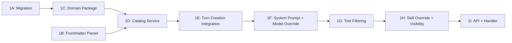
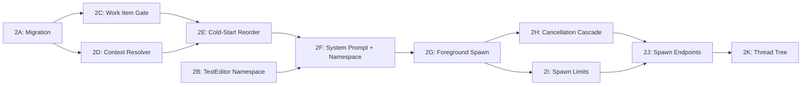
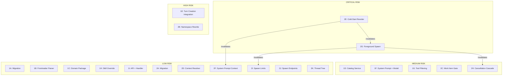

# Agent Orchestration Implementation Plan

Concrete implementation plan for the agent orchestration feature. Based on the design docs in `.meridian/work/v1-launch/features/agents/` and reviewer feedback (p394).

## Scope Decisions

**Incorporated from review (p394):**
- Phase 3 (background execution) is **deferred from v1**. Ship foreground-only spawn first.
- `internal` turn role is **deferred from v1**. Thread notifications are not needed without background execution.
- `ChildThreadBootstrapper` / `SpawnInvoker` indirection layers are avoided. Spawn orchestration stays inside `streaming` package for v1 with local helpers.
- Persona body goes in system prompt (position 7), not injected into user message. Accept cache miss on persona switch.
- `ThreadNotifier` is deferred — no background task completion notifications needed for foreground-only spawns.

**What ships in v1:**
- Phase 1: Persona support (catalog, resolution, model/tool/skill override, system prompt composition)
- Phase 2: Work sessions + foreground spawning + cancellation cascade + spawn status endpoints

**What is deferred:**
- Phase 3: Background execution, `check_background` tool, server restart recovery, `internal` turn role, `ThreadNotifier`, `background_tasks` table
- Post-v1: Cache optimization (persona body in user message), continue/fork, stats, marketplace

---

## Phase 1: Personas

### Dependency Graph



### Execution Rounds

| Round | Steps | Notes |
|-------|-------|-------|
| 1 | **1A** + **1B** (parallel) | Migration + parser are independent |
| 2 | **1C** | Depends on 1B for frontmatter types |
| 3 | **1D** | Depends on 1C for domain types |
| 4 | **1E** + **1F** (parallel) | Both depend on 1D, but touch different files |
| 5 | **1G** | Depends on 1F (tool registry changes) |
| 6 | **1H** | Depends on 1G (skill visibility piggybacks on tool filter) |
| 7 | **1I** | Final integration — API contract changes |

---

### Step 1A: Database Migration — Persona Column

**What**: Add `persona` column to `threads` table. Add `persona` column to `turns` table (for replay fidelity). No `internal` role yet (deferred).

**SQL**:
```sql
ALTER TABLE ${TABLE_PREFIX}threads
    ADD COLUMN persona TEXT
    CONSTRAINT ${TABLE_PREFIX}threads_persona_format
    CHECK (persona IS NULL OR persona ~ '^[a-z0-9][a-z0-9-]*[a-z0-9]$');

ALTER TABLE ${TABLE_PREFIX}turns
    ADD COLUMN persona TEXT;

CREATE INDEX idx_${TABLE_PREFIX}threads_persona
    ON ${TABLE_PREFIX}threads(persona)
    WHERE deleted_at IS NULL AND persona IS NOT NULL;
```

**Agent staffing**:
- Coder: routine (haiku-capable). Straightforward DDL.
- Review gate: none (migration is mechanical)
- QA: verification-tester (run migration up/down, check column exists)

**Context files**: `streaming-integration.md` (schema section), existing migration files

**Verification criteria**:
- [ ] Migration applies cleanly on fresh DB and on existing DB with data
- [ ] `persona` column nullable, CHECK constraint enforces slug format
- [ ] Rollback migration drops column cleanly

**Risk**: LOW. Additive column, no data migration.

---

### Step 1B: Shared Frontmatter Parser

**What**: Create a shared YAML frontmatter parser. None exists in the codebase. Used by persona catalog (and later by skill visibility parsing).

**New file**: `backend/internal/pkg/frontmatter/parser.go`

**Interface**:
```go
package frontmatter

// Parse splits a markdown file into YAML frontmatter and body.
// Returns (frontmatter map, body string, error).
// If no frontmatter delimiter found, returns (nil, fullContent, nil).
func Parse(content string) (map[string]interface{}, string, error)

// ParseInto splits and unmarshals frontmatter into a typed struct.
func ParseInto(content string, v interface{}) (body string, err error)
```

**Agent staffing**:
- Coder: routine. Standard YAML parsing.
- Review gate: correctness (edge cases: no frontmatter, empty body, malformed YAML)
- QA: verification-tester (unit tests)

**Context files**: `personas.md` (frontmatter spec), `.agents/agents/` directory for example files

**Verification criteria**:
- [ ] Handles `---` delimited frontmatter
- [ ] Returns body without frontmatter delimiters
- [ ] Preserves nil vs empty for fields (critical for `tools` field)
- [ ] Handles no frontmatter gracefully
- [ ] Unit tests cover: valid frontmatter, missing frontmatter, empty body, malformed YAML, nil vs empty slice

**Risk**: LOW. Pure utility, no integration concerns.

---

### Step 1C: Domain Package — `domain/agents/`

**What**: Create `Persona` struct and `PersonaCatalog` interface.

**New files**:
- `backend/internal/domain/agents/persona.go` — Persona struct
- `backend/internal/domain/agents/catalog.go` — PersonaCatalog interface (split: Lister vs Resolver per ISP)

**Key types from design**:
```go
type Persona struct {
    Name           string    // From frontmatter
    Slug           string    // Derived from filename
    Description    string
    Model          string
    UserSelectable bool
    Spawnable      bool
    Skills         []string  // nil = unset (inherits), [] = none, [a,b] = explicit
    Temperature    *float64
    MaxTokens      *int
    Tools          []string  // nil = all tools, [] = no tools, [a,b] = only those
    SystemPrompt   string    // Markdown body after frontmatter
    SourcePath     string    // File path in document tree
}

type PersonaCatalog interface {
    ListPersonas(ctx context.Context, userID, projectID string) ([]Persona, []ValidationIssue, error)
    ListUserPersonas(ctx context.Context, userID, projectID string) ([]Persona, error)
    ListSpawnablePersonas(ctx context.Context, userID, projectID string) ([]Persona, error)
    ResolvePersona(ctx context.Context, userID, projectID, slug string) (*Persona, error)
}
```

**Agent staffing**:
- Coder: routine. Domain types with validation.
- Review gate: SOLID (ISP split, field semantics for nil vs empty)
- QA: verification-tester (compile check, type assertions)

**Context files**: `personas.md`, `domain/llm/thread.go`, `domain/skill/service.go` (pattern reference)

**Verification criteria**:
- [ ] Persona struct preserves nil vs empty for `Tools` and `Skills`
- [ ] Validation on required fields (Name, Description, Model)
- [ ] PersonaCatalog interface follows ISP (separate list/resolve concerns)
- [ ] Compiles with no dead imports

**Risk**: LOW. Pure domain types, no implementation logic.

---

### Step 1D: Catalog Service — `service/agents/`

**What**: Implement `PersonaCatalog` that reads `.agents/agents/*.md` from the document tree.

**New files**:
- `backend/internal/service/agents/catalog.go` — Implementation
- `backend/internal/service/agents/catalog_test.go` — Tests

**Key behaviors**:
- Lists documents under `.agents/agents/` via `DocumentService` + `FolderService`
- Parses each `.md` file using `pkg/frontmatter`
- Validates frontmatter fields
- `ResolvePersona` returns 404-equivalent if slug not found or file invalid
- Slug derived from filename (strip `.md`)
- Reports validation issues (bad YAML, missing required fields) without crashing

**Dependencies**: `pkg/frontmatter`, `domain/agents`, `domain/docsystem.DocumentService`, `domain/docsystem.FolderService`

**Agent staffing**:
- Coder: **sonnet** (architecturally interesting — must interact with document tree correctly, handle namespace routing for `.agents/` paths)
- Review gate: correctness + SOLID (service depends on interfaces, error handling for malformed files)
- QA: verification-tester (unit tests with mock document service)

**Context files**: `personas.md`, `service/llm/streaming/system_prompt_resolver.go` (pattern for loading from doc tree), `domain/docsystem/` interfaces, `domain/skill/service.go` (ISP pattern reference)

**Verification criteria**:
- [ ] Lists all `.md` files under `.agents/agents/`
- [ ] Parses frontmatter correctly for all field types
- [ ] `nil` tools field (omitted) != empty `[]` tools field
- [ ] Reports malformed files as ValidationIssues, doesn't crash
- [ ] `ResolvePersona` returns clear error for missing/invalid persona
- [ ] Unit tests cover: valid persona, missing fields, bad YAML, empty dir, nil vs empty tools

**Risk**: MEDIUM. This is the foundational service that everything else depends on. If the document tree API doesn't support listing `.agents/agents/` cleanly, this blocks.

---

### Step 1E: Turn Creation Integration — Persona Resolution

**What**: Modify `CreateTurn` to accept `persona` field, resolve it via catalog, and store on thread + turn.

**Modified files**:
- `domain/llm/streaming_service.go` — Add `Persona *string` to `CreateTurnRequest`
- `domain/llm/thread.go` — Add `Persona *string` field
- `domain/llm/turn.go` — Add `Persona *string` field
- `streaming/turn_creation.go` — Resolve persona early in `CreateTurn`
- `streaming/service.go` — Add `personaCatalog` dependency
- `streaming/deps.go` — Add to `ServiceDeps`
- `repository/postgres/llm/thread.go` — Update queries for new columns
- `app/domains/llm.go` — Wire `PersonaCatalog` into `LLMCrossDeps`
- `service/llm/setup.go` — Wire catalog into streaming deps

**Key behavior changes in `CreateTurn`**:
1. If `req.Persona` is set, call `PersonaCatalog.ResolvePersona()`
2. If persona doesn't exist → `422 Unprocessable Entity`
3. On cold start: create thread with `persona` field set
4. On existing thread: update thread's `persona` field
5. Store persona slug on turn record for replay fidelity

**Agent staffing**:
- Coder: **sonnet** (touches the critical path — `CreateTurn` is the core streaming entry point, many interleaved concerns)
- Review gate: correctness + security (persona resolution must happen BEFORE model selection, 422 on invalid persona must not leak info)
- QA: verification-tester (compile, existing tests pass) + smoke-tester (create turn with persona, verify persona stored)

**Context files**: `streaming/turn_creation.go` (FULL), `streaming/service.go`, `streaming/deps.go`, `domain/llm/streaming_service.go`, `domain/llm/thread.go`, `domain/llm/turn.go`, `personas.md`, `streaming-integration.md` (turn creation flow)

**Verification criteria**:
- [ ] `CreateTurn` with valid persona succeeds, persona stored on thread + turn
- [ ] `CreateTurn` with invalid persona returns 422
- [ ] `CreateTurn` without persona works exactly as before (backward compatible)
- [ ] Cold start with persona creates thread with persona set
- [ ] Persona can be switched on subsequent turns
- [ ] All existing streaming tests still pass
- [ ] Thread GET response includes persona field

**Risk**: HIGH. This is the most integration-heavy step. `CreateTurn` is ~500 lines with many interlocking concerns (validation, thread resolution, model selection, tool building, system prompt). Incorrect placement of persona resolution could break the flow. This step must be reviewed carefully.

---

### Step 1F: System Prompt Composition + Model Override

**What**: Extend system prompt resolver to append persona body. Override model/temperature/max_tokens from persona.

**Modified files**:
- `domain/llm/system_prompt.go` — Extend `SystemPromptResolver.Resolve()` signature with `*agents.Persona` parameter
- `streaming/system_prompt_resolver.go` — Add persona body as last section (position 7)
- `streaming/turn_creation.go` — Pass resolved persona to prompt resolver; override model/temperature/max_tokens

**Prompt composition order**:
1. Base identity (stable)
2. Tool section (stable)
3. User-provided system prompt
4. Project system prompt
5. Thread system prompt
6. Skills content
7. **Persona body** (NEW — changes on switch)

**Model override logic**:
```go
if persona != nil {
    model = persona.Model  // Always override
    if persona.Temperature != nil {
        requestParams["temperature"] = *persona.Temperature
    }
    if persona.MaxTokens != nil {
        requestParams["max_tokens"] = *persona.MaxTokens
    }
}
```

**Agent staffing**:
- Coder: **sonnet** (interface change touches multiple callers; prompt order matters for cache behavior)
- Review gate: correctness (verify no existing callers break from signature change, model override ordering)
- QA: verification-tester (existing tests pass) + smoke-tester (verify persona body appears in system prompt, model is overridden)

**Context files**: `domain/llm/system_prompt.go`, `streaming/system_prompt_resolver.go` (FULL), `streaming/turn_creation.go` (lines 190-210 — prompt resolution), `streaming-integration.md` (cache-aware split section), `personas.md` (model override)

**Verification criteria**:
- [ ] `SystemPromptResolver.Resolve()` signature extended — all callers updated
- [ ] Persona body appended as LAST section of system prompt
- [ ] Persona body is NOT stored in turn record (injected at request time)
- [ ] Model from persona overrides request params model
- [ ] Temperature/max_tokens override only when persona specifies them
- [ ] Debug build-provider-request endpoint shows correct persona body + model
- [ ] Existing tests pass (nil persona = backward compatible)

**Risk**: MEDIUM. Interface change to `SystemPromptResolver` requires updating all callers. The `Resolve()` method is called from `turn_creation.go` and potentially from debug handlers. Need to find all call sites.

---

### Step 1G: Tool Filtering

**What**: Implement persona-based tool filtering. `nil` tools = all, `[]` = none, explicit list = only those.

**Modified files**:
- `streaming/turn_creation.go` — Apply tool filter when building tool registry
- `tools/builder.go` — May need a `WithToolFilter(allowedTools []string)` method, or filter at call site

**Key logic**:
```go
// In CreateTurn, after persona resolution:
if persona != nil && persona.Tools != nil {
    // persona.Tools is explicitly set (could be empty [] or [a,b])
    enabledTools = persona.Tools  // Override project tool policy
} else if persona != nil && persona.Tools == nil {
    // Tools field omitted — use all registered tools (no filter)
    enabledTools = nil // signal "all"
}
```

The critical distinction: `nil` (field omitted in YAML) vs `[]` (field explicitly set to empty array). The frontmatter parser from 1B must preserve this.

**Agent staffing**:
- Coder: routine. Conditional logic in turn creation.
- Review gate: correctness (nil vs empty semantics are subtle and must be exact)
- QA: smoke-tester (verify: persona with no tools field → all tools; persona with `tools: []` → no tools; persona with explicit list → only those)

**Context files**: `streaming/turn_creation.go` (tool registry building section, ~lines 177-383), `tools/builder.go`, `personas.md` (tool whitelist section)

**Verification criteria**:
- [ ] Persona with `tools: null` (omitted) → all project tools registered
- [ ] Persona with `tools: []` → NO tools registered (read-only agent)
- [ ] Persona with `tools: [str_replace_based_edit_tool]` → only that tool registered
- [ ] Tool filtering interacts correctly with project disabled-tools policy
- [ ] System prompt tool section matches actual registered tools

**Risk**: MEDIUM. The nil-vs-empty distinction is the most common bug vector. If the frontmatter parser (1B) doesn't preserve this correctly, this step produces wrong behavior.

---

### Step 1H: Skill Override + Visibility

**What**: When persona specifies `skills`, use those instead of client-provided `selected_skills`. Add `user_selectable` and `agent_usable` visibility flags to skills.

**Modified files**:
- `domain/skill/service.go` — Extend `ProjectSkill` with visibility fields (or add to skill frontmatter parsing)
- `streaming/turn_creation.go` — Override `selectedSkills` from persona
- `streaming/system_prompt_resolver.go` — Filter skills by visibility

**Skill override logic**:
```go
if persona != nil && len(persona.Skills) > 0 {
    selectedSkills = persona.Skills  // Override client-provided skills
    // Filter: only skills with agent_usable=true
} else {
    // Use client-provided selected_skills
    // Filter: only skills with user_selectable=true
}
```

**Agent staffing**:
- Coder: routine. Extends existing skill loading path.
- Review gate: SOLID (visibility filtering belongs in catalog/service, not in streaming)
- QA: verification-tester (unit tests for visibility filter)

**Context files**: `personas.md` (skill visibility section), `domain/skill/service.go`, `streaming/system_prompt_resolver.go` (loadSkills method)

**Verification criteria**:
- [ ] Persona with `skills: [story-bible]` → only that skill loaded
- [ ] Skills with `agent_usable: false` not loadable by persona
- [ ] Skills with `user_selectable: false` not loadable by user
- [ ] Default: both flags true (backward compatible)
- [ ] System prompt includes only the resolved skills

**Risk**: LOW. Additive behavior on existing skill loading path.

---

### Step 1I: API Contract + Handler Updates

**What**: Accept `persona` on turn creation API. Return persona in thread/turn responses.

**Modified files**:
- `handler/thread.go` — Include persona in thread GET response, accept persona in turn creation
- Handler JSON serialization — persona field in responses

**API changes**:
- `POST /api/turns` — Accepts `"persona": "slug"` field
- `GET /api/threads/{id}` — Returns `"persona": "slug"` field
- `GET /api/threads` — Returns persona in list response

**New endpoint**:
- `GET /api/projects/{id}/personas` — Lists personas (user_selectable + all for admin)

**Agent staffing**:
- Coder: routine. Standard handler wiring.
- Review gate: none (handler is thin wrapper)
- QA: smoke-tester (end-to-end: create turn with persona via HTTP, verify response)

**Context files**: `handler/thread.go`, `app/domains/llm.go` (route registration), `streaming-integration.md` (API contract section)

**Verification criteria**:
- [ ] `POST /api/turns` with `persona` field works
- [ ] `GET /api/threads/{id}` returns persona
- [ ] `GET /api/projects/{id}/personas` returns list with visibility info
- [ ] Invalid persona slug returns 422

**Risk**: LOW. Thin handler layer.

---

## Phase 2: Work Sessions + Foreground Spawning

### Dependency Graph



### Execution Rounds

| Round | Steps | Notes |
|-------|-------|-------|
| 1 | **2A** + **2B** (parallel) | Migration + namespace rewrite are independent |
| 2 | **2C** + **2D** (parallel) | Work item gate + context resolver are independent |
| 3 | **2E** | Depends on 2C + 2D (cold-start needs both) |
| 4 | **2F** | Depends on 2E + 2B |
| 5 | **2G** | Core spawn implementation |
| 6 | **2H** + **2I** (parallel) | Cancellation + limits are independent |
| 7 | **2J** | Spawn status endpoints |
| 8 | **2K** | Thread tree (can ship independently) |

---

### Step 2A: Database Migration — Spawn Columns

**What**: Add spawn-related columns to threads table. Add `work_item_id` column on threads (if not already present from A4).

**SQL**:
```sql
ALTER TABLE ${TABLE_PREFIX}threads
    ADD COLUMN parent_thread_id UUID
    REFERENCES ${TABLE_PREFIX}threads(id)
    ON DELETE RESTRICT;

ALTER TABLE ${TABLE_PREFIX}threads
    ADD COLUMN spawn_status TEXT;

ALTER TABLE ${TABLE_PREFIX}threads
    ADD COLUMN spawn_result JSONB
    CONSTRAINT ${TABLE_PREFIX}threads_spawn_result_type
    CHECK (spawn_result IS NULL OR jsonb_typeof(spawn_result) = 'object');

ALTER TABLE ${TABLE_PREFIX}threads
    ADD CONSTRAINT ${TABLE_PREFIX}threads_spawn_status_check
    CHECK (spawn_status IS NULL OR spawn_status IN ('running', 'succeeded', 'failed', 'cancelled'));

-- Indexes
CREATE INDEX idx_${TABLE_PREFIX}threads_parent
    ON ${TABLE_PREFIX}threads(parent_thread_id, created_at DESC)
    WHERE deleted_at IS NULL AND parent_thread_id IS NOT NULL;

CREATE INDEX idx_${TABLE_PREFIX}threads_work_item_running_spawns
    ON ${TABLE_PREFIX}threads(work_item_id)
    WHERE deleted_at IS NULL AND spawn_status = 'running';
```

**Note**: `background_tasks` table and `agent_install_state` table are **deferred to Phase 3** per reviewer feedback.

**Agent staffing**:
- Coder: routine
- Review gate: none
- QA: verification-tester (migration up/down)

**Context files**: `streaming-integration.md` (schema section)

**Verification criteria**:
- [ ] Migration applies cleanly
- [ ] `parent_thread_id` self-reference with RESTRICT delete
- [ ] `spawn_status` CHECK constraint enforces valid values
- [ ] Indexes created on parent + running spawns

**Risk**: LOW.

---

### Step 2B: TextEditor Namespace Access Rewrite

**What**: Change `checkEditNamespaceAccess` to allow writes to `.meridian/work/<slug>/` and `.meridian/fs/`. Inject `workItemSlug` into TextEditorTool for isolation enforcement.

**Modified files**:
- `tools/text_editor.go` — Rewrite `checkEditNamespaceAccess` with work-item-scoped access
- `tools/builder.go` — Accept `workItemSlug` parameter

**New access policy**:
```go
func (t *TextEditorTool) checkEditNamespaceAccess(path string) interface{} {
    namespace, relativePath, err := t.namespaceSvc.ParsePath(path)
    if err != nil || namespace != domaindocsys.NamespaceMeridian {
        // Not a .meridian path — normal flow (proposal via collab pipeline)
        return nil
    }

    // .meridian/fs/ — any thread can write (shared reference)
    if strings.HasPrefix(relativePath, "fs/") {
        return nil
    }

    // .meridian/work/<slug>/ — work-item isolation
    if strings.HasPrefix(relativePath, "work/") {
        if t.workItemSlug == "" {
            return ErrorResult(ErrInvalidInput, "cannot write to work dirs without active work item", ...)
        }
        expectedPrefix := "work/" + t.workItemSlug + "/"
        if !strings.HasPrefix(relativePath, expectedPrefix) {
            return ErrorResult(ErrInvalidInput, "cannot write to other work items", ...)
        }
        return nil
    }

    // All other .meridian/ paths — denied
    return ErrorResult(ErrInvalidInput, "cannot modify this .meridian/ path", ...)
}
```

**Agent staffing**:
- Coder: **sonnet** (security-critical — path traversal, canonicalization)
- Review gate: **security** (path traversal via `../`, case sensitivity, symlink attacks via `filepath.Clean`)
- QA: verification-tester (unit tests) + smoke-tester (attempt cross-work-item writes)

**Context files**: `tools/text_editor.go` (FULL — especially `checkEditNamespaceAccess`), `work-sessions.md` (write routing + isolation sections), `domain/docsystem/` namespace types

**Verification criteria**:
- [ ] Write to `.meridian/work/my-item/notes.md` succeeds when workItemSlug = "my-item"
- [ ] Write to `.meridian/work/other-item/notes.md` blocked when workItemSlug = "my-item"
- [ ] Write to `.meridian/fs/architecture.md` always succeeds
- [ ] Write to `.meridian/agents/foo.md` still blocked (goes through `.agents/` path)
- [ ] Path traversal via `../` is canonicalized and blocked
- [ ] Write to `.meridian/work/` without active work item blocked
- [ ] All existing TextEditorTool tests pass

**Risk**: HIGH. Security-critical code. Path traversal bugs here could let agents write outside their work item. Must be reviewed by security-focused reviewer.

---

### Step 2C: Work Item Lifecycle Gate

**What**: Check work item status before `CreateTurn`. Return 409 on done/deleted.

**Prerequisites**: A4 (Work Items) must exist in code. If not, this step creates the minimal work item service interface needed.

**Modified files**:
- `streaming/turn_creation.go` — Add work item status check after thread resolution
- `streaming/service.go` — Add `workItemService` dependency
- `streaming/deps.go` — Add to `ServiceDeps`

**Gate logic**:
```go
// After resolving thread context:
if thread.WorkItemID != nil {
    workItem, err := s.workItemService.Get(ctx, *thread.WorkItemID)
    if err != nil { return err }
    if workItem.Status == "done" {
        return domain.NewConflictError("Reopen work item first")
    }
    if workItem.Status == "deleted" {
        return domain.NewConflictError("Work item deleted")
    }
}
```

**Agent staffing**:
- Coder: routine (if work item service exists) / **sonnet** (if creating minimal work item interface)
- Review gate: correctness (TOCTOU between check and turn creation — must be in same tx, or use row-level lock)
- QA: smoke-tester (verify 409 on done work item)

**Context files**: `work-sessions.md` (enforcement points table), `streaming/turn_creation.go` (transaction section), work item domain types (if they exist)

**Verification criteria**:
- [ ] CreateTurn on active work item → succeeds
- [ ] CreateTurn on done work item → 409
- [ ] CreateTurn on thread without work item → succeeds (legacy mode)
- [ ] Race condition: concurrent CreateTurn + CompleteWorkItem → one wins, other gets 409

**Risk**: MEDIUM. Depends on A4 work item implementation. If A4 isn't done yet, this step needs to create a minimal interface + stub. TOCTOU prevention requires careful transaction design.

---

### Step 2D: Context Resolver

**What**: Create `contextResolver` that resolves work context variables (`WorkDir`, `FSDir`, `ThreadID`, `WorkItem` slug).

**New file**: `backend/internal/service/llm/streaming/context_resolver.go`

**Interface**:
```go
type ResolvedContext struct {
    WorkDir  string // ".meridian/work/revise-arc-3"
    FSDir    string // ".meridian/fs"
    ThreadID string
    WorkItem string // work item slug
}

type ContextResolver interface {
    Resolve(ctx context.Context, threadID, workItemID string) (*ResolvedContext, error)
}
```

**Agent staffing**:
- Coder: routine
- Review gate: none
- QA: verification-tester (unit tests)

**Context files**: `work-sessions.md` (context variable resolution section)

**Verification criteria**:
- [ ] Resolves correct WorkDir from work item slug
- [ ] FSDir is always `.meridian/fs`
- [ ] Returns nil/error gracefully when no work item

**Risk**: LOW. Pure data mapping.

---

### Step 2E: Cold-Start Reorder

**What**: Reorder `CreateTurn` so thread + work item are created inside the transaction BEFORE building system prompt. Currently, system prompt is built before the transaction.

This is a **structural refactor** of `CreateTurn`. The current flow:
1. Resolve thread context
2. Build tool registry (needs project, not thread)
3. Resolve system prompt (currently uses threadID="" for cold start)
4. Transaction: create thread + turns
5. Build real tool registry (needs thread.ProjectID)

The new flow:
1. Resolve thread context
2. If cold start, create thread inside transaction FIRST
3. Resolve work context from persisted thread
4. Build tool registry with work context
5. Resolve system prompt with work context + persona
6. Create turns inside same or subsequent transaction

**Modified files**: `streaming/turn_creation.go` — significant restructuring of `CreateTurn`

**Agent staffing**:
- Coder: **opus** (this is the hardest single step — restructuring a 500-line function with many interlocking concerns. Must preserve all existing behavior while changing execution order.)
- Review gate: correctness (all existing paths must still work) + SOLID (is the restructuring clean?)
- QA: verification-tester (ALL existing streaming tests must pass) + smoke-tester (cold start, warm start, persona + cold start)

**Context files**: `streaming/turn_creation.go` (FULL — all 600 lines), `streaming-integration.md` (cold-start reorder section), `work-sessions.md` (lifecycle enforcement)

**Verification criteria**:
- [ ] Cold start creates thread BEFORE system prompt resolution
- [ ] Warm start (existing thread) behavior unchanged
- [ ] Thread ID is available when building system prompt
- [ ] Work context variables resolved from persisted state
- [ ] ALL existing tests pass (zero regressions)
- [ ] Tool registry built with correct project context in both cold + warm paths

**Risk**: **CRITICAL**. This is the highest-risk step in the entire plan. `CreateTurn` is the core entry point for all streaming. Restructuring it incorrectly breaks everything. The coder needs the full file context and must understand every path through the function. **If this step fails, it invalidates 2F, 2G, 2H, 2I, 2J, 2K.**

**Mitigation**: Run ALL existing tests before and after. Use the debug endpoint to compare provider requests before/after the change for identical inputs.

---

### Step 2F: System Prompt — Work Context Section + Autoapply

**What**: Add work session context to system prompt (position 3). Configure autoapply defaults for `.meridian/work/` and `.meridian/fs/`.

**Modified files**:
- `streaming/system_prompt_resolver.go` — Add work context section
- `streaming/turn_creation.go` — Pass `ResolvedContext` to prompt resolver

**Prompt addition**:
```text
## Your Workspace

You are working within the context of work item "Revise Arc 3".

- Work directory: .meridian/work/revise-arc-3/
- Project reference: .meridian/fs/
- Thread ID: <thread-id>

Write notes, plans, and artifacts to your work directory.
Read project-wide reference material from .meridian/fs/.
```

**Agent staffing**:
- Coder: routine
- Review gate: correctness (prompt position must be stable for cache)
- QA: smoke-tester (verify work context appears in system prompt)

**Context files**: `streaming/system_prompt_resolver.go`, `work-sessions.md` (context resolution section), `streaming-integration.md` (prompt architecture)

**Verification criteria**:
- [ ] Work context section appears at position 3 (after tool section, before project prompt)
- [ ] Without work item → section omitted (backward compatible)
- [ ] Variables are literal strings, not expandable templates

**Risk**: LOW.

---

### Step 2G: Foreground Spawning

**What**: Implement `spawn_agent` tool that creates a child thread, starts streaming, and blocks until completion.

This is the core spawn implementation. Per reviewer feedback, spawn orchestration stays inside the `streaming` package — no separate `SpawnService` package for v1.

**New files**:
- `backend/internal/service/llm/tools/spawn_agent.go` — spawn_agent tool implementation
- `backend/internal/service/llm/streaming/spawn.go` — Spawn orchestration logic (child thread creation, blocking wait)

**Modified files**:
- `tools/builder.go` — `WithSpawnTool()` method
- `tools/metadata.go` — spawn_agent metadata
- `streaming/turn_creation.go` — Wire spawn tool into registry when work item present
- `streaming/service.go` — Expose spawn creation method for the tool
- `domain/llm/thread.go` — Ensure `ParentThreadID`, `SpawnStatus`, `SpawnResult` fields

**Key spawn flow**:
1. `spawn_agent` tool receives `{agent, prompt}` input
2. Validates persona exists and is spawnable
3. Creates child thread with `parent_thread_id` set
4. Creates initial user turn with the prompt
5. Starts streaming on child thread (reusing `CreateTurn` logic)
6. **Blocks** on a channel/waitgroup until child turn completes
7. Extracts spawn result (summary, artifacts, status)
8. Returns `tool_result` to parent

**Blocking mechanism**: The tool's `Execute` method blocks on a channel. When the child's `StreamExecutor` completes, it sends the result on the channel. This means the parent's tool round blocks, which is correct for foreground spawns.

**Circular dependency solution**: The spawn tool needs to create turns (streaming service), but the streaming service creates the tool registry (which includes spawn tool). Break via: spawn tool receives a narrow `SpawnInvoker` function/interface, not the full streaming service. The streaming service implements this interface internally.

```go
// Narrow interface — breaks circular dependency
type SpawnInvoker interface {
    CreateSpawn(ctx context.Context, req *SpawnRequest) (<-chan *SpawnResult, error)
}
```

**Agent staffing**:
- Coder: **opus** (architecturally complex — circular dependency resolution, blocking semantics, child thread lifecycle, context management)
- Review gate: correctness + SOLID (narrow interface, proper context propagation — child must use `context.Background()` for its streaming, not parent's context)
- QA: verification-tester + smoke-tester (spawn completes, result returned to parent, spawn with invalid persona fails gracefully)

**Context files**: `subagent-spawning.md` (FULL), `streaming-integration.md` (tool builder section), `streaming/turn_creation.go` (FULL — reuse patterns), `tools/builder.go`, `tools/executor.go`, `tools/registry.go`

**Verification criteria**:
- [ ] `spawn_agent` tool appears in tool registry when thread has work item
- [ ] Child thread created with `parent_thread_id`, `persona`, `work_item_id`
- [ ] Child thread streams with correct persona (model, tools, system prompt)
- [ ] Parent blocks until child completes
- [ ] Spawn result contains summary (extracted from child's last text block or explicit report)
- [ ] Child thread's `spawn_status` transitions: running → succeeded/failed
- [ ] `spawn_result` stored on child thread as JSONB
- [ ] Tool returns proper `tool_result` block to parent
- [ ] Error handling: invalid persona → tool error (not parent crash)
- [ ] Error handling: child stream error → spawn_status = failed

**Risk**: **CRITICAL**. This is the second hardest step. Multiple concerns interact: circular dependencies, blocking semantics, child thread lifecycle, persona resolution for child, context management (child must outlive parent's tool round context). Child thread must share the parent's work item. The blocking mechanism must not deadlock.

---

### Step 2H: Cancellation Cascade

**What**: When parent turn is interrupted, cascade cancel to all running children.

**Modified files**:
- `streaming/service.go` — Modify `InterruptTurn` to cascade
- `streaming/spawn.go` — Track active child executors for cascade

**Cascade logic**:
```go
func (s *Service) InterruptTurn(ctx context.Context, userID, turnID string) error {
    // ... existing interruption logic ...

    // Cascade to child spawns
    childThreadIDs := s.getRunningChildThreads(turnID)
    for _, childTurnID := range childThreadIDs {
        if childExec := s.executorRegistry.Get(childTurnID); childExec != nil {
            childExec.Interrupt()
        }
    }
}
```

**Agent staffing**:
- Coder: **sonnet** (must understand executor registry, interruption flow, and spawn tracking)
- Review gate: correctness (cascade must be reliable — missed children keep consuming credits)
- QA: smoke-tester (interrupt parent → verify child is also interrupted)

**Context files**: `streaming/service.go` (InterruptTurn), `streaming/deps.go` (ExecutorRegistry), `subagent-spawning.md` (cancellation cascade section)

**Verification criteria**:
- [ ] Interrupting parent interrupts all running child spawns
- [ ] Child interruption updates child's spawn_status to "cancelled"
- [ ] Interrupting parent with no children works normally
- [ ] Multiple levels of spawn (A → B → C): interrupting A cancels B and C

**Risk**: MEDIUM. Must be reliable — orphaned children waste credits. Edge case: what if child completes between the cascade decision and the interrupt call?

---

### Step 2I: Spawn Limits

**What**: Enforce max spawn depth (3) and max concurrent spawns per work item (5).

**Modified files**:
- `streaming/spawn.go` — Add limit checks before spawn creation

**Limit checks**:
```go
func (s *Service) validateSpawnLimits(ctx context.Context, parentThreadID, workItemID string) error {
    // Count ancestor depth via recursive parent_thread_id lookup
    depth := s.countAncestorDepth(ctx, parentThreadID)
    if depth >= s.config.MaxSpawnDepth {
        return domain.NewValidationError("max spawn depth exceeded")
    }

    // Count running spawns for this work item (SELECT ... FOR UPDATE)
    running := s.countRunningSpawns(ctx, workItemID)
    if running >= s.config.MaxConcurrentSpawns {
        return domain.NewValidationError("max concurrent spawns exceeded")
    }
    return nil
}
```

**Agent staffing**:
- Coder: routine (but must use `SELECT ... FOR UPDATE` correctly)
- Review gate: correctness (TOCTOU prevention — limit check + row creation in same tx)
- QA: verification-tester (unit tests for depth counting, concurrent spawn limit)

**Context files**: `subagent-spawning.md` (spawn limits section), `streaming/spawn.go`

**Verification criteria**:
- [ ] Depth 3 spawn chain (A→B→C) succeeds; depth 4 (A→B→C→D) fails with 422
- [ ] 5 concurrent spawns succeed; 6th fails with 422
- [ ] Limit checks are race-safe (FOR UPDATE in same tx)

**Risk**: LOW-MEDIUM. Straightforward validation, but the FOR UPDATE pattern must be correct.

---

### Step 2J: Spawn Status Endpoints

**What**: API endpoints for viewing spawn status.

**New endpoints**:
- `GET /api/threads/{id}/spawns` — List child spawns with status
- `GET /api/threads/{id}` (extended) — Add `parent_thread_id`, `spawn_status`, `spawn_result`, `children_count`

**Modified files**:
- `handler/thread.go` — New handler methods
- `app/domains/llm.go` — Route registration
- `repository/postgres/llm/thread.go` — Spawn queries

**Agent staffing**:
- Coder: routine
- Review gate: none
- QA: smoke-tester (verify spawn status endpoint returns correct data)

**Context files**: `subagent-spawning.md` (API contracts section), `handler/thread.go`, `app/domains/llm.go`

**Verification criteria**:
- [ ] `GET /threads/{id}/spawns` returns child threads with persona, status, result
- [ ] `GET /threads/{id}` includes new fields
- [ ] Only threads the user owns are visible

**Risk**: LOW.

---

### Step 2K: Thread Tree Endpoint

**What**: `GET /api/projects/{id}/work-items/{slug}/thread-tree` — Recursive thread tree for a work item.

**New endpoint**: Returns nested thread structure showing spawn hierarchy.

**Agent staffing**:
- Coder: routine
- Review gate: none
- QA: smoke-tester (verify tree structure with nested spawns)

**Context files**: `subagent-spawning.md` (thread tree API section)

**Verification criteria**:
- [ ] Returns nested tree structure
- [ ] Includes persona, spawn_status for each node
- [ ] Works with depth > 1

**Risk**: LOW.

---

## Risk Assessment Summary



### Steps That Could Invalidate Downstream

| Step | If it fails... | Downstream impact |
|------|----------------|-------------------|
| **2E: Cold-Start Reorder** | Entire Phase 2 is blocked. Work context can't be injected. | 2F, 2G, 2H, 2I, 2J, 2K |
| **2G: Foreground Spawn** | Spawn tool doesn't work. | 2H, 2I, 2J, 2K |
| **1D: Catalog Service** | Can't resolve personas. | 1E, 1F, 1G, 1H |
| **1E: Turn Creation Integration** | Persona not wired into pipeline. | 1F, 1G, 1H, all of Phase 2 |

### Mitigation Strategies

1. **2E (Cold-Start Reorder)**: Assign to opus-class coder. Run full test suite before and after. Use debug endpoint to compare provider requests for identical inputs. Consider breaking into sub-steps if the function is too large.

2. **2G (Foreground Spawn)**: Prototype the blocking mechanism first in isolation. Test with a fake "slow tool" before wiring to real child streaming. The circular dependency solution (narrow `SpawnInvoker` interface) should be validated at compile time before the full implementation.

3. **2B (Namespace Rewrite)**: Security review is mandatory. Fuzz test with path traversal payloads.

4. **1E (Turn Creation Integration)**: Keep the initial change minimal — just persona resolution and storage. Don't combine with model override (that's 1F) or tool filtering (that's 1G).

---

## Total Estimated Rounds

| Phase | Rounds | Notes |
|-------|--------|-------|
| Phase 1 | 7 | Some parallelism in rounds 1, 4 |
| Phase 2 | 8 | Some parallelism in rounds 1, 2, 6 |
| **Total** | **15** | Sequential phases (Phase 2 depends on Phase 1 completion) |

Each round = one coder session + review + QA. Expect ~2-3 hours per round with foreground agents. Total: ~30-45 hours of agent time.

---

## Agent Model Recommendations

| Step | Coder Model | Rationale |
|------|-------------|-----------|
| 1A, 1B, 1C, 1H, 1I | haiku/sonnet | Routine work, well-defined scope |
| 1D, 1G, 2B, 2H | sonnet | Moderate complexity, some judgment needed |
| 1E, 1F, 2C, 2D, 2F, 2I, 2J, 2K | sonnet | Standard integration work |
| **2E, 2G** | **opus** | Architecturally critical, high risk, large context window needed |

## Prerequisite Check

Before starting, verify:
- [ ] A3 (File-First Agents + Skills) is deployed — catalog reads from document tree
- [ ] A4 (Work Items) schema exists — work_item_id on threads, work item CRUD
- [ ] A5 (Agent Tools) — document-native tool pattern established
- [ ] Supabase migrations directory identified for migration file placement
