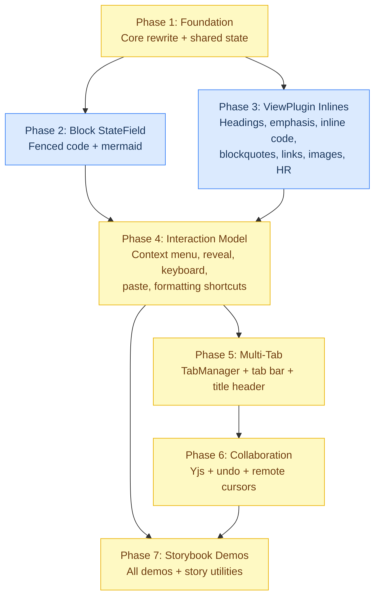

# CM6 Editor Implementation Plan

Based on [cm6-editor-design.md](../features/editor/cm6-editor-design.md) (approved through 12 review rounds).

## Dependency Graph



**Parallelism:** Phases 2 and 3 can execute concurrently (independent decoration systems, both depend only on Phase 1 outputs). All other phases are sequential.

---

## Phase 1: Foundation -- Core Editor Rewrite

**Complexity:** M | **Dependencies:** None

Rewrite `Editor.tsx` and shared state infrastructure. This phase establishes the mount-once compartment architecture, shared StateFields (focus, reveal, composing), cursor utilities, URL validation, and the pull-based content API. Everything else builds on these primitives.

### Files to Create

| File | Purpose |
|---|---|
| `editor/decorations/focus-state.ts` | `focusState` StateField + `focusTracker` domEventHandlers with 50ms blur debounce. Exports `focusChange` effect, `focusState` field, `focusTracker` extension. (Design doc section 2.2) |
| `editor/decorations/reveal-state.ts` | `revealState` StateField for persistent Show Raw. Exports `revealElement`/`concealElement` effects, `revealState` field. Maps ranges through doc changes on every transaction. Auto-conceals when cursor moves outside revealed ranges. (Design doc section 2.2) |
| `editor/url-validation.ts` | `safeExternalUrl` (link opening) + `safeImageUrl` (image trust model with private-network blocking) + `isTrustedImageUrl`. (Design doc sections 2.2 Links and Images) |
| `editor/content/content-api.ts` | `EditorContentAPI` interface (`getContent`, `getWordCount`, `getCharCount`). Debounced word count via `EditorView.updateListener`. (Design doc section 7) |

### Files to Modify

| File | Changes |
|---|---|
| `editor/decorations/cursor-utils.ts` | Add `selectionIntersectsRange(state: EditorState, from, to, padding)` for StateField use (no view access). Keep existing `cursorInRange`/`cursorOnLine` functions. (Design doc section 10) |
| `editor/Editor.tsx` | Add `collabCompartment`, `undoCompartment`, `formattingKeymapCompartment`, `pasteHandlerCompartment`. Wire `focusTracker`, `focusState`, `revealState` into the extension stack. Replace `onChange` `doc.toString()` per keystroke with pull-based content API. Add `suppressOnChange` annotation. Add `collabActiveRef` guard on the update listener. Add `EditorContentAPI` ref. (Design doc sections 1, 5, 7) |
| `editor/live-preview.ts` | Update to include `focusState`, `revealState`, `focusTracker` as required extensions alongside decoration plugins. (Design doc section 2.2) |
| `editor/theme.ts` | Add CSS classes for new decoration types: `.md-hidden-syntax`, `.md-revealed` (with opacity transitions), `.md-widget-wrapper`, `.md-widget-overlay`, `.md-hr-wrapper`, `.md-link`, `.md-image-wrapper`, `.md-code-block`, `.md-mermaid-block`, `.md-image-external-placeholder`, `.md-image-load-btn`. (Design doc sections 2.1, 2.2) |

### Context Files for Coder

```
-f .meridian/work/v1-launch/features/editor/cm6-editor-design.md
-f frontend-v2/src/editor/Editor.tsx
-f frontend-v2/src/editor/decorations/cursor-utils.ts
-f frontend-v2/src/editor/live-preview.ts
-f frontend-v2/src/editor/theme.ts
-f frontend-v2/CLAUDE.md
```

### Verification

- [ ] `pnpm run lint` passes
- [ ] Storybook builds (`pnpm run build-storybook`)
- [ ] Existing `Editor.stories.tsx` stories still render correctly (mount-once preserved)
- [ ] Unit test: `focusState` field dispatches `true` on focus, `false` on blur (with 50ms debounce)
- [ ] Unit test: `revealState` tracks reveal/conceal effects, maps through doc changes, auto-conceals on cursor move
- [ ] Unit test: `selectionIntersectsRange` works with empty and non-empty selections
- [ ] Unit test: `safeExternalUrl` blocks `javascript:`, `data:`, `file:`, same-origin URLs; allows `https:`
- [ ] Unit test: `safeImageUrl` blocks private network targets (`localhost`, `10.x`, `192.168.x`, `.local`), returns `trusted`/`external` correctly
- [ ] Unit test: `contentApi.getWordCount()` debounces correctly, returns cached count

### Key Risks

- **Compartment initialization order**: ensure new compartments (collab, undo, formatting, paste) are initialized with sensible defaults (`[]` or Phase 1 history) so the editor functions without Phases 4-6
- **focusTracker blur debounce**: the 50ms timing must prevent context menu flash without causing sluggish focus reporting

---

## Phase 2: Block StateField -- Fenced Code + Mermaid

**Complexity:** L | **Dependencies:** Phase 1

The hardest decoration work. Move fenced code from ViewPlugin to the unified `blockDecorationField` StateField. Add mermaid support with sandbox rendering. This phase also creates the atomic ranges provider.

### Files to Create

| File | Purpose |
|---|---|
| `editor/decorations/block-decorations.ts` | Unified `blockDecorationField` StateField with incremental mapping. Dispatches to per-node-type handlers for `FencedCode` (with/without mermaid `CodeInfo`). Includes `changeAffectsBlocks`, `selectionCrossesBlockBoundary` helpers. Provides `EditorView.atomicRanges` for all block-level replace decorations. (Design doc sections 2.2, 8) |
| `editor/decorations/fenced-code-widget.ts` | `FencedCodeWidget` class with `eq()`, `toDOM()` using `textContent` (never `innerHTML`), `estimatedHeight`, `ignoreEvent()`. Hover overlay for edit affordance. (Design doc section 2.2 Fenced Code) |
| `editor/decorations/mermaid-widget.ts` | `MermaidWidget` class with async rendering via `MermaidRenderQueue`, SVG cache, cancellation on destroy, sandbox mode validation (`<iframe` check). Lazy mermaid.js loading. Hover overlay. (Design doc sections 2.2 Mermaid, 8) |
| `editor/decorations/atomic-ranges.ts` | `getAtomicWidgetRanges(view)` and `nearestWidgetAtPos(state, pos, decos)` utilities. Collects atomic replace decoration ranges from all sources (block field + image/HR ViewPlugins). Filters to `.md-widget-wrapper` only (excludes links and HR). (Design doc section 2.2 Atomic Ranges) |

### Files to Modify

| File | Changes |
|---|---|
| `editor/decorations/code-blocks.ts` | Remove fenced code handling entirely. This file becomes `inline-code.ts` in Phase 3, or is deleted if Phase 3 creates a new file. Keep only the export name as a temporary re-export during transition. |
| `editor/live-preview.ts` | Replace `codeDecorations()` with the new `blockDecorationField` (as a direct StateField extension, not a ViewPlugin). |

### Context Files for Coder

```
-f .meridian/work/v1-launch/features/editor/cm6-editor-design.md
-f frontend-v2/src/editor/decorations/code-blocks.ts
-f frontend-v2/src/editor/decorations/cursor-utils.ts
-f frontend-v2/src/editor/decorations/focus-state.ts    (from Phase 1)
-f frontend-v2/src/editor/decorations/reveal-state.ts   (from Phase 1)
-f frontend-v2/src/editor/live-preview.ts
-f frontend-v2/src/editor/theme.ts
-f frontend-v2/CLAUDE.md
```

### Verification

- [ ] `pnpm run lint` passes
- [ ] Storybook: fenced code blocks render as styled `<pre><code>` widgets in preview mode
- [ ] Storybook: mermaid code blocks render as SVG diagrams (lazy loaded)
- [ ] Manual test: cursor arrow keys skip over fenced code widget (atomic range)
- [ ] Manual test: cursor arrow keys skip over mermaid widget (atomic range)
- [ ] Unit test: `blockDecorationField` incremental update -- `map(tr.changes)` used for non-block edits, full rebuild only when `changeAffectsBlocks` or `selectionCrossesBlockBoundary`
- [ ] Unit test: `FencedCodeWidget.eq()` returns true for same code+language, false otherwise
- [ ] Unit test: `MermaidRenderQueue` limits concurrent renders to 2, caches results, uses monotonic IDs
- [ ] Unit test: `MermaidWidget` validates `<iframe` prefix before innerHTML injection
- [ ] Unit test: `nearestWidgetAtPos` finds adjacent atomic widgets, excludes links and HR

### Key Risks

- **Mermaid sandbox mode**: `securityLevel: "sandbox"` changes mermaid's output format (iframe). The widget must validate this and handle gracefully if mermaid version doesn't support it
- **StateField rebuild frequency**: `selectionCrossesBlockBoundary` must be cheap -- O(active blocks), not O(document)
- **Lazy loading race**: multiple mermaid blocks entering viewport simultaneously could trigger multiple dynamic imports. The `getMermaid()` singleton pattern handles this, but verify no double-initialization

### Skill Notes

- Use `/browser-testing` after Storybook stories are created to verify mermaid rendering and cursor navigation around widgets

---

## Phase 3: ViewPlugin Inlines -- Text Formatting + Images + Links + HR

**Complexity:** L | **Dependencies:** Phase 1

Fix all existing ViewPlugin decorations per the design doc. Create new `inline-code.ts`. Update images and links to the always-rendered multi-modal interaction model. Fix HR viewport constraint. All files are ViewPlugins (single-line, viewport-limited).

### Files to Create

| File | Purpose |
|---|---|
| `editor/decorations/inline-code.ts` | Inline code decorations using non-overlapping pattern: `replace(backtick)`, `mark(content)`, `replace(backtick)`. Split from `code-blocks.ts`. (Design doc section 2.1) |

### Files to Modify

| File | Changes |
|---|---|
| `editor/decorations/emphasis.ts` | Fix overlapping mark+replace bug. Use non-overlapping pattern: `replace(markers)`, `mark(content)`, `replace(markers)`. Handle nested emphasis (`***bold italic***`) with independent per-node processing. (Design doc sections 2.1, 9.1, 10) |
| `editor/decorations/heading.ts` | Fix trailing HeaderMark bug (use `marks[0].to` not `marks[marks.length-1].to`). Change from `Decoration.mark` to `Decoration.line` for heading level class. Keep `Decoration.replace` on all `HeaderMark` nodes and whitespace. (Design doc sections 2.1, 9, 10) |
| `editor/decorations/blockquote.ts` | Add recursive `collectQuoteMarks` for nested blockquotes. Process all nesting depths, not just direct children. (Design doc section 2.1) |
| `editor/decorations/links.ts` | Change to always-rendered model. Add `data-md-href` attribute, `role="link"`, `tabindex="-1"`. Implement reveal rule (padding=0, OR with revealState). Links are NOT atomic -- cursor enters text normally. Use `safeExternalUrl` for URL validation. (Design doc section 2.2 Links) |
| `editor/decorations/images.ts` | Change to always-rendered with trust model. Add `ImageWidget` with `safeImageUrl` integration (trusted auto-render, external shows placeholder). Add hover overlay, `estimatedHeight`, `requestMeasure` on load. CSS `display: block` on figure for visual block. (Design doc section 2.2 Images) |
| `editor/decorations/horizontal-rule.ts` | Add `view.visibleRanges` constraint to tree iteration. Use `.md-hr-wrapper` class (not `.md-widget-wrapper`). Ensure `eq()` returns `true`. (Design doc section 2.2 HR) |
| `editor/decorations/lists.ts` | No changes needed (current implementation is correct per design doc) |
| `editor/decorations/code-blocks.ts` | Delete or rename. Fenced code moved to Phase 2's `block-decorations.ts`. Inline code moved to new `inline-code.ts`. |
| `editor/live-preview.ts` | Update imports: remove `codeDecorations`, add `inlineCodeDecorations`. Ensure all ViewPlugins iterate only `view.visibleRanges`. |

### Context Files for Coder

```
-f .meridian/work/v1-launch/features/editor/cm6-editor-design.md
-f frontend-v2/src/editor/decorations/emphasis.ts
-f frontend-v2/src/editor/decorations/heading.ts
-f frontend-v2/src/editor/decorations/blockquote.ts
-f frontend-v2/src/editor/decorations/links.ts
-f frontend-v2/src/editor/decorations/images.ts
-f frontend-v2/src/editor/decorations/horizontal-rule.ts
-f frontend-v2/src/editor/decorations/cursor-utils.ts
-f frontend-v2/src/editor/decorations/focus-state.ts    (from Phase 1)
-f frontend-v2/src/editor/decorations/reveal-state.ts   (from Phase 1)
-f frontend-v2/src/editor/url-validation.ts              (from Phase 1)
-f frontend-v2/src/editor/live-preview.ts
-f frontend-v2/src/editor/theme.ts
-f frontend-v2/CLAUDE.md
```

### Verification

- [ ] `pnpm run lint` passes
- [ ] Storybook: all existing stories render correctly with fixed decorations
- [ ] Storybook: headings use `Decoration.line` (full-width styling, not just text content)
- [ ] Manual test: emphasis cursor proximity works with padding=1
- [ ] Manual test: nested blockquote markers (`> > text`) are all hidden in preview
- [ ] Manual test: links show as styled text, cursor enters link text naturally
- [ ] Manual test: images show as `` widgets with hover overlay
- [ ] Manual test: external images show "Click to load" placeholder
- [ ] Manual test: HR only iterates visible ranges (verify no console warnings about non-visible nodes)
- [ ] Unit test: `emphasis.ts` non-overlapping pattern produces correct decoration order
- [ ] Unit test: `heading.ts` uses first HeaderMark for text start
- [ ] Unit test: `ImageWidget.eq()` compares src + alt correctly

### Key Risks

- **Emphasis nested pattern**: `***bold italic***` has overlapping marker segments. Each `Emphasis` node must be processed independently with its own markers
- **Image CSS block workaround**: `display: block` on inline widget causes CM6 height estimation mismatch. `estimatedHeight` + `requestMeasure` on load must compensate
- **Links NOT atomic**: this is a key behavioral difference from all other embedded objects. Ensure no code path accidentally makes links atomic

### Skill Notes

- Use `/browser-testing` to verify hover overlays render correctly on images
- Use `/frontend-design` if image placeholder UI needs design attention

---

## Phase 4: Interaction Model

**Complexity:** L | **Dependencies:** Phases 2, 3

Build the multi-modal interaction system: context menu bridge, unified event handlers, formatting shortcuts, and paste handling. This connects the decoration system to user interaction.

### Files to Create

| File | Purpose |
|---|---|
| `editor/interaction/context-menu-bridge.ts` | `ContextMenuBridge` class with `open`/`close`/`subscribe`/`getSnapshot` (for `useSyncExternalStore`). `ChangeDesc` tracking for position mapping. `getMappedPos()` with doc length clamping. `MenuState` type definition. (Design doc section 4) |
| `editor/interaction/event-handlers.ts` | Unified `domEventHandlers` for `contextmenu`, `dblclick`, `mousedown`, `keydown`, `touchstart`, `touchend`. All interaction flows from design doc section 4. Imports `nearestWidgetAtPos`, `revealElement`/`concealElement`, `safeExternalUrl`, `contextMenuBridge`. |
| `editor/interaction/menu-actions.ts` | `executeMenuAction` with position re-validation via syntax tree. Re-reads metadata at mapped position before executing. Action handlers for: Edit Link, Copy URL, Open in New Tab, Edit Alt Text, Edit URL, View Full Size, Edit Source, Copy Code, Export SVG, Show Raw. (Design doc section 4) |
| `editor/interaction/EditorContextMenu.tsx` | React component using Radix `Popover` (not `ContextMenu`) with controlled open state and manual coordinate positioning. Uses `useSyncExternalStore` to read from `contextMenuBridge`. Per-type menu items. (Design doc section 4) |
| `editor/formatting/formatting-keymap.ts` | Keymap extension for `Cmd+B`, `Cmd+I`, `Cmd+K`, `Cmd+Shift+K`, `Cmd+Shift+X`. (Design doc section 15) |
| `editor/formatting/toggle-wrap.ts` | `toggleWrap(view, marker)` with syntax-tree-validated unwrap (prevents cross-span unwrap bug). `insertLink(view)` helper. All dispatches annotated with `yjsOrigin.of(ORIGIN_HUMAN)`. (Design doc section 15) |
| `editor/paste/paste-handler.ts` | `pasteHandler` domEventHandlers extension. Detects `text/html`, checks `containsMeaningfulMarkup`, converts via `htmlToMarkdown`. Image paste inserts placeholder. (Design doc section 16) |
| `editor/paste/html-to-markdown.ts` | Turndown wrapper with sanitization via DOMPurify. Configured for atx headings, fenced code blocks, dash bullets. (Design doc section 16) |

### Files to Modify

| File | Changes |
|---|---|
| `editor/Editor.tsx` | Wire `formattingKeymapCompartment` with `formattingKeymap`. Wire `pasteHandlerCompartment` with `pasteHandler`. Add `event-handlers.ts` unified handlers to extension stack. Render `<EditorContextMenu>` component adjacent to editor div. |
| `editor/live-preview.ts` | Add event handlers extension and context menu bridge ViewPlugin (for `ChangeDesc` tracking). |

### New Dependencies to Install

| Package | Purpose |
|---|---|
| `turndown` | HTML-to-markdown conversion for paste handling |
| `@types/turndown` | TypeScript types for turndown |
| `dompurify` | HTML sanitization for paste and export |
| `@types/dompurify` | TypeScript types for DOMPurify |

### Context Files for Coder

```
-f .meridian/work/v1-launch/features/editor/cm6-editor-design.md
-f frontend-v2/src/editor/Editor.tsx
-f frontend-v2/src/editor/decorations/reveal-state.ts   (from Phase 1)
-f frontend-v2/src/editor/decorations/atomic-ranges.ts   (from Phase 2)
-f frontend-v2/src/editor/url-validation.ts              (from Phase 1)
-f frontend-v2/src/editor/live-preview.ts
-f frontend-v2/src/components/ui/popover.tsx
-f frontend-v2/CLAUDE.md
```

### Verification

- [ ] `pnpm run lint` passes
- [ ] Storybook: right-click on a link shows context menu with "Edit Link", "Copy URL", "Open in New Tab", "Show Raw"
- [ ] Storybook: right-click on an image shows "Edit Alt Text", "Edit URL", "View Full Size", "Show Raw"
- [ ] Storybook: right-click on a code block shows "Edit Source", "Copy Code", "Show Raw"
- [ ] Storybook: double-click on any embedded object enters "Show Raw" (reveals source)
- [ ] Storybook: Escape exits "Show Raw" and moves cursor past element
- [ ] Storybook: hover over image/code block shows edit icon overlay
- [ ] Storybook: Cmd+Click on link opens URL in new tab
- [ ] Storybook: Enter/Space adjacent to atomic widget enters edit mode
- [ ] Storybook: Shift+F10 adjacent to widget opens context menu
- [ ] Manual test: Cmd+B toggles bold on selected text
- [ ] Manual test: Cmd+I toggles italic
- [ ] Manual test: Cmd+K inserts link template
- [ ] Manual test: paste from web page converts HTML to markdown
- [ ] Unit test: `contextMenuBridge` position mapping through `ChangeDesc` accumulation
- [ ] Unit test: `toggleWrap` syntax-tree validation prevents cross-span unwrap
- [ ] Unit test: `containsMeaningfulMarkup` correctly distinguishes rich HTML from plain-text-with-meta

### Key Risks

- **Context menu positioning**: Radix Popover at arbitrary coordinates may conflict with viewport edges. Need collision-aware placement
- **Position mapping staleness**: between menu open and action execution, remote Yjs edits can invalidate positions. The `getMappedPos()` + re-validation pattern handles this, but edge cases around element deletion during menu open need testing
- **Touch event timing**: 300ms long-press vs double-tap detection overlap. The touchend-based double-tap tracker must reset properly after long-press fires

### Skill Notes

- Use `/frontend-design` for context menu visual design
- Use `/browser-testing` to verify all interaction modes (double-click, hover, right-click, Cmd+Click, touch)

---

## Phase 5: Multi-Tab Architecture

**Complexity:** M | **Dependencies:** Phase 4

Build the TabManager with LRU caching, tab bar component, and document title header. This phase introduces the one-EditorView-per-document model with CSS show/hide.

### Files to Create

| File | Purpose |
|---|---|
| `editor/tabs/TabManager.ts` | `TabManager` class with `TabEntry` type, LRU cache (max 6), `switchTo()` with CSS show/hide, `evictIfNeeded()` (filter active tab before eviction), `restoreTab()` with `requestMeasure` for scroll restoration. (Design doc section 12) |
| `editor/tabs/TabBar.tsx` | Tab bar component with horizontal compact pills. Active/inactive styling, close button (hover reveal), modified indicator dot, max-width truncation, overflow scrolling. Keyboard navigation (arrow left/right, Ctrl+W, Ctrl+Tab). (Design doc section 12) |
| `editor/tabs/useTabManager.ts` | React hook wrapping `TabManager` for React state integration. Exposes tabs list, active tab, switch/close/open actions. |
| `editor/title-header/TitleHeader.tsx` | Document title header with document name, connection status, word count, last saved time, export dropdown. (Design doc section 13) |
| `editor/title-header/ConnectionStatus.tsx` | Three-state indicator: connected (green pulse), reconnecting (amber spin), offline (gray). (Design doc section 13) |
| `editor/title-header/WordCount.tsx` | Word count display using `getWordCount()` from content API. Shows selection count when text selected. Thousands separator formatting. (Design doc section 13) |
| `editor/title-header/RenameInput.tsx` | Click-to-rename inline input. Enter confirms, Escape cancels, blur cancels, empty reverts. (Design doc section 13) |
| `editor/export/ExportDropdown.tsx` | Export format dropdown (Markdown, Plain Text, HTML client-side; PDF, DOCX, EPUB server-side with "Server" badge). (Design doc section 14) |
| `editor/export/exporters.ts` | Client-side export functions: `exportMarkdown`, `exportPlainText`, `exportHTML` (with DOMPurify sanitization). `downloadBlob` helper. Server-side stubs (`exportPDF`, `exportDOCX`, `exportEPUB`). (Design doc section 14) |
| `editor/EditorShell.tsx` | (Update existing) Compose tab bar + title header + editor container. Wire TabManager into the shell. |

### Files to Modify

| File | Changes |
|---|---|
| `editor/Editor.tsx` | Expose `EditorView` ref and `EditorContentAPI` ref for TabManager integration. Add `requestMeasure()` call on tab show (after `display: none` -> `display: block`). |

### New Dependencies to Install

| Package | Purpose |
|---|---|
| `marked` | Markdown-to-HTML for HTML export |

### Context Files for Coder

```
-f .meridian/work/v1-launch/features/editor/cm6-editor-design.md
-f frontend-v2/src/editor/Editor.tsx
-f frontend-v2/src/editor/EditorShell.tsx
-f frontend-v2/src/editor/content/content-api.ts         (from Phase 1)
-f frontend-v2/src/components/ui/dropdown-menu.tsx
-f frontend-v2/src/components/ui/badge.tsx
-f frontend-v2/src/components/ui/button.tsx
-f frontend-v2/src/components/ui/input.tsx
-f frontend-v2/CLAUDE.md
```

### Verification

- [ ] `pnpm run lint` passes
- [ ] Storybook story: tab bar with 3 tabs, click to switch, close button works
- [ ] Storybook story: tab bar with 12 tabs, overflow scrolling works
- [ ] Storybook story: modified indicator dot visible on dirty tab
- [ ] Storybook story: title header with connected/reconnecting/offline states
- [ ] Storybook story: word count updates as user types
- [ ] Storybook story: click document name to rename, Enter to confirm, Escape to cancel
- [ ] Storybook story: export dropdown opens with all format options
- [ ] Manual test: switch between tabs preserves cursor position and scroll position
- [ ] Manual test: open 8+ tabs triggers LRU eviction, evicted tab restores on switch
- [ ] Manual test: active tab is never evicted
- [ ] Unit test: `TabManager.evictIfNeeded()` never evicts active tab
- [ ] Unit test: `TabManager.switchTo()` hides current, shows target
- [ ] Unit test: `TabManager.restoreTab()` creates new EditorView from cached state

### Key Risks

- **Scroll restoration after eviction**: `requestMeasure` timing must ensure CM6 has laid out the DOM before setting `scrollTop`/`scrollLeft`. If the write phase runs before layout, scroll position will be wrong
- **`display: none` viewport size**: CM6 reports viewport size as 0 when container is hidden. `requestMeasure()` on show is essential
- **LRU eviction during rapid switching**: rapid tab switching could trigger evict-then-restore cycles. The maxLive=6 threshold should prevent this for typical use

### Skill Notes

- Use `/frontend-design` for tab bar and title header visual design
- Use `/browser-testing` to verify tab switching, scroll preservation, and keyboard navigation

---

## Phase 6: Collaboration -- Yjs Integration

**Complexity:** L | **Dependencies:** Phase 5

Integrate Yjs for real-time collaboration: Y.Doc per chapter, Y.UndoManager, remote cursors, WebSocket transport, IndexedDB persistence. This phase also implements the undo compartment swap.

### Files to Create

| File | Purpose |
|---|---|
| `editor/collab/collab-extensions.ts` | `yCollab` extension setup, awareness protocol, remote cursor display. `collabCompartment` content (Yjs binding + awareness). Save suppression logic (`collabActiveRef` guard). (Design doc section 5) |
| `editor/collab/undo-manager.ts` | `Y.UndoManager` setup with `trackedOrigins` (`ORIGIN_HUMAN`, `ORIGIN_ACCEPT`, `ORIGIN_REJECT`, `ORIGIN_THREAD`). `stopCapturing()` before discrete actions. Origin constants. `swapUndo` StateEffect for compartment swap. `undoSwapper` transaction extender. (Design doc section 6) |
| `editor/content/content-reconcile.ts` | Diff-based content reconciliation using `diff` library. Produces minimal `ChangeSpec` entries instead of full-document replace. Annotated with `suppressOnChange`. (Design doc section 7) |

### New Dependencies to Install

| Package | Purpose |
|---|---|
| `yjs` | CRDT framework |
| `y-codemirror.next` | CM6 <-> Yjs binding |
| `y-indexeddb` | IndexedDB persistence for offline safety |
| `y-protocols` | Awareness protocol for remote cursors |
| `diff` | Character-level diff for content reconciliation |
| `@types/diff` | TypeScript types for diff |

### Files to Modify

| File | Changes |
|---|---|
| `editor/Editor.tsx` | Wire `collabCompartment` and `undoCompartment` into extension stack. Add Yjs lifecycle management (create Y.Doc, IndexedDB persistence, awareness). Add `swapUndo` effect dispatch on collab connect/disconnect. |
| `editor/tabs/TabManager.ts` | Add Yjs lifecycle per tab: create/destroy Y.Doc, IndexedDB persistence, awareness on tab create/evict/restore. Reconnect Yjs on tab restore. (Design doc section 12) |
| `editor/live-preview.ts` | Add collab extensions to the compartment configuration. |

### Context Files for Coder

```
-f .meridian/work/v1-launch/features/editor/cm6-editor-design.md
-f frontend-v2/src/editor/Editor.tsx
-f frontend-v2/src/editor/tabs/TabManager.ts             (from Phase 5)
-f frontend-v2/src/editor/content/content-api.ts         (from Phase 1)
-f frontend-v2/src/editor/live-preview.ts
-f frontend/src/core/cm6-collab/                          (v1 reference)
-f frontend/src/core/editor/adapters/                     (v1 reference)
-f frontend-v2/CLAUDE.md
```

### Verification

- [ ] `pnpm run lint` passes
- [ ] Unit test: `Y.UndoManager` tracks `ORIGIN_HUMAN` but not `null` (remote edits)
- [ ] Unit test: `stopCapturing()` creates separate undo steps for discrete actions
- [ ] Unit test: `swapUndo` effect correctly swaps between CM6 history and Y.UndoManager keybindings
- [ ] Unit test: `reconcileContent` produces minimal change specs (not full-document replace)
- [ ] Unit test: save suppression -- `onChange` not called when `collabActiveRef.current === true`
- [ ] Manual test: two EditorViews sharing a Y.Doc show real-time sync (in-memory, for development)
- [ ] Manual test: undo/redo works with Y.UndoManager (only undoes own changes)
- [ ] Manual test: IndexedDB persistence survives page reload (content preserved)

### Key Risks

- **History cliff on collab connect**: pre-connect CM6 history is lost. Documented as acceptable (design doc section 6), but may surprise users if collab connection is slow
- **Y.Doc lifecycle with tabs**: evicting a tab destroys its Y.Doc and disconnects. Restoring must re-sync from IndexedDB + WebSocket. Race condition if eviction and restore happen in quick succession
- **Origin tracking**: if any transaction is dispatched without a tracked origin, it won't be undoable. All formatting shortcuts and paste handlers must use `ORIGIN_HUMAN`

---

## Phase 7: Storybook Demos

**Complexity:** M | **Dependencies:** Phases 4, 6

Build all Storybook demo stories and shared helper components. These serve as both documentation and verification of the complete system.

### Files to Create

| File | Purpose |
|---|---|
| `editor/stories/helpers/StandaloneEditor.tsx` | Single editor with no backend. Accepts `initialContent`, `livePreview`, `trustAllImages` props. `trustAllImages` overrides `isTrustedImageUrl` for demos. (Design doc section 18) |
| `editor/stories/helpers/CollabEditor.tsx` | Editor with Yjs binding. Creates own `Y.Doc` + `Awareness`, registers with `SimulatedServer` via `server.addPeer()`. (Design doc section 18.3) |
| `editor/stories/helpers/SimulatedServer.ts` | Central relay for in-memory collab. Per-peer Y.Docs, latency simulation, disconnect/reconnect with bidirectional queue flush, awareness relay. Monotonic render IDs. (Design doc section 18.3) |
| `editor/stories/helpers/TabbedEditor.tsx` | TabManager + multiple editors. Accepts array of `{ id, name, content }` documents. (Design doc section 18.2) |
| `editor/stories/helpers/CollabTabbedEditor.tsx` | Tabs + collab combined. Per-chapter `SimulatedServer`, per-user Y.Docs. (Design doc section 18.4) |
| `editor/stories/helpers/mockContent.ts` | Sample markdown content for demos: prose with all element types, character sheets, worldbuilding notes. |
| `editor/stories/LivePreview.stories.tsx` | All text formatting + embedded objects. Pre-populated content. Toggle button. `trustAllImages`. (Design doc section 18.1) |
| `editor/stories/InteractionModel.stories.tsx` | Double-click, hover, right-click, Cmd+Click demos. (Design doc section 18.6) |
| `editor/stories/TabBar.stories.tsx` | Multiple tabs, close button, modified indicator, overflow scrolling, LRU eviction. (Design doc section 18.2) |
| `editor/stories/TitleHeader.stories.tsx` | Document name, connection states, word count, rename, export dropdown. (Design doc section 18.5) |
| `editor/stories/Collaboration.stories.tsx` | Two/three user collab with `SimulatedServer`. Server bar with latency control + per-peer connect/disconnect toggles. (Design doc section 18.3) |
| `editor/stories/CollabTabs.stories.tsx` | Collab + tabs combined. Two side-by-side users with independent tab bars. (Design doc section 18.4) |

### Files to Modify

| File | Changes |
|---|---|
| `editor/Editor.stories.tsx` | Update to use new `StandaloneEditor` helper. Add stories for new capabilities (context menu, formatting shortcuts, paste). |

### Context Files for Coder

```
-f .meridian/work/v1-launch/features/editor/cm6-editor-design.md
-f frontend-v2/src/editor/Editor.tsx
-f frontend-v2/src/editor/tabs/TabBar.tsx                 (from Phase 5)
-f frontend-v2/src/editor/tabs/TabManager.ts              (from Phase 5)
-f frontend-v2/src/editor/title-header/TitleHeader.tsx    (from Phase 5)
-f frontend-v2/src/editor/collab/collab-extensions.ts     (from Phase 6)
-f frontend-v2/.storybook/main.ts
-f frontend-v2/.storybook/preview.tsx
-f frontend-v2/CLAUDE.md
```

### Verification

- [ ] `pnpm run build-storybook` succeeds
- [ ] All stories render without console errors
- [ ] LivePreview story: all decoration types visible, cursor proximity reveal works
- [ ] InteractionModel story: all interaction modes functional (double-click, hover, right-click, Cmd+Click, keyboard)
- [ ] TabBar story: tab switching, close, overflow all work
- [ ] TitleHeader story: all connection states render correctly
- [ ] Collaboration story: type in one editor, content appears in the other
- [ ] Collaboration story: latency slider adds visible delay
- [ ] Collaboration story: disconnect pauses sync, reconnect flushes queued changes
- [ ] CollabTabs story: tab switching is per-user, remote cursors visible only on shared documents

### Key Risks

- **SimulatedServer complexity**: the bidirectional queue flush on reconnect + awareness sync is intricate. Test with rapid disconnect/reconnect cycles
- **Storybook isolation**: stories must not share global state. Each story creates its own `SimulatedServer` and Y.Docs. Cleanup on unmount is critical
- **Mermaid in Storybook**: mermaid.js may have issues with Storybook's sandboxed environment. Test early

### Skill Notes

- Use `/browser-testing` to verify all Storybook demos render and interact correctly
- Use `/frontend-design` for the Collaboration story server bar layout (latency control, peer toggles)

---

## Appendix: File Creation Summary

### New Files (by phase)

| Phase | Files | Count |
|---|---|---|
| 1 | `focus-state.ts`, `reveal-state.ts`, `url-validation.ts`, `content-api.ts` | 4 |
| 2 | `block-decorations.ts`, `fenced-code-widget.ts`, `mermaid-widget.ts`, `atomic-ranges.ts` | 4 |
| 3 | `inline-code.ts` | 1 |
| 4 | `context-menu-bridge.ts`, `event-handlers.ts`, `menu-actions.ts`, `EditorContextMenu.tsx`, `formatting-keymap.ts`, `toggle-wrap.ts`, `paste-handler.ts`, `html-to-markdown.ts` | 8 |
| 5 | `TabManager.ts`, `TabBar.tsx`, `useTabManager.ts`, `TitleHeader.tsx`, `ConnectionStatus.tsx`, `WordCount.tsx`, `RenameInput.tsx`, `ExportDropdown.tsx`, `exporters.ts` | 9 |
| 6 | `collab-extensions.ts`, `undo-manager.ts`, `content-reconcile.ts` | 3 |
| 7 | `StandaloneEditor.tsx`, `CollabEditor.tsx`, `SimulatedServer.ts`, `TabbedEditor.tsx`, `CollabTabbedEditor.tsx`, `mockContent.ts`, 6 story files | 12 |
| **Total** | | **41** |

### Modified Files (by phase)

| Phase | Files |
|---|---|
| 1 | `cursor-utils.ts`, `Editor.tsx`, `live-preview.ts`, `theme.ts` |
| 2 | `code-blocks.ts` (delete/replace), `live-preview.ts` |
| 3 | `emphasis.ts`, `heading.ts`, `blockquote.ts`, `links.ts`, `images.ts`, `horizontal-rule.ts`, `code-blocks.ts` (delete), `live-preview.ts` |
| 4 | `Editor.tsx`, `live-preview.ts` |
| 5 | `Editor.tsx`, `EditorShell.tsx` |
| 6 | `Editor.tsx`, `TabManager.ts`, `live-preview.ts` |
| 7 | `Editor.stories.tsx` |

### New Dependencies (by phase)

| Phase | Packages |
|---|---|
| 4 | `turndown`, `@types/turndown`, `dompurify`, `@types/dompurify` |
| 5 | `marked` |
| 6 | `yjs`, `y-codemirror.next`, `y-indexeddb`, `y-protocols`, `diff`, `@types/diff` |
| 7 | `mermaid` (if not already lazy-loaded in Phase 2 without install) |

## Appendix: Design Doc Section Index

Quick reference for coders to find relevant design doc sections:

| Topic | Design Doc Section |
|---|---|
| Architecture overview, compartments | 1 |
| Text formatting decorations | 2.1 |
| Embedded objects (widgets) | 2.2 |
| ViewPlugin vs StateField decision | 2.2 (flowchart) |
| RangeSetBuilder ordering rules | 2.2 (after Tables) |
| Widget eq() requirements | 2.2 (after RangeSetBuilder) |
| Atomic ranges | 2.2 (after Widget eq) |
| Cursor-aware reveal system | 3 |
| Multi-modal interaction model | 4 |
| Context menu architecture | 4 |
| Yjs collaboration | 5 |
| Undo/redo with Y.UndoManager | 6 |
| Content model + pull-based API | 7 |
| Performance (viewport, incremental, IME) | 8 |
| Known pitfalls from v1 | 9 |
| Migration guide (what to keep/change) | 10 |
| Multi-tab architecture | 12 |
| Document title header | 13 |
| Export controls | 14 |
| Keyboard shortcuts | 15 |
| Paste handling | 16 |
| Accessibility | 17 |
| Storybook demos | 18 |
| File structure | End of doc |
