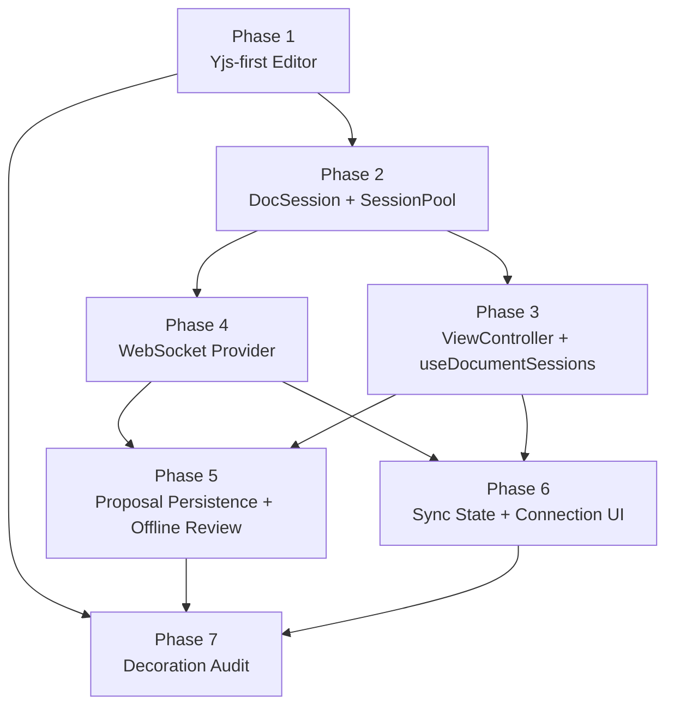

# Editor Refactor Implementation Plan

Based on:
- `./../features/editor/editor-refactor-design.md`
- `./../features/editor/editor-collab.md`
- `./../features/collab/frontend-diff-model.md`
- `./../foundations/data-architecture.md`
- parent work-session context from `c502`

This plan turns the 7 design phases into coder-sized implementation steps. It assumes the refactor design is the source of truth for editor lifecycle behavior, even where current WIP code or older layout docs still reflect the pre-refactor single-surface model.

## Planning Assumptions

1. `frontend-v2/src/editor/` already contains useful WIP and should be refactored in place where possible. This is not a greenfield rebuild.
2. Storybook is the primary verification surface for this work. Every phase must leave behind at least one story or story update that demonstrates the new contract.
3. The refactor design's "independent `activeDocId` per surface with lease transfer for same-doc collisions" supersedes the stale note in `features/layouts/studio-chrome.md` that Converse always mirrors Studio's active tab.
4. Later phases can refine the plan, but coders should not need to mine the full design doc to execute a phase step.

## Current Code Migration Map

| Area | Keep | Refactor | Delete/Replace |
|---|---|---|---|
| Core editor rendering | `content/content-api.ts`, `theme.ts`, `live-preview.ts`, decoration files, formatting/paste/interaction modules | `Editor.tsx`, `EditorShell.tsx`, `extensions.ts` | remove `value`/`onChange` editor contract |
| Yjs integration | `collab/undo-manager.ts`, `collab/remote-cursors.ts` | `collab/yjs-binding.ts`, `collab/idb-persistence.ts` | remove CM6-history fallback and `swapUndo` path after Phase 1 |
| Tab/session lifecycle | `tabs/TabBar.tsx` UI only | salvage host/LRU ideas from `tabs/tab-manager.ts` into a new `ViewController` | phase out `useTabManager.ts` and the old tab-owned collab lifecycle |
| Story helpers | `stories/helpers/SimulatedServer.ts`, mock content files | `stories/helpers/StandaloneEditor.tsx`, `stories/helpers/CollabEditor.tsx`, `TabbedEditor.stories.tsx`, `stories/CollabTabs.stories.tsx`, `stories/Collaboration.stories.tsx` | remove story usage of `createMeridianExtensions()` |
| New persistence/review runtime | none | add session, persistence, provider, and proposal modules | n/a |

## Dependency Map

## Execution Rounds

| Round | Work | Why |
|---|---|---|
| 1 | Phase 1 | Stabilizes the public editor API and removes the controlled-editor model everything else currently assumes |
| 2 | Phase 2 | Establishes durable document-scoped state, local persistence, and the warm-session lifecycle all later phases borrow |
| 3 | Phase 3 and Phase 4 Step 4.1 in parallel | Once `DocSession` contracts exist, one coder can build surface controllers while another defines the document WS provider boundary |
| 4 | Finish Phase 4 | Transport must be real before proposal syncing and user-facing connection states are trustworthy |
| 5 | Phase 5 and Phase 6 in parallel | Proposal review and connection UI both depend on the stable Phase 4 session/provider contracts but do not block each other mechanically |
| 6 | Phase 7 | Final performance audit only makes sense against the near-final extension stack and review layers |

## Phase Index

| Phase | Blueprint | Output |
|---|---|---|
| 1 | [phase-1-yjs-first-editor.md](./editor/phase-1-yjs-first-editor.md) | Uncontrolled Yjs-native `Editor`, shared `createEditorExtensions()`, Storybook migrated to the new API |
| 2 | [phase-2-doc-session-and-session-pool.md](./editor/phase-2-doc-session-and-session-pool.md) | Warm `DocSession` lifecycle, IDB health tracking, Dexie schema, SessionPool story harness |
| 3 | [phase-3-view-controller-and-use-document-sessions.md](./editor/phase-3-view-controller-and-use-document-sessions.md) | Per-surface controllers, lease transfer, `useDocumentSessions()`, tabbed stories on the new lifecycle |
| 4 | [phase-4-websocket-provider.md](./editor/phase-4-websocket-provider.md) | Real document WS provider with Yjs sync, reconnect, auth-expiry handling, reset flow |
| 5 | [phase-5-proposal-persistence-and-offline-review.md](./editor/phase-5-proposal-persistence-and-offline-review.md) | Dexie-backed proposal runtime, diff derivation, offline accept/reject, proposal stories |
| 6 | [phase-6-sync-state-and-connection-ui.md](./editor/phase-6-sync-state-and-connection-ui.md) | Per-doc sync state, accurate connection indicators, degraded-local-save bannering |
| 7 | [phase-7-decoration-audit.md](./editor/phase-7-decoration-audit.md) | ViewPlugin audit, performance stress stories, regression checklist for the final extension stack |

## Highest-Risk Steps

| Step | Risk | Reason | Recommended model |
|---|---|---|---|
| P1.2 | High | Breaks the public editor API and removes the controlled `value` reconciliation path | `opus` |
| P2.3 | High | Introduces the canonical `DocSession` contract other phases depend on | `opus` |
| P2.4 | High | Idle-timer generation guards, warm-budget eviction, and invalidation are race-prone | `opus` |
| P3.1 | High | Replaces the current `TabManager` ownership model with lease-based surface control | `opus` |
| P3.3 | High | Awareness clearing/publishing must not leave ghost cursors or double-live views | `opus` |
| P4.1 | High | Transport protocol, reconnect semantics, and control-plane events must match backend behavior exactly | `opus` |
| P5.2 | High | Proposal derivation is where Yjs projection, diffing, stale detection, and grouped hunk identity can go wrong | `opus` |

## Agent Team

Opus is the default coder for all frontend work. GPT 5.4 is the primary correctness reviewer. Overlapping focus areas across model families surfaces disagreements. Documenters mine session context for decision rationale and backlog items, not just doc updates.

### Per-Round Staffing

#### Round 1 — Phase 1: Yjs-first Editor

| Role | Agent | Model | Focus |
|---|---|---|---|
| Coder | coder | opus | — |
| Reviewer 1 | reviewer | gpt-5.4 | CM6/Yjs correctness |
| Reviewer 2 | reviewer | gpt-5.4 | Design alignment — does impl match design doc? |
| Reviewer 3 | reviewer | gpt-5.4 | Extension ordering/precedence |
| Reviewer 4 | reviewer | opus | CM6/Yjs correctness (cross-model diversity) |
| Reviewer 5 | reviewer | opus | API ergonomics |
| Reviewer 6 | reviewer | opus | Story coverage gaps |
| Tester 1 | verification-tester | — | Build, types, lint |
| Tester 2 | unit-tester | — | Editor component tests |
| Tester 3 | browser-tester | — | Storybook visual check |
| Documenter 1 | documenter | — | Update cm6-architecture.md, editor-collab.md |
| Documenter 2 | documenter | — | Mine session context for decision log + rationale |
| Documenter 3 | documenter | — | Scan for backlog items surfaced during implementation |

#### Round 2 — Phase 2: DocSession + SessionPool

| Role | Agent | Model | Focus |
|---|---|---|---|
| Coder | coder | opus | — |
| Reviewer 1 | reviewer | gpt-5.4 | Lifecycle races, generation guards |
| Reviewer 2 | reviewer | gpt-5.4 | IDB failure modes, degraded mode |
| Reviewer 3 | reviewer | gpt-5.4 | Dexie schema completeness |
| Reviewer 4 | reviewer | opus | Lifecycle races (cross-model diversity) |
| Reviewer 5 | reviewer | opus | Session model coherence |
| Reviewer 6 | reviewer | opus | Warm budget / eviction edge cases |
| Tester 1 | verification-tester | — | Build, types, lint |
| Tester 2 | unit-tester | — | SessionPool lifecycle tests |
| Tester 3 | smoke-tester | — | Open/close/reopen persistence |
| Documenter 1 | documenter | — | Update data-architecture.md |
| Documenter 2 | documenter | — | Mine decisions + backlog |
| Documenter 3 | documenter | — | Update editor-refactor-design.md if impl diverged |

#### Round 3a — Phase 3: ViewController + hook

| Role | Agent | Model | Focus |
|---|---|---|---|
| Coder | coder | opus | — |
| Reviewer 1 | reviewer | gpt-5.4 | Lease transfer, awareness lifecycle |
| Reviewer 2 | reviewer | gpt-5.4 | Multi-surface correctness |
| Reviewer 3 | reviewer | opus | Lease transfer, awareness (cross-model) |
| Reviewer 4 | reviewer | opus | Mode switching UX |
| Reviewer 5 | reviewer | opus | Hook API ergonomics |
| Tester 1 | verification-tester | — | Build, types, lint |
| Tester 2 | unit-tester | — | ViewController tests |
| Tester 3 | browser-tester | — | Tab switching, mode switching in Storybook |
| Documenter 1 | documenter | — | Update layout-architecture.md |
| Documenter 2 | documenter | — | Mine decisions + backlog |

#### Round 3b — Phase 4.1: WS provider interface (parallel with 3a)

| Role | Agent | Model | Focus |
|---|---|---|---|
| Coder | coder | opus | — |
| Reviewer 1 | reviewer | gpt-5.4 | Protocol match to backend handler |
| Reviewer 2 | reviewer | gpt-5.4 | Compare against v1 runtime.ts |
| Reviewer 3 | reviewer | opus | Protocol match to backend (cross-model) |
| Reviewer 4 | reviewer | opus | API shape, session model fit |
| Tester 1 | verification-tester | — | Types pass |
| Documenter 1 | documenter | — | Update editor-collab.md |

#### Round 4 — Phase 4.2-4.4: WS implementation

| Role | Agent | Model | Focus |
|---|---|---|---|
| Coder | coder | opus | — |
| Reviewer 1 | reviewer | gpt-5.4 | Reconnect/auth/reset edge cases |
| Reviewer 2 | reviewer | gpt-5.4 | Security — token handling, origin guards |
| Reviewer 3 | reviewer | gpt-5.4 | Rate limiting, heartbeat |
| Reviewer 4 | reviewer | opus | Reconnect/auth/reset edges (cross-model) |
| Reviewer 5 | reviewer | opus | Error recovery UX |
| Reviewer 6 | reviewer | opus | Compare against v1 DocumentSessionManager.ts |
| Tester 1 | verification-tester | — | Build, types, lint |
| Tester 2 | smoke-tester | — | Two tabs collab, disconnect/reconnect |
| Tester 3 | browser-tester | — | Connection indicator behavior |
| Documenter 1 | documenter | — | Update editor-collab.md, connectivity.md |
| Documenter 2 | documenter | — | Mine decisions + backlog |
| Documenter 3 | documenter | — | Update WS transport docs if protocol details changed |

#### Round 5a — Phase 5: Proposal persistence (parallel with 5b)

| Role | Agent | Model | Focus |
|---|---|---|---|
| Coder | coder | opus | — |
| Reviewer 1 | reviewer | gpt-5.4 | Diff derivation correctness |
| Reviewer 2 | reviewer | gpt-5.4 | Offline edge cases, stale GC |
| Reviewer 3 | reviewer | gpt-5.4 | Dexie read/write patterns |
| Reviewer 4 | reviewer | opus | Diff derivation correctness (cross-model) |
| Reviewer 5 | reviewer | opus | Proposal lifecycle coherence |
| Reviewer 6 | reviewer | opus | Offline accept/reject UX flow |
| Tester 1 | verification-tester | — | Build, types, lint |
| Tester 2 | unit-tester | — | Clone/apply/diff pipeline |
| Tester 3 | smoke-tester | — | Receive proposal, offline, reload, accept |
| Documenter 1 | documenter | — | Update frontend-diff-model.md |
| Documenter 2 | documenter | — | Mine decisions + backlog |

#### Round 5b — Phase 6: Sync state + UI (parallel with 5a)

| Role | Agent | Model | Focus |
|---|---|---|---|
| Coder | coder | opus | — |
| Reviewer 1 | reviewer | gpt-5.4 | State machine correctness, no impossible transitions |
| Reviewer 2 | reviewer | gpt-5.4 | Indicator accuracy vs actual connection state |
| Reviewer 3 | reviewer | opus | State machine correctness (cross-model) |
| Reviewer 4 | reviewer | opus | User-facing messaging, copy |
| Tester 1 | verification-tester | — | Build, types, lint |
| Tester 2 | browser-tester | — | Indicator states in Storybook |
| Documenter 1 | documenter | — | Mine decisions + backlog |

#### Round 6 — Phase 7: Decoration audit

| Role | Agent | Model | Focus |
|---|---|---|---|
| Auditor | reviewer | gpt-5.4 | Identify performance issues |
| Coder | coder | opus | Fix issues found |
| Reviewer 1 | reviewer | gpt-5.4 | Performance — rebuild guards |
| Reviewer 2 | reviewer | gpt-5.4 | Widget eq() + updateDOM() completeness |
| Reviewer 3 | reviewer | gpt-5.4 | Viewport scoping |
| Reviewer 4 | reviewer | opus | Visual quality, decoration interaction |
| Reviewer 5 | reviewer | opus | Performance under collab (remote edits) |
| Reviewer 6 | reviewer | opus | Large doc stress (50K words) |
| Tester 1 | verification-tester | — | Build, types, lint |
| Tester 2 | browser-tester | — | Visual decoration correctness |
| Tester 3 | smoke-tester | — | Large doc scroll performance |
| Documenter 1 | documenter | — | Update decorations.md |
| Documenter 2 | documenter | — | Final doc sweep — all editor docs consistent |
| Documenter 3 | documenter | — | Compile full decision log from entire implementation |

### Team Pattern Summary

- **Coder**: opus (all rounds). Best for frontend, UI, architecture.
- **Reviewers**: 4-6 per round. GPT 5.4 for correctness/security/protocol. Opus for design/UX/ergonomics. Overlapping focus areas across models to catch disagreements.
- **Testers**: 2-3 per round. verification-tester always. unit-tester or smoke-tester based on what the phase changes. browser-tester when visual verification matters.
- **Documenters**: 2-3 per round. One updates the relevant technical docs. One mines session context (`--from`) for decision rationale and backlog. One on final round does full consistency sweep.

## Open Decisions Captured As Assumptions

- Implement Phase 3 against the refactor design's independent per-surface active document model. If product wants Converse to mirror Studio instead, update the design before coding P3.1.
- Treat the current `tab-manager.ts` and `useTabManager.ts` as transition code, not as APIs to preserve.
- Keep Storybook helpers lightweight. Do not build production-only providers into stories unless they are directly exercising the production contract.
