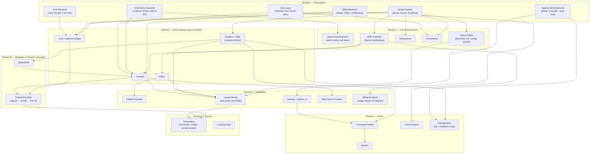

# v1 Implementation Plan

## Execution Model

Three parallel tracks run through the entire build:

- **Track A: Backend** — billing, agents, work items, tools. No frontend dependency. Starts immediately.
- **Track B: Design System + Storybook** — atoms, theme, responsive foundations. Already in progress. Feeds all frontend work.
- **Track C: Data Layer** — optimistic flow, Dexie, sync ports. Frontend infrastructure that every feature consumes.

As tracks complete, they unlock cascading rounds of feature work. Within each round, features are independent and can run in parallel.

## Dependency Graph



### Key changes from v1 of this plan:

1. **F11 split** — F11a (layout shells with mock panes) moves to Round 1. F11b (wire real panes) stays Round 3.
2. **Round 2 capped at 4 parallel** — Explorer+Tabs merged (shared contract). @Mentions is Round 2b (needs Explorer).
3. **F9 includes balance widget** — minimal credit display + purchase CTA ships with auth, not Round 3.
4. **Onboarding stub (F20s)** — signup→credits→first AI activation path in Round 2b. Full wizard in Round 5.
5. **A3 two-phase** — Round 0 is backfill + dual-read. Table drop deferred to Round 2+.
6. **Writing Stats cut** — removed from v1 scope.
7. **Import/Export trimmed** — zip + markdown only, EPUB deferred.
8. **Missing edges added** — Auth Backend → Auth Frontend, F12 → F15, F8 → F7.

## Round 0 — Foundations

Everything starts here. All six workstreams run in parallel.

### Track A: Backend

#### A1. Billing Backend
**Priority: CRITICAL** — blocks all AI features, threads, and onboarding.

- `credit_lots` table (source of truth for balances) + `credit_transactions` audit log + `credit_balances` view
- Credit gate: check `balance > 0` before each inference step in agent loop. Negative balances acceptable — max exposure is one inference step (~1-15 credits). No reservations, no locks.
- FIFO consumption: expiring lots first (`ORDER BY expires_at NULLS LAST`), then purchased
- Stripe Checkout integration (session creation endpoint, webhook handler)
- Webhook idempotency via UNIQUE constraint on `stripe_session_id` in `credit_lots`
- Per-inference-step billing: check → infer → deduct → tool call → check again → infer → deduct
- Free credit grant on signup (300 credits, 30-day expiry lot)
- Expiration cron: daily, zeroes expired lots, logs expiration transactions
- Rate limiting (token bucket per user, max 3 concurrent generations)

**Carry forward:** None — new system.
**Verification:** Unit tests for FIFO consumption, webhook idempotency, expiration cron. Smoke test: Stripe test mode purchase -> credits appear. Concurrent calls: verify balance can go slightly negative without errors.

#### A2. Auth Backend
**Priority: Medium** — mostly carry forward, small changes.

- Verify existing Supabase Auth flow works with new frontend
- Add free tier guest mode endpoint (signup -> auto-grant credits via A1)
- Ensure JWKS validation works for new frontend domain

**Carry forward:** `backend/internal/auth/`, JWT validation, Supabase client.
**Verification:** Login/signup flow works, free credits granted on signup.

#### A3. Agents+Skills Backend (Phase 1: Backfill + Dual-Read)
**Priority: High** — unlocks settings UI and agent execution.

Round 0 is phase 1 only — backfill and dual-read. Table drop deferred to Round 2+ after UI exists to verify.

- New document tree filter: hide `.agents/` from explorer API
- Backfill: create `.agents/skills/<name>/SKILL.md` documents from existing `project_skills` rows
- Dual-read skill resolver: try document tree first, fall back to `project_skills` table
- Agent resolver: parse YAML frontmatter from `.agents/agents/*.md`
- Git import endpoint: `POST /api/projects/{id}/agents/import-git` (with URL allowlist, size limits, text-only filtering)
- **Do NOT drop `project_skills` table yet** — deferred to Round 2+ after F12 Settings UI can verify migration

**Carry forward:** Skill invocation in streaming (rewire to dual-read).
**Verification:** Skill resolution from file matches DB resolution. Git import creates documents with size/URL validation. Backfilled files round-trip correctly.

#### A4. Work Items Backend
**Priority: High** — unlocks threads-as-coordinated-work.

- `work_items` table (id, project_id, name, slug, status, created_at)
- Thread -> work item relationship (nullable FK on threads table)
- Artifact space: `.meridian/work/<slug>/` folder creation in document tree
- CRUD API: create, list, show, update status, complete, reopen
- Archive behavior: complete -> artifacts read-only, reopen -> restore

**Carry forward:** None — new feature (mirrors CLI `meridian work`).
**Verification:** CRUD ops, thread grouping, artifact folder creation, archive/reopen.

### Track B: Frontend

#### B1. Design System + Storybook
**Priority: CRITICAL** — every frontend feature depends on this.

- Complete atom library: Button, Badge, Input, Select, Dialog, Tooltip, Dropdown, Toast
- Color tokens: paper, espresso, jade-teal, accent-fill vs accent-text (WCAG fix)
- Typography scale with `clamp()` (fluid, not breakpoint-based)
- Spacing system (8pt grid)
- Dark/light mode theme context
- Phosphor Icons integration (replace Lucide)
- Responsive foundations: 44px touch targets, no hover-only interactions, viewport-aware modals
- Storybook stories for every atom

**Carry forward:** `frontend-v2/` Phase 1 done, Phase 2 in progress (button + badge built).
**Verification:** All atoms have Storybook stories. Visual regression baseline established.

### Track C: Frontend Infrastructure

#### C1. Data Layer
**Priority: High** — cross-cutting, consumed by connectivity, threads, editor, explorer.

- Optimistic universal flow implementation: `updateState() -> render + Dexie.write() + POST() -> reconcile()`
- Dexie schema setup (thread cache, pending ops, project tree cache)
- y-indexeddb integration for document bodies
- Sync service ports from existing frontend (5 transport subsystems)
- Pending operation queue with retry/drain logic

**Carry forward:** Existing `documentSyncService.ts`, `treeSyncService.ts`, `persistentSaveDrain.ts`, `treeQueueDrain.ts`.
**Verification:** Optimistic render timing (< 16ms to visual update), queue drain on reconnect, Dexie persistence across reload.

## Round 1 — Core Infrastructure

Needs: Design System (B1) atoms available. Data Layer (C1) sync primitives available.

#### A5. Agent Tools Backend
**Needs:** Work Items (A4) for `$MERIDIAN_WORK_DIR` resolution.

- Write routing middleware: target path -> Yjs pipeline OR direct API OR reject
- Context variable injection: `$MERIDIAN_WORK_DIR`, `$MERIDIAN_FS_DIR`, `$MERIDIAN_CHAT_ID`
- Permission boundary enforcement (`.agents/` = read-only to agents)
- just-bash TS sidecar: Vercel Labs integration, internal API from Go backend
- Virtual FS mount (document tree projected as files in bash context)

**Verification:** Write to live doc goes through Yjs, write to `.work/` goes direct, write to `.agents/` rejected. just-bash executes simple commands.

#### F1. CM6 Primitives
**Needs:** Design System (B1) for theme tokens.

Narrowed scope — only shared primitives in Round 1. Markdown decorations and mention autocomplete move to their consumer features (Editor, @Mentions).

- `core/cm6/extensions/theme.ts` — CM6 theme derived from design system tokens
- `core/cm6/extensions/keybindings.ts` — shared keyboard shortcuts (formatting, navigation)
- Storybook: bare CM6 instance with shared primitives loaded

**Carry forward:** `frontend/src/core/editor/codemirror/`, `frontend/src/core/cm6-collab/`.
**Verification:** CM6 renders with theme tokens, keybindings fire.

#### F11a. Layout Shells
**Needs:** Design System (B1).

Build the application shell, rail, routing, and panel infrastructure with **mock panes** — placeholder content where Editor, Explorer, Threads will eventually mount. This de-risks layout integration by getting shell-level UX (mode switching, panel resize, state preservation) working early.

- AppShell component with rail (48px, 3 mode icons)
- StudioLayout, ConverseLayout, AgentsLayout shells with `react-resizable-panels`
- Mode switching via rail (instant, URL routing: `/projects/{id}/studio/...`)
- Panel size persistence (localStorage per mode)
- State preservation mechanism: define keep-alive/offscreen strategy for mode switch (components stay mounted but hidden, or state hoisted above layout)
- Responsive breakpoint definitions (`sm`, `md`, `lg`, `xl`) — below `lg`, single-pane fallback
- Mock panes: colored rectangles with labels ("Editor goes here", "Explorer goes here")
- Storybook stories: each shell, rail interaction, panel resize, mode switch, responsive breakpoint

**Verification:** Mode switch preserves mock pane state, panel sizes persist, URL reflects mode, below-lg shows single-pane fallback.

#### F2. Notifications
**Needs:** Design System (B1) for Toast atom.

- Toast provider (context + portal)
- Queue/stack behavior for multiple simultaneous toasts
- Auto-dismiss (configurable duration) + persistent toasts with action buttons
- Optimistic failure pattern: "Saving..." -> "Saved" / "Failed, click to retry"
- Storybook: toast variants, stacking, action buttons

**Verification:** Toasts render, stack, auto-dismiss, action buttons work.

#### F3. Connectivity
**Needs:** Design System (B1), Data Layer (C1).

- WebSocket connection manager (connect, reconnect, exponential backoff)
- Connection status store (connected, reconnecting, offline)
- Status indicator component (status bar widget)
- Offline queue integration with data layer drain
- SSE resilience (Last-Event-ID for thread streaming reconnect)
- Storybook: connection status indicator states

**Carry forward:** Existing sync system's 5 transport subsystems.
**Verification:** WebSocket reconnect after drop, queue drains on reconnect, status indicator updates.

## Round 2 — Core Features (max 4 parallel)

Needs: CM6 Primitives (F1), Notifications (F2), Connectivity (F3), Layout Shells (F11a), plus relevant backend APIs.

Four parallel streams — capped to prevent contract drift. Storybook-first.

#### F4. Editor
**Needs:** CM6 Primitives (F1).

- CM6 live preview rebuild (single-pass decoration compute, scroll anchor preservation)
- Markdown decorations (bold, italic, headings, links, code) — owned by editor, not shared CM6
- 4-layer decoration stack: live preview, block rendering, collab hunks, remote cursors
- Decoration conflict matrix: define explicit ownership when layers overlap (e.g., hunk inside hidden syntax)
- Block rendering: math (KaTeX), diagrams (Mermaid), images, code (Shiki)
- Formatting toolbar (floating on selection or fixed, configurable)
- Focus mode, typewriter scroll (editor-only CM6 extensions)
- Undo via Y.UndoManager (CM6 built-in undo disabled)
- Storybook stories: BasicEditing, LivePreview, DecorationStability, BlockRendering, LargeDocument, FocusMode, TypewriterScroll

**Carry forward:** Existing CM6 setup, collab extensions.
**Verification:** No content jumping, no flickering, decoration stability through undo/redo, 10K+ line scroll performance.

#### F5. Explorer + Tabs (shared contract)
**Needs:** Design System (B1), Layout Shells (F11a).

Merged because Explorer and Tabs have a shared contract (single-click → preview tab, double-click → persistent). Building them together prevents contract drift.

Explorer:
- Tree component (folders, documents, expand/collapse)
- CRUD: create, rename, delete (with optimistic rendering)
- Drag-and-drop reorder (within and across folders)
- Context menu (right-click actions)
- Word count per document (inline)
- `.agents/` and `.meridian/` filtered from tree

Tabs:
- Tab strip (names, close, reorder via drag)
- Preview tabs (single-click, replaced by next) vs persistent tabs (double-click/edit)
- Path disambiguation for duplicate names
- Overflow: horizontal scroll + dropdown
- LRU eviction: full document session (Y.Doc + CM6 + WebSocket)
- Session pin: active AI streaming pins the doc session, prevents LRU eviction mid-stream

- Storybook stories: tree states, drag-drop, tab strip, preview/persistent, overflow, LRU eviction

**Carry forward:** `useTreeStore.ts`, `treeSyncService.ts`, `useEditorStore.ts`.
**Verification:** Single-click → preview tab, double-click → persistent. LRU evicts correctly. Active stream prevents eviction. System folders hidden.

#### F7. Threads
**Needs:** CM6 Primitives (F1), Billing Backend (A1), Work Items Backend (A4), Data Layer (C1).

- CM6-based chat input (using shared keybindings + chat-only extensions)
- Optimistic send: render user message immediately, POST in background (fix current 1s delay)
- Reconciliation state machine: pending → acked (server confirms) / rejected (402, validation error) → ghost turn cleanup, composer restoration on reject
- SSE streaming for AI responses via streamdown
- SSE resume: durable checkpoint tuple (thread_id, turn_id, last_event_id), partial-content reconstruction on reconnect
- Tool call display (collapsible blocks)
- Thread list per work item
- Quick switching between threads (LRU cached in-memory state)
- Scroll position memory per thread
- Credit check integration (pre-action estimate, 402 handling, "credits exhausted" state)
- Storybook stories: message list, streaming simulation, tool calls, empty state, credit exhausted

**Carry forward:** `useThreadStore.ts`, SSE streaming, `useThreadScrollController.ts`.
**Verification:** Optimistic send renders < 16ms, SSE streams correctly, SSE reconnects with Last-Event-ID, credit check shows exhausted state, thread switching preserves state.

#### F9. Auth Frontend + Balance Widget
**Needs:** Design System (B1), Billing Backend (A1), Auth Backend (A2).

- Login/signup pages (email + Google OAuth)
- Route protection via TanStack Router `beforeLoad`
- Free tier flow: Google OAuth → instant 300 credits. Email → credits after verification.
- JWT injection in API client
- **Minimal balance widget** in status bar (compact credit count + icon)
- **Purchase CTA** — when balance ≤ 0, "Buy credits" button opens Stripe Checkout
- Account settings page (basic — full settings in F12)

**Carry forward:** `core/supabase/client.ts`, `core/lib/api.ts`, route protection patterns.
**Verification:** Login/signup works, free credits appear (instant for OAuth, post-verify for email), balance shows in status bar, purchase CTA opens Checkout.

## Round 2b — Depends on Round 2 Internals

These need specific Round 2 outputs before they can start.

#### F8. @Mentions
**Needs:** Explorer (F5) for document list, CM6 Primitives (F1).

- Canonical mention entity schema: `{ id, type, name, target_id }`
- `@` trigger autocomplete with fuzzy matching
- Dual rendering: wiki links in editor, chips in chat
- Stable IDs (survive renames)
- Copy/paste across surfaces preserves mention
- Storybook stories: autocomplete dropdown, chip rendering, wiki link rendering

**Verification:** Mention survives rename, cross-surface paste preserves, autocomplete fuzzy matches.

#### F20s. Onboarding Stub (Activation Path)
**Needs:** Auth Frontend (F9), Threads (F7).

Minimal activation flow — not the full onboarding wizard, just the critical path from signup to first AI interaction. Tests the integration of auth + billing + threads before Round 5.

- Signup → credit grant → redirect to first project
- Auto-create default project (or "Create your first project" one-click)
- Auto-open a thread with a starter prompt suggestion
- "Credits exhausted" recovery path (purchase CTA → Checkout → balance refreshes → retry)

**Verification:** New user can go from signup to first AI response. OAuth path < 2 minutes. Email path < 3 minutes (includes verification). Purchase recovery works.

## Round 3 — Integration

Needs: Editor (F4), Explorer+Tabs (F5), Threads (F7), Layout Shells (F11a).

#### F10. Collab Frontend
**Needs:** Editor (F4), CM6 Primitives (F1). Backend already done (collab v2).

- Projection pipeline: clone doc, apply pending updates, extract hunks
- Hunk decorations (Layer 3 in editor decoration stack)
- Inline accept/reject toolbar per hunk
- Grouped hunk actions (accept all, reject all for a turn)
- Y.UndoManager integration for session-level undo of accepted changes
- MockCollab protocol: define mock event shapes using real backend events (`proposal:new`, `document:restored`) + in-memory Y.Doc
- Storybook stories: MockCollab, MockStreaming (simulated server edits)

**Verification:** Hunks render as decorations, accept/reject applies correctly, undo reverses accepted changes, no decoration conflicts with live preview.

#### F11b. Layout Wiring
**Needs:** Layout Shells (F11a), Editor (F4), Explorer+Tabs (F5), Threads (F7).

Replace mock panes from F11a with real feature components:

- StudioLayout: wire Explorer, tabbed Editor, Chat sidecar
- ConverseLayout: thread primary + editor secondary (collapsible)
- AgentsLayout: work dashboard + thread drill-in
- `react-resizable-panels` for all resizable dividers
- Mode switching (instant, all state preserved, CSS/layout only)
- Panel size persistence (localStorage per mode)
- URL routing: `/projects/{id}/studio/...`, `/projects/{id}/converse/...`
- Responsive breakpoints defined (lg+ renders desktop, below lg shows "desktop recommended")
- Storybook stories: each layout shell, rail, panel resize, mode switch

**Verification:** Mode switch preserves all state, panel sizes persist, URL reflects mode, responsive breakpoint triggers.

#### F12. Settings
**Needs:** Agents+Skills Backend (A3), Billing Backend (A1), Auth Frontend (F9).

- Settings page layout (global, per-project, account tabs)
- Agents & Skills management panel (reads `.agents/` folder)
  - List agents/skills, toggle enabled, edit frontmatter, import from git
- Theme toggle, editor font size, default model
- Account: profile, credit balance, usage history, connected accounts
- Storybook stories: settings panels, agent/skill cards, import flow

**Verification:** Settings persist, agents/skills panel reflects `.agents/` folder state, git import flow works end-to-end.

#### F13. Work Items Frontend
**Needs:** Threads (F7), Work Items Backend (A4).

- Work dashboard (list active work items, status, thread count, last activity)
- Work item detail view (threads, shared artifacts, create new thread)
- Thread navigation within work item (fast switching, LRU)
- Active/streaming indicators on threads
- Quick-create from command palette or dashboard
- Storybook stories: dashboard, detail view, thread list, empty states

**Verification:** Work items CRUD from UI, threads grouped correctly, artifacts visible, streaming indicators work.

#### F14. Billing Frontend (Full)
**Needs:** Billing Backend (A1), Auth Frontend (F9).

Balance widget and purchase CTA already shipped in F9. This round adds the full billing experience:

- Detailed balance view (purchased vs promotional breakdown)
- Usage history table (model, tokens, credits, action type, date)
- Monthly usage chart (top actions by cost)
- Low balance alerts (configurable thresholds)
- Pre-action cost estimate for expensive operations ("This will use ~15 credits (Opus). Continue?")
- Burn-rate indicator ("At current pace, credits last ~12 days")
- Storybook stories: usage table, usage chart, cost estimate popover, burn rate

**Verification:** Usage history shows correct data, pre-action estimates render before expensive ops, alerts fire at threshold.

## Round 4 — Polish

Needs: Round 3 features integrated. These are additive features that enhance the core experience.

#### F15. Command Palette
**Needs:** Design System (B1), Explorer (F5), Settings (F12).

- Cmd+K (or resolved shortcut) opens palette
- Fuzzy search: documents, commands, settings, threads
- Recent files list
- Action execution (theme toggle, create doc, switch layout, open settings)
- Keyboard shortcut resolution (resolve Cmd+1/2/3 collision — see design doc)
- Storybook stories: palette open, search results, action execution

#### F16. Search
**Needs:** Command Palette (F15), Editor (F4).

- Full-text search across project documents (backend API exists)
- Search results panel with file path, line number, content preview
- Click result -> open document at match location
- Debounced query, highlight matches
- Inline in command palette (Cmd+K -> type query -> see results)

#### F18. Prose Analysis (stretch goal)
**Needs:** CM6 Primitives (F1), Design System (B1).

Stretch goal — ship if time allows. Differentiator (free client-side analysis vs competitors' paid AI analysis), but adds a 5th decoration producer that needs shared scheduling with the editor's decoration stack.

- Sentence length distribution (highlight overly long)
- Passive voice detection
- Adverb density highlighting
- Readability score (Flesch-Kincaid)
- Toggle on/off per document
- Results as CM6 decorations + summary panel
- Shared decoration scheduler/registry to coordinate with editor layers

#### F19. Import/Export (trimmed)
**Needs:** Explorer (F5), Agents+Skills Backend (A3).

Trimmed for v1 — zip + markdown only. EPUB deferred.

- Zip export (full project: docs, folders, `.agents/`)
- Zip import (restore from export)
- Single document markdown download
- Bulk markdown import (folder of files, preserve structure)
- Git import for agents/skills (UI flow in settings, backend endpoint from A3)

**Deferred:** EPUB export (post-v1).

## Round 5 — Launch

#### F20. Onboarding (Full Wizard)
**Needs:** Onboarding Stub (F20s), Layout Wiring (F11b), Settings (F12).

The activation path (signup → credits → first AI) already works from F20s. This round adds the guided experience:

- Feature introduction tooltips (editor, threads, skills)
- First project wizard (create or import)
- Feature introduction (brief tooltips: editor, threads, skills)
- Sample project (pre-built with example chapters + installed skills)
- "Meridian Moment" — first AI interaction within 2 minutes of signup
- Skippable for experienced users

#### F21. Landing Page
- Simple marketing page at `meridian-flow.com`
- Not a full marketing site (post-v1)
- Product screenshots, value prop, signup CTA

## Execution Timeline

```
Round 0 ──────────────────────────────────────────────
  Backend:  [A1 Billing ██████████] [A2 Auth ███] [A3 Agents (dual-read) ██████] [A4 Work Items █████]
  Frontend: [B1 Design System ████████████████████████████████████████████████████████████]
  Infra:    [C1 Data Layer ████████████████████████]

Round 1 ──────────────────────────────────────
  Backend:  [A5 Agent Tools ████████████]
  Frontend: [F1 CM6 Primitives ████] [F2 Notifications ████] [F3 Connectivity ████████]
            [F11a Layout Shells ████████████████████]

Round 2 (max 4 parallel) ──────────────────────────────────────────────
  Frontend: [F4 Editor █████████████████] [F5 Explorer+Tabs ██████████████]
            [F7 Threads ██████████████████] [F9 Auth+Balance ██████████]

Round 2b ──────────────────────
  Frontend: [F8 @Mentions ████████] [F20s Onboarding Stub ██████]

Round 3 ──────────────────────────────────────────────
  Frontend: [F10 Collab ████████████████] [F11b Layout Wiring ██████████████████]
            [F12 Settings+Agents ██████████] [F13 Work Items UI ██████████] [F14 Billing Full ████████]

Round 4 ──────────────────────────────────────
  Frontend: [F15 Cmd Palette ██████] [F16 Search ██████]
            [F18 Prose Analysis (stretch) ██████] [F19 Import/Export ████████]

Round 5 ──────────────────
  Frontend: [F20 Onboarding Wizard ████████████] [F21 Landing ████████]
```

## Storybook-First Protocol

Every frontend feature follows the same cycle:

1. **Stories first** — build component stories in Storybook with mock data before any integration
2. **Visual review** — verify appearance, interactions, responsive behavior, dark/light mode in isolation
3. **Integration** — wire to real stores, APIs, and data layer
4. **E2E verification** — test the integrated feature works in the full application

This means Round 2-4 features can have their Storybook components built as soon as the Design System (B1) is ready, even if their backend dependencies aren't done yet. Mock data stands in until real APIs are available.

## Risk Notes

| Risk | Mitigation |
|------|-----------|
| Billing concurrency (negative balance) | Accepted: concurrent calls may push balance slightly negative. Max exposure is one inference step. Simple check-then-deduct, no reservation complexity. |
| CM6 decoration conflicts (live preview + collab + prose analysis) | Explicit layer ordering defined in editor design doc, tested in Storybook with MockCollab stories |
| just-bash sidecar is unproven at scale | Document-native tools cover 90% of agent needs. just-bash is Tier 2, can ship later in Round 1 without blocking |
| Keyboard shortcut collisions (Cmd+1/2/3) | Must resolve before Command Palette (F15). Resolution proposed in design doc. |
| y-indexeddb + Dexie dual IndexedDB | Data Layer (C1) defines clear ownership boundaries. Never mix. |
| `.agents/` migration from project_skills | Run migration in dev first, verify skill resolution, then cut over |
