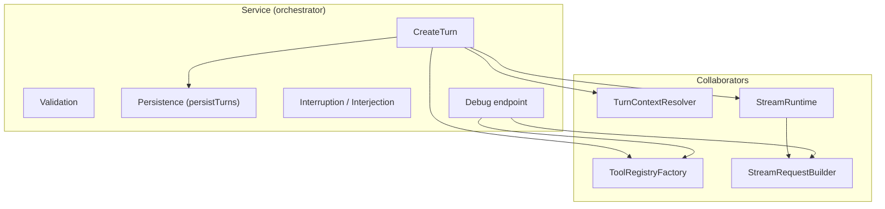
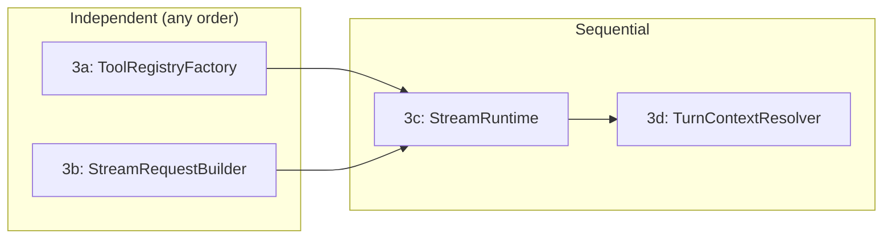

# Phase 3: Streaming Service God Object Decomposition

Detailed design for splitting `streaming.Service` (~37 fields, 11+ concerns) into 4 collaborators. Follows the direction established in `refactoring-design.md` Item 2 and incorporates reviewer feedback from p563 (tool-registry seam needs shared construction).

## Prior Decisions (from decision-log.md)

- **SpawnInvokerRef accepted as transitional** — Phase 3 ToolRegistryFactory absorbs it
- **prompt_helpers.go accepted as transitional** — each helper maps 1:1 to a collaborator
- **Temp vs production registry divergence deferred to Phase 3** — ToolRegistryFactory is the fix
- **Conversation helpers confirmed as good Phase 3 seams** — reviewer approved

## Design Approach

**Keep turnPipeline as the per-request state holder.** Each pipeline stage still exists, but delegates to a collaborator instead of accessing `p.svc.*` fields directly. This minimizes the migration diff (pipeline structure unchanged) while achieving the goal: Service loses ~20 fields, each collaborator is independently testable.

Service stores references to collaborators. The collaborators own logic + deps. The pipeline orchestrates data flow.



---

## 1. TurnContextResolver

### Responsibility

Pipeline stage 1: thread resolution, persona, model/provider, request params, capability filtering, and stream slot acquisition. Everything in `gather_context.go` moves here.

### Struct Definition

```go
// TurnContextResolver resolves all request context before prompt assembly.
// Owns: thread resolution, persona resolution, model/provider selection,
// request param preparation, capability filtering, stream slot acquisition.
type TurnContextResolver struct {
    turnReader             domainllm.TurnReader       // PrevTurnID lookup
    threadRepo             domainllm.ThreadStore      // Thread CRUD, GetThread
    projectRepo            domaindocsys.ProjectStore  // Project load for tool policy
    validator              ThreadValidator             // Thread existence/access check
    personaCatalog         domainagents.PersonaCatalog // Persona resolution (nil = disabled)
    workItemSvc            domainwi.Service            // Work item gates (nil = disabled)
    contextResolver        *contextResolver            // Work context variables (nil = disabled)
    creditAdmissionChecker billing.CreditAdmissionChecker // HasPurchasedCredits for stream tier
    userStreamTracker      *UserStreamTracker          // Per-user concurrent stream limiter
    capabilityRegistry     *capabilities.Registry      // Model capability lookup
    config                 *config.Config              // DefaultModel, SearchAPIKey
    txManager              domain.TransactionManager   // Thread creation transaction
    logger                 *slog.Logger
}
```

13 fields, but they are tightly cohesive — all needed for the "can this request proceed and what does it look like?" question. No further split is justified because the sub-concerns (persona resolution, work item gate, capability filtering) are sequentially dependent within the same stage.

### Constructor

```go
type TurnContextResolverDeps struct {
    TurnReader             domainllm.TurnReader
    ThreadRepo             domainllm.ThreadStore
    ProjectRepo            domaindocsys.ProjectStore
    Validator              ThreadValidator
    PersonaCatalog         domainagents.PersonaCatalog    // optional
    WorkItemSvc            domainwi.Service               // optional
    WorkItemStore          domainwi.Store                 // optional, for contextResolver
    CreditAdmissionChecker billing.CreditAdmissionChecker
    UserStreamTracker      *UserStreamTracker
    CapabilityRegistry     *capabilities.Registry
    Config                 *config.Config
    TxManager              domain.TransactionManager
    Logger                 *slog.Logger
}

func NewTurnContextResolver(deps TurnContextResolverDeps) *TurnContextResolver
```

Constructor builds `contextResolver` internally (same pattern as current `NewStreamingOrchestrator`).

### Output Struct

```go
// TurnContext holds all outputs from context resolution (pipeline stage 1).
// Replaces the scattered fields on turnPipeline that gatherContext used to set.
type TurnContext struct {
    ThreadCtx        *threadContext
    Project          *domaindocsys.Project
    RequestParams    map[string]interface{}
    Params           *domainllm.RequestParams
    Model            string
    Provider         string
    CreatedThread    *domainllm.Thread         // Only set on cold start
    StreamAcquired   bool                      // True if stream slot acquired
    ResolvedPersona  *domainagents.Persona     // nil for non-persona turns
    ResolvedWorkItem *domainwi.WorkItem        // nil for non-persona turns
    WorkContext      *domainllm.WorkContext    // nil for non-persona turns
    EnabledTools     []string                  // Extracted from RequestParams
}
```

### Public Methods

```go
// Resolve executes the full context resolution pipeline.
// Returns TurnContext with all fields populated, or an error.
// On success with StreamAcquired=true, caller must release the stream slot
// on error paths (or transfer ownership to cleanup).
func (r *TurnContextResolver) Resolve(ctx context.Context, req *domainllm.CreateTurnRequest) (*TurnContext, error)

// ResolveThreadContext determines which thread to use (exported for debug endpoint).
// Priority: PrevTurnID > ThreadID > ProjectID > error.
func (r *TurnContextResolver) ResolveThreadContext(ctx context.Context, req *domainllm.CreateTurnRequest) (*threadContext, error)
```

### Methods That Move Here (from Service)

| Current method | Current file | New owner |
|---|---|---|
| `resolveThreadContext` | gather_context.go | `TurnContextResolver.ResolveThreadContext` |
| `resolvePersona` (on turnPipeline) | gather_context.go | private method on TurnContextResolver |
| `ensureWorkItemAndResolveContext` (on turnPipeline) | gather_context.go | private method |
| `resolveRequestParams` (on turnPipeline) | gather_context.go | private method |
| `resolveModelAndProvider` (on turnPipeline) | gather_context.go | private method |
| `applyModelCapabilities` (on turnPipeline) | gather_context.go | private method |
| `applyPersonaOverrides` (on turnPipeline) | gather_context.go | private method |

### Files

- **New file:** `turn_context_resolver.go` (replaces logic from `gather_context.go`)
- **Deleted file:** `gather_context.go` (fully absorbed)
- `context_resolver.go` — unchanged (still a helper, constructed by TurnContextResolver)
- `user_stream_tracker.go` — unchanged (still a dependency)

---

## 2. ToolRegistryFactory

### Responsibility

Unified tool registry construction for both prompt-facing (temp) and execution (production) registries. Owns skill loading, common builder setup, and variant-specific extras. **Directly addresses p563 reviewer finding**: one owner for shared builder construction.

### Struct Definition

```go
// ToolRegistryFactory builds tool registries for both prompt assembly and execution.
// Common builder setup is shared; BuildTempRegistry and BuildProductionRegistry
// add variant-specific tools on top.
//
// This replaces the divergent buildTempToolRegistry (prompt_helpers.go) and
// buildProductionToolRegistry (launch_stream.go) with a single owner.
type ToolRegistryFactory struct {
    namespaceSvc     domaindocsys.NamespaceService     // Namespace routing
    mutationStrategy tools.DocumentMutationStrategy    // AI edit persistence strategy
    documentSvc      domaindocsys.DocumentService      // Document tool deps
    folderSvc        domaindocsys.FolderService        // Folder tool deps
    skillResolver    domainagents.SkillResolver         // Skill listing + tool registration
    spawnInvokerRef  func() domainllm.SpawnInvoker     // Lazy spawn invoker (transitional)
    config           *config.Config                     // SearchAPIKey for web search
    logger           *slog.Logger
}
```

8 fields. Clean single-concern struct.

### Shared Input Struct

```go
// ToolRegistryInputs captures the per-request context shared by both registry variants.
// Constructed once from TurnContext, used by both BuildTempRegistry and BuildProductionRegistry.
type ToolRegistryInputs struct {
    EnabledTools  []string              // Tool names from request params
    ProjectID     string                // Project scope for tools
    UserID        string                // User scope for tools
    WorkItemSlug  string                // .meridian/work/<slug>/ path isolation
    Persona       *domainagents.Persona // Persona tool filter (nil = no filter)
}
```

### Constructor

```go
type ToolRegistryFactoryDeps struct {
    NamespaceSvc     domaindocsys.NamespaceService
    MutationStrategy tools.DocumentMutationStrategy
    DocumentSvc      domaindocsys.DocumentService
    FolderSvc        domaindocsys.FolderService
    SkillResolver    domainagents.SkillResolver
    SpawnInvokerRef  func() domainllm.SpawnInvoker // optional
    Config           *config.Config
    Logger           *slog.Logger
}

func NewToolRegistryFactory(deps ToolRegistryFactoryDeps) *ToolRegistryFactory
```

### Public Methods

```go
// LoadAvailableSkills resolves runtime skills for tool metadata enrichment.
// Best-effort: failures logged, returns empty slice.
func (f *ToolRegistryFactory) LoadAvailableSkills(ctx context.Context, projectID string) []domainagents.RuntimeSkill

// BuildTempRegistry builds the prompt-facing registry for system prompt tool section generation.
// Does NOT include spawn tool or web search (prompt doesn't need execution-only tools).
func (f *ToolRegistryFactory) BuildTempRegistry(inputs ToolRegistryInputs, skills []domainagents.RuntimeSkill) *tools.ToolRegistry

// BuildProductionRegistry builds the execution registry with spawn + web search tools.
// threadID and workItemID are needed for spawn tool context.
func (f *ToolRegistryFactory) BuildProductionRegistry(inputs ToolRegistryInputs, skills []domainagents.RuntimeSkill, threadID string, workItemID string) *tools.ToolRegistry
```

### Internal: Shared Builder Setup

```go
// commonBuilder creates a ToolRegistryBuilder with the tools shared by both variants.
func (f *ToolRegistryFactory) commonBuilder(inputs ToolRegistryInputs, skills []domainagents.RuntimeSkill) *tools.ToolRegistryBuilder {
    return tools.NewToolRegistryBuilder().
        WithNamespaceService(f.namespaceSvc).
        WithMutationStrategy(f.mutationStrategy).
        WithWorkItemSlug(inputs.WorkItemSlug).
        WithEnabledDocumentTools(inputs.EnabledTools, inputs.ProjectID, inputs.UserID, f.documentSvc, f.folderSvc).
        WithEnabledSkillTools(inputs.EnabledTools, inputs.ProjectID, f.skillResolver, false, skills)
}
```

`BuildTempRegistry` calls `commonBuilder`, applies persona filter, builds.
`BuildProductionRegistry` calls `commonBuilder`, adds spawn tool, adds web search, applies persona filter, builds. **Persona filter applied last in both variants** (after all tools registered).

### Methods That Move Here

| Current method | Current file | New owner |
|---|---|---|
| `loadAvailableSkills` | prompt_helpers.go | `ToolRegistryFactory.LoadAvailableSkills` |
| `buildTempToolRegistry` | prompt_helpers.go | `ToolRegistryFactory.BuildTempRegistry` |
| `buildProductionToolRegistry` | launch_stream.go | `ToolRegistryFactory.BuildProductionRegistry` |

### Files

- **New file:** `tool_registry_factory.go`
- `prompt_helpers.go` — `loadAvailableSkills` and `buildTempToolRegistry` removed (2 of 5 functions move out)
- `launch_stream.go` — `buildProductionToolRegistry` removed
- `tool_policy.go` — unchanged (still utility functions called by TurnContextResolver)

---

## 3. StreamRequestBuilder

### Responsibility

Turn path loading, message construction, and @-reference transformation. Builds the `[]domainllm.Message` that feeds the LLM provider.

### Struct Definition

```go
// StreamRequestBuilder loads conversation history and transforms @-references
// into provider-ready messages. Used by both production streaming and debug endpoints.
type StreamRequestBuilder struct {
    turnNavigator     domainllm.TurnNavigator          // GetTurnPath
    turnReader        domainllm.TurnReader             // GetTurnBlocks
    messageBuilder    domainllm.MessageBuilder         // BuildMessages
    documentSvc       domaindocsys.DocumentService     // Reference transformer deps
    folderSvc         domaindocsys.FolderService       // Reference transformer deps
    formatterRegistry *formatting.FormatterRegistry    // Reference transformer deps
    logger            *slog.Logger
}
```

7 fields. Clean, focused on message construction.

### Constructor

```go
type StreamRequestBuilderDeps struct {
    TurnNavigator     domainllm.TurnNavigator
    TurnReader        domainllm.TurnReader
    MessageBuilder    domainllm.MessageBuilder
    DocumentSvc       domaindocsys.DocumentService
    FolderSvc         domaindocsys.FolderService
    FormatterRegistry *formatting.FormatterRegistry
    Logger            *slog.Logger
}

func NewStreamRequestBuilder(deps StreamRequestBuilderDeps) *StreamRequestBuilder
```

### Public Methods

```go
// BuildConversationMessages loads turn path, builds messages, transforms references.
// Convenience wrapper for the common production path.
func (b *StreamRequestBuilder) BuildConversationMessages(ctx context.Context, turnID, userID, projectID string) ([]domainllm.Message, error)

// LoadConversationHistory loads the turn path and builds untransformed messages.
// Use when you need to insert messages before reference transformation (e.g. debug).
func (b *StreamRequestBuilder) LoadConversationHistory(ctx context.Context, turnID string) ([]domainllm.Message, error)

// TransformMessageReferences compiles @-references into synthetic tool_use/tool_result pairs.
func (b *StreamRequestBuilder) TransformMessageReferences(ctx context.Context, messages []domainllm.Message, userID, projectID string) ([]domainllm.Message, error)
```

### Methods That Move Here

| Current method | Current file | New owner |
|---|---|---|
| `buildConversationMessages` | prompt_helpers.go | `StreamRequestBuilder.BuildConversationMessages` |
| `loadConversationHistory` | prompt_helpers.go | `StreamRequestBuilder.LoadConversationHistory` |
| `transformMessageReferences` | prompt_helpers.go | `StreamRequestBuilder.TransformMessageReferences` |

### Files

- **New file:** `stream_request_builder.go`
- `prompt_helpers.go` — **fully absorbed** (all 5 functions move: 2 to ToolRegistryFactory, 3 to StreamRequestBuilder). File deleted.

---

## 4. StreamRuntime

### Responsibility

Executor creation, stream/executor registration, cleanup wiring, provider resolution, and background streaming kick-off. Owns the "launch" ceremony.

### Struct Definition

```go
// StreamRuntime creates StreamExecutors, registers them, and starts background streaming.
// Bundles executor dependencies so Service doesn't need to hold 15+ fields just to pass
// them through to NewStreamExecutor.
type StreamRuntime struct {
    providerGetter       LLMProviderGetter
    streamRegistry       *mstream.Registry              // mstream stream registration
    executorRegistry     *ExecutorRegistry               // Executor tracking for interruption
    interjectionRegistry *mstream.InterjectionRegistry   // Interjection buffer management
    toolLimitResolver    domainllm.ToolLimitResolver     // Tool round limit resolution
    requestBuilder       *StreamRequestBuilder           // For building messages in background goroutine
    executorDeps         ExecutorDeps                    // Deps passed through to NewStreamExecutor
    config               *config.Config
    logger               *slog.Logger
}

// ExecutorDeps groups dependencies that are threaded through to NewStreamExecutor.
// These are all "pass-through" deps: StreamRuntime doesn't use them directly,
// but NewStreamExecutor needs them.
type ExecutorDeps struct {
    TurnWriter             domainllm.TurnWriter
    TurnReader             domainllm.TurnReader
    TurnNavigator          domainllm.TurnNavigator
    MessageBuilder         domainllm.MessageBuilder
    CreditAdmissionChecker billing.CreditAdmissionChecker
    CreditSettler          billing.CreditSettler
    TokenFinalizer         tokens.TokenFinalizer
    JobQueue               jobs.JobQueue
    TokenMonitor           *TokenMonitor // nil = monitoring disabled
}
```

StreamRuntime itself has 9 fields. ExecutorDeps bundles 9 pass-through fields. Total: 18 dependency references, but the split makes intent clear — StreamRuntime's own logic only touches 9.

### Constructor

```go
type StreamRuntimeDeps struct {
    ProviderGetter       LLMProviderGetter
    StreamRegistry       *mstream.Registry
    ExecutorRegistry     *ExecutorRegistry
    InterjectionRegistry *mstream.InterjectionRegistry
    ToolLimitResolver    domainllm.ToolLimitResolver
    RequestBuilder       *StreamRequestBuilder
    ExecutorDeps         ExecutorDeps
    Config               *config.Config
    Logger               *slog.Logger
}

func NewStreamRuntime(deps StreamRuntimeDeps) *StreamRuntime
```

### Public Methods

```go
// LaunchInput captures everything needed to start streaming for an assistant turn.
type LaunchInput struct {
    AssistantTurn  *domainllm.Turn
    UserTurn       *domainllm.Turn
    Thread         *domainllm.Thread           // Resolved or created thread
    ThreadID       string
    UserID         string
    ProjectID      string
    Model          string
    Provider       string
    RequestParams  map[string]interface{}
    Params         *domainllm.RequestParams
    ToolRegistry   *tools.ToolRegistry          // Production registry from ToolRegistryFactory
    SettlementMode billing.CreditSettlementMode
}

// Launch creates an executor, registers the stream, wires cleanup, and starts
// background streaming. Returns the CreateTurnResponse.
//
// On success, stream slot ownership transfers to the executor's cleanup callback.
// The caller's LaunchInput.UserStreamTracker release is disarmed.
func (r *StreamRuntime) Launch(ctx context.Context, input *LaunchInput, releaseStreamSlot func()) (*domainllm.CreateTurnResponse, error)

// CreateStreamSwitchFn builds a StreamSwitchFn for interjection injection.
// The returned function creates follow-up turns when an interjection triggers a stream switch.
//
// NOTE: This takes createTurnFn as a callback to avoid the StreamRuntime -> Service
// circular dependency. Service passes s.CreateTurn as the callback.
func (r *StreamRuntime) CreateStreamSwitchFn(
    threadID, userID string,
    requestParams map[string]any,
    createTurnFn func(ctx context.Context, req *domainllm.CreateTurnRequest) (*domainllm.CreateTurnResponse, error),
) StreamSwitchFn
```

### Methods That Move Here

| Current method | Current file | New owner |
|---|---|---|
| `launchStream` (core logic) | launch_stream.go | `StreamRuntime.Launch` |
| `startStreamingExecution` | launch_stream.go | private method on StreamRuntime |
| `createStreamSwitchFn` | interjection.go | `StreamRuntime.CreateStreamSwitchFn` |

### Files

- **New file:** `stream_runtime.go`
- `launch_stream.go` — **fully absorbed**. File deleted.
- `interjection.go` — `createStreamSwitchFn` moves out; `UpsertInterjection`, `GetInterjection`, `ClearInterjection` stay on Service.
- `stream_executor.go` — unchanged (StreamExecutor is already its own type)

---

## 5. How turnPipeline Changes

### Before (current)

```go
type turnPipeline struct {
    svc *Service   // God object reference — accesses ~25 fields
    req *domainllm.CreateTurnRequest

    // 12+ output fields set across stages
    threadCtx, project, requestParams, params, model, provider,
    createdThread, streamAcquired, resolvedPersona, resolvedWorkItem,
    workContext, availableSkills, enabledTools, userTurn, assistantTurn
}
```

Each stage method (e.g. `p.gatherContext`) accesses `p.svc.*` directly.

### After

```go
type turnPipeline struct {
    svc *Service   // Narrowed: only persistence + remaining Service methods
    req *domainllm.CreateTurnRequest

    // Stage 1 output (from TurnContextResolver)
    turnCtx *TurnContext

    // Stage 2 output (from ToolRegistryFactory + Service.assemblePrompt)
    availableSkills []domainagents.RuntimeSkill

    // Stage 3 output (from Service.persistTurns)
    userTurn      *domainllm.Turn
    assistantTurn *domainllm.Turn
}
```

Scattered output fields collapse into `TurnContext`. Pipeline shrinks from ~15 fields to ~5.

### CreateTurn Flow (after)

```go
func (s *Service) CreateTurn(ctx context.Context, req *domainllm.CreateTurnRequest) (*domainllm.CreateTurnResponse, error) {
    // Normalize + validate (stays on Service)
    normalizeRequest(req)
    if err := s.validateCreateTurnRequest(req); err != nil { return nil, ... }

    // Stage 1: Resolve context (delegates to TurnContextResolver)
    turnCtx, err := s.turnContextResolver.Resolve(ctx, req)
    if err != nil { return nil, err }

    // Defer: release stream slot on error; orphan thread cleanup
    defer func() {
        if turnCtx.StreamAcquired { s.turnContextResolver.ReleaseStreamSlot(req.UserID) }
    }()
    defer func() {
        if turnCtx.CreatedThread != nil && userTurn == nil {
            s.threadRepo.DeleteThread(context.Background(), turnCtx.CreatedThread.ID, req.UserID)
        }
    }()

    // Stage 2: Assemble prompt (Service orchestrates collaborators)
    if err := s.assemblePrompt(ctx, turnCtx, req); err != nil { return nil, err }

    // Stage 3: Persist turns (stays on Service — pure persistence)
    userTurn, assistantTurn, err := s.persistTurns(ctx, turnCtx, req)
    if err != nil { return nil, err }

    // Stage 4: Launch stream (delegates to StreamRuntime)
    return s.streamRuntime.Launch(ctx, &LaunchInput{
        AssistantTurn:  assistantTurn,
        UserTurn:       userTurn,
        Thread:         turnCtx.CreatedThread,  // or loaded thread
        ThreadID:       turnCtx.ThreadCtx.threadID,
        UserID:         req.UserID,
        ProjectID:      turnCtx.ThreadCtx.projectID,
        Model:          turnCtx.Model,
        Provider:       turnCtx.Provider,
        RequestParams:  turnCtx.RequestParams,
        Params:         turnCtx.Params,
        ToolRegistry:   productionRegistry,
        SettlementMode: s.resolveSettlementMode(turnCtx.Provider),
    }, func() { s.turnContextResolver.ReleaseStreamSlot(req.UserID) })
}
```

`assemblePrompt` stays as a method on Service (it orchestrates ToolRegistryFactory + SystemPromptResolver), but it takes `TurnContext` as input instead of reading from `turnPipeline`:

```go
func (s *Service) assemblePrompt(ctx context.Context, turnCtx *TurnContext, req *domainllm.CreateTurnRequest) error {
    skills := s.toolRegistryFactory.LoadAvailableSkills(ctx, turnCtx.ThreadCtx.projectID)

    inputs := ToolRegistryInputs{
        EnabledTools: turnCtx.EnabledTools,
        ProjectID:    turnCtx.ThreadCtx.projectID,
        UserID:       req.UserID,
        WorkItemSlug: workItemSlugFrom(turnCtx),
        Persona:      turnCtx.ResolvedPersona,
    }
    tempRegistry := s.toolRegistryFactory.BuildTempRegistry(inputs, skills)
    toolSection := tempRegistry.BuildSystemPromptSection()

    // ... system prompt resolution (stays on Service, uses systemPromptResolver) ...

    // Stash skills + inputs for Stage 4's production registry
    turnCtx.AvailableSkills = skills
    turnCtx.ToolRegistryInputs = inputs
    return nil
}
```

---

## 6. How debug.go Changes

Currently `BuildDebugProviderRequest` reimplements ~60% of the pipeline. With collaborators, it calls them directly:

```go
func (s *Service) BuildDebugProviderRequest(ctx context.Context, req *domainllm.CreateTurnRequest) (map[string]interface{}, error) {
    // Validate (same as now)
    ...

    // Partial context resolution (debug doesn't need full pipeline)
    // Thread + project load
    thread, err := s.threadRepo.GetThread(ctx, *req.ThreadID, req.UserID)
    project, err := s.projectRepo.GetByID(ctx, thread.ProjectID, req.UserID)

    // Tool policy (same utility functions, no change)
    disabled := parseDisabledTools(project.Preferences)
    toolNames := resolveServerToolNames(s.config.LLM.SearchAPIKey != "", disabled)
    enabledTools := toolNames
    ...

    // Skills + temp registry via ToolRegistryFactory (replaces duplicated code)
    skills := s.toolRegistryFactory.LoadAvailableSkills(ctx, thread.ProjectID)
    tempRegistry := s.toolRegistryFactory.BuildTempRegistry(ToolRegistryInputs{
        EnabledTools: enabledTools,
        ProjectID:    thread.ProjectID,
        UserID:       req.UserID,
        WorkItemSlug: "",  // debug doesn't support persona/work items
        Persona:      nil,
    }, skills)
    toolSection := tempRegistry.BuildSystemPromptSection()

    // System prompt resolution (same as now)
    ...

    // Conversation messages via StreamRequestBuilder (replaces duplicated code)
    messages, err := s.streamRequestBuilder.LoadConversationHistory(ctx, turnIDForPath)
    // Append hypothetical user message (same as now)
    ...
    messages, err = s.streamRequestBuilder.TransformMessageReferences(ctx, messages, req.UserID, thread.ProjectID)

    // Provider + JSON conversion (same as now)
    ...
}
```

**Key improvement:** debug.go drops from ~230 lines to ~120 lines. The duplicated skill loading, tool registry construction, and message building are replaced by collaborator calls.

---

## 7. Dependency Threading: setup.go Wiring

### Construction Order

```
1. UserStreamTracker          (standalone)
2. TurnContextResolver        (standalone, receives UserStreamTracker)
3. ToolRegistryFactory         (standalone)
4. StreamRequestBuilder       (standalone)
5. StreamRuntime              (depends on StreamRequestBuilder)
6. Service                    (depends on all 4 collaborators + remaining deps)
```

No circular dependencies between collaborators. StreamRuntime depends on StreamRequestBuilder (uses it in `startStreamingExecution`). All others are independent.

### setup.go Changes

```go
func SetupLLMServices(deps LLMServicesDeps) (*Services, *mstream.Registry, error) {
    // ... existing provider, validator, formatter, etc. setup ...

    executorRegistry := streaming.NewExecutorRegistry()
    streamRegistry := mstream.NewRegistry()

    // Build collaborators
    userStreamTracker := streaming.NewUserStreamTracker(
        deps.Config.LLM.MaxConcurrentStreamsFree,
        deps.Config.LLM.MaxConcurrentStreamsPaid,
    )

    turnContextResolver := streaming.NewTurnContextResolver(streaming.TurnContextResolverDeps{
        TurnReader:             deps.TurnRepo,
        ThreadRepo:             deps.ThreadRepo,
        ProjectRepo:            deps.ProjectRepo,
        Validator:              validator,
        PersonaCatalog:         deps.PersonaCatalog,
        WorkItemSvc:            deps.WorkItemSvc,
        WorkItemStore:          deps.WorkItemStore,
        CreditAdmissionChecker: deps.CreditAdmissionChecker,
        UserStreamTracker:      userStreamTracker,
        CapabilityRegistry:     deps.CapabilityRegistry,
        Config:                 deps.Config,
        TxManager:              deps.TxManager,
        Logger:                 deps.Logger,
    })

    var spawnInvoker domainllm.SpawnInvoker // closure variable for spawn wiring

    toolRegistryFactory := streaming.NewToolRegistryFactory(streaming.ToolRegistryFactoryDeps{
        NamespaceSvc:     namespaceSvc,
        MutationStrategy: deps.MutationStrategy,
        DocumentSvc:      deps.DocumentSvc,
        FolderSvc:        deps.FolderSvc,
        SkillResolver:    deps.SkillResolver,
        SpawnInvokerRef:  func() domainllm.SpawnInvoker { return spawnInvoker },
        Config:           deps.Config,
        Logger:           deps.Logger,
    })

    streamRequestBuilder := streaming.NewStreamRequestBuilder(streaming.StreamRequestBuilderDeps{
        TurnNavigator:     deps.TurnRepo,
        TurnReader:        deps.TurnRepo,
        MessageBuilder:    messageBuilder,
        DocumentSvc:       deps.DocumentSvc,
        FolderSvc:         deps.FolderSvc,
        FormatterRegistry: formatterRegistry,
        Logger:            deps.Logger,
    })

    // Build token monitor (same as current, but passes to StreamRuntime)
    var tokenMonitor *streaming.TokenMonitor
    tokenEst, estErr := tokens.NewTiktokenEstimator(deps.CapabilityRegistry)
    if estErr == nil {
        tokenMonitor = streaming.NewTokenMonitor(tokenEst, deps.CapabilityRegistry, deps.Logger)
    }

    streamRuntime := streaming.NewStreamRuntime(streaming.StreamRuntimeDeps{
        ProviderGetter:       providerResolver,
        StreamRegistry:       streamRegistry,
        ExecutorRegistry:     executorRegistry,
        InterjectionRegistry: mstream.NewInterjectionRegistry(),
        ToolLimitResolver:    deps.ToolLimitResolver,
        RequestBuilder:       streamRequestBuilder,
        ExecutorDeps: streaming.ExecutorDeps{
            TurnWriter:             deps.TurnRepo,
            TurnReader:             deps.TurnRepo,
            TurnNavigator:          deps.TurnRepo,
            MessageBuilder:         messageBuilder,
            CreditAdmissionChecker: deps.CreditAdmissionChecker,
            CreditSettler:          deps.CreditSettler,
            TokenFinalizer:         tokenFinalizer,
            JobQueue:               deps.JobQueue,
            TokenMonitor:           tokenMonitor,
        },
        Config: deps.Config,
        Logger: deps.Logger,
    })

    // Build Service with collaborators + remaining deps
    streamingService, err := streaming.NewStreamingOrchestrator(streaming.StreamingDeps{
        // Collaborators
        TurnContextResolver:  turnContextResolver,
        ToolRegistryFactory:  toolRegistryFactory,
        StreamRequestBuilder: streamRequestBuilder,
        StreamRuntime:        streamRuntime,

        // Remaining deps (persistence, auth, interruption)
        TurnWriter:           deps.TurnRepo,
        TurnReader:           deps.TurnRepo,
        ThreadRepo:           deps.ThreadRepo,
        ProjectRepo:          deps.ProjectRepo,
        Validator:            validator,
        Authorizer:           deps.Authorizer,
        Registry:             streamRegistry,       // mstream registry for InterruptTurn
        ExecutorRegistry:     executorRegistry,      // for InterruptTurn
        InterjectionRegistry: mstream.NewInterjectionRegistry(), // for interjection endpoints
        CapabilityRegistry:   deps.CapabilityRegistry, // for InterruptTurn capability check
        SystemPromptResolver: systemPromptResolver,    // for assemblePrompt
        TxManager:            deps.TxManager,          // for persistTurns
        Config:               deps.Config,
        Logger:               deps.Logger,
    })

    // SpawnService wiring (same pattern as current)
    bootstrapper := streaming.NewChildThreadBootstrapper(streamingService, deps.TurnRepo, deps.Logger)
    spawnSvc := streaming.NewSpawnService(...)
    spawnInvoker = spawnSvc

    // ...
}
```

### SpawnInvokerRef Migration

`SpawnInvokerRef` moves from `StreamingDeps.Services` to `ToolRegistryFactoryDeps`. The closure variable pattern is identical — just a different owner. Phase 3 resolves the "temporal coupling" concern from the decision log: the ToolRegistryFactory is the sole consumer of SpawnInvoker, so the coupling is localized.

---

## 8. What Stays on Service

### Remaining Fields (~16, down from ~37)

```go
type Service struct {
    // Collaborators (4)
    turnContextResolver  *TurnContextResolver
    toolRegistryFactory  *ToolRegistryFactory
    streamRequestBuilder *StreamRequestBuilder
    streamRuntime        *StreamRuntime

    // Persistence (5) — used by persistTurns, interruption, interjection, debug
    turnWriter    domainllm.TurnWriter
    turnReader    domainllm.TurnReader
    threadRepo    domainllm.ThreadStore
    projectRepo   domaindocsys.ProjectStore
    txManager     domain.TransactionManager

    // Auth + validation (2) — used by interruption, interjection, debug
    validator  ThreadValidator
    authorizer authdomain.ResourceAuthorizer

    // Interruption infrastructure (3) — used by InterruptTurn, UpsertInterjection
    registry           *mstream.Registry              // mstream stream lookup for interrupt
    executorRegistry   *ExecutorRegistry               // Executor lookup for interrupt/interjection
    capabilityRegistry *capabilities.Registry          // Model cap check for soft/hard cancel

    // Prompt + billing remnants (3) — used by assemblePrompt, resolveSettlementMode
    systemPromptResolver domainllm.SystemPromptResolver
    settlementMode       billing.CreditSettlementMode
    config               *config.Config

    // Infra (1)
    logger *slog.Logger
}
```

**Removed from Service (~21 fields):**
- `turnNavigator` → StreamRuntime (ExecutorDeps) + StreamRequestBuilder
- `documentSvc` → ToolRegistryFactory + StreamRequestBuilder
- `folderSvc` → ToolRegistryFactory + StreamRequestBuilder
- `namespaceSvc` → ToolRegistryFactory
- `skillResolver` → ToolRegistryFactory
- `providerGetter` → StreamRuntime
- `interjectionRegistry` → StreamRuntime (Service still needs it for interjection endpoints — shared reference)
- `formatterRegistry` → StreamRequestBuilder
- `messageBuilder` → StreamRequestBuilder + StreamRuntime (ExecutorDeps)
- `tokenFinalizer` → StreamRuntime (ExecutorDeps)
- `creditAdmissionChecker` → TurnContextResolver + StreamRuntime (ExecutorDeps)
- `creditSettler` → StreamRuntime (ExecutorDeps)
- `toolLimitResolver` → StreamRuntime
- `jobQueue` → StreamRuntime (ExecutorDeps)
- `mutationStrategy` → ToolRegistryFactory
- `spawnInvokerRef` → ToolRegistryFactory
- `personaCatalog` → TurnContextResolver
- `workItemSvc` → TurnContextResolver
- `contextResolver` → TurnContextResolver
- `userStreamTracker` → TurnContextResolver
- `tokenMonitor` → StreamRuntime (ExecutorDeps)

**Note on interjectionRegistry:** Both StreamRuntime and Service need access. StreamRuntime uses it for `GetOrCreate` in Launch. Service uses it for `Get`, `Remove` in interjection endpoints. They share the same instance (wired in setup.go). This is fine — it's a concurrent-safe registry.

### Remaining Methods

| Method | File | Why it stays |
|---|---|---|
| `CreateTurn` | turn_creation.go | Orchestration hub, calls collaborators |
| `validateCreateTurnRequest` | turn_helpers.go | Request validation |
| `assemblePrompt` | assemble_prompt.go | Orchestrates ToolRegistryFactory + SystemPromptResolver |
| `persistTurns` | persist_turns.go | Pure persistence in transaction |
| `resolveSystemPromptForParams` | assemble_prompt.go | System prompt composition |
| `resolveSettlementMode` | turn_creation.go | Billing mode per provider |
| `InterruptTurn` | interruption.go | Auth + executor + capability coupling |
| `AuthorizeTurnStream` | interruption.go | Auth check |
| `cascadeCancelChildren` | interruption.go | Thread repo + executor registry |
| `getProviderFromModel` | interruption.go | Simple model-to-provider mapping |
| `UpsertInterjection` | interjection.go | Auth + executor + CreateTurn recursion |
| `GetInterjection` | interjection.go | Auth + interjection registry |
| `ClearInterjection` | interjection.go | Auth + interjection registry |
| `BuildDebugProviderRequest` | debug.go | Debug endpoint, calls collaborators |
| `CreateAssistantTurnDebug` | turn_helpers.go | Debug-only turn creation |

---

## 9. Phase Ordering

### Extraction Independence



### Phase 3a: ToolRegistryFactory (independent)

**Why first:** Directly addresses reviewer p563 finding. Smallest blast radius. No dependency on other collaborators.

**What moves:**
- `loadAvailableSkills` from prompt_helpers.go
- `buildTempToolRegistry` from prompt_helpers.go
- `buildProductionToolRegistry` from launch_stream.go
- `spawnInvokerRef` from Service

**What changes:**
- `assemblePrompt` calls `s.toolRegistryFactory.BuildTempRegistry(...)` instead of `svc.buildTempToolRegistry(...)`
- `launchStream` calls `s.toolRegistryFactory.BuildProductionRegistry(...)` instead of `p.buildProductionToolRegistry(...)`
- Service loses: `namespaceSvc`, `mutationStrategy`, `skillResolver`, `spawnInvokerRef` (4 fields)

**Files touched:** `tool_registry_factory.go` (new), `prompt_helpers.go` (remove 2 functions), `launch_stream.go` (remove 1 function, update callers), `assemble_prompt.go` (update callers), `service.go` (remove fields, add collaborator), `deps.go` (restructure), `setup.go` (wire factory)

**Verification:** `go build`, existing tests. No behavior change.

### Phase 3b: StreamRequestBuilder (independent, parallel with 3a)

**Why parallel:** No dependency on ToolRegistryFactory. Smallest scope.

**What moves:**
- `buildConversationMessages` from prompt_helpers.go
- `loadConversationHistory` from prompt_helpers.go
- `transformMessageReferences` from prompt_helpers.go

**What changes:**
- `startStreamingExecution` calls `s.streamRequestBuilder.BuildConversationMessages(...)` instead of `svc.buildConversationMessages(...)`
- `BuildDebugProviderRequest` calls `s.streamRequestBuilder.LoadConversationHistory(...)` and `.TransformMessageReferences(...)` instead of `svc.*`
- Service loses: `formatterRegistry` (1 field; `documentSvc` and `folderSvc` stay for now since they're used elsewhere too)

**After 3a + 3b:** `prompt_helpers.go` is empty → delete it.

**Files touched:** `stream_request_builder.go` (new), `prompt_helpers.go` (delete), `launch_stream.go` (update callers), `debug.go` (update callers), `service.go` (remove field, add collaborator), `deps.go` (restructure), `setup.go` (wire builder)

**Verification:** `go build`, existing tests. No behavior change.

### Phase 3c: StreamRuntime (depends on 3b)

**Why after 3b:** StreamRuntime.startStreamingExecution calls StreamRequestBuilder.BuildConversationMessages.

**What moves:**
- Core logic of `launchStream` (executor creation, registration, cleanup, background goroutine)
- `startStreamingExecution` from launch_stream.go
- `createStreamSwitchFn` from interjection.go

**What changes:**
- `turnPipeline.launchStream` becomes a thin wrapper that calls `s.streamRuntime.Launch(...)`
- Service loses: `providerGetter`, `turnNavigator`, `messageBuilder`, `creditAdmissionChecker`, `creditSettler`, `tokenFinalizer`, `jobQueue`, `toolLimitResolver`, `tokenMonitor` (9 fields)
- `interjectionRegistry` becomes shared between Service and StreamRuntime

**Files touched:** `stream_runtime.go` (new), `launch_stream.go` (delete or reduce to thin wrapper), `interjection.go` (remove createStreamSwitchFn), `service.go` (remove fields, add collaborator), `deps.go` (restructure), `setup.go` (wire runtime)

**Verification:** `go build`, existing tests, manual smoke test (streaming still works).

### Phase 3d: TurnContextResolver (depends on 3c)

**Why last:** Largest extraction. Benefits from 3a-3c being stable. Changes the turnPipeline struct shape (introduces TurnContext).

**What moves:**
- All of `gather_context.go` (gatherContext, resolveThreadContext, resolvePersona, ensureWorkItemAndResolveContext, resolveRequestParams, resolveModelAndProvider, applyModelCapabilities, applyPersonaOverrides)

**What changes:**
- `turnPipeline` loses 12 scattered fields, gains `*TurnContext`
- `CreateTurn` calls `s.turnContextResolver.Resolve(ctx, req)` instead of `p.gatherContext(ctx)`
- Service loses: `personaCatalog`, `workItemSvc`, `contextResolver`, `userStreamTracker` (4 fields; `turnReader`, `threadRepo`, `projectRepo`, `capabilityRegistry` stay for interruption/interjection/debug)
- `BuildDebugProviderRequest` can optionally use `TurnContextResolver.ResolveThreadContext` (minor, not required)

**Files touched:** `turn_context_resolver.go` (new), `gather_context.go` (delete), `turn_creation.go` (update pipeline shape), `assemble_prompt.go` (read from TurnContext), `persist_turns.go` (read from TurnContext), `service.go` (remove fields, add collaborator), `deps.go` (restructure), `setup.go` (wire resolver), `debug.go` (optional update)

**Verification:** `go build`, existing tests, full smoke test.

---

## 10. Risk Assessment

### Low Risk
- **ToolRegistryFactory (3a)** and **StreamRequestBuilder (3b)**: Mechanical extraction. Methods move from Service to a collaborator with identical logic. No behavior change.

### Medium Risk
- **StreamRuntime (3c)**: The launch ceremony has subtle ordering requirements (register before return, cleanup callback before executor registration, streamAcquired ownership transfer). Tests should verify the ordering is preserved.
- **Interjection stream switch**: `createStreamSwitchFn` calls `s.CreateTurn` recursively. The callback pattern (`createTurnFn` parameter) avoids circular deps but needs care.

### Higher Risk
- **TurnContextResolver (3d)**: Largest extraction. Changes the turnPipeline data shape. All downstream stages (assemblePrompt, persistTurns, launchStream) need to read from TurnContext instead of scattered fields. This is the highest-touch change but mechanically straightforward.

### Mitigation
- Each phase lands as a separate commit/PR with `go build` + `go test` verification
- Phase 3c and 3d each get a manual smoke test (create a turn, verify streaming works)
- No behavior changes in any phase — pure structural refactoring

---

## Appendix: Field Migration Matrix

| Service Field (current) | Moves to | Phase |
|---|---|---|
| `turnWriter` | stays (persistence) | — |
| `turnReader` | stays (interruption/interjection) + StreamRuntime(ExecutorDeps) | 3c |
| `turnNavigator` | StreamRuntime(ExecutorDeps) + StreamRequestBuilder | 3b, 3c |
| `threadRepo` | stays (interruption) + TurnContextResolver | 3d |
| `projectRepo` | stays (debug/persistTurns) + TurnContextResolver | 3d |
| `documentSvc` | ToolRegistryFactory + StreamRequestBuilder | 3a, 3b |
| `folderSvc` | ToolRegistryFactory + StreamRequestBuilder | 3a, 3b |
| `namespaceSvc` | ToolRegistryFactory | 3a |
| `skillResolver` | ToolRegistryFactory | 3a |
| `validator` | stays + TurnContextResolver | 3d |
| `authorizer` | stays (interruption/interjection) | — |
| `providerGetter` | StreamRuntime | 3c |
| `registry` | stays (interruption) + StreamRuntime | 3c |
| `executorRegistry` | stays (interruption) + StreamRuntime | 3c |
| `interjectionRegistry` | StreamRuntime (shared) | 3c |
| `config` | stays + all collaborators (shared) | 3a-3d |
| `txManager` | stays (persistTurns) + TurnContextResolver | 3d |
| `systemPromptResolver` | stays (assemblePrompt) | — |
| `messageBuilder` | StreamRequestBuilder + StreamRuntime(ExecutorDeps) | 3b, 3c |
| `toolLimitResolver` | StreamRuntime | 3c |
| `capabilityRegistry` | stays (interruption) + TurnContextResolver | 3d |
| `formatterRegistry` | StreamRequestBuilder | 3b |
| `tokenFinalizer` | StreamRuntime(ExecutorDeps) | 3c |
| `creditAdmissionChecker` | TurnContextResolver + StreamRuntime(ExecutorDeps) | 3c, 3d |
| `creditSettler` | StreamRuntime(ExecutorDeps) | 3c |
| `settlementMode` | stays (resolveSettlementMode) | — |
| `jobQueue` | StreamRuntime(ExecutorDeps) | 3c |
| `mutationStrategy` | ToolRegistryFactory | 3a |
| `spawnInvokerRef` | ToolRegistryFactory | 3a |
| `personaCatalog` | TurnContextResolver | 3d |
| `workItemSvc` | TurnContextResolver | 3d |
| `contextResolver` | TurnContextResolver | 3d |
| `userStreamTracker` | TurnContextResolver | 3d |
| `tokenMonitor` | StreamRuntime(ExecutorDeps) | 3c |
| `logger` | stays + all collaborators (shared) | 3a-3d |

Fields marked "stays + X" are shared: Service retains a reference for interruption/interjection/debug, and the collaborator also holds one. This is normal in Go — interfaces are cheap.
