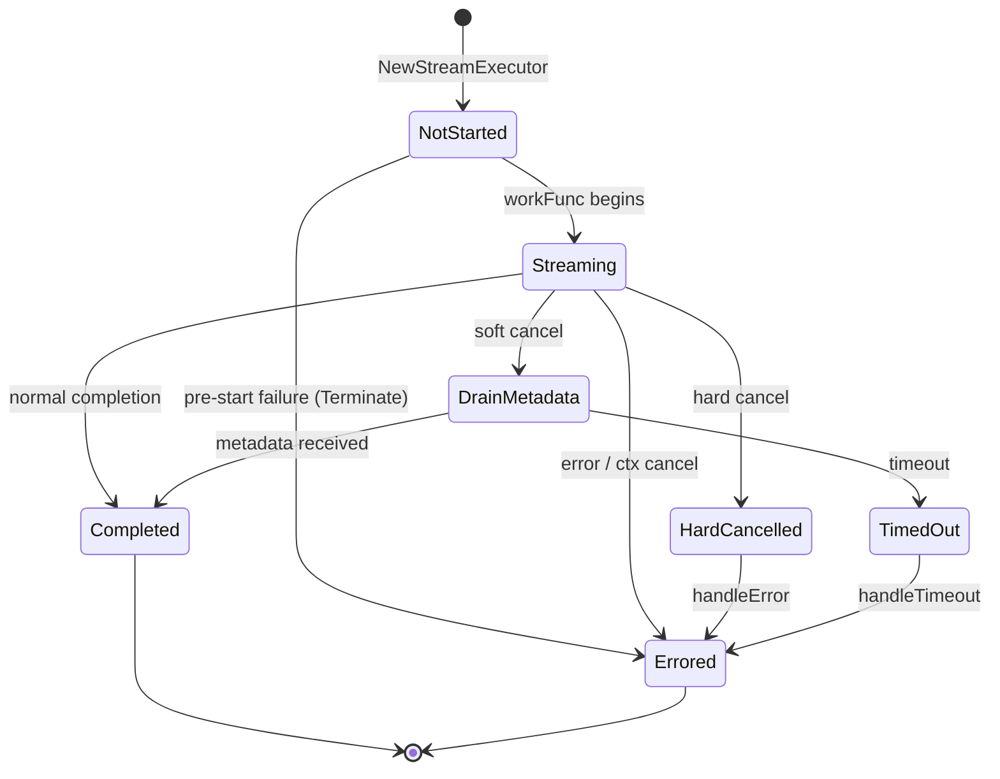
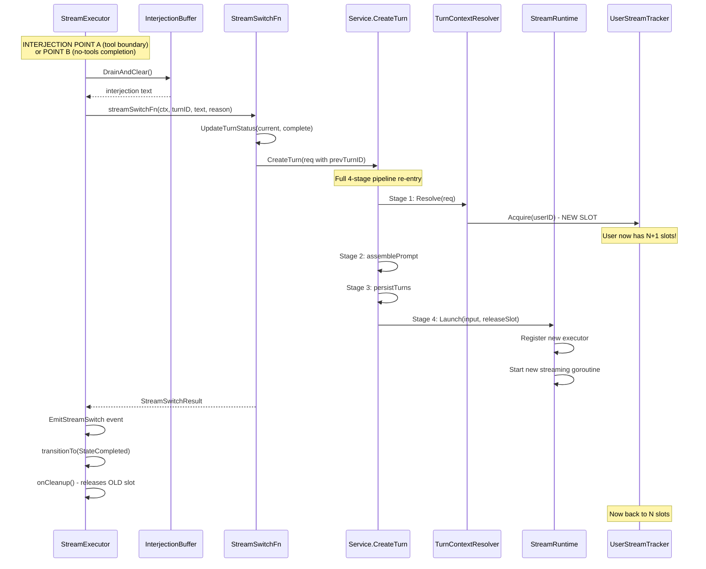
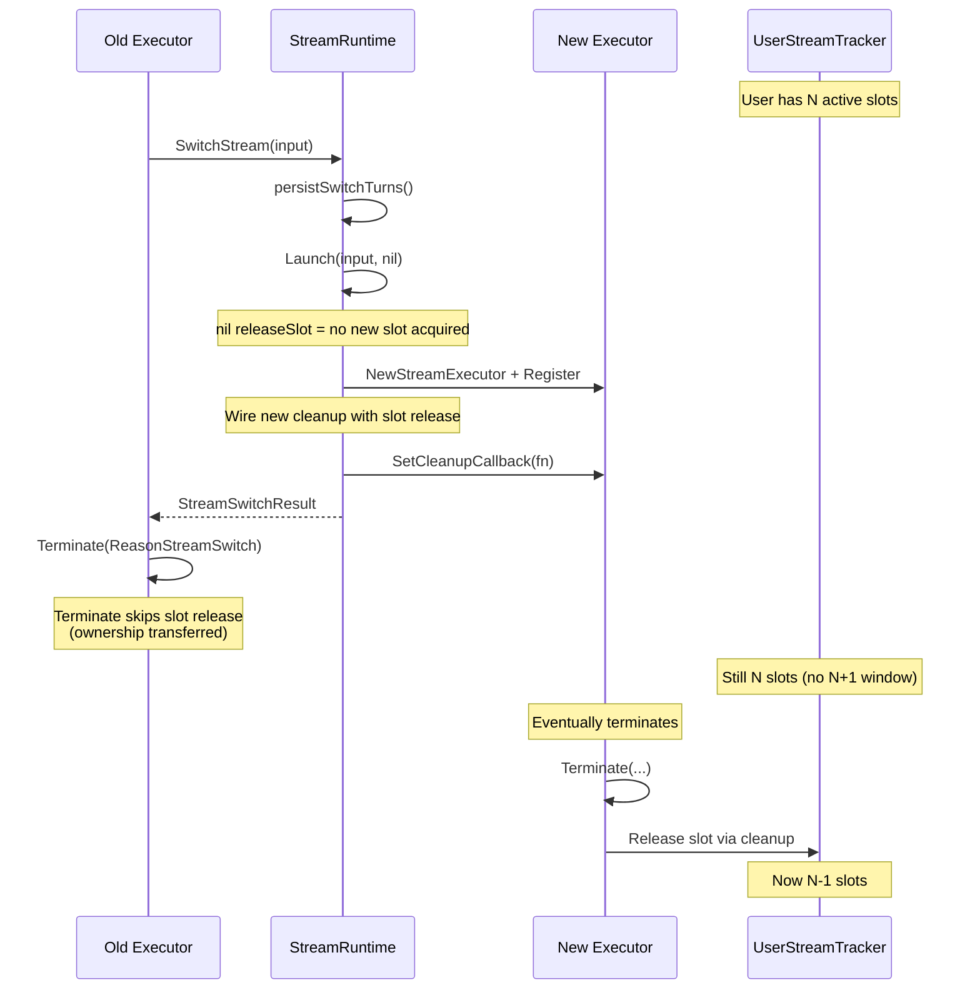
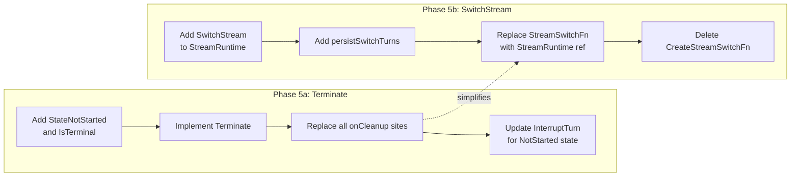

# Phase 5: Streaming Hardening Design

Unified `Terminate` method and first-class `SwitchStream` to fix three concurrency bugs caused by distributed cleanup and CreateTurn recursion.

## Problem Statement

After the Phase 1-4 decomposition, the streaming system has a clean collaborator architecture but three concurrency bugs remain:

1. **Pre-start window bug**: Between executor registration (`executorRegistry.Register`) and `executor.Start()`, a cancel/cleanup can fire and leave the executor in a half-initialized state.
2. **Interjection race**: Stream switch calls `CreateTurn` recursively (from within a streaming goroutine), which re-enters the full 4-stage pipeline including slot acquisition. If the slot limit is reached, the interjection silently fails.
3. **N+1 slot bug**: Stream switch acquires a *new* stream slot via `TurnContextResolver.Resolve` but the *old* executor's cleanup callback also holds a slot. During the overlap window, the user has N+1 active slots counted against their limit.

Root causes:
- Cleanup is distributed across 7+ call sites with `if se.onCleanup != nil { se.onCleanup() }` — easy to miss one, and adding new exit paths is error-prone.
- Stream switch reuses `CreateTurn` (full pipeline) when it only needs the executor+stream portion (stage 4).

---

## Refactor 1: Unified Terminate

### Current State — Cleanup Step Audit

The AGENTS.md documents 6 mandatory cleanup steps. Here is where each step currently executes across every exit path:

| Exit Path | File:Line | 1. Remove Executor | 2. Clear Interjection | 3. Finalize Tokens | 4. Settle Billing | 5. Mark Turn Status | 6. Release Slot |
|---|---|---|---|---|---|---|---|
| Normal completion | `completion_handler.go:207` (`completeTurn`) | via `onCleanup` | via `onCleanup` | `handleCompletion:46` | `handleCompletion:91` | `completeTurn:353` | via `onCleanup` |
| Soft cancel drain complete | `completion_handler.go:109` | via `onCleanup` | via `onCleanup` | `handleCompletion:46` | `handleCompletion:91` | **already set by InterruptTurn** | via `onCleanup` |
| Error/hard cancel | `completion_handler.go:331` (`handleError`) | via `onCleanup` | via `onCleanup` | `handleError:239` | `handleError:273` | `handleError:317` (skips if cancelled) | via `onCleanup` |
| Soft cancel timeout | `cancel_handler.go:140` | via `onCleanup` | via `onCleanup` | `handleTimeout:87` | `handleTimeout:115` | **already set by InterruptTurn** | via `onCleanup` |
| Credits exhausted | `billing_handler.go:66` | via `onCleanup` | via `onCleanup` | **MISSING** | **MISSING** | `handleCreditsExhausted:41/51` | via `onCleanup` |
| Stream switch (tool boundary) | `tool_executor.go:249` | via `onCleanup` | via `onCleanup` | **MISSING** | **MISSING** | `streamSwitchFn:253` (marks complete) | via `onCleanup` |
| Stream switch (no-tools) | `completion_handler.go:201` | via `onCleanup` | via `onCleanup` | `handleCompletion:46` | `handleCompletion:91` | `streamSwitchFn:253` (marks complete) | via `onCleanup` |
| Pre-start failure | `stream_runtime.go:220` (`RunCleanup`) | via `onCleanup` | via `onCleanup` | **MISSING** | **MISSING** | `startStreamingExecution:214` (marks error) | via `onCleanup` |

**Observations:**

- Steps 1, 2, 6 (registry cleanup + slot release) are always via `onCleanup` — consistent.
- Steps 3, 4 (tokens + billing) are **missing** on credits_exhausted and tool-boundary stream switch. These are low-impact today (credits exhausted has no tokens to finalize; stream switch mid-tool-execution has tokens from the *previous* completion already saved). But the asymmetry is a correctness risk as the system evolves.
- Step 5 (turn status) is handled by different callers depending on the path, with implicit assumptions about who already set it.
- The `onCleanup` callback pattern is reliable for the registry/slot steps but doesn't enforce ordering or ensure all 6 steps run.

### Design: `Terminate(reason TerminateReason)`

```go
// TerminateReason encodes why the stream is ending.
// Each reason produces different behavior for token finalization,
// billing settlement, turn status, and AG-UI events.
type TerminateReason int

const (
    // ReasonCompleted: LLM finished with stop_reason != "tool_use".
    // Full token/billing settlement from provider metadata.
    ReasonCompleted TerminateReason = iota

    // ReasonSoftCancelDrained: Soft cancel completed; provider sent final metadata.
    // Tokens from metadata, turn status already "cancelled" (set by InterruptTurn).
    ReasonSoftCancelDrained

    // ReasonHardCancelled: Hard cancel — provider stream terminated.
    // Tokens from cancel snapshot or generation API fallback.
    ReasonHardCancelled

    // ReasonSoftCancelTimeout: Provider didn't send metadata within timeout.
    // Best-effort token count from cancel snapshot.
    ReasonSoftCancelTimeout

    // ReasonError: Unrecoverable error (provider error, context cancelled, etc).
    // Best-effort tokens. Turn status set to "error".
    ReasonError

    // ReasonCreditsExhausted: Admission check failed.
    // No tokens to finalize. Turn status "credit_limited".
    ReasonCreditsExhausted

    // ReasonStreamSwitch: Interjection triggered new stream.
    // Current turn marked "complete". New stream takes over.
    ReasonStreamSwitch
)
```

#### Method signature

```go
// Terminate is the ONLY way to end a stream. It executes all cleanup steps
// in a deterministic order and is idempotent (second call is a no-op).
//
// MUST be called from the streaming goroutine (actor pattern — no concurrent mutation).
func (se *StreamExecutor) Terminate(reason TerminateReason, opts TerminateOpts) {
    // Idempotency: if already in a terminal state, log and return.
    if se.state.IsTerminal() {
        se.logger.Debug("Terminate no-op (already terminal)",
            "turn_id", se.turnID,
            "state", se.state.String(),
            "reason", reason.String(),
        )
        return
    }

    // Transition to terminal state
    se.transitionTo(reason.TerminalState())

    // === STEP 1: Persist partial blocks ===
    // (before token finalization so accumulated text is available)
    if reason.ShouldPersistPartials() {
        persistCtx, cancel := context.WithTimeout(context.Background(), dbWriteDeadline)
        defer cancel()
        se.persistPartialBlocks(persistCtx)
    }

    // === STEP 2: Finalize tokens ===
    var tokenResult *tokens.FinalizeResult
    if reason.ShouldFinalizeTokens() {
        tokenResult = se.finalizeTokens(reason, opts.Metadata)
    }

    // === STEP 3: Settle billing ===
    if reason.ShouldSettleBilling() {
        se.settleBilling(reason, opts.Metadata, tokenResult)
    }

    // === STEP 4: Mark turn status ===
    se.markTurnStatus(reason, opts.ErrorMessage)

    // === STEP 5: Emit terminal AG-UI event ===
    se.emitTerminalEvent(reason, opts)

    // === STEP 6: Registry cleanup + slot release ===
    // This MUST be last — other steps may need registry state.
    if se.onCleanup != nil {
        se.onCleanup()
    }
}
```

#### TerminateOpts

```go
// TerminateOpts carries reason-specific data to Terminate.
// Zero-value fields are ignored for reasons that don't use them.
type TerminateOpts struct {
    // Metadata from provider (ReasonCompleted, ReasonSoftCancelDrained)
    Metadata *domainllm.StreamMetadata

    // Error message for AG-UI event and turn error (ReasonError)
    ErrorMessage string

    // StopReason from provider (ReasonCompleted)
    StopReason string
}
```

#### Reason-specific behavior table

| Reason | Persist Partials | Finalize Tokens | Settle Billing | Turn Status | AG-UI Event |
|---|---|---|---|---|---|
| Completed | No (blocks already persisted) | Yes (from metadata) | Yes (authoritative) | `complete` | `RUN_FINISHED` |
| SoftCancelDrained | No (already persisted by `handleSoftCancel`) | Yes (from metadata) | Yes (from metadata) | Skip (already `cancelled`) | None (clients disconnected) |
| HardCancelled | Yes | Yes (snapshot/API) | Yes (best-effort) | Skip (already `cancelled`) | `RUN_ERROR(isCancelled=true)` |
| SoftCancelTimeout | No (already persisted by `handleSoftCancel`) | Yes (snapshot/API) | Yes (best-effort) | Skip (already `cancelled`) | `RUN_ERROR(isCancelled=true)` |
| Error | Yes | Yes (snapshot) | Yes (best-effort) | `error` | `RUN_ERROR` |
| CreditsExhausted | Yes | No | No | `credit_limited` | `CREDITS_EXHAUSTED` + `RUN_FINISHED` |
| StreamSwitch | No | Conditional* | Conditional* | `complete` | `STREAM_SWITCH` |

*StreamSwitch: If metadata is available (no-tools completion path), tokens/billing are finalized. If at tool boundary, the metadata from the prior completion was already processed.

#### How the pre-start window bug disappears

**Current bug**: `startStreamingExecution` has a gap between `executorRegistry.Register` (line 174 of `stream_runtime.go`) and `executor.Start()` (called inside the goroutine at line 230). If `BuildConversationMessages` fails (line 208), `RunCleanup()` fires but the executor was never started — `workFunc` never ran, so state is `StateStreaming` but nothing is actually streaming.

If an `InterruptTurn` arrives during this window, the executor is found in the registry but has no running goroutine to process the `ctrlCh` command. The cancel command is queued but never consumed.

**With Terminate**: The pre-start failure path in `startStreamingExecution` calls `executor.Terminate(ReasonError, ...)` instead of `executor.RunCleanup()`. Because `Terminate` is idempotent and unconditionally runs all cleanup steps in-line (not via a goroutine channel), it works regardless of whether the streaming goroutine is running. The terminal state transition ensures any later `InterruptTurn` call sees `IsTerminal() == true` and skips.

Additionally, we add a state gate: `StateNotStarted` (new initial state, replaces starting at `StateStreaming`). The executor transitions `StateNotStarted -> StateStreaming` at the top of `workFunc`. `InterruptTurn` checks for `StateNotStarted` and calls `Terminate` directly instead of queuing a channel command.



### What stays in handlers vs. what moves to Terminate

| Current Handler | Stays (domain logic) | Moves to Terminate |
|---|---|---|
| `handleCompletion` | Tool continuation decision, interjection check, metadata processing | `onCleanup()`, token finalization, billing settlement, `completeTurn` |
| `handleError` | Error classification (cancel vs error), partial block persistence | `onCleanup()`, token finalization, billing settlement, turn status update, `EmitRunError` |
| `handleSoftCancel` | Snapshot text, persist partials, `SoftCancel()` SSE disconnect | Nothing — this is a mid-stream action, not termination |
| `handleTimeout` | Timer management, `stream.Cancel()` | `onCleanup()`, token finalization, billing settlement, `EmitRunError` |
| `handleCreditsExhausted` | Credit-limited turn status, `EmitCreditsExhausted` | `onCleanup()` |
| Stream switch sites | `streamSwitchFn` call, `EmitStreamSwitch` | `onCleanup()`, turn status |

**Key insight**: `handleSoftCancel` is NOT a terminal handler. It's an in-flight state change (disconnect clients, snapshot text). The actual termination happens later when either metadata arrives (`ReasonSoftCancelDrained`) or timeout fires (`ReasonSoftCancelTimeout`). This distinction is important — `handleSoftCancel` stays exactly as-is.

---

## Refactor 2: First-Class SwitchStream

### Current State — Stream Switch Flow

Tracing from interjection injection through CreateTurn recursion:



**Problems visible in this trace:**

1. **N+1 slot window**: Between `Acquire` (new slot) and `onCleanup` (old slot release), the user holds N+1 slots. If at the limit, `Acquire` fails and the interjection stream switch breaks entirely.

2. **Full pipeline overhead**: `CreateTurn` runs the entire 4-stage pipeline including thread resolution, persona resolution, project loading, prompt assembly, and turn persistence. But stream switch already knows the thread, project, model, and provider — it just needs new turns and a new executor.

3. **Recursive `CreateTurn`**: The streaming goroutine calls `createTurnFn` (which is `svc.CreateTurn`), which runs stages 1-4 synchronously in the streaming goroutine. This means the old stream's goroutine is blocked while the new stream's `startStreamingExecution` goroutine launches. Any error in the new pipeline returns to the old executor's error handler.

4. **CreateTurn transaction scope**: Stage 3 (`persistTurns`) runs in a transaction. If the transaction fails, the stream switch reports an error on the *old* stream, even though the old stream was already complete.

### Design: `StreamRuntime.SwitchStream()`

The core insight: stream switch needs exactly two things from the pipeline:
1. Persist new turns (user turn with interjection + assistant turn)
2. Launch a new executor with the same configuration

It does NOT need: thread resolution, persona resolution, model/provider selection, capability filtering, prompt assembly, or slot acquisition (it inherits the old stream's slot).

```go
// SwitchStreamInput captures the request-scoped data for an atomic stream switch.
type SwitchStreamInput struct {
    // Current stream context (inherited, not re-resolved)
    CurrentTurnID string
    ThreadID      string
    UserID        string
    ProjectID     string
    Model         string
    Provider      string
    Params        *domainllm.RequestParams
    ToolRegistry  *tools.ToolRegistry
    SettlementMode billing.CreditSettlementMode

    // Interjection content
    InterjectionText string
    Reason           string // "tool_boundary" or "no_tools_completion"
}

// SwitchStream atomically swaps the active stream for a thread.
// 1. Marks current turn as complete
// 2. Persists new user turn (interjection) and assistant turn
// 3. Transfers the stream slot from old executor to new executor (no Acquire/Release)
// 4. Launches new executor
// 5. Returns result for the old executor to emit STREAM_SWITCH event
//
// The caller (old StreamExecutor) calls Terminate(ReasonStreamSwitch) after this returns.
func (r *StreamRuntime) SwitchStream(ctx context.Context, input *SwitchStreamInput) (*StreamSwitchResult, error) {
    // Step 1: Mark current turn complete
    if err := r.executorDeps.TurnWriter.UpdateTurnStatus(ctx, input.CurrentTurnID, domainllm.TurnStatusComplete, nil); err != nil {
        return nil, fmt.Errorf("failed to complete current turn: %w", err)
    }

    // Step 2: Persist new turns (user + assistant)
    // This is a lightweight version of stages 3+4 — no context resolution needed.
    userTurn, assistantTurn, err := r.persistSwitchTurns(ctx, input)
    if err != nil {
        return nil, fmt.Errorf("failed to persist switch turns: %w", err)
    }

    // Step 3: Launch new executor WITHOUT acquiring a new slot.
    // The slot transfer happens atomically: old executor's cleanup is DEFERRED
    // until the new executor is fully registered. The releaseStreamSlot callback
    // is passed directly from the old executor's onCleanup to the new one.
    resp, err := r.Launch(ctx, &LaunchInput{
        AssistantTurn:  assistantTurn,
        UserTurn:       userTurn,
        ThreadID:       input.ThreadID,
        UserID:         input.UserID,
        ProjectID:      input.ProjectID,
        Model:          input.Model,
        Provider:       input.Provider,
        Params:         input.Params,
        ToolRegistry:   input.ToolRegistry,
        SettlementMode: input.SettlementMode,
        StreamSwitchFn: r.CreateStreamSwitchFn(
            input.ThreadID, input.UserID,
            nil, // requestParams not needed for nested switch
            nil, // createTurnFn replaced by SwitchStream — see below
        ),
    }, nil) // nil releaseStreamSlot — slot ownership transferred from old executor
    if err != nil {
        return nil, fmt.Errorf("failed to launch switch stream: %w", err)
    }

    // Step 4: Update bookmark
    if err := r.threadRepo.UpdateLastViewedTurn(ctx, input.ThreadID, input.UserID, &assistantTurn.ID); err != nil {
        r.logger.Warn("failed to update bookmark after stream switch",
            "thread_id", input.ThreadID,
            "error", err,
        )
    }

    // Cleanup old executor's registries (NOT the slot — that transfers)
    r.executorRegistry.Remove(input.CurrentTurnID)
    r.interjectionRegistry.Remove(input.CurrentTurnID)

    return &StreamSwitchResult{
        UserTurn:      userTurn,
        AssistantTurn: assistantTurn,
        StreamURL:     resp.StreamURL,
    }, nil
}
```

#### Slot transfer mechanism

The key to fixing both the N+1 and interjection race bugs is **slot transfer** — the new executor inherits the old executor's slot instead of acquiring a new one.



**Implementation detail**: The `StreamSwitchFn` closure currently captures `svc.CreateTurn` as the `createTurnFn`. After this refactor, `StreamSwitchFn` is replaced with a method on `StreamExecutor` that calls `StreamRuntime.SwitchStream` directly. The executor has access to all the inherited context it needs.

```go
// StreamExecutor gets a reference to StreamRuntime (replacing streamSwitchFn callback)
type StreamExecutor struct {
    // ... existing fields ...
    streamRuntime *StreamRuntime // For SwitchStream (replaces streamSwitchFn)
}
```

The `StreamSwitchFn` callback type and `CreateStreamSwitchFn` factory method are deleted. The interjection injection points call `se.streamRuntime.SwitchStream()` directly.

#### How the interjection race disappears

**Current bug**: `streamSwitchFn` calls `CreateTurn` which calls `TurnContextResolver.Resolve` which calls `UserStreamTracker.Acquire`. If the user is at their concurrent stream limit, `Acquire` returns a `RateLimitError` and the interjection fails — even though the old stream is about to release its slot.

**With SwitchStream**: No `Acquire` call happens. The new executor inherits the old slot. `UserStreamTracker` never sees the user exceed their limit.

#### How the N+1 slot bug disappears

**Current bug**: Between `Acquire` (new slot in `CreateTurn`) and `onCleanup()` (old slot released after `StreamSwitchResult` returns), the user momentarily holds N+1 slots. This is observable by concurrent requests that may fail with rate limit errors during the window.

**With SwitchStream**: Slot count is constant. Old executor's cleanup removes it from registries but does NOT release the slot. New executor's cleanup inherits the slot release. At no point does the count exceed N.

---

## Dependencies and Phase Ordering

### Refactor 1 depends on Refactor 2?

No. They are **independent** and can be done in either order. However, doing Refactor 1 first simplifies Refactor 2 because `Terminate(ReasonStreamSwitch)` replaces the inline cleanup at the two stream switch sites.

### Recommended implementation order



**Phase 5a** (Terminate): 4 sub-steps, estimated ~200 lines changed across 6 files.

| Step | Files | Risk |
|---|---|---|
| 5a.1: Add `StateNotStarted`, `IsTerminal()`, `TerminateReason` | `executor_state.go` | Low — additive only |
| 5a.2: Implement `Terminate()` method | `stream_executor.go` (new method) | Medium — must exactly replicate current behavior for each reason |
| 5a.3: Replace all exit paths with `Terminate()` calls | `completion_handler.go`, `cancel_handler.go`, `billing_handler.go`, `tool_executor.go` | High — must not change observable behavior (regression risk) |
| 5a.4: Update `InterruptTurn` for `StateNotStarted` | `interruption.go`, `stream_runtime.go` | Medium — new codepath for pre-start cancel |

**Phase 5b** (SwitchStream): 4 sub-steps, estimated ~150 lines changed across 4 files.

| Step | Files | Risk |
|---|---|---|
| 5b.1: Add `SwitchStream()` to StreamRuntime | `stream_runtime.go` | Medium — new method, core slot transfer logic |
| 5b.2: Add `persistSwitchTurns()` | `stream_runtime.go` or new file | Low — extracted from existing CreateTurn stage 3 |
| 5b.3: Replace callback with direct method | `stream_executor.go`, `tool_executor.go`, `completion_handler.go` | Medium — changes executor constructor and injection sites |
| 5b.4: Delete `CreateStreamSwitchFn`, `StreamSwitchFn` type | `stream_runtime.go`, `launch_stream.go` | Low — deletion of dead code |

### Risk Assessment

| Risk | Likelihood | Impact | Mitigation |
|---|---|---|---|
| Terminate misses a step for one reason | Medium | High (leaked slots, wrong billing) | Comprehensive test: one test per `TerminateReason` verifying all 6 steps |
| Slot transfer leaves orphan slot on SwitchStream error | Medium | Medium (user stuck at limit) | Error path in `SwitchStream` explicitly releases slot if launch fails |
| Breaking change to InterruptTurn behavior | Low | High (user-facing cancel broken) | Existing interrupt tests + new test for NotStarted state |
| Regression in token finalization paths | Medium | Medium (billing inaccuracy) | Token finalization is already unit-tested; Terminate just moves the call site |

### Testing Strategy

**Phase 5a:**
- Unit test: `TestTerminate_AllReasons` — one sub-test per reason, assert all 6 cleanup steps executed in order, assert correct turn status, assert correct AG-UI event.
- Unit test: `TestTerminate_Idempotent` — call twice, second is no-op.
- Unit test: `TestTerminate_PreStartWindow` — simulate pre-start failure, verify cleanup runs without goroutine.
- Integration: existing smoke tests cover cancel, completion, and error paths end-to-end.

**Phase 5b:**
- Unit test: `TestSwitchStream_SlotTransfer` — verify UserStreamTracker count stays at N during switch.
- Unit test: `TestSwitchStream_ErrorRollback` — verify slot is released if launch fails.
- Unit test: `TestSwitchStream_AtLimit` — verify switch succeeds even when user is at stream limit (because no Acquire).
- Integration: interjection smoke test with concurrent streams at limit.

---

## Design Decisions

### Why not merge handleSoftCancel into Terminate?

`handleSoftCancel` is a **mid-stream state change**, not a termination. It disconnects SSE clients and snapshots text, but the provider stream keeps running. Termination happens later when metadata arrives or timeout fires. Forcing it into `Terminate` would mean `Terminate` returns control to the streaming loop (non-terminal), which defeats the purpose of "Terminate is the only way to end."

### Why StreamRuntime.SwitchStream instead of a new pipeline stage?

Adding a "stream switch" branch to `CreateTurn` would complicate the clean 4-stage pipeline with conditional logic. `SwitchStream` is conceptually different from `CreateTurn`: it inherits context instead of resolving it, and it transfers a slot instead of acquiring one. A separate method keeps both paths simple.

### Why not use channel-based slot transfer?

We considered having the old executor send a "transfer" message to the new executor via a channel. But this introduces timing complexity — what if the new executor hasn't started yet? Direct slot inheritance (nil `releaseStreamSlot` on Launch, explicit slot in new cleanup) is simpler and race-free.

### Why keep `onCleanup` callback pattern alongside Terminate?

`Terminate` calls `onCleanup` as its final step. The callback pattern remains useful because the cleanup actions (registry removal, slot release) are wired by `StreamRuntime.Launch`, not by the executor itself. The executor shouldn't know about registries. `Terminate` just guarantees the callback is always called exactly once.
