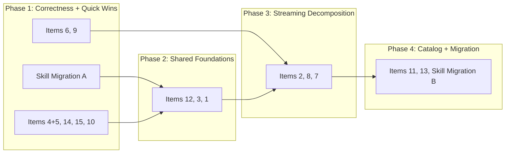

# Backend Refactoring Design

Reviewed 2026-03-26 against the current codebase. Items from `_docs/future/refactoring-backlog.md`.

## Review Corrections

The initial design claimed items 12 and 15 were resolved. GPT-5.4 verified against code and found both are still open:

| Item | Claim | Actual |
|------|-------|--------|
| 12 (tool OCP) | "Already OCP-compliant" | `builder.go` hardcodes per-tool registration branches; `launch_stream.go` hardcodes web-search provider selection with if/else |
| 15 (UUID parsing) | "Already returns 400" | `context_budget.go`, `spawn.go`, `work_item.go` pass raw path params to services; malformed UUIDs bubble as DB 500s |
| 6 (ISP) | "Needs splitting" | Domain interfaces already split; remaining work is narrowing consumers |
| 4 (folder.go duplication) | "document.go + folder.go" | Duplication is within document.go only (3× identical blocks); folder.go uses generic `handleError()` |

Added workstream: skill CRUD migration (DB-first → file-first).

## Execution Phases

### Phase 1: Correctness + Quick Wins

| Item | What | Complexity | Files |
|------|------|-----------|-------|
| **Skill A** | File-backed ProjectSkillService, remove DB-first + warn-and-continue | Medium | ~8 |
| **4+5** | Extract `resolveDocumentID()` in document handler | Trivial | 1 |
| **14** | Add `?status=` filter to work items list | Trivial | 4 |
| **15** | Add `parseUUID()` validation to context_budget, spawn, work_item handlers | Trivial | 3 |
| **10** | Slug-based service methods for work items | Small | 3 |
| **6** | Narrow consumers to `DocumentReader`/`DocumentWriter` (interfaces already split) | Small | 5-8 |
| **9** | Rename tools `DocumentPathResolver` → `ToolPathResolver` (don't merge with write-capable resolver) | Trivial | 3 |

### Phase 2: Shared Foundations

| Item | What | Complexity | Files |
|------|------|-----------|-------|
| **3** | Extract shared prompt helpers (`loadAvailableSkills`, `buildToolRegistry`, `buildToolSection`, `resolveSystemPrompt`, `buildConversationMessages`) — both debug and production call these | Medium | 4 |
| **1** | Replace `SetSpawnInvoker` type assertion with `spawnInvokerRef` callback in `StreamingDeps` — keep local to streaming, not a domain-level interface | Small | 5 |

Note: Item 12 (tool registration) moved to v1-launch backlog as a feature — arbitrary tool registration (MCP-style open registry), not just a refactoring.

### Phase 3: Streaming Decomposition

| Item | What | Complexity | Files |
|------|------|-----------|-------|
| **2** | Split god object into collaborators: `TurnContextResolver`, `ToolRegistryFactory`, `StreamRequestBuilder`, `StreamRuntime`. Keep interruption/interjection on Service until recursive CreateTurn coupling is removed. | Large | ~12 |
| **8** | Subsumed — inline orchestration moves to collaborators | — | — |
| **7** | Narrow TurnReader via consumer-local interfaces; fold into collaborator constructors | Small | 5-6 |

### Phase 4: Catalog + Migration

| Item | What | Complexity | Files |
|------|------|-----------|-------|
| **11** | Shared helpers for folder lookup, doc loading, frontmatter parse/error collection (not a generic `CatalogLoader[T]` — extract smaller helpers instead) | Medium | 3 |
| **13** | Gradual DomainError migration, service by service | Medium | 15+ (spread) |
| **Skill B** | Switch handlers to file-backed service, demote backfill to one-time tool, remove `postgres/skill` + `domain/skill` | Medium | ~10 |

---

## Item Details

### Item 1: SetSpawnInvoker → Callback in StreamingDeps

**Problem:** `setup.go` uses anonymous interface type assertion to wire SpawnInvoker after construction.

**Approach:** Keep the indirection local to streaming — a `spawnInvokerRef` or callback in `StreamingDeps`, not a domain-level `SpawnInvokerProvider` interface. The spawn invoker is set once at startup and never changes.

**Files:** `streaming/service.go`, `streaming/deps.go`, `service/llm/setup.go`, `tools/builder.go` — 4-5 files.

### Item 2: Streaming Service God Object → Collaborators

**Problem:** 30+ fields, 11+ concerns on one struct. Tests require full dependency graph.

**Revised approach (from review):** The initial design proposed `PromptAssembler`, `StreamLauncher`, `InterruptionManager`. The review found `InterruptionManager` is too coupled — `interruption.go` depends on auth, registries, turn IO, capability lookup, and thread repo; `interjection.go` recurses back into `CreateTurn`. Extracting it would move coupling sideways.

**Better first-pass decomposition:**

| Collaborator | Responsibility | Extracted from |
|---|---|---|
| `TurnContextResolver` | Thread resolution, persona, model/provider, stream slot | `gather_context.go` |
| `ToolRegistryFactory` | Temp + production registries with shared construction | `assemble_prompt.go`, `launch_stream.go` |
| `StreamRequestBuilder` | Turn path → blocks → messages → reference transform | `launch_stream.go` (background sequence) |
| `StreamRuntime` | Executor creation, registration, cleanup, provider start | `launch_stream.go`, `stream_executor.go` |

Service keeps: persistence, validation, authorization, interruption/interjection (until recursive coupling resolved).

### Item 3: Debug/Production Prompt Divergence → Shared Helpers

**Move earlier than originally planned.** Extract shared helpers before the streaming decomposition so collaborators start with shared foundations:

- `loadAvailableSkills(ctx, projectID, selectedSkills) → []RuntimeSkill`
- `buildToolRegistry(ctx, tools, skills, workItemSlug, persona) → *ToolRegistry`
- `buildToolSection(registry) → string`
- `resolveSystemPrompt(ctx, threadID, toolSection, persona, workContext) → string`
- `buildConversationMessages(ctx, turnPath, blocks, params) → []Message`

### Items 4+5: Document Handler Cleanup

Extract `resolveDocumentID()` — combines resolution + error response. 3 identical blocks become 3 one-liners.

### Item 6: ISP Consumer Narrowing

Domain interfaces already split. Change consumers to accept `DocumentReader` or `DocumentWriter` instead of composite `DocumentStore`. Key consumer: `OwnerBasedAuthorizer` only needs `GetByIDOnly()`.

### Item 7: TurnReader Consumer-Local Interfaces

Define consumer-local interfaces (Go convention). `TurnReader` stays as-is at domain level. Each consumer declares the 1-2 methods it needs.

### Item 9: Path Resolver Rename

Rename tools-side resolver to `ToolPathResolver` or `ReadOnlyPathWalker`. Don't merge with the write-capable docsystem resolver — they have intentionally different capabilities.

### Item 10: Work Item Slug-Based Service Methods

Add `UpdateBySlug`, `CompleteBySlug`, `ReopenBySlug`, `DeleteBySlug` to eliminate the double fetch.

### Item 11: Agent Catalog Shared Helpers

Don't build a generic `CatalogLoader[T]`. Extract smaller shared helpers: folder lookup, document loading, frontmatter parse + error collection, shared SKILL/persona codecs.

### Item 12: Arbitrary Tool Registration (moved to v1 backlog as feature)

Moved out of refactoring scope. The direction is an open tool registry where built-in tools and external tools (MCP servers) register the same way. Persona allow/deny lists work uniformly across both. The builder shouldn't need to know what tools exist at compile time. See v1-launch backlog.

### Item 13: DomainError Migration

Gradual — add constructors for each legacy error type, migrate service by service (docsystem → workitem → llm → billing). Eventually simplify `handleError()` to remove legacy branches.

### Item 14: Status Filter

Thread `?status=` through handler → service → store with optional WHERE clause. Empty = no filter (backwards compatible).

### Item 15: UUID Validation

Add `parseUUID()` checks to `context_budget.go`, `spawn.go`, `work_item.go` handlers before DB calls.

---

## Skill CRUD Migration

### Problem

Runtime resolution is file-only (`.agents/skills/<slug>/SKILL.md`), but CRUD is DB-first with best-effort file sync. This creates split-brain:
- Create/update can succeed even when SKILL.md write fails
- Reorder only touches DB positions
- `enabled` exists in API/DB but not in SKILL.md or RuntimeSkill
- Backfill is one-way DB → file

### Phase A (Phase 1)

- File-backed `ProjectSkillService` using shared skill codec
- Create/update/delete fail if file persistence fails (no more warn-and-continue)
- Remove `enabled` from API — Claude Code skill spec has no `enabled` field. A skill is present (file exists) or absent (file doesn't). `enabled=false` in DB is just a skill that shouldn't have a SKILL.md.
- Reorder rewrites frontmatter positions in files

### Phase B (Phase 4)

- Switch handlers/routes to file-backed service
- Demote backfill to one-time migration tool
- Remove `postgres/skill/`, `domain/skill/`, `service/skill/`

### Blast Radius

Backend: `app/domains/skill.go`, `handler/project_skill*.go`, `service/skill/`, `service/agents/skill_resolver.go`, `service/agents/backfill.go`, `domain/skill/`, `domain/agents/`

Frontend: skill API client/store/types, any UI depending on `enabled`, UUID `skillId`, reorder semantics
