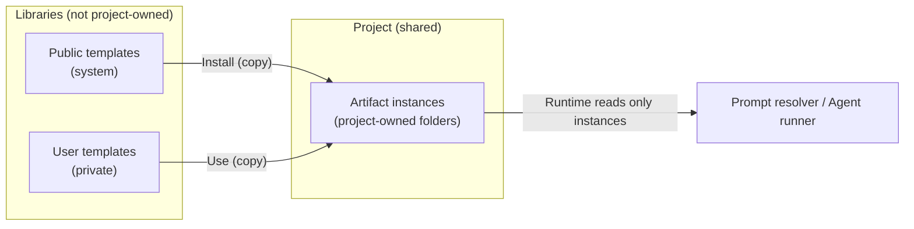
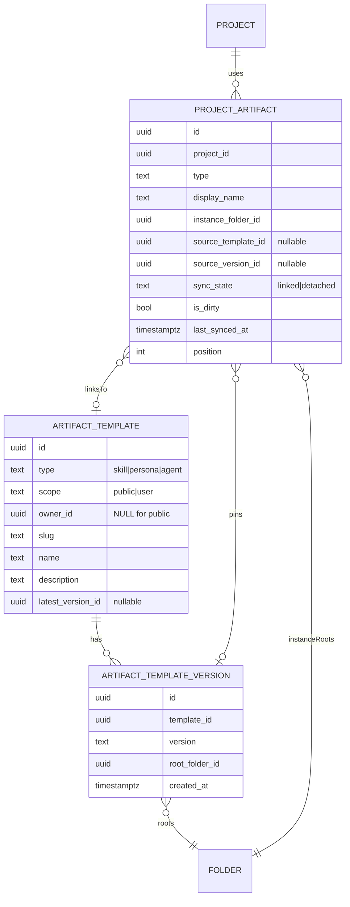
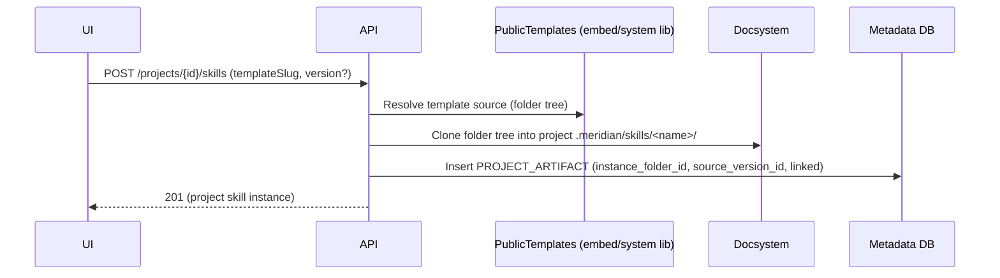

# Artifact Templates + Project Instances (Skills / Personas / Agents)

**Status:** In planning  
**Priority:** High (unblocks shared projects)  
**Estimated effort:** 1–3 days for Skills-only v1 (longer if we also ship Personas/Agents)

## Problem Statement (WHY)

Meridian will likely support **shared/multi-user projects**. In that world, any artifact used at runtime by the AI (skills/personas/agents) must be:
- **Readable by all project collaborators**
- **Auditable + reproducible** (“what config was used for this turn?”)
- **Not coupled to a single user’s private library permissions**

At the same time, we want reusable **templates** (public + user-private) that do *not* automatically apply to projects.

## Goals / Non-goals

**Goals**
- Make “use this skill/persona/agent in project X” explicit (opt-in).
- Make runtime loading for shared projects depend only on **project-owned data**.
- Support “override locally” + “reload/update from template” workflows.

**Non-goals (v1)**
- Cross-user live syncing of private libraries into shared projects.
- Marketplace moderation / trust system for user-published public templates.
- 3-way merges for “update template into customized instance”.

## Definitions

| Term | Meaning | Stored where |
|---|---|---|
| **Template** | Reusable artifact definition (public or user-private). Not used by any project until installed. | Library (pseudo-project or embedded bundle) |
| **Instance** | Project-owned copy of a template. This is what the AI loads. | Project docsystem |
| **Link** | Metadata connecting an instance to its source template/version (optional). | DB (metadata) |
| **Override** | Any edit to the instance folder/docs after install. | Project docsystem |

## Proposed Architecture (WHAT)

Runtime loads **instances only**. Templates are only inputs to “install/update”.

### Where instances live (docsystem paths)

Standardize on a single Meridian-owned subtree for project instances:

**Recommended**
- Skills: `.meridian/skills/<project-skill-name>/...` (project-unique name; store stable IDs in metadata)
- Personas (future): `.meridian/personas/<personaSlug>/...`
- Agents (future user-defined): `.meridian/agents/<agentSlug>/...`

All are hidden from the normal writer tree via `is_hidden` / tree filtering. Runtime reads from `.meridian/**` (project-owned) only.

### Visibility + Editing Policy

`.meridian/**` is Meridian-owned project state and should be treated as internal:
- **Hidden from the writer file tree UI** by default.
- **Not discoverable/editable by the LLM document tools by default** (no `doc_tree`/`doc_search` scanning; no `doc_edit` writes) except via dedicated editor surfaces and explicit approval/allowlisting.
- Runtime loads only **explicitly selected** instances (e.g., configured project skills), not “everything under `.meridian/**`”.

### Sessions are not project-owned

`.session/**` is a session-owned virtual mount (see `_docs/plans/agents.md`). It should not live under `.meridian/**` at runtime, but can be snapshotted into exports.

## Major Decision Points

### 1) Should projects reference templates directly, or copy into instances?

| Option | Pros | Cons | Recommendation |
|---|---|---|---|
| **Reference templates directly** | No copies; updates propagate automatically | Breaks shared projects (permissions); hard to audit (“template changed”) | ❌ |
| **Copy templates into project instances** | Shared-safe; auditable; deterministic | Needs copy/clone primitive; template updates are explicit | ✅ **Choose this** |

### 2) Where do public templates live?

| Option | Pros | Cons | When to use |
|---|---|---|---|
| **Embedded templates (Go `embed`)** | Zero DB/docsystem setup; fast; deploy = update | Not user-publishable; “versions” tied to app releases | ✅ v1 built-ins |
| **System library pseudo-project** (`__public_library__`) | Can store many templates/versions as folders; same docsystem tooling | Requires system-owned project bootstrap; migrations; access rules | v2 marketplace |
| **DB-only blobs** | Simple schema; easy listing | Loses docsystem reuse (folders/docs); harder to preview/edit | Rarely |

**Recommendation:** start with **embedded public templates**, evolve to **system library pseudo-project** once we introduce user-published public templates.

### 3) Versioning: how do we enable “update to latest”?

| Layer | Recommendation | Rationale |
|---|---|---|
| Public templates | Immutable “version snapshots” (folder tree per version) | “Update to latest” must be reproducible |
| User templates | Mutable working template (v1) | Keeps creation/editing simple |
| Instances | Project-level edits tracked by docsystem + optional revision metadata | Audit/debug without building a full merge engine |

### 4) Updating an instance from its source template

| Option | Pros | Cons | Recommendation |
|---|---|---|---|
| Overwrite in place | No pointer changes; simplest | Risky partial failures; harder rollback | ⚠️ only if transactional copy exists |
| Copy-new-and-swap pointer | Safe rollback (keep old folder); clear audit | Needs an “instance folder id” pointer to change | ✅ |

**Recommendation:** for each project artifact row, point to an `instance_folder_id`. Updating = clone into a fresh folder and atomically repoint.

### 5) What happens when a project becomes shared?

Rule: shared projects cannot rely on a private user library for any runtime read.

With instance-only runtime, sharing is safe by default. The only thing to change is the **sync contract**:
- If an instance was linked to a **user-private template**, we must **disable syncing** (“detach link”) once the project has >1 member.

## Storage Model (Skills-first, generalized)

### Docsystem content

- **Instance** folder lives in the project (e.g. `.meridian/skills/outline-helper/`).
- A skill instance contains:
  - `SKILL.md` (instructions + optional frontmatter)
  - optional references (`examples.md`, `templates/*.md`, etc.)

### Metadata (DB)

Prefer a generalized “artifact” model so skills/personas/agents share the same mechanism.

## Key Flows (Skills example)

### Install public skill template -> project instance

### Override + reload/update

- Override = edits to files under the instance folder.
- Reload/update = clone the pinned/latest template version into a new folder and repoint `instance_folder_id`.
- If `is_dirty=true`, require explicit user confirmation (“this will discard local overrides”) until we have merge tooling.

## Alternatives Considered

### “Everything in DB, not docsystem”

Pros: fewer moving parts.  
Cons: duplicates existing doc CRUD, tree, export/import; poorer debuggability; harder “references folder” model.  
Decision: ❌ prefer docsystem folders for artifact bytes.

### “Single global .meridian/ folder for everything”

Pros: central place for internals.  
Cons: requires hiding/filtering so writers don’t see internal state.  
Decision: ✅ choose this. Use `.meridian/**` for all project-owned Meridian state.

## Exports (Project + Sessions)

When exporting an entire project, include (a) writer workspace, (b) Meridian-owned project state, and (c) conversation/session data as separate roots.

| Export root | Contains | Notes |
|---|---|---|
| `workspace/**` | Writer-visible project files | Equivalent to “project root” content |
| `.meridian/**` | Meridian-owned project state | Instances + manifests |
| `sessions/<session_id>/threads/**` | Thread/turn history | Prefer JSON; optional MD rendering |
| `sessions/<session_id>/session_fs/**` | Snapshot of mounted `.session/**` | Copy at export time |

## Integration Points

- Prompt resolver / agent runner must load artifact content from **project instances** only.
- Tool permissions / skill editing policy (see `_docs/plans/agents.md`) applies at the instance layer:
  - revisions/audit can be stored as additional metadata, independent of template linkage.

## Success Criteria

- [ ] Project runtime never reads from user-private libraries (instances only).
- [ ] Installing a template produces a project-owned folder tree instance.
- [ ] Linked instance can “reload/update from template” (copy-new-and-swap).
- [ ] When a project becomes shared, user-private template links are detached (no syncing).

## Related Documentation

- `_docs/plans/agents.md` (skills/personas/agents concept + skill editing policy)
