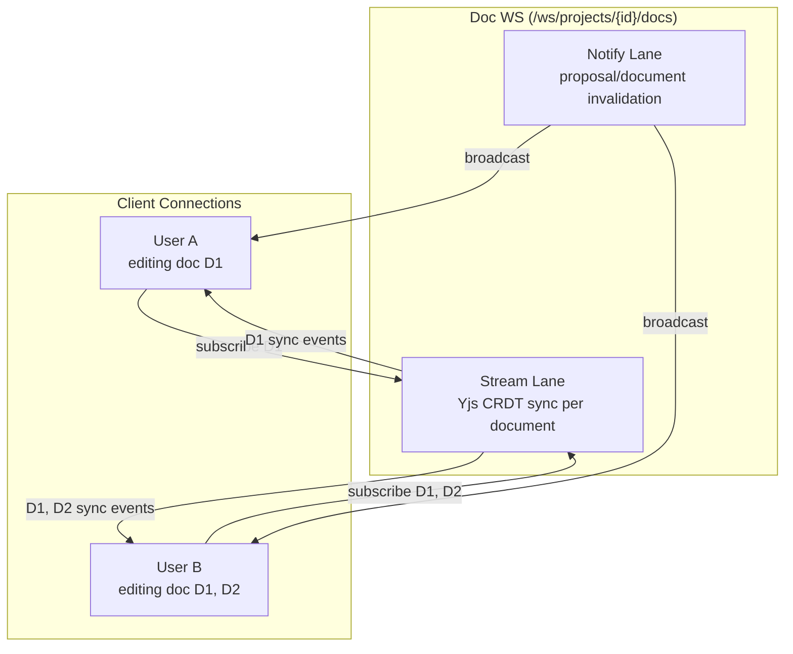
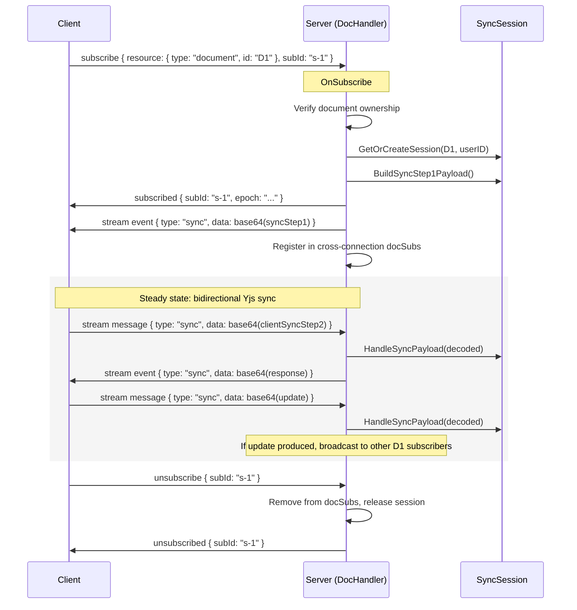

# Doc WS — Document Notification & Sync Connection

The doc WS handles document/proposal notifications and Yjs CRDT sync for a project. It replaces both the current project WS (`collab_project.go`) and the per-document Yjs WS (`collab_document_handler.go`) using the [generic protocol](protocol.md) via the [wsutil framework](framework.md).

**Endpoint**: `GET /ws/projects/{projectId}/docs`

Related: [overview.md](overview.md) for how this fits into the architecture, [frontend.md](frontend.md) for client-side integration, [protocol.md](protocol.md) for the wire format.

## Architecture

The doc WS uses both protocol lanes:

- **Notify lane**: Lightweight invalidation hints for proposals and documents. Broadcast to all project connections automatically. Unchanged from v1.
- **Stream lane**: Yjs CRDT sync for individual documents. Client subscribes to a document resource → receives Yjs sync/update data as base64-encoded JSON stream events. Client sends Yjs data back via stream messages.



## What Gets Replaced

### Current project WS (`collab_project.go`) — replaced in prior phases

- `ProjectConnectionRegistry` and `ProjectBroadcaster` → framework's built-in connection registry + `DocNotifier`

### Current per-document Yjs WS (`collab_document_handler.go`) — replaced by stream lane

| Current (per-doc WS) | New (doc WS stream lane) |
|---|---|
| Per-document endpoint `GET /ws/documents/{documentId}` | Doc WS stream lane subscriptions |
| Direct binary frames (0x00 sync, 0x01 awareness) | Base64-encoded JSON stream events |
| Per-document auth/heartbeat/reconnect | Framework handles at connection level |
| `CollabDocumentHandler.documentConns` fanout map | `DocHandler.docSubs` cross-connection registry |
| `DocumentBroadcaster.BroadcastToDocument()` | `DocHandler.BroadcastYjsUpdate()` |
| `BroadcastDocumentRestored()` | Stream `ended{reason: document_restored}` to subscribers |
| `HasOwnerTabs()` | `DocHandler.HasActiveSubscribers()` |

## Handler Registration

```go
docHandler := handler.NewDocHandler(
    sessionManager,    // collab.DocumentSessionProvider
    documentResolver,  // collab.DocumentResolver
    logger,
)

docServer := wsutil.NewServer(
    wsutil.WithAuth(authenticator),
    wsutil.WithHeartbeat(20*time.Second, 20*time.Second),
    wsutil.WithRateLimit(30),
    wsutil.WithOriginPatterns(allowedOrigins...),
    wsutil.WithReadLimit(512 * 1024), // 512KB — accommodates base64-encoded Yjs payloads
)
docServer.RegisterHandler("document", docHandler)
mux.HandleFunc("GET /ws/projects/{projectId}/docs", docServer.Serve)
```

**ReadLimit raised to 512KB**: The per-document WS used 256KB application-level max for raw binary Yjs frames. Base64 encoding adds ~33% overhead (256KB binary → ~341KB base64 + JSON envelope). 512KB provides headroom for large chapters.

## Doc Handler

Replaces the v1 `DocNotifyHandler` (which returned `ErrNotSupported` for all stream operations). Now implements the full `wsutil.Handler` interface with Yjs sync support.

```go
type DocHandler struct {
    sessionManager   collab.DocumentSessionProvider
    documentResolver collab.DocumentResolver
    logger           *slog.Logger

    // Cross-connection document subscriber registry.
    // Maps documentID → active subscribers across ALL connections.
    // Used for Yjs update fanout: when one subscriber sends an update,
    // broadcast to all other subscribers of the same document.
    docSubsMu sync.RWMutex
    docSubs   map[string][]*docSubscriber
}

type docSubscriber struct {
    session     wsutil.Session     // framework egress API for this connection
    subId       string             // subscription ID on this connection
    syncSession collab.SyncSession // reference-counted Yjs session
    releaseFn   func()             // session release (decrements ref count)
    documentID  string             // for reverse lookup on unsubscribe
    epoch       string             // random UUID, identifies this subscription instance
    seq         atomic.Int64       // monotonic per subscription, incremented on each stream event
}
```

### Per-Connection State

```go
type docHandlerState struct {
    session wsutil.Session
    // documentID → local subscription info.
    // OnMessage uses this to find the subscriber for a given document.
    subs map[string]*docSubscriber
}
```

### OnConnect / OnDisconnect

`OnConnect` creates per-connection state with an empty subscription map. Returns `&docHandlerState{session: session, subs: make(...)}`.

`OnDisconnect` is a no-op — the framework calls `EndSub` for all active subscriptions before `OnDisconnect`, which triggers `OnUnsubscribe` for each, handling all cleanup (registry removal, session release).

## Notify Events

Unchanged from v1. The notify lane broadcasts proposal/document invalidation hints to all project connections via `Broadcaster.BroadcastNotify()`. These do NOT go through the handler — the framework broadcasts them directly.

| Event | Resource | Payload | When |
|---|---|---|---|
| `created` | `proposal` | `{ "event": "created", "documentId": "..." }` | New proposal created |
| `accepted` | `proposal` | `{ "event": "accepted", "documentId": "..." }` | Proposal accepted |
| `rejected` | `proposal` | `{ "event": "rejected", "documentId": "..." }` | Proposal rejected |
| `updated` | `document` | `{ "event": "updated" }` | Document content changed |
| `error` | `document` | `{ "event": "error", "code": "...", "message": "..." }` | Document error |

### Notify Emission

Service-layer code emits notifications through `DocNotifier` — a typed wrapper around `wsutil.Broadcaster`:

```go
type DocNotifier interface {
    NotifyProposal(projectID string, proposalID string, event string, documentID string)
    NotifyDocument(projectID string, documentID string, event string)
    NotifyDocumentError(projectID string, documentID string, code string, message string)
}
```

## Document Stream: Yjs CRDT Sync

### Binary Payload Encoding

Yjs uses binary data (`[]byte` / `Uint8Array`). The wire protocol is text-only JSON. Binary Yjs payloads are **base64-encoded** inside JSON stream event payloads:

```json
{
  "kind": "stream",
  "op": "event",
  "subId": "s-doc-1",
  "resource": { "type": "document", "id": "D1" },
  "seq": 1,
  "epoch": "abc-123",
  "payload": {
    "type": "sync",
    "data": "AGFiY2RlZg..."
  }
}
```

**Why base64 over binary frames**: The protocol rejects binary frames at the framework level. All message routing depends on JSON envelope parsing (`kind`, `op`, `resource.type`). Supporting binary frames would require a parallel framing protocol — byte-prefix routing without JSON, separate code paths for binary vs text, mixed frame types on one connection. Base64 adds ~33% size overhead, but Yjs payloads are typically small (sync step 1: hundreds of bytes, updates: a few KB per edit). The connection consolidation benefit (N per-document connections → 1 doc WS) far outweighs the encoding cost.

**Encoding**: Server uses `encoding/base64.StdEncoding`. Client uses a `base64ToUint8Array()` / `uint8ArrayToBase64()` utility pair.

### Stream Payload Types

All stream events and messages for document subscriptions use `payload.type` to discriminate:

| Payload Type | Direction | Description |
|---|---|---|
| `sync` | Both | Yjs sync protocol message (step 1, step 2, or update) |
| `awareness` | Both | Yjs awareness update (cursor positions, user names) |

The `payload.data` field is always a base64-encoded `Uint8Array`. For sync messages, the binary data includes the Yjs sync protocol prefix byte (0x00) — same encoding as the current per-document WS. For awareness, it includes the awareness prefix (0x01).

**Type discrimination**: The **prefix byte** in the decoded binary data is authoritative for handler dispatch. `payload.type` is informational — it helps with logging and debugging but the handler dispatches on the binary prefix after base64 decoding, not on the JSON type field.

**Application-level size check**: After base64 decoding, the handler applies a 256KB limit on the decoded binary payload (matching the current `docWSAppMaxFrame`). The 512KB ReadLimit provides headroom for the base64 encoding overhead + JSON envelope, but the actual Yjs payload is still capped at 256KB.

### Subscribe Lifecycle



### OnSubscribe

1. **Deduplicate**: If this connection already has a subscription for the same document, end the old subscription first (`session.EndSub(oldSubId)` → triggers `OnUnsubscribe` → cleanup). Same pattern as the thread handler for duplicate turn subscriptions.
2. **Authorize**: `documentResolver.VerifyOwnership(ctx, documentID, userID)`. Failure → framework sends `SUBSCRIBE_FAILED` error.
3. **Acquire session**: `sessionManager.GetOrCreateSession(ctx, documentID, userID)` → returns `SyncSession` + release function. Sessions are reference-counted — multiple subscribers to the same document share the same underlying Yjs document state. **Use a deferred release guard**: set a `registered` flag, defer `if !registered { releaseFn() }`. This prevents session reference leaks if any subsequent step fails and OnSubscribe returns an error (the framework does NOT call OnUnsubscribe on subscribe failure).
4. **Build sync step 1**: `session.BuildSyncStep1Payload()` → binary Yjs sync-step-1 data.
5. **Generate epoch**: Random UUID identifying this subscription instance.
6. **Send subscribed**: Control message confirming subscription with `epoch`.
7. **Send initial sync**: First stream event with `{ "type": "sync", "data": base64(prefixed(syncStep1)) }`, `seq: 1`, `epoch`.
8. **Register**: Add subscriber to both per-connection state (`docHandlerState.subs[documentID]`) and cross-connection registry (`DocHandler.docSubs[documentID]`). Set `registered = true` to prevent the deferred release.

### OnUnsubscribe

1. Remove subscriber from per-connection state.
2. Remove subscriber from cross-connection registry.
3. Release Yjs session reference (`releaseFn()`).

### OnMessage (Client → Server Yjs Data)

Client sends Yjs data as `stream:message` with document resource:

```json
{
  "kind": "stream",
  "op": "message",
  "resource": { "type": "document", "id": "D1" },
  "payload": { "type": "sync", "data": "base64..." }
}
```

Handler processing:

1. Look up subscriber in per-connection state by `resource.id` (document ID). Not found → error.
2. Base64-decode `payload.data` → raw binary with prefix byte.
3. Strip the prefix byte, dispatch by type:
   - **Sync (0x00)**: Call `syncSession.HandleSyncPayload(ctx, payload, "human")`.
     - If `responsePayload` non-empty: send stream event back to sender with `{ "type": "sync", "data": base64(prefixed(response)) }`.
     - If `updatePayload` non-empty: `encodeSyncUpdatePayload(update)`, then broadcast to all OTHER subscribers of the same document via cross-connection registry.
   - **Awareness (0x01)**: Log receipt. Fanout deferred (see [Awareness](#awareness) below).

### Cross-Connection Fanout

When a Yjs update needs to be broadcast (from a client edit or a server-initiated action like proposal acceptance), the handler iterates the cross-connection registry:

```go
func (h *DocHandler) broadcastToDocSubscribers(
    documentID string,
    excludeSubId string, // empty string = send to all
    payload json.RawMessage,
) {
    h.docSubsMu.RLock()
    subs := h.docSubs[documentID]
    targets := make([]*docSubscriber, 0, len(subs))
    for _, sub := range subs {
        if sub.subId != excludeSubId {
            targets = append(targets, sub)
        }
    }
    h.docSubsMu.RUnlock()

    for _, target := range targets {
        seq := target.seq.Add(1)
        _ = target.session.SendToSub(target.subId, wsutil.Envelope{
            Kind:     wsutil.KindStream,
            Op:       wsutil.OpEvent,
            SubId:    target.subId,
            Resource: &wsutil.Resource{Type: "document", Id: documentID},
            Seq:      seq,
            Epoch:    target.epoch,
            Payload:  payload,
        })
    }
}
```

**Snapshot-then-send**: Read-lock the registry, copy targets, release lock, then send outside the lock. Same pattern as `wsutil.BroadcastNotify` — prevents deadlock when a send failure triggers connection removal. `SendToSub` failures (dead connection, queue full) are handled by the framework — the handler doesn't need to clean up failed sends.

### Server-Initiated Broadcasts

Two service-layer actions broadcast Yjs data to document subscribers:

#### Proposal Acceptance

When a proposal is accepted, the Yjs document is updated server-side. The update must be broadcast to all connected editors:

```go
// DocHandler implements this interface for ProposalBroadcaster integration.
// Replaces DocumentBroadcaster.BroadcastToDocument().
type DocumentSyncBroadcaster interface {
    BroadcastYjsUpdate(documentID string, update []byte)
}
```

The handler base64-encodes the update, wraps it in `{ "type": "sync", "data": "..." }`, and broadcasts to all document subscribers. No sender exclusion — server-initiated updates go to everyone.

#### Document Restored

When a document is restored from a bookmark, the backend replaces the persisted Yjs state. All connected editors must discard local state and re-sync.

The handler sends `stream:ended` with `reason: "document_restored"` to all subscribers, then calls `EndSub` for each to clean up:

```json
{
  "kind": "stream",
  "op": "ended",
  "subId": "s-1",
  "resource": { "type": "document", "id": "D1" },
  "payload": { "reason": "document_restored" }
}
```

**Important**: The `ended` event MUST be sent via `session.Send()`, NOT `session.SendToSub()`. `Send()` routes `stream:ended` through the control queue (since `op != "event"`). If sent via `SendToSub()`, the event would be orphaned — `EndSub` removes the subscription from `subOrder` before the writer loop drains the per-subscription queue.

The flow: `session.Send(endedEnvelope)` → `session.EndSub(subId)` → framework calls `OnUnsubscribe` → handler removes from registry and releases session reference.

**Client behavior**: The client receives `ended{reason: "document_restored"}` and emits a `document-restored` control event to the editor. The client does NOT auto-reconnect immediately — the current restore flow broadcasts the restored event before rebuilding the session (`rebuildFrozenDocuments`), so an immediate re-subscribe would hit a frozen session and fail. Instead, the editor handles the control event (e.g., shows a reload prompt, or retries with backoff after the session is rebuilt).

### HasActiveSubscribers

Replaces `CollabDocumentHandler.HasOwnerTabs()`. Checks whether any subscriptions exist for a document in the cross-connection registry:

```go
func (h *DocHandler) HasActiveSubscribers(documentID string) bool {
    h.docSubsMu.RLock()
    defer h.docSubsMu.RUnlock()
    return len(h.docSubs[documentID]) > 0
}
```

### Awareness

Awareness (cursor positions, user presence) is per-document. Clients send awareness updates as `stream:message` with `payload.type: "awareness"`. The server currently logs them — **awareness fanout is deferred** (same as the current `collab_document_handler.go` Phase 5 stub).

When awareness fanout is implemented, the handler broadcasts awareness updates to all other subscribers of the same document, using the same cross-connection fanout mechanism as sync updates.

### Seq/Epoch Semantics for Documents

- **epoch**: Identifies the Yjs session instance (random UUID). Server restart → sessions gone → client re-subscribes with old epoch → handler doesn't recognize it → gap → client re-subscribes fresh.
- **seq**: Monotonic per subscription. Each stream event increments seq. Used by the framework for backpressure (queue overflow → gap → subscription terminated).
- **Gap recovery**: Much simpler than for thread streaming. Client re-subscribes with no `lastSeq`/`epoch`, triggering a full sync-step-1 exchange. CRDTs naturally support this — no REST fallback needed, no gap counting. A fresh subscribe always converges to the correct state.

### Connection Limits

No per-subscription idle timeout. Document subscriptions stay active as long as the editor is open. The framework provides connection-level protection: max 10 subscriptions per connection, heartbeat keepalive (20s), per-connection rate limiting (30 msg/s).

The current per-document WS has a 5-minute idle timeout — that was DoS mitigation for standalone connections. In the doc WS, per-connection limits provide equivalent protection without individual subscription timeouts.

## Key Files

| Area | File | Status |
|---|---|---|
| Doc handler | `backend/internal/handler/doc_ws_handler.go` | Upgrade from notify-only to full handler |
| Per-doc WS (to be removed) | `backend/internal/handler/collab_document_handler.go` | Remove after migration |
| Shared collab infra | `backend/internal/handler/collab.go` | Keep (shared types, helpers) |
| Proposal broadcaster | `backend/internal/handler/collab_proposal_broadcaster.go` | Update `DocumentBroadcaster` → `DocumentSyncBroadcaster` |
| Document broadcaster interface | `backend/internal/handler/collab_document_broadcaster.go` | Replace with `DocumentSyncBroadcaster` |
| Presence interface | `backend/internal/domain/collab/presence.go` | Update `OwnerTabPresenceTracker.HasOwnerTabs` → `HasActiveSubscribers` |
| Proposal service (presence caller) | `backend/internal/service/collab/proposal_service.go` | Update presence interface usage |
| Restore service (broadcast caller) | `backend/internal/service/collab/restore_service.go` | Update `BroadcastDocumentRestored` caller |
| Auth | `backend/internal/handler/collab_authenticator.go` | Reuse |
| Session domain | `backend/internal/domain/collab/session.go` | No changes |
| Session manager | `backend/internal/service/collab/session_manager.go` | No changes |
| Domain wiring | `backend/internal/app/domains/collab.go` | Update handler construction + remove per-doc route |
