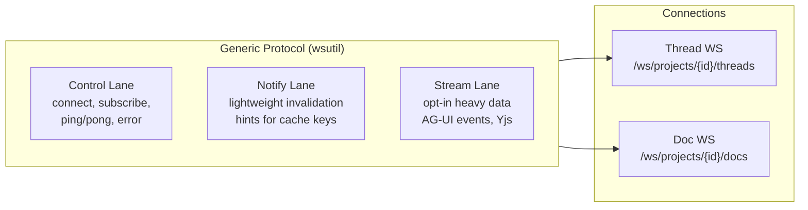

# WebSocket Streaming Migration — Design Overview

## Problem

Each streaming turn opens a separate SSE connection (`GET /api/turns/{id}/stream`). With parent + spawned agents, a single conversation uses 4-5 SSE connections. While WebSocket connections aren't subject to the HTTP/1.1 ~6 connection limit, per-turn connections mean per-turn auth handshakes, heartbeats, and reconnection state machines — and no built-in spawn discovery. Secondary: an interjection drain race silently loses user input between `DrainAndClear()` and executor cleanup.

## Architecture

Two project-scoped WebSocket connections replace the current SSE transport and project notification bus:

```
/ws/projects/{projectId}/threads   ← streaming + spawn management
/ws/projects/{projectId}/docs      ← document/proposal notifications
```

Both connections use an identical **generic wire protocol** with three lanes:



**Thread WS** multiplexes all turn streaming for a project. Server pushes spawn notifications via the notify lane. Client subscribes to individual turns for AG-UI event delivery via the stream lane. Interjections flow client→server as control messages.

**Doc WS** replaces both the current project WS (`collab_project.go`) and the per-document Yjs WS (`collab_document_handler.go`). Notify lane carries document/proposal invalidation hints. Stream lane multiplexes Yjs CRDT sync for all open documents — clients subscribe to individual documents and receive base64-encoded Yjs data as JSON stream events.

## Component Map

| Component | Location | Doc |
|---|---|---|
| Wire protocol specification | — | [protocol.md](protocol.md) |
| Go framework (`wsutil` package) | `backend/internal/wsutil/` | [framework.md](framework.md) |
| Thread WS handler | `backend/internal/handler/` | [thread-ws.md](thread-ws.md) |
| Doc WS handler | `backend/internal/handler/` | [doc-ws.md](doc-ws.md) |
| Interjection forwarder | `backend/internal/service/llm/streaming/` | [interjection-forwarder.md](interjection-forwarder.md) |
| Frontend integration | `frontend-v2/src/` | [frontend.md](frontend.md) |
| mstream library | `meridian-stream-go/` | (existing, fixes needed) |
| Service layer interfaces | `backend/internal/service/llm/streaming/` | [thread-ws.md](thread-ws.md) §Interfaces |

## Key Design Decisions

Decisions from the prior design rounds that remain valid:

| ID | Decision | Rationale |
|---|---|---|
| D1 | Per-project multiplexed WS over per-thread WS | Spawn management: parent + 3 spawns = 4 threads, one connection handles all. Server pushes spawn discovery. |
| D4 | Interjection drain race fix is transport-independent | Race is between `DrainAndClear()` and executor cleanup — service internals, not transport. |
| D5 | Hybrid replay: epoch + seq, crash = non-resumable | Epoch is ephemeral (in-memory). Server restart → gap → REST fallback. No false-positive replay. |
| D6 | Build on `coder/websocket`, not `x/net/websocket` | Origin enforcement, read limits, binary/text frame control needed. Current project WS (`x/net/websocket`) lacks these. |
| D7 | ~~Document Yjs WS stays separate~~ **Reversed** — see D34 | Originally kept separate for binary CRDT frames. Reversed: Yjs sync multiplexed on doc WS stream lane via base64 encoding. |
| D8 | SwitchStream atomicity | Old-turn completion + successor-turn creation in one DB transaction. |

New decisions for the generic protocol architecture:

| ID | Decision | Rationale |
|---|---|---|
| D17 | Two WS connections, not one unified | Threads and docs are separate concerns. Separate connections = independent lifecycle, simpler failure containment, cleaner auth scoping. |
| D18 | Generic reusable protocol | Both connections share identical wire format and Go framework. Third connection type = plug in handlers, not copy infrastructure. |
| D19 | Notify lane = cache invalidation only | TanStack Query pattern. Tiny hints (`turn T1 completed`), frontend invalidates query keys. No full data in notify. |
| D20 | Stream lane = explicit subscriptions | Client subscribes for full event data. Supports seq/epoch for replay, gap detection, backpressure. |
| D21 | No SSE fallback, no v1 compat | Clean break. No dual-format complexity. |
| D22 | Observability deferred | Structured logging with turn/connection IDs sufficient until real users exist. No metrics/dashboards. |

Decisions for Yjs CRDT sync multiplexing on the doc WS:

| ID | Decision | Rationale |
|---|---|---|
| D34 | Yjs CRDT sync multiplexed on doc WS stream lane | Consolidates N per-document WS connections into the single project-scoped doc WS. Client subscribes to a document → gets Yjs sync via stream events. Reverses D7. |
| D35 | Base64 encoding for binary Yjs payloads | Protocol is text-only JSON. Binary frames would require parallel framing protocol. Base64 adds ~33% overhead but Yjs payloads are small (sync step 1: hundreds of bytes, updates: a few KB). Connection consolidation benefit outweighs encoding cost. |
| D36 | Cross-connection document subscriber registry in handler | Yjs update fanout must reach subscribers on different WS connections. Handler maintains `documentID → []subscriber` map. Same snapshot-then-send pattern as `BroadcastNotify`. |
| D37 | ReadLimit raised to 512KB for doc WS | Per-doc WS used 256KB app-level max for raw binary. Base64 + JSON envelope pushes that to ~341KB. 512KB provides headroom. |
| D38 | Gap recovery = re-subscribe, no REST fallback | CRDTs naturally converge on re-sync. Client sends fresh subscribe (no lastSeq/epoch) → full sync-step-1 exchange. Simpler than thread streaming gap recovery. |

## Connections Per User

After migration:

| Connection | Scope | Count |
|---|---|---|
| Thread WS | Per active project | 1 |
| Doc WS | Per active project | 1 |

## What Gets Removed

- `SSEHandler` and `sse/` package
- `nethttp` adapter from mstream
- `StreamURL` from `SwitchStreamResult`
- `AllowsSSE` helpers
- SSE `STREAM_SWITCH` event type (replaced by `ended{reason: stream_switch}`)
- Current project WS in `collab_project.go` (replaced by doc WS notify lane)
- Per-document Yjs WS in `collab_document_handler.go` (replaced by doc WS stream lane)
- `GET /ws/documents/{documentId}` endpoint
- `DocumentBroadcaster` interface (replaced by `DocumentSyncBroadcaster`)
- Frontend `DocumentWsProviderImpl` per-document WS class (replaced by doc WS subscription)
