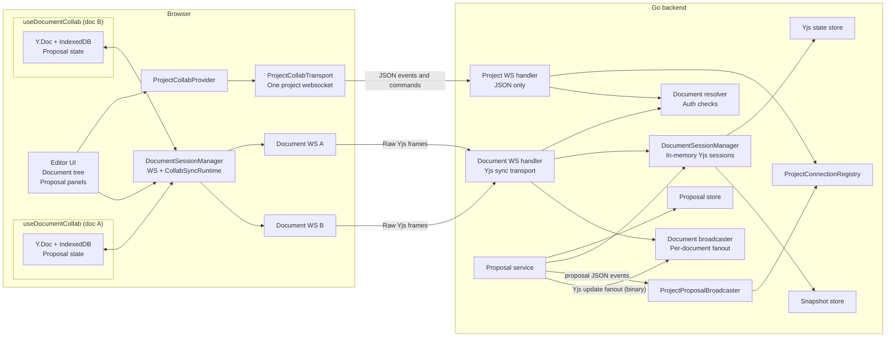
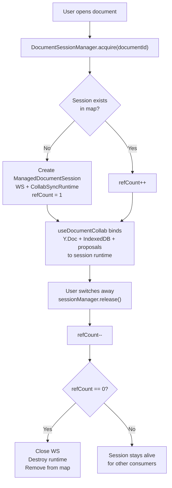
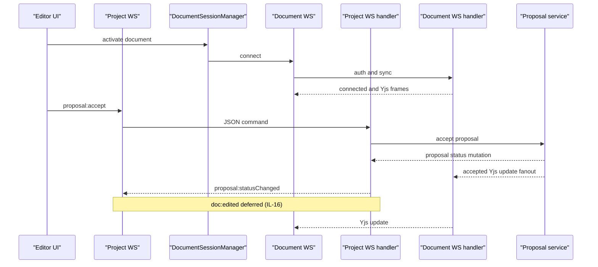

# v2 Architecture Map

Maps the implemented transport redesign. Warm pool and `doc:edited` are deferred (see `ws-patterns.md`).

## System Overview

## Frontend Ownership

Note: Y.Doc, IndexedDB, and proposal state live in `useDocumentCollab` hook, NOT in the session manager. The session manager owns only WS + runtime. Warm pool (deferred) would change the refCount=0 path to retain sessions temporarily.

## Backend Event Split

## Rules

| Area | Rule | Status |
|------|------|--------|
| React ownership | `useDocumentCollab` owns Y.Doc, IndexedDB, proposal state. Session manager owns WS + runtime only. | Implemented |
| Project WS | JSON events and proposal commands only. No binary frames. | Implemented |
| Document WS | Document-scoped Yjs sync traffic only. `coder/websocket` library. | Implemented |
| Broadcasting | `ProjectBroadcaster` (JSON to project WS) and `DocumentBroadcaster` (binary to document WS) are separate interfaces. | Implemented |
| Warm pool | Release retains session with open WS for instant re-acquire. | Deferred (IL-15) |
| `doc:edited` | Project WS notification when server-side edits occur. | Deferred (IL-16) |
| `proposal:snapshot` | Sent on project WS connect for documents with pending proposals. | Broken (IL-13) |
