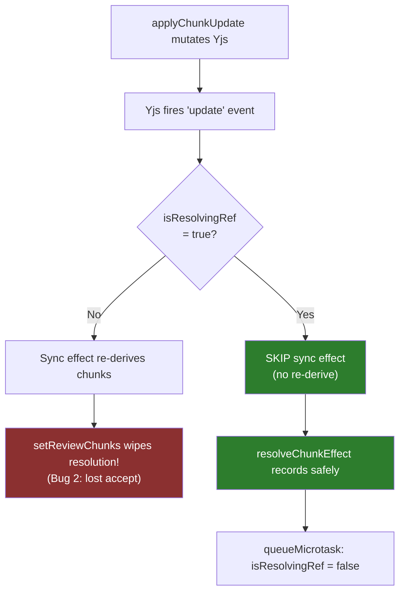
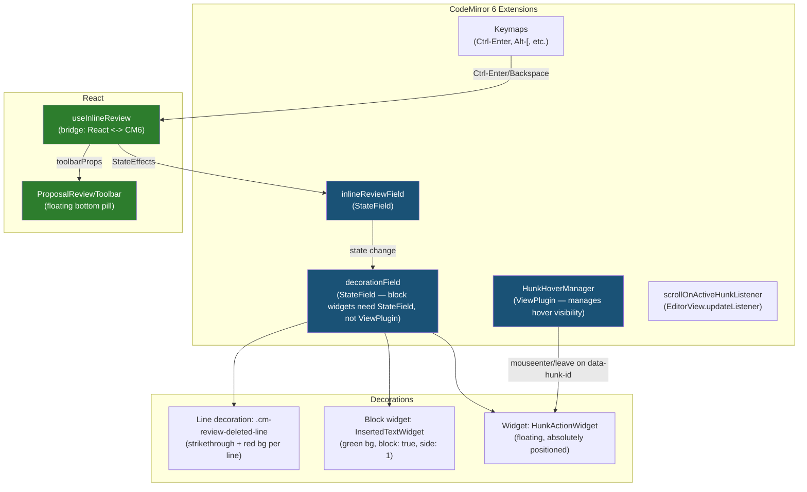
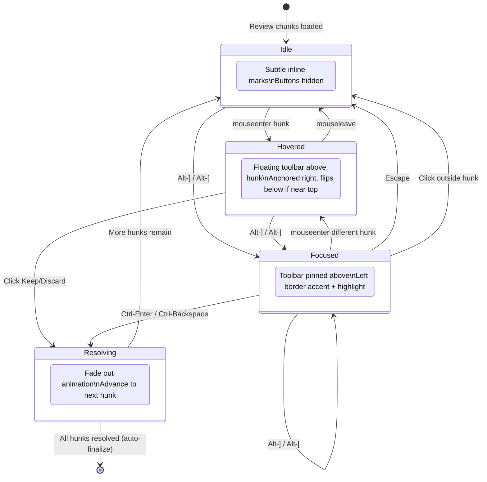
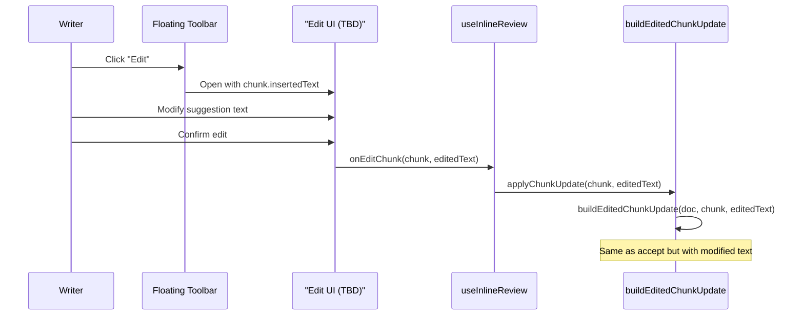

# Inline Review V2 — Floating Controls + Edit Button

> Design spec for fixing the inline review UI: floating accept/reject/edit controls, keeping block widget rendering.

## Problem Statement

The current inline review UI has a critical visual bug: **Accept/Reject buttons are inline widget decorations** that stack at the top of the editor, pushing content down and breaking layout (see screenshot). The text rendering (red strikethrough for deletions, green block widgets for insertions) is actually good — it provides a "live preview" of what the document will look like after accepting.

### What's Broken

1. **`ChunkActionWidget` renders inline at `chunkStart` with `side: -1`** — every chunk gets buttons in the document flow, and they all stack at the top when multiple chunks exist
2. **No hover-based floating toolbar** — the old PUA system in `meridian` solved this with `hoverManager.ts`
3. **No way to edit suggestions** — writer must accept-then-edit or reject-then-redo

### What Works Well (Keep)

- `InsertedTextWidget` as `block: true` widget — shows formatted preview of proposed text
- Line decorations for deleted text (red bg + strikethrough)
- Bottom floating pill (`ProposalReviewToolbar`) — Accept All / Reject All + navigation
- Keyboard shortcuts (Alt-], Alt-[, Ctrl-Enter, Ctrl-Backspace)
- StateField-based architecture with `inlineReviewField`
- Changeset extraction pipeline: `extractProposalOps` -> `groupIntoChunks` -> `ReviewChunk[]`
- Partial application via `buildPartialUpdate` (clone, mutate, diff-only update)
- Race condition guard (`isResolvingRef`) preventing sync effect re-derive
- Auto-finalization: always sends `proposal:reject` (not accept) to prevent double-apply

---

## Key Decisions

### Keep Block Widgets for Insertions

PUA markers put both versions inline as flat text. You lose the ability to render inserted text as a formatted preview block. The block widget approach is strictly more powerful for a writing tool — it shows the writer what the result will look like.

### Don't Make Widgets contentEditable

Making the green block `contentEditable` creates a split UX:
- CM6 undo/redo doesn't reach inside widgets (two undo stacks)
- Cursor can't arrow-key into widgets (CM6 treats them as atomic)
- Keybindings (Alt-], Ctrl-Enter) don't fire inside the widget

Instead: **"Edit" button** on the floating toolbar opens a proper editing context.

---

## Accept Hunk Data Flow

```mermaid
sequenceDiagram
    participant U as User
    participant W as ChunkActionWidget
    participant H as handleAcceptChunk
    participant PA as buildPartialUpdate
    participant Y as Y.Doc
    participant WS as WebSocket
    participant CM as CM6 StateField
    participant S as Server

    U->>W: Click Accept
    W->>H: onAcceptChunk(chunk)
    H->>H: isResolvingRef = true

    rect rgb(40, 80, 40)
        Note over H,Y: Phase 2 - Mutate Yjs Doc
        H->>PA: buildPartialUpdate(doc, chunk)
        PA->>PA: Clone doc, delete old, insert new
        PA-->>H: Uint8Array partial update
        H->>Y: Y.applyUpdate(liveDoc, update)
        Y->>WS: Binary frame (auto via "update" event)
        WS->>S: Yjs sync update (text already changed)
    end

    rect rgb(30, 60, 100)
        Note over H,CM: Phase 3 - Update Editor State
        H->>CM: resolveChunkEffect(chunkId, "accepted")
        CM->>CM: Add to resolutions Map
        CM->>CM: Rebuild decorations (skip resolved)
        Note over CM: Hunk visually disappears
    end

    rect rgb(80, 60, 30)
        Note over H,S: Phase 4 - Auto-Finalize (if all resolved)
        H->>H: maybeAutoFinalize()
        H->>WS: sendProposalReject(proposalId)
        Note right of WS: Always REJECT, never accept!\nChunk edits already synced via Yjs.\nAccept would re-apply = duplicate text.
        WS->>S: proposal:reject command
        H->>CM: clearReviewEffect()
    end

    H->>H: queueMicrotask: isResolvingRef = false

    S-->>WS: proposal:statusChanged
    WS-->>CM: ProposalManager removes proposal
```



### Race Condition Guard



---

## Component Architecture (V2)



---

## Interaction State Machine



---

## UX Design Rationale

### Writer-First Language

Buttons use **"Keep" / "Discard"** instead of "Accept" / "Reject". The writer is reviewing AI suggestions to their *own* document — "accept/reject" is code-review language that frames the writer as a gatekeeper. "Keep/discard" frames the writer as the author making creative choices about their text. This applies to both the floating toolbar and the bottom pill.

### Toolbar Anchoring (Right-Aligned, Not Mouse-Following)

The toolbar anchors to the **right edge** of the hunk's line area rather than following mouse X. Mouse-following creates a jittery, unstable feel that undermines Meridian's calm aesthetic. Right-anchoring matches VS Code's gutter action pattern — the toolbar is always in a predictable location, reducing cognitive load. The writer can build muscle memory for where the buttons are.

### Vertical Flip for Top-of-Viewport Hunks

Default position is above the hunk. When a hunk is near the top of the visible scroller, the toolbar flips below. Without this, the first hunk in a document or hunks scrolled to the top would have clipped/invisible toolbars.

### No Opacity Reduction on Deleted Text

The writer needs to *read* deleted text to make an informed keep/discard decision. `opacity: 0.7` was triple-encoding "deleted" (red bg + strikethrough + dimming). Background + strikethrough is sufficient. Opacity only applies on hover/focus as a deliberate "before → after" preview effect (deleted dims to 0.4 while inserted brightens).

### Before→After Preview on Hover

When hovering or focusing a hunk, deleted lines dim and the inserted block brightens. This creates an instant visual preview of what the document will look like if the writer keeps the change, without requiring them to mentally composite the two states.

### Left Border Accent for Active Hunk

Active hunk uses a `border-left: 3px solid var(--primary)` instead of `outline`. The outline pattern conflicts visually with CM6's text selection highlight (both are rectangular overlays). The left border matches the existing visual language — inserted blocks already use a green left border — creating visual consistency between "here's what's new" and "here's what's focused".

### 150ms Hide Delay + 16px Bridge

The toolbar doesn't hide instantly on mouseleave. A 150ms delay prevents flickering during fast mouse movement across the gap between text and toolbar. The 16px bridge (up from 8px) extends both vertically and horizontally (`left: -8px; right: -8px`) to catch diagonal mouse paths. Together these make the hover interaction feel solid rather than brittle.

### 48px Bottom Padding (Down from 80px)

The bottom padding only needs to accommodate the floating pill (~32px tall) plus its bottom offset (16px). 80px wasted 32px of vertical writing space for no reason.

---

## Existing Code Patterns (Must Stay Consistent)

### Naming Conventions

| Pattern | Examples | Convention |
|---------|----------|------------|
| Types | `ReviewChunk`, `EditOp`, `InlineReviewState` | PascalCase, descriptive |
| StateEffects | `setReviewChunks`, `resolveChunk`, `clearReview` | camelCase verb-noun |
| Effect dispatchers | `setReviewChunksEffect()`, `resolveChunkEffect()` | Same name + `Effect` suffix |
| CM6 CSS classes | `.cm-review-deleted-line`, `.cm-review-accept-btn` | `.cm-review-{concept}[-{modifier}]` |
| Widget classes | `ChunkActionWidget`, `InsertedTextWidget` | PascalCase + `Widget` suffix |
| ViewPlugin classes | `DiffViewPluginClass` (meridian) | PascalCase + descriptive |
| Builder functions | `buildPartialUpdate`, `buildProposalRejectCommand` | `build*` prefix |
| Extraction functions | `extractProposalOps` | `extract*` prefix |
| React hooks | `useInlineReview` | `use*` prefix, returns `{ extensions, toolbarProps }` |

### CM6 Architecture Patterns

1. **Block widgets MUST use StateField** — CM6 forbids block-level decorations from ViewPlugins. Current `makeInlineReviewDecorationField` follows this correctly.
2. **Hover/positioning logic uses ViewPlugin** — `hoverManager.ts` in meridian is a ViewPlugin. New `HunkHoverManager` should follow same pattern.
3. **Callback stability via refs** — `useInlineReview` creates extensions once with `useMemo([collabEnabled])`, callbacks go through refs so CM6 always calls latest handlers.
4. **RangeSetBuilder ordering** — Decorations must be sorted by `(from, startSide)`. Current code explicitly sorts and uses `startSide: -1/lineStartSide/1`.
5. **Theme location** — Current review styles are in `EditorView.baseTheme()`. Note: `baseTheme()` *does* support `var()` CSS custom properties (our own `livePreviewTheme` uses them extensively). **Decision: move to globals.css** for consistency with meridian's approach, easier pseudo-element styling (the `::after` bridge), and `@media` query ergonomics — not due to any `var()` limitation.

### Data Pipeline (Unchanged)

```
Proposal.yjsUpdate (base64)
  -> extractProposalOps(baseDoc, update) -> EditOp[]
  -> groupIntoChunks(ops, proposalId, baseText) -> ReviewChunk[]
  -> setReviewChunksEffect(view, chunks)
  -> buildInlineReviewDecorations(state, reviewState, callbacks)
```

### Key Types

```typescript
// review/types.ts (now ReviewHunk)
interface ReviewHunk {
  id: string;                // "${proposalId}-chunk-${index}"
  proposalId: string;
  baseStart: number;         // Offset in base text (inclusive)
  baseEnd: number;           // Offset in base text (exclusive)
  deletedText: string | undefined;   // undefined for pure inserts
  insertedText: string | undefined;  // undefined for pure deletes
  status: ReviewHunkStatus;
}

// inline-review.ts — UNCHANGED
interface InlineReviewState {
  chunks: ReviewChunk[];
  resolutions: Map<string, "accepted" | "rejected">;
  activeChunkIndex: number;  // -1 = none
}

interface InlineReviewCallbacks {
  onAcceptChunk: (chunk: ReviewChunk) => void;
  onRejectChunk: (chunk: ReviewChunk) => void;
  // NEW: onEditChunk will be added in Phase 3
}
```

---

## Implementation Phases

### Phase 1: Floating Hover Toolbar (Priority Fix)

**Goal**: Replace inline `ChunkActionWidget` with floating absolutely-positioned toolbar. Port hover manager from meridian.

#### Changes to `inline-review.ts`

**Remove**: Current `ChunkActionWidget` rendered at `chunkStart` with `side: -1` in document flow.

**Add**: New `HunkActionWidget` rendered at `chunkEnd` with `side: 1`, absolutely positioned, hidden by default.

```typescript
// NEW: HunkActionWidget (adapted from meridian/diffView/HunkActionWidget.ts)
class HunkActionWidget extends WidgetType {
  constructor(
    private chunk: ReviewChunk,
    private callbacks: InlineReviewCallbacks,
    private isFocused: boolean,
  ) { super(); }

  toDOM(): HTMLElement {
    const container = document.createElement("span");
    // Focused class for auto-visibility (keyboard nav / mobile)
    container.className = this.isFocused
      ? "cm-review-actions cm-review-focused-visible"
      : "cm-review-actions";
    container.dataset.hunkId = this.chunk.id;

    // Writer-first language: "Keep" / "Discard" instead of "Accept" / "Reject"
    const keepBtn = document.createElement("button");
    keepBtn.textContent = "Keep \u2713";
    keepBtn.className = "cm-review-accept-btn";
    keepBtn.title = "Keep this change (Ctrl-Enter)";
    keepBtn.type = "button";
    keepBtn.onclick = (e) => {
      e.preventDefault();
      e.stopPropagation();
      this.callbacks.onAcceptChunk(this.chunk);
    };

    const discardBtn = document.createElement("button");
    discardBtn.textContent = "Discard \u2717";
    discardBtn.className = "cm-review-reject-btn";
    discardBtn.title = "Discard this change (Ctrl-Backspace)";
    discardBtn.type = "button";
    discardBtn.onclick = (e) => {
      e.preventDefault();
      e.stopPropagation();
      this.callbacks.onRejectChunk(this.chunk);
    };

    container.appendChild(keepBtn);
    container.appendChild(discardBtn);
    return container;
  }

  eq(other: HunkActionWidget): boolean {
    return this.chunk.id === other.chunk.id
      && this.isFocused === other.isFocused;
  }

  ignoreEvent(): boolean { return true; }
}
```

**Key difference from current**: `ignoreEvent() returns true` (buttons handle their own events). Current `ChunkActionWidget` returns `false` — we need `true` so CM6 doesn't interfere with click handling on absolutely-positioned elements.

#### New file: `hover-manager.ts`

Port from `meridian/frontend/src/core/editor/codemirror/diffView/hoverManager.ts`:

```typescript
// ViewPlugin — manages hover visibility for hunk action buttons
class HunkHoverManager {
  private currentHunkId: string | null = null;
  private currentAnchorEl: HTMLElement | null = null;
  private pendingRepositionFrame: number | null = null;

  constructor(private view: EditorView) {
    this.setupListeners();
  }

  private hideTimeout: ReturnType<typeof setTimeout> | null = null;

  update(update: ViewUpdate) {
    // Clear hover on doc change (accept/reject removes hunk)
    if (update.docChanged && this.currentHunkId) {
      this.hideActions(this.currentHunkId);
      this.currentHunkId = null;
    }
    // Reposition on geometry/viewport changes
    if ((update.geometryChanged || update.viewportChanged) && this.currentHunkId) {
      this.requestReposition();
    }
  }

  // Event delegation on contentDOM (capture phase):
  // - mouseenter [data-hunk-id] -> show toolbar, cancel pending hide
  // - mouseleave -> start 150ms hide delay (prevents flicker on fast mouse movement)
  // - mouseenter on .cm-review-actions -> cancel pending hide (bridge traversal)
  // See meridian/hoverManager.ts for full implementation

  // === Positioning behavior ===
  //
  // Toolbar is anchored to the RIGHT EDGE of the hunk's line area,
  // not mouse-following. This avoids jittery sliding and matches
  // VS Code's gutter-action anchoring pattern.
  //
  // Vertical flip: default position is ABOVE the hunk. When the hunk
  // is near the top of the visible scroller viewport, flip to BELOW:
  //
  //   const scrollerRect = this.view.scrollDOM.getBoundingClientRect();
  //   const anchorRect = anchorEl.getBoundingClientRect();
  //   const toolbarHeight = actions.offsetHeight;
  //   const flipBelow = anchorRect.top - toolbarHeight < scrollerRect.top;
  //
  //   if (flipBelow) {
  //     actions.style.top = `${anchorRect.bottom - scrollerRect.top + scrollDOM.scrollTop + 4}px`;
  //   } else {
  //     actions.style.top = `${anchorRect.top - scrollerRect.top + scrollDOM.scrollTop - toolbarHeight - 4}px`;
  //   }
  //
  // Horizontal: right-aligned relative to content area.
}

export const hunkHoverPlugin = ViewPlugin.fromClass(HunkHoverManager);
```

**Consistency note**: This follows the same ViewPlugin pattern as `DiffViewPluginClass` in meridian. Event delegation via `contentDOM.addEventListener("mouseenter", handler, true)` in capture phase.

#### Changes to `buildInlineReviewDecorations`

```diff
- // Action widget at the start of the chunk (INLINE — causes stacking)
- decos.push({
-   from: chunkStart, to: chunkStart, startSide: -1,
-   deco: Decoration.widget({
-     widget: new ChunkActionWidget(chunk, callbacks),
-     side: -1,
-   }),
- });

+ // Action widget at the end of the chunk (FLOATING — hidden by default)
+ decos.push({
+   from: chunkEnd, to: chunkEnd, startSide: 1,
+   deco: Decoration.widget({
+     widget: new HunkActionWidget(chunk, callbacks, isActive),
+     side: 1,
+   }),
+ });
```

#### Data attributes on decorations

The hover manager needs `data-hunk-id` attributes on the decorated regions to know which hunk the mouse is over.

**Important**: `Decoration.line` attributes cannot distinguish multiple hunks on the same line (a line attribute can only hold one value). When two hunks overlap on the same line, `data-hunk-id` on line decorations becomes ambiguous. Therefore:

- **Use `Decoration.mark` over deleted/inserted ranges** for hunk identity (`data-hunk-id`). Mark decorations are per-range, so multiple hunks on the same line each get their own attribute.
- **Keep `Decoration.line` for visual styling only** (`.cm-review-deleted-line` background). Line decorations apply the red background to the full line without needing hunk identity.
- **InsertedTextWidget** also gets `data-hunk-id` on its container.

```typescript
// Mark decoration on deleted text range (for hover identity)
Decoration.mark({
  class: "cm-review-deleted-mark",
  attributes: { "data-hunk-id": chunk.id },
}).range(deleteFrom, deleteTo)

// Line decoration for deleted text (visual styling only, no hunk identity)
Decoration.line({
  class: "cm-review-deleted-line",
})

// InsertedTextWidget.toDOM()
wrap.dataset.hunkId = this.chunkId;  // Add chunkId to constructor
```

#### Applying `.cm-review-active` to the editor

The CSS references `.cm-review-active` for positioning context, but this class must be explicitly applied. Use `EditorView.editorAttributes` to conditionally add it when review chunks are present:

```typescript
const reviewActiveAttrs = EditorView.editorAttributes.compute(
  [inlineReviewField],
  (state) => {
    const review = state.field(inlineReviewField, false);
    if (review && review.chunks.length > 0) {
      return { class: "cm-review-active" };
    }
    return {};
  },
);
```

Add this to the extension array in `inlineReviewExtension()`.

#### Escape and click-outside handlers

Add an Escape keymap to dismiss focused state:

```typescript
// In makeInlineReviewKeymap
{
  key: "Escape",
  run(view) {
    const state = view.state.field(inlineReviewField);
    if (state.activeChunkIndex >= 0) {
      view.dispatch({ effects: setActiveChunk.of(-1) });
      return true;
    }
    return false;
  },
}
```

The hover manager should also detect clicks outside any `[data-hunk-id]` region and clear the focused state via `setActiveChunk.of(-1)`.

#### Event handling: keep `mousedown` pattern

The current `ChunkActionWidget` uses `mousedown` with `preventDefault()` to prevent editor focus loss. The new `HunkActionWidget` keeps `onclick` because `ignoreEvent() { return true }` already prevents CM6 from processing events on the widget. However, for consistency with the proven pattern and to avoid subtle timing differences (mousedown fires on press, onclick on release), **either approach is acceptable**. Document the choice in a code comment.

#### CSS (move from `EditorView.baseTheme()` to `globals.css`)

```css
/* ========== INLINE REVIEW ========== */

/* Editor container — relative positioning for absolute action pills.
   Applied via EditorView.editorAttributes when review chunks are present.
   48px = pill height (~32px) + bottom offset (16px). */
.cm-editor.cm-review-active .cm-scroller {
  position: relative;
  padding-bottom: 48px;
}

/* Deleted text — red bg + strikethrough per line.
   No opacity reduction — writer needs to read deleted text comfortably
   to make an informed keep/discard decision. */
.cm-review-deleted-line {
  background-color: color-mix(in srgb, var(--error) 15%, transparent);
  text-decoration: line-through;
}

/* Hover preview: dim deleted lines when hunk is hovered/focused,
   brighten inserted block — creates a "before → after" visual shift. */
[data-hunk-id]:hover .cm-review-deleted-line,
.cm-review-active-hunk .cm-review-deleted-line {
  opacity: 0.4;
}

[data-hunk-id]:hover + .cm-review-inserted-block,
.cm-review-active-hunk + .cm-review-inserted-block {
  background-color: color-mix(in srgb, var(--success) 25%, transparent);
}

/* Inserted text block — green bg + left border */
.cm-review-inserted-block {
  background-color: color-mix(in srgb, var(--success) 15%, transparent);
  padding: 2px 0;
  border-left: 3px solid color-mix(in srgb, var(--success) 60%, transparent);
}

.cm-review-inserted-line {
  padding: 0 4px;
  white-space: pre-wrap;
  font-family: inherit;
  font-size: inherit;
  line-height: inherit;
}

/* Active hunk highlight — left border accent (matches inserted block visual
   language) instead of outline (which conflicts with CM6 selection highlight). */
.cm-review-active-hunk {
  border-left: 3px solid var(--primary);
}

/* ========== FLOATING ACTION TOOLBAR ========== */

.cm-review-actions {
  display: none;
  position: absolute;
  z-index: 50;
  max-height: 1lh;
  padding: 0;
  gap: 2px;
  background: var(--surface);
  border: 1px solid var(--border);
  border-radius: 4px;
  box-shadow: 0 2px 8px rgba(0, 0, 0, 0.12);
}

/* Shown on hover via HunkHoverManager */
.cm-review-actions.visible {
  display: inline-flex;
  align-items: center;
}

/* Auto-shown on focused hunk (keyboard nav / mobile) */
.cm-review-actions.cm-review-focused-visible {
  display: inline-flex;
  align-items: center;
  position: absolute;
  transform: translateY(-100%);
  margin-top: -4px;
}

/* Invisible bridge for mouse travel from text to buttons.
   16px is generous enough to survive fast/diagonal mouse movement.
   Combined with the 150ms hide delay in HunkHoverManager, this
   prevents flickering when moving between text and toolbar. */
.cm-review-actions::after {
  content: "";
  position: absolute;
  left: -8px;
  right: -8px;
  top: 100%;
  height: 16px;
}

.cm-review-actions button {
  padding: 4px 8px;
  border: none;
  border-radius: 4px;
  font-size: 12px;
  line-height: 1;
  cursor: pointer;
  transition: background 150ms, color 150ms;
  white-space: nowrap;
  background: transparent;
  color: var(--muted-foreground);
}

.cm-review-accept-btn:hover {
  background: color-mix(in srgb, var(--success) 15%, transparent);
  color: var(--success);
}

.cm-review-reject-btn:hover {
  background: color-mix(in srgb, var(--error) 15%, transparent);
  color: var(--error);
}
```

**Why move to globals.css**: For consistency with meridian's diff view styling, easier pseudo-element handling (the `::after` bridge for hover), and `@media` query support for touch/coarse pointer fallbacks (see Accessibility section). Note: `baseTheme()` *does* support `var()` — the move is a consistency/ergonomics choice, not a technical necessity.

#### Extension array update

```typescript
export function inlineReviewExtension(callbacks: InlineReviewCallbacks): Extension[] {
  return [
    inlineReviewField,
    reviewActiveAttrs,                   // NEW: applies .cm-review-active to editor
    makeInlineReviewDecorationField(callbacks),
    hunkHoverPlugin,                     // NEW: hover manager
    makeScrollOnActiveChunkListener(),
    makeInlineReviewKeymap(callbacks),   // Updated: includes Escape handler
    // inlineReviewTheme REMOVED — styles now in globals.css
  ];
}
```

### Phase 2: Rename chunks to hunks

Pure mechanical refactor after Phase 1 is working. **Keep "chunk" in protocol/Yjs layer** (chunk IDs in proposals are stable across client/server boundary). Rename only the UI-facing surface:

#### Files to rename

| Current file | New file |
|-------------|----------|
| `review/chunk-grouper.ts` | `review/hunk-grouper.ts` |
| `review/chunk-editor.ts` | `review/hunk-editor.ts` |

#### Symbols to rename

| Current | New | Files affected |
|---------|-----|----------------|
| `ReviewChunk` | `ReviewHunk` | `types.ts`, `inline-review.ts`, `useInlineReview.ts`, `partial-apply.ts`, `chunk-grouper.ts`, `chunk-editor.ts`, `contracts.ts`, `runtime.ts`, `ops-to-changes.ts` |
| `ReviewChunkStatus` | `ReviewHunkStatus` | `types.ts`, `inline-review.ts` |
| `groupIntoChunks` | `groupIntoHunks` | `chunk-grouper.ts`, `runtime.ts` |
| `ChunkEditSession` / `ChunkEditCommit` | `HunkEditSession` / `HunkEditCommit` | `chunk-editor.ts`, consumers |
| `activeChunkIndex` | `activeHunkIndex` | `inline-review.ts`, `useInlineReview.ts` |
| `resolveChunk` / `resolveChunkEffect` | `resolveHunk` / `resolveHunkEffect` | `inline-review.ts`, `useInlineReview.ts` |
| `setReviewChunks` / `setReviewChunksEffect` | `setReviewHunks` / `setReviewHunksEffect` | `inline-review.ts`, `useInlineReview.ts` |
| `onAcceptChunk` / `onRejectChunk` | `onAcceptHunk` / `onRejectHunk` | `inline-review.ts`, `useInlineReview.ts` |
| `handleAcceptChunk` / `handleRejectChunk` | `handleAcceptHunk` / `handleRejectHunk` | `useInlineReview.ts` |
| `ChunkActionWidget` / `InsertedTextWidget` | `HunkActionWidget` / (keep) | `inline-review.ts` |
| `applyChunkUpdate` | `applyHunkUpdate` | `useInlineReview.ts`, `useDocumentCollab.ts` |
| `cm-review-chunk-*` | `cm-review-hunk-*` | CSS classes in `globals.css` |
| `cm-review-active-chunk` | `cm-review-active-hunk` | CSS + `inline-review.ts` |

#### Barrel exports to update

| File | Exports to rename |
|------|-------------------|
| `review/index.ts` | Re-exports of renamed types/functions |
| `cm6-collab/index.ts` | Re-exports from `review/index.ts` |

#### Tests to update

| File | Changes |
|------|---------|
| `tests/cm6-collab/inline-review.test.ts` | All `chunk` references in assertions/helpers |
| `tests/cm6-collab/partial-apply.test.ts` | `ReviewChunk` → `ReviewHunk` in test fixtures |

#### What stays as "chunk"

- `chunk.id` format string (`"${proposalId}-chunk-${index}"`) — stable protocol identifier, don't rename
- Any backend/WebSocket protocol fields referencing chunk IDs

### Phase 3: Edit Button for Suggestions

> **UI component design TBD.** The data flow infrastructure exists, but the edit popover component needs a separate UI spec before implementation. This section covers the data flow and known constraints; the UI spec should answer: positioning, size, editor type (CM6 mini-editor vs textarea), keyboard handling (Escape/Ctrl-Enter semantics), cancel flow, empty-edit validation, and multi-edit behavior.

**Data flow** (infrastructure exists, design confirmed):



**Infrastructure already exists**: `applyChunkUpdate` accepts optional `editedInsertedText` parameter, and `buildEditedChunkUpdate` in `partial-apply.ts` handles this path. The `ChunkEditSession` in `chunk-editor.ts` manages edit session state.

**New callback**:
```typescript
interface InlineReviewCallbacks {
  onAcceptChunk: (chunk: ReviewChunk) => void;
  onRejectChunk: (chunk: ReviewChunk) => void;
  onEditChunk: (chunk: ReviewChunk) => void;  // NEW
}
```

**Edit button in HunkActionWidget** (the button itself is Phase 3 scope; the edit UI is separate):
```typescript
const editBtn = document.createElement("button");
editBtn.textContent = "Edit \u270E";
editBtn.className = "cm-review-edit-btn";
editBtn.title = "Edit this suggestion";
editBtn.type = "button";
editBtn.onclick = (e) => {
  e.preventDefault();
  e.stopPropagation();
  this.callbacks.onEditChunk(this.chunk);
};
container.appendChild(editBtn);
```

### Phase 4: Bottom Pill Refinements + Polish

Updates to `ProposalReviewToolbar`:
- Rename chunk -> hunk in props
- Rename "Accept All" → "Keep All", "Reject All" → "Discard All" (writer-first language)
- Add subtle entrance animation (slide up + fade)
- Consider adding per-hunk keep/discard to pill when focused

Resolve animation (deferred from Phase 1 due to CM6 complexity):
- On resolve, briefly apply `.cm-review-resolving` class before removing decorations
- CSS transition: `opacity 200ms ease-out` on deleted lines + inserted block
- If too complex with CM6's decoration rebuild, use a subtle flash/highlight on the *next* active hunk to anchor the writer's eye after content shifts

---

## SOLID Compliance Notes

### Current Compliance

| Principle | Status | Evidence |
|-----------|--------|----------|
| SRP | Needs work | `inline-review.ts` (590 lines) and `useInlineReview.ts` (535 lines) both exceed the project's ~500 line SRP threshold |
| OCP | Good | Callbacks injected, extensions composable |
| LSP | Good | All EditOp variants have consistent position semantics |
| ISP | Good | `InlineReviewCallbacks` is minimal (2 methods) |
| DIP | Good | useInlineReview depends on abstract `operationsModels`, not concrete ProposalManager |

### Refactoring Needed

1. **SRP: `inline-review.ts` (590 lines)** — Exceeds ~500 line threshold. Phase 1 extracts hover manager to `hover-manager.ts` and removes `baseTheme` (CSS moves to globals.css). After Phase 1, extract widgets to `review/widgets.ts` if still over 500 lines. Target: widgets/decorations/keymaps/public-API each under 500 lines.

2. **SRP: `useInlineReview.ts` (535 lines)** — Also over threshold. Consider extracting auto-finalization and navigation logic into separate hooks (`useReviewFinalization`, `useReviewNavigation`) in a future cleanup slice.

3. **OCP: Theme approach** — Moving from `baseTheme()` to globals.css for consistency/ergonomics. CSS class names are the "extension point" for custom themes — keep them stable.

4. **ISP: `InlineReviewCallbacks`** — Adding `onEditChunk` in Phase 3 keeps the interface small (3 methods). If it grows beyond 4-5, split into `ReviewActionCallbacks` and `ReviewNavigationCallbacks`.

5. **Consistency: data attributes** — Use `Decoration.mark` (per-range) for `data-hunk-id` attributes, not `Decoration.line` (per-line, ambiguous when hunks overlap on a line). Line decorations are for visual styling only.

---

## Acceptance Criteria

### Phase 1: Floating Hover Toolbar

**Desktop (hover capable)**:
- [ ] Hovering over a deleted line or inserted block shows the floating toolbar anchored to the right edge above the hunk
- [ ] When hunk is near the top of the viewport, toolbar flips to below the hunk
- [ ] Moving mouse from hunk text to toolbar buttons does not dismiss toolbar (16px bridge + 150ms delay)
- [ ] Moving mouse outside hunk region hides toolbar after 150ms delay
- [ ] Only one toolbar visible at a time (hovering a different hunk switches)
- [ ] Clicking Keep applies the change and hunk disappears; clicking Discard removes the change
- [ ] No buttons stack in the document flow (the original bug is fixed)
- [ ] On hover/focus: deleted lines dim to 0.4 opacity, inserted block brightens (before→after preview)

**Keyboard-only**:
- [ ] `Alt-]` / `Alt-[` navigates between pending hunks, showing pinned toolbar on active hunk
- [ ] `Ctrl-Enter` keeps active hunk; `Ctrl-Backspace` discards active hunk
- [ ] `Escape` dismisses focused state (returns to Idle, toolbar hidden)
- [ ] After resolving a hunk, focus advances to next pending hunk

**Touch/coarse pointer** (WCAG 1.4.13):
- [ ] When a hunk is active (focused via keyboard or tap), toolbar is always visible (`.cm-review-focused-visible`)
- [ ] On devices without hover (`@media (hover: none)`), tap on a hunk focuses it and shows toolbar

**Multi-hunk overlap**:
- [ ] Two hunks on the same line: hovering each hunk's *text range* shows the correct toolbar (mark decoration identity, not line identity)
- [ ] Keep/discard operates on the correct hunk even when ranges are adjacent

**Bottom pill**:
- [ ] `ProposalReviewToolbar` shows total/resolved count, navigation, and bulk keep/discard
- [ ] Keep All resolves all pending hunks; Discard All clears the review

## Accessibility

### Touch/Coarse Pointer Fallback

Add to `globals.css`:

```css
@media (hover: none) {
  /* On touch devices, always show toolbar for the active/focused hunk */
  .cm-review-actions.cm-review-focused-visible {
    display: inline-flex;
  }
}
```

The hover manager should detect `@media (hover: none)` and skip hover-based show/hide, relying on tap-to-focus instead.

### WCAG 1.4.13 Compliance

Content shown on hover/focus must be:
1. **Dismissible**: Escape key clears focused state (implemented above)
2. **Hoverable**: User can move pointer to toolbar without it disappearing (bridge element)
3. **Persistent**: Toolbar stays visible while hovered or focused (no auto-dismiss timer)

---

## File Changes Summary

### New Files
| File | Purpose | Pattern |
|------|---------|---------|
| `review/hover-manager.ts` | ViewPlugin for hover visibility | Port from `meridian/diffView/hoverManager.ts` |

### Modified Files
| File | Changes | Risk |
|------|---------|------|
| `review/inline-review.ts` | Replace ChunkActionWidget, add data attrs, remove baseTheme | Medium — core decoration logic |
| `globals.css` | Add `.cm-review-*` CSS classes | Low — additive |
| `review/types.ts` | Rename chunk -> hunk (Phase 2) | Low — mechanical |
| `review/chunk-grouper.ts` | Rename to hunk-grouper (Phase 2) | Low — mechanical |
| `review/chunk-editor.ts` | Rename to hunk-editor (Phase 2) | Low — mechanical |
| `hooks/useInlineReview.ts` | Rename + add onEditChunk | Low-Medium |
| `components/ProposalReviewToolbar.tsx` | Rename + animations | Low |

### Testing Impact

Current tests in `frontend/tests/cm6-collab/inline-review.test.ts` test StateField logic via pure state transitions (no DOM). These tests are **unaffected** by the widget/CSS changes. New tests needed:
- Hover manager: mock `contentDOM` events, verify `.visible` class toggle
- HunkActionWidget: verify `data-hunk-id`, `ignoreEvent()`, button click handlers
- Integration: verify decoration ordering constraints still hold

---

## Migration Path

1. **Phase 1** (floating toolbar): Priority fix. Changes `ChunkActionWidget` -> `HunkActionWidget`, adds hover manager, moves CSS. Self-contained slice.
2. **Phase 2** (rename): Pure refactor, no behavior change. Can be done in same PR or separate.
3. **Phase 3** (edit button): Additive feature. Uses existing `buildEditedChunkUpdate` path.
4. **Phase 4** (polish): Animations, pill refinements, accessibility audit.

Each phase is a self-contained slice that can be reviewed and tested independently.
