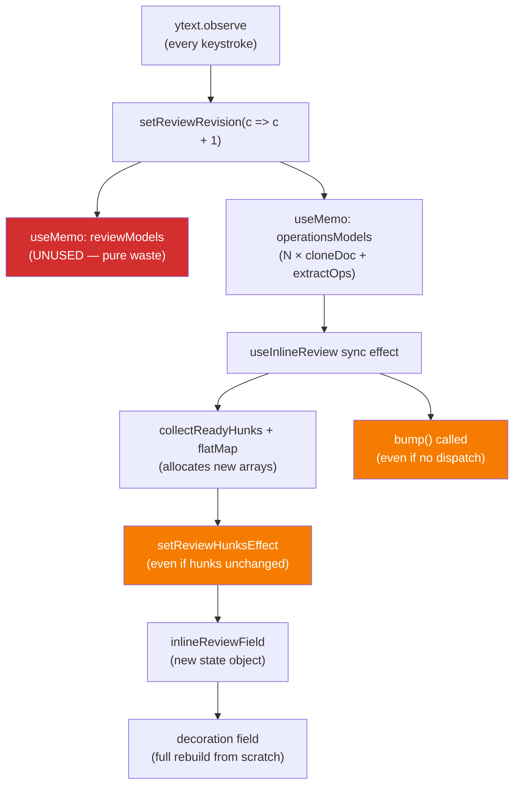
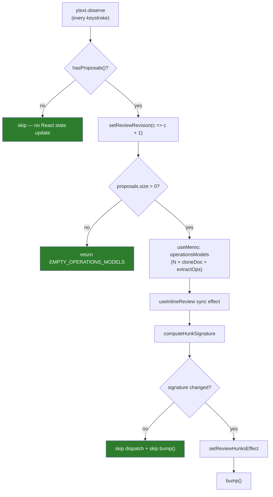

# Performance: Review Derivation Hot Path Optimization

## Problem

The inline review derivation pipeline recomputes **all proposal models** on every Y.Text change (keystroke), even when proposals haven't changed. This is O(N×D) per keystroke where N=proposals and D=doc size, because each derivation clones the Y.Doc.

### Root Cause Chain



### Measured Impact

Benchmark (Yjs clone/apply only, excludes React/CM6 overhead):
- 200KB doc, 5 proposals: ~3.8ms per pass
- 500KB doc, 20 proposals: ~25ms per pass
- Current code does TWO passes (reviewModels + operationsModels), so worst case ~50ms per keystroke

### Issues (Ordered by Impact)

1. **`reviewModels` computed but never consumed** — full per-proposal derivation pass with no UI benefit
2. **`operationsModels` recomputes on every text change** — even when no proposal data changed
3. **No equality check before CM6 dispatch** — `setReviewHunksEffect` fires even when hunks are identical
4. **`bump()` called unconditionally** — React state update even when no CM6 mutation occurred
5. **`reviewRevision` bumps with no proposals** — React state churn during normal typing
6. **Decoration field does full rebuild** — no incremental mapping of existing decorations (deferred)

## Design

### Principles

- **Follow existing conventions**: Use patterns already in the codebase (identity guards, revision counters, `isResolvingRef`-style gating)
- **SOLID/SRP**: Each optimization is a focused, independent change
- **Start simple**: Approach A (edge gating) first, defer per-proposal caching (Approach B) until profiling shows need
- **No new abstractions**: Use existing Map/Set/useMemo patterns

### Fix 1: Remove `reviewModels` Derivation

**Why**: `reviewModels` has zero consumers. `EditorPanel` only passes `operationsModels` to `useInlineReview`. The `deriveProposalReviews()` method does a full clone+apply+normalize per proposal — pure waste.

**Convention followed**: "Delete dead code — it's easier to clean up now than later" (CLAUDE.md principle 1)

**Changes**:
- `useDocumentCollab.ts`: Remove `reviewModels` useMemo, remove from return type, remove `EMPTY_REVIEW_MODELS` constant
- `useDocumentCollab.ts` return type: Remove `reviewModels` field
- Keep `deriveProposalReviews()` method on `ProposalReviewRuntime` — it's a public API that may be used in future (diff preview panel). Just stop calling it eagerly.
- Update test mocks if needed

**Impact**: Eliminates ~50% of per-keystroke derivation cost (one full clone+apply+normalize pass per proposal removed).

### Fix 2: Gate `operationsModels` Recompute — Skip When No Proposals Exist

**Why**: When there are no active proposals, the derivation loop still runs on every text change. The `void reviewRevision` trigger fires regardless.

**Convention followed**: Existing pattern in `useDocumentContent` (skip hydration when no change), `WorkspaceLayout` (skip project switch when same ID).

**Changes**:
- `useDocumentCollab.ts`: In `operationsModels` useMemo, early-return `EMPTY_OPERATIONS_MODELS` when `proposalState.proposals.size === 0`
- This is a single-line guard, not a structural change

**Non-goal**: Do NOT skip derivation when proposals exist but all have `missing_update`. Those entries are intentionally consumed by `useInlineReview`'s auto-request effect to trigger `requestProposalUpdate`. Skipping them would break lazy yjsUpdate loading.

**Impact**: Eliminates all derivation cost when no proposals are active (common case during normal writing).

### Fix 3: Hunk Equality Check Before CM6 Dispatch

**Why**: `setReviewHunksEffect` is dispatched on every `operationsModels` change, even when the derived hunks are byte-identical. The `inlineReviewField` always returns a new state object, triggering decoration rebuild.

**Convention followed**: Existing pattern in `CodeMirrorEditor.dispatchSetContent` (skip when content identical), `reconcileTurnBlocks` (reuse prior objects when unchanged). CM6 best practice: StateField update should return previous value when unchanged.

**Changes**:
- `useInlineReview.ts`: Add a `lastDispatchedHunksRef` that stores a signature of the last dispatched hunk set
- Before calling `setReviewHunksEffect`, compare current signature against last. Skip dispatch if identical.
- Signature format: `hunkId:baseStart:baseEnd:hash(deletedText):hash(insertedText)` joined by `|`
  - Must include text payload hashes, not just positions — two different hunk sets can share the same `id/baseStart/baseEnd` while text content changes (e.g., after surrounding edits)
  - Hash function: simple `djb2` or `string.length + first/last chars` — just needs collision resistance, not cryptographic strength
- Extract signature computation into a small helper function (`computeHunkSignature`) in the same file

**Impact**: Eliminates unnecessary CM6 state updates and decoration rebuilds when text changes don't affect proposal hunks (most keystrokes).

### Fix 4: Gate `bump()` and `reviewRevision` When No Work Done

**Why**: Two remaining hot-path rerender sources even after Fixes 1-3:
1. `useInlineReview` calls `bump()` unconditionally at the end of the sync effect, even when no CM6 change was dispatched
2. `useDocumentCollab` bumps `reviewRevision` on every `ytext.observe`, even with no active proposals

**Convention followed**: Existing `isResolvingRef` pattern (skip effect work when state won't change).

**Changes**:
- `useInlineReview.ts`: Move `bump()` inside the `if (allHunks.length > 0)` and `clearReviewEffect` branches — only bump when CM6 state actually changes
- `useDocumentCollab.ts`: In `handleTextChange` (ytext.observe callback), gate the revision bump:
  ```typescript
  const handleTextChange = () => {
    // Skip revision bump when no proposals exist — avoids expensive
    // operationsModels recompute during normal typing without proposals.
    if (proposalManager.hasProposals()) {
      setReviewRevision((current) => current + 1);
    }
  };
  ```
  - Requires adding a `hasProposals()` method to `ProposalManager` (or reading size from the state callback)

**Impact**: Eliminates React state churn during normal typing without proposals.

### Fix 5: Convention — Document the Derivation Hot Path Pattern

**Why**: This is a recurring pattern (expensive derivation triggered by revision counter). New code should follow the same gating conventions.

**Changes**:
- `.claude/skills/review/references/frontend.md`: Add "Expensive Derivation Gating" rule
- `_docs/technical/frontend/architecture/sync-system.md`: Add note about derivation cost in review pipeline

**Convention**:
```
When useMemo depends on a revision counter that fires on every text change:
1. Early-return empty when no data to derive (Fix 2)
2. Gate the revision bump when no consumers need it (Fix 4)
3. Check if output changed before dispatching to CM6 (Fix 3)
```

## After State



## What This Design Does NOT Do

- **No per-proposal derivation cache** (Approach B) — deferred until profiling shows need after these fixes
- **No worker/off-thread derivation** (Approach C) — overkill for expected scale
- **No changes to `deriveProposalOperations()`** — the runtime method is correct, we're just calling it less often
- **No changes to CM6 decoration rebuild** — incremental decoration mapping is a larger refactor with higher regression risk
- **No hook extraction** — these fixes *remove* code (reviewModels) and add ~10 net lines. SRP extraction is tracked in cleanup-009 from prior review.

## Files Changed

| File | Change | Risk |
|------|--------|------|
| `frontend/src/features/documents/hooks/useDocumentCollab.ts` | Remove reviewModels, add proposals.size guard, gate reviewRevision bump | Low |
| `frontend/src/features/documents/hooks/useInlineReview.ts` | Add hunk signature equality check, gate bump() | Low |
| `frontend/src/core/cm6-collab/proposals/runtime.ts` | Add `hasProposals()` to ProposalManager | Low |
| `.claude/skills/review/references/frontend.md` | Add derivation gating convention | None |
| `frontend/tests/useDocumentCollabTransport.test.ts` | Update mocks (remove reviewModels) | Low |

## Acceptance Criteria

### Core
1. `reviewModels` no longer computed on any code path
2. `operationsModels` returns empty map immediately when `proposals.size === 0`
3. `setReviewHunksEffect` not dispatched when hunk signature is unchanged
4. `bump()` only called when CM6 state actually changes
5. `reviewRevision` not bumped when no proposals exist
6. All existing tests pass (`pnpm --dir frontend run test`)
7. Lint clean (`pnpm --dir frontend run lint`)

### Regression checks
8. Proposals with `missing_update` still trigger auto-request after `doc:subscribed`
9. Accept/reject proposals still works correctly (hunk resolution, partial apply)
10. Hunk-edit accept applies edited text correctly after intervening typing
11. Pending proposal navigation (`pendingProposalId`) still scrolls/selects correctly when dispatch is skipped
12. Rapid document switching doesn't leave stale hunks

### Performance verification
13. Manual: type rapidly in document with 10+ proposals — no visible jank
14. Console: count `setReviewHunksEffect` dispatches per keystroke (should be 0 when hunks unchanged)
15. Console: no `reviewRevision` bumps when typing with 0 proposals

## Verification

- Unit tests: existing test suite
- Manual: React DevTools profiler on document with 10+ proposals during rapid typing
- Console: count `setReviewHunksEffect` dispatches per keystroke (should be 0 when hunks unchanged)
