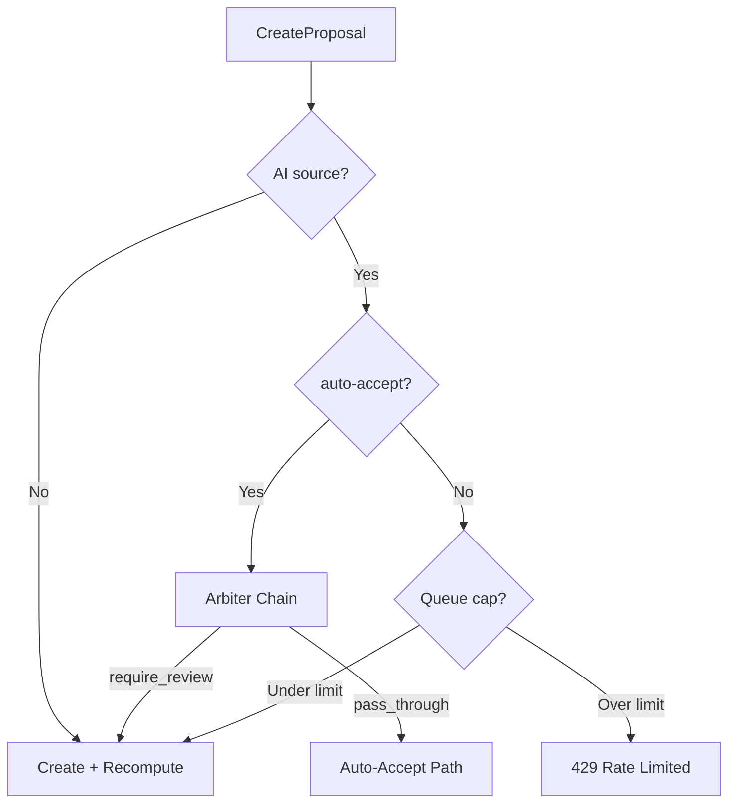

# Collab Arbitration & Guardrails (Phase 4)

**Multi-agent arbitration chain, proposal admission guardrails, and per-document acceptance serialization.**

## Status: ✅ Complete (Backend)

---

## Features

### Arbiter Strategy Chain
**Status**: ✅ Complete
- Evaluates AI proposals at creation time; can override auto-accept to require writer review
- Chain of `ArbiterStrategy` implementations; first non-pass-through verdict wins
- Built-in strategies: **size threshold** (large Yjs updates), **recent change density** (high proposal volume)
- No-op arbiter for when no strategies are configured
- See `backend/internal/service/collab/agent_arbiter.go`

### Admission Guardrails
**Status**: ✅ Complete
- **Proposal size limit**: 256 KB max Yjs update per proposal
- **Queue cap**: 200 queued AI proposals per document (prevents unbounded accumulation)
- **WS inbound rate limit**: 30 messages/second per connection with 1-second mute on burst
- See `backend/internal/service/collab/proposal_service.go`, `backend/internal/handler/collab.go`

### Per-Document Acceptance Serialization
**Status**: ✅ Complete
- `proposalAcceptGate`: serializes accept mutations per document, bounds pending operations (max 20)
- `proposalDocumentGate`: serializes create operations per document
- Both allow different documents to proceed concurrently
- See `backend/internal/service/collab/proposal_accept_gate.go`, `proposal_document_gate.go`

### Idempotency
**Status**: ✅ Complete
- Accept and group-accept operations are idempotent via `IdempotencyStore`
- Replay detection with request hash validation
- Conflict detection for key reuse with different payloads
- See `backend/internal/service/collab/proposal_service_helpers.go`

---

## Architecture

## Adding New Arbiter Strategies

1. Implement `ArbiterStrategy` interface (defined in `internal/domain/services/collab/collab.go`)
2. Return `PassThrough` to defer, `RequireReview` to override auto-accept, `Allow` to explicitly approve
3. Register in `cmd/server/main.go` strategy chain (order matters: first non-pass-through wins)

---

## Related

- `backend/internal/domain/services/collab/collab.go` - Domain interfaces (`ArbiterStrategy`, `AgentArbiter`)
- `backend/internal/service/collab/arbiter_strategy_size.go` - Size threshold strategy
- `backend/internal/service/collab/arbiter_strategy_density.go` - Recent change density strategy
