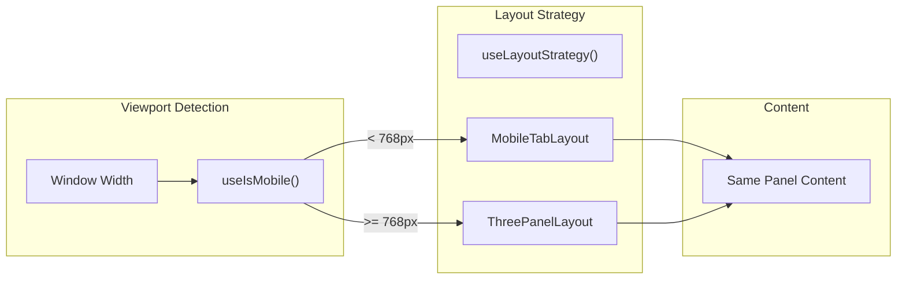
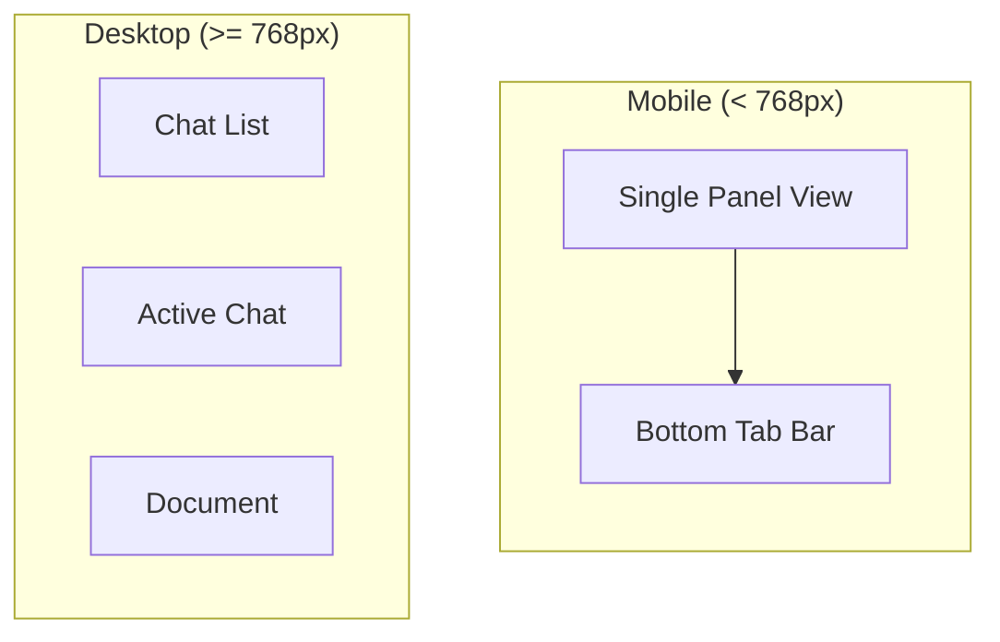

# Mobile Responsive Layout

**Responsive layouts for mobile and desktop viewports using a strategy pattern.**

## Status: ✅ Complete (Frontend Only)

---

## Architecture

---

## Design Decisions

| Decision | Why |
|----------|-----|
| **768px breakpoint** | Phones-only get mobile layout; tablets (≥768px) get desktop three-panel for better use of screen space |
| **Strategy pattern** | Content components are layout-agnostic; easy to add new layouts (drawer, split-screen) without changing content |
| **Bottom tab navigation** | Thumb-friendly; follows native mobile patterns (iOS tab bar, Android bottom nav) |
| **Persisted tab state** | `mobileActivePanel` in localStorage so users return to their last-used tab |

---

## Specs

| Spec | Value |
|------|-------|
| Breakpoint | 768px (TailwindCSS `md:`) |
| Touch targets | 56px minimum height |
| Safe areas | `pb-[env(safe-area-inset-bottom)]` for notched devices |
| Mobile tabs | 3 (Chat List, Active Chat, Document) |
| Default tab | `activeChat` |

---

## Implementation

| File | Purpose |
|------|---------|
| `frontend/src/core/hooks/useIsMobile.ts` | Viewport detection hook |
| `frontend/src/core/hooks/useLayoutStrategy.ts` | Returns layout component based on viewport |
| `frontend/src/shared/components/layout/types.ts` | `PanelDefinitions`, `LayoutStrategyProps` types |
| `frontend/src/shared/components/layout/MobileBottomNav.tsx` | Bottom tab bar component |
| `frontend/src/shared/components/layout/MobileTabLayout.tsx` | Mobile single-panel layout |
| `frontend/src/shared/components/layout/ThreePanelLayout.tsx` | Desktop three-panel layout |
| `frontend/src/core/stores/useUIStore.ts` | `mobileActivePanel` state (persisted) |
| `frontend/src/features/workspace/components/WorkspaceLayout.tsx` | Integration point |

---

## Mobile vs Desktop

---

## Known Gaps

1. **No landscape-specific optimizations** - Mobile landscape uses same single-panel layout
2. **No swipe gestures** - Tab switching is tap-only (no horizontal swipe between panels)
