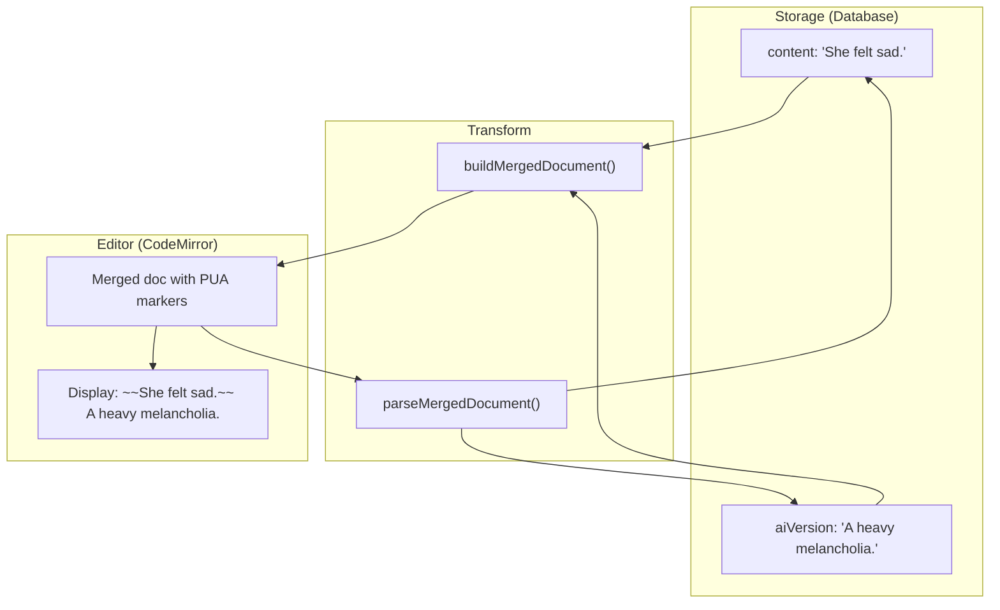
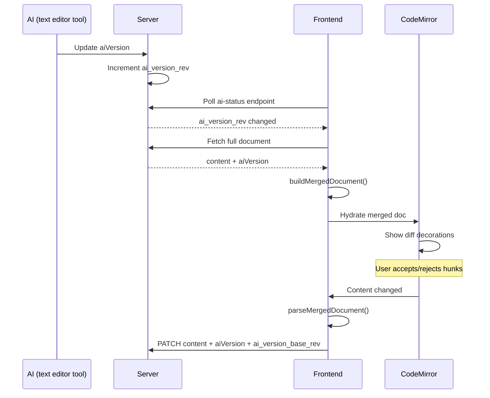

# AI Editing Architecture

**How AI suggestions are stored, displayed, and resolved.**

---

## Core Concept: Merged Document

Storage keeps clean markdown (`content` + `aiVersion`). The editor displays a merged document with invisible markers.



---

## PUA Markers

Unicode Private Use Area characters mark diff regions:

| Marker | Code | Purpose |
|--------|------|---------|
| DEL_START | `\uE000` | Start of deletion (original text) |
| DEL_END | `\uE001` | End of deletion |
| INS_START | `\uE002` | Start of insertion (AI text) |
| INS_END | `\uE003` | End of insertion |

**Example merged document:**
```
\uE000She felt sad.\uE001\uE002A heavy melancholia.\uE003 The rain fell.
└─── deletion ─────────┘└─── insertion ────────────┘
```

**Why PUA markers:**
- No collision with normal text
- No escaping needed (unlike text markers)
- CM6 history tracks them naturally
- Easy to hide via decorations

---

## Data Flow



---

## Editing Rules

| Region | Allowed? | Effect on Save |
|--------|----------|----------------|
| Outside hunks | ✅ Yes | Updates both `content` and `aiVersion` |
| INS region | ✅ Yes | Updates `aiVersion` only |
| DEL region | ❌ No | Blocked (original text read-only) |
| Markers | ❌ No | Blocked (structure protected) |

---

## Accept/Reject as Transactions

Operations are CM6 transactions (undoable via Cmd+Z):

**Accept hunk:**
```
Before: "...\uE000old\uE001\uE002new\uE003..."
After:  "...new..."
```

**Reject hunk:**
```
Before: "...\uE000old\uE001\uE002new\uE003..."
After:  "...old..."
```

---

## Why Not CodeMirror Merge View

The standard `@codemirror/merge` treats original text as a baseline, not a co-edited sibling.

Meridian's requirement: **edits outside hunks must update both versions**.

With PUA markers, shared text exists once in the merged doc, so `parseMergedDocument()` naturally includes it in both projections.

---

## Related

- [backend-api.md](backend-api.md) - CAS token and tri-state semantics
- [frontend-diff-view.md](frontend-diff-view.md) - CodeMirror extension details
- `frontend/src/core/lib/mergedDocument.ts` - Implementation
