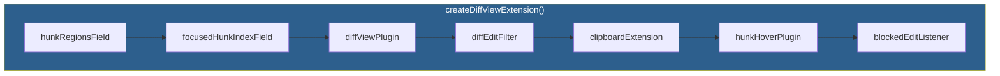

# Frontend Diff View

**CodeMirror 6 extension for inline diff display and interaction.**

---

## Extension Architecture



**Order matters**: Each extension depends on the ones above it.

---

## Core Components

### diffViewPlugin (ViewPlugin)
**File**: `frontend/src/core/editor/codemirror/diffView/plugin.ts`

Renders decorations for the merged document:
- **Marker hiding**: Replace markers with zero-width widgets
- **DEL styling**: Red strikethrough
- **INS styling**: Green underline
- **Action buttons**: Widget at end of each hunk
- **Focus highlight**: Background color on current hunk

Uses viewport culling (2000-char buffer) for performance.

### diffEditFilter (Transaction Filter)
**File**: `frontend/src/core/editor/codemirror/diffView/editFilter.ts`

Blocks dangerous edits:
1. Edits touching marker characters
2. Edits inside DEL regions
3. Inserts at INS_START position

Returns `blockedEditEffect` for toast feedback.

### clipboardExtension
**File**: `frontend/src/core/editor/codemirror/diffView/clipboard.ts`

- **Copy/cut**: Converts markers to markdown strikethrough
- **Paste**: Strips all markers (prevents corruption)

### HunkActionWidget
**File**: `frontend/src/core/editor/codemirror/diffView/HunkActionWidget.ts`

DOM widget with ✓/✕ buttons:
- Green checkmark = accept (keep AI text)
- Red X = reject (keep original)
- Dispatches transactions via `acceptHunk()` / `rejectHunk()`

### hunkRegionsField (StateField)
**File**: `frontend/src/core/editor/codemirror/diffView/hunkRegionsField.ts`

Provides hunk boundaries to other extensions. Live preview reads this to skip decorations inside hunk regions.

---

## Transactions

**File**: `frontend/src/core/editor/codemirror/diffView/transactions.ts`

All operations use `filter: false` to bypass edit protection:

```typescript
// Accept: replace hunk with insertion text
acceptHunk(view, hunkId)

// Reject: replace hunk with deletion text
rejectHunk(view, hunkId)

// Bulk operations
acceptAll(view)
rejectAll(view)
```

Annotated with `userEvent` for undo support.

---

## React Hooks

### useDiffView
**File**: `frontend/src/features/documents/hooks/useDiffView.ts`

- Extracts hunks from `localDocument`
- Manages diff compartment (enable/disable)
- Syncs focused hunk index from store to CM6
- Provides navigation callbacks

### useDocumentContent
**File**: `frontend/src/features/documents/hooks/useDocumentContent.ts`

- Hydrates merged document from `content` + `aiVersion`
- Tracks `localDocument` (editor source of truth)
- Manages `hasUserEdit` flag
- Stores `aiVersionBaseRevRef` (CAS token)

### useDocumentSync
**File**: `frontend/src/features/documents/hooks/useDocumentSync.ts`

- 1s debounced save
- Validates marker structure before saving
- Handles CAS conflicts
- Flushes on unmount

---

## Files Summary

```
frontend/src/core/editor/codemirror/diffView/
├── index.ts              ← Extension entry point
├── plugin.ts             ← Decorations (ViewPlugin)
├── editFilter.ts         ← Block dangerous edits
├── blockedEditEffect.ts  ← Effect for feedback
├── blockedEditListener.ts← Listener for toast
├── clipboard.ts          ← Marker sanitization
├── transactions.ts       ← Accept/reject helpers
├── focus.ts              ← Focus highlighting state
├── HunkActionWidget.ts   ← Inline buttons
├── hunkRegionsField.ts   ← Hunk boundaries state
└── hoverManager.ts       ← Per-hunk hover visibility
```

---

## Related

- [architecture.md](architecture.md) - Merged document pattern
- `/_docs/technical/frontend/inline-editing/` - Deep-dive architecture
- `frontend/src/core/lib/mergedDocument.ts` - Hunk extraction utilities
