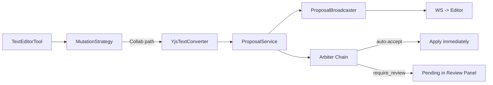

# AI Collaboration Bridge (Phase 4.5)

**Routes AI text edits through the Yjs collab proposal system instead of the legacy PUA-marker path.**

## Status: ✅ Complete (Both Backend + Frontend)

---

## What It Does

When the AI edits a document via `str_replace_based_edit_tool`, the edit flows through the collab proposal system:

```
TextEditorTool -> DocumentMutationStrategy
  └─ CollabProposalStrategy
      -> YjsTextConverter -> ProposalService.CreateProposal
      -> ProposalBroadcaster -> WS -> editor
```

Auto-accept is ON by default — AI proposals apply immediately unless the arbiter downgrades to `require_review`.
Writers can now override this per project in **Project Settings -> Collaboration -> Auto-accept AI proposals**.

---

## Architecture



### Key Design: Strategy Pattern (DIP + OCP)

`DocumentMutationStrategy` interface lets the tool builder inject the right save path at construction time. No branching logic in the tool itself.

See `backend/internal/service/llm/tools/mutation_strategy.go`

---

## Features

### Backend

| Feature | Status | Key Files |
|---------|--------|-----------|
| Yjs Text Diff Converter | ✅ | `service/collab/yjs_text_converter.go` |
| Thread Context Propagation | ✅ | `service/llm/tools/thread_context.go` |
| DocumentMutationStrategy | ✅ | `service/llm/tools/mutation_strategy.go` |
| CollabProposalStrategy | ✅ | `service/llm/tools/mutation_strategy_collab.go` |
| ProposalBroadcaster | ✅ | `handler/collab_proposal_broadcaster.go` |
| Auto-accept default ON | ✅ | `config/config.go` |

### Frontend

| Feature | Status | Key Files |
|---------|--------|-----------|
| Collab extension gating (`.md`, `.markdown`, `.txt`) | ✅ | `features/documents/lib/collabFeatureFlag.ts` |
| Connection status indicator | ✅ | `CollabConnectionIndicator.tsx` |
| Proposal status badges in thread | ✅ | `useProposalStatus.ts`, `TextEditorBlock` |
| Thread -> Editor navigation | ✅ | `TextEditorBlock` "View in Editor" button |

---

## Configuration

| Env Var | Default | Description |
|---------|---------|-------------|
| `MERIDIAN_COLLAB_DEFAULT_AUTO_ACCEPT` | `true` | Auto-accept AI proposals (arbiter can override) |

Project-level override:
- Stored in `projects.auto_accept_proposals` (nullable)
- Configured in frontend `Project Settings` panel
- `NULL` defers to the environment default (`MERIDIAN_COLLAB_DEFAULT_AUTO_ACCEPT`)

---

## Removed

The legacy ai-version path has been removed:

- `DocumentService.UpdateAIVersion`
- `documents.ai_version` / `documents.ai_version_rev`
- PUA-marker merge/diff save path

---

## Related

- [b-collab-arbitration/](../b-collab-arbitration/) — Arbiter chain, proposal guardrails (Phase 4)
- [fb-ai-editing/](../fb-ai-editing/) — Legacy PUA-based inline suggestions
- [Phase 4.5 plan](`../../plans/collab-ai/phase/phase-4.5-ai-collab-bridge.md`) — Implementation plan with all 10 slices
