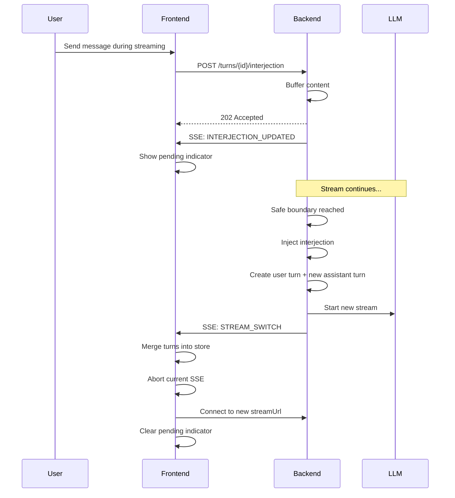

# Interjection

**Send messages while the LLM is actively streaming a response.**

## Status: ✅ Complete (Backend + Frontend)

---

## What is Interjection?

Interjections allow users to send messages while an assistant turn is still streaming. The message is buffered and injected at **safe boundaries**:
- After tool execution completes
- At stream completion (no tools)

This triggers a **stream switch** to a new assistant turn, maintaining conversation continuity.

---

## User-Facing Behavior

1. User sees streaming response from assistant
2. User types and sends a message during streaming
3. Message appears as "pending" indicator
4. At safe boundary, message is injected
5. Stream seamlessly switches to new assistant response

---

## API Endpoints

| Method | Endpoint | Purpose | Status Code |
|--------|----------|---------|-------------|
| POST | `/api/turns/{id}/interjection` | Submit interjection (append/replace) | 202 Accepted (queued) / 201 Created (fallback) |
| GET | `/api/turns/{id}/interjection` | Get current buffer state | 200 OK |
| DELETE | `/api/turns/{id}/interjection` | Clear buffered interjection | 204 No Content |

### Request Body (POST)

```json
{
  "content": "string",     // Required: message content
  "mode": "append|replace" // Optional: default "append"
}
```

---

## SSE Events

| Event | Purpose |
|-------|---------|
| `INTERJECTION_UPDATED` | Buffer content changed (for UI display) |
| `STREAM_SWITCH` | Interjection injected, new stream started |

### INTERJECTION_UPDATED

```typescript
{
  type: 'INTERJECTION_UPDATED'
  turnId: string      // Assistant turn this targets
  content: string     // Current buffer content
  length: number      // Buffer length in bytes
}
```

### STREAM_SWITCH

```typescript
{
  type: 'STREAM_SWITCH'
  prevAssistantTurnId: string     // Turn that was streaming
  reason: 'tool_boundary' | 'no_tools_completion'
  userTurn: TurnDto               // Persisted user turn
  assistantTurn: TurnDto          // New streaming assistant turn
  streamUrl: string               // URL for new SSE stream
}
```

---

## Flow Diagram



---

## Stream Switch Reasons

| Reason | When |
|--------|------|
| `tool_boundary` | After tool execution completes |
| `no_tools_completion` | Stream ends without tool calls |

---

## Files

### Backend

| File | Purpose |
|------|---------|
| `backend/internal/handler/thread.go:470-597` | HTTP handlers (Upsert, Get, Clear) |
| `backend/internal/service/llm/streaming/service.go` | Service logic, injection timing |
| `backend/internal/service/llm/streaming/agui/events.go:97-156` | SSE event types |
| `meridian-stream-go/interjection.go` | Buffer implementation (library) |

### Frontend

| File | Purpose |
|------|---------|
| `frontend/src/core/lib/api.ts:663-730` | API client methods |
| `frontend/src/core/stores/useThreadStore.ts:642-733` | Store actions |
| `frontend/src/features/threads/hooks/sse/eventHandlers/interjectionEventHandlers.ts` | SSE event handlers |
| `frontend/src/features/threads/hooks/sseEventTypes.ts:120-198` | TypeScript types |

---

## Related

- See [../fb-streaming/](../fb-streaming/) for SSE implementation
- See [../fb-thread-llm/](../fb-thread-llm/) for thread/turn architecture
