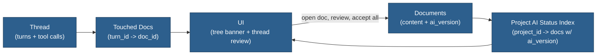

# AI Editing Workspace (V1-Friendly Redesign)

## Overview

This document is a future-facing idea, but it is redesigned to be implementable incrementally.

Start with two concrete primitives:
- **Project AI status index**: which docs currently have `ai_version` set (tree banner + project accept-all).
- **Per-turn touched docs**: which docs were mutated by tools in a turn (thread review entrypoint).

These primitives move Meridian toward a “workspace” model without requiring a large orchestrator rewrite.

## Idea

V1: treat each document as having at most one active AI draft (`ai_version`).

Tool rule (already aligned with implementation):
- AI tools edit `ai_version` when present; otherwise they edit against `content` and initialize `ai_version`.

Missing V1 pieces:
- Track **touched docs per turn** for “go review this”.
- Track **project docs with AI suggestions** for a writer-first banner + “Accept all”.

## Benefits

- **Writer-first visibility**: AI changes aren’t “invisible”; the tree and thread can show what needs review.
- **Consistency**: tools operate on the server’s `ai_version`, not stale copies in chat messages.
- **Extensible**: touched-docs + status index can evolve into a full changeset/workspace later.

## Future Workspace Layer (Later)

After V1 primitives exist, a workspace layer can add:
- “Open docs set” per thread/project (explicit).
- Workspace summary injected into system prompt (paths + last-touched times).
- Conflict awareness when multiple threads touch the same docs.

---

## When to Revisit

- After doc history + touched-docs + tree banner exist and we see:
  - repeated tool failures due to stale edit bases
  - confusion from multiple threads editing the same docs
  - high token costs from repeated document views

## Related

- `_docs/plans/fb-document-history-v1.md`
- `_docs/plans/fb-tree-ai-suggestions-banner-accept-all.md`
- `_docs/plans/fb-event-driven-refresh-framework.md`
