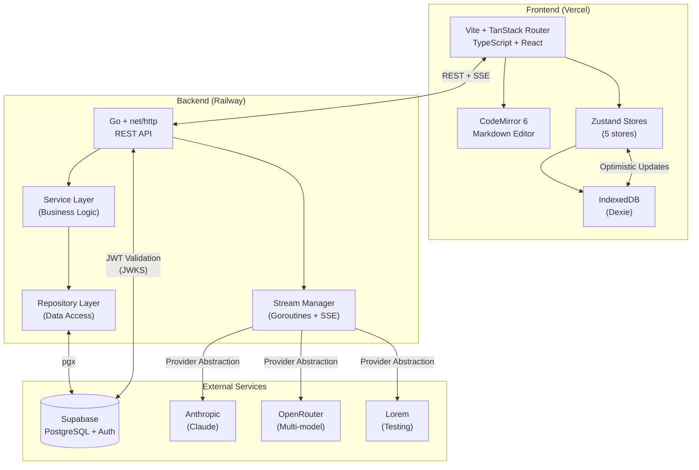
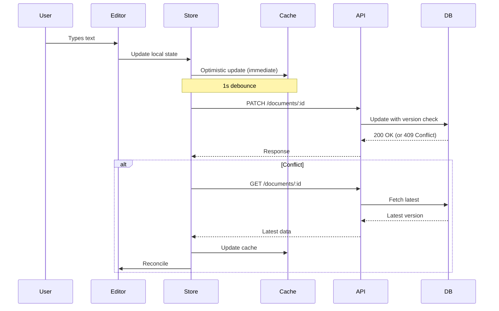
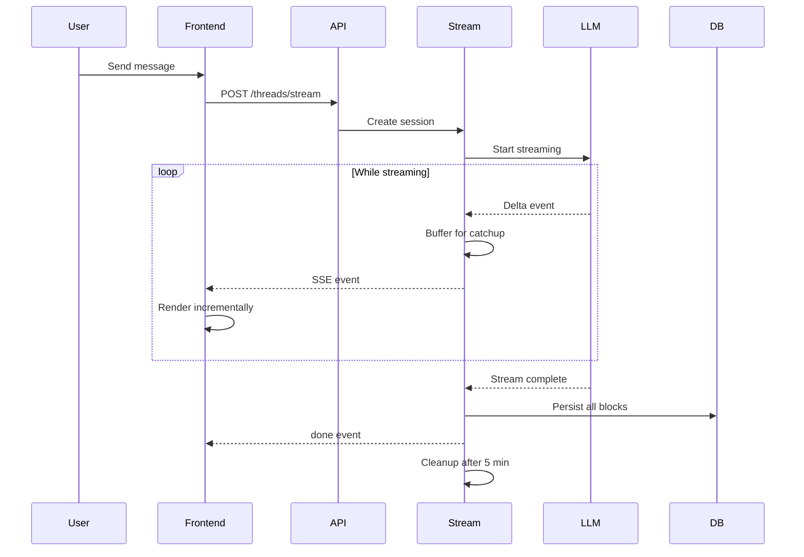
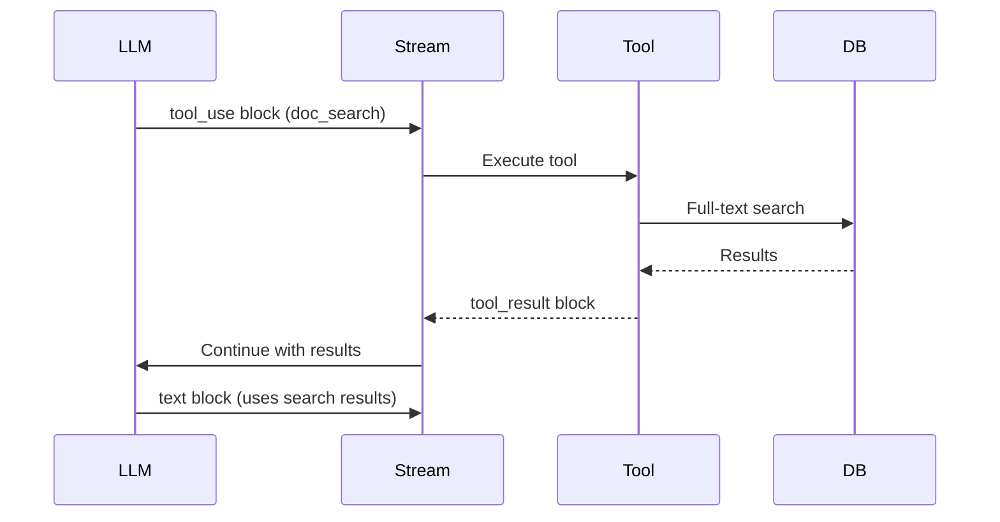

# Meridian: Technical Overview

**High-level technical architecture for engineers.**

For detailed implementation docs, see [`_docs/technical/`](../technical/).

---

## System Architecture



---

## Stack Overview

### Frontend

**Core:**
- **Vite** - Build tool (fast HMR, optimized production builds)
- **TanStack Router** - File-based routing with type-safe navigation
- **React 18** - UI framework with concurrent features
- **TypeScript** - Type safety and better DX

**Editor:**
- **CodeMirror 6** - Markdown-native editor with extensions
- **PUA markers** - Inline diff view for AI suggestions (U+E000-U+F8FF range)
- **Custom extensions** - Accept/reject decorations, edit protection

**State Management:**
- **Zustand** - Lightweight state management (5 stores)
- **IndexedDB (Dexie)** - Client-side caching and offline support
- **Optimistic updates** - Immediate UI response, background sync

**UI:**
- **shadcn/ui** - Component library (Radix UI + Tailwind)
- **Tailwind CSS** - Utility-first styling
- **Lucide** - Icon library

**Deployment:** Vercel (CDN, edge functions, automatic deployments)

### Backend

**Core:**
- **Go 1.21+** - Systems language (goroutines for persistent streaming)
- **net/http** - Standard library HTTP server (no framework)
- **pgx** - PostgreSQL driver (prepared statements, connection pooling)

**Architecture:**
- **Clean Architecture** - Domain -> Service -> Repository -> Handler layers
- **SOLID principles** - Interfaces, dependency injection, single responsibility
- **Provider abstraction** - Multi-LLM support via common interface

**Key Features:**
- **Goroutines** - Concurrent streaming, background tasks
- **SSE (Server-Sent Events)** - Real-time LLM response streaming
- **Stream registry** - In-memory session management with automatic cleanup
- **Two-tier catchup** - In-memory buffer + database fallback

**Deployment:** Railway (containerized Go binary, auto-scaling)

### Database

**Supabase (PostgreSQL 15+):**
- **Auth** - JWT validation via JWKS endpoint (RS256/ES256)
- **RLS (Row-Level Security)** - Database-enforced authorization
- **JSONB** - Flexible storage for turn blocks, preferences
- **Full-text search** - `to_tsvector` for document search
- **Soft delete** - `deleted_at` timestamp for recovery

**Schema highlights:**
- **projects** -> **folders** -> **documents** (tree structure)
- **threads** -> **turns** -> **turn_blocks** (conversation tree)
- **skills** - Custom AI commands with instructions
- **user_preferences** - JSONB storage (5 categories)

### LLM Integration

**Multi-provider design:**
- **Anthropic** - Claude models (primary)
- **OpenRouter** - Multiple models (GPT, Claude, Gemini access)
- **Lorem** - Testing provider (no API calls)

**Provider abstraction:**
```go
type LLMProvider interface {
    StreamTurn(ctx, request, streamCallback) error
    Name() string
    ValidateConfig(config) error
}
```

**Tool calling:**
- **Auto-mapping** - Minimal definitions -> provider-specific formats
- **3 tools** - str_replace_based_edit_tool, doc_search, web_search
- **Registry pattern** - Extensible tool system

---

## Key Technical Decisions

### Why Go for Backend?

**Persistent streaming is the core differentiator.**

Users can close the browser, AI continues working server-side, reconnect and resume.

**Go makes this trivial:**
```go
// Launch background goroutine for AI generation
go func() {
    stream := llm.StreamTurn(ctx, request)
    for delta := range stream {
        buffer.Append(delta)      // In-memory catchup
        broadcast(delta)           // Send to all SSE clients
    }
    db.Persist(buffer)            // Save to database
}()
```

**Python alternatives would require:**
- Celery + Redis + workers
- Complex distributed task management
- More moving parts, higher cost

**Go's lightweight goroutines make persistent streaming simple and cheap.**

### Why Markdown Storage?

**Single source of truth** - No format conversion needed.

**Benefits:**
- **Editor compatibility** - CodeMirror works natively with markdown
- **AI friendly** - Clean, structured format for LLMs
- **Search friendly** - Easy full-text search
- **Export friendly** - Universal format
- **No synchronization** - Editor ↔ DB is direct

**Alternative considered:** ProseMirror JSON
- More complex storage
- Requires bidirectional conversion
- Harder to search and process
- No compelling advantage for our use case

### Why Server-Sent Events (SSE)?

**Real-time streaming without WebSocket complexity.**

**SSE advantages:**
- **HTTP/1.1 compatible** - Works everywhere
- **Automatic reconnection** - Built into EventSource API
- **Simple server-side** - Just write to response stream
- **Unidirectional** - Perfect for LLM streaming (server -> client)
- **Works with proxies** - Better than WebSockets through load balancers

**Catchup mechanism:**
```
Client connects with Last-Event-ID header
        ↓
Server checks: buffer exists in memory?
        ↓
Yes: Send buffered events (fast catchup)
        ↓
No: Query database for completed blocks (historical catchup)
```

### Why IndexedDB Caching?

**Offline-capable, optimistic updates, instant UI.**

**Strategy:**
- **Reconcile-Newest** - On conflict, newest version wins
- **Optimistic updates** - Update cache immediately, sync in background
- **Retry queue** - In-memory queue for failed requests
- **Automatic cleanup** - Stale data eviction

**Alternative considered:** localStorage
- Too limited (5-10MB)
- Synchronous API (blocks UI)
- No structured queries

### Why CAS Concurrency Control?

**Safe concurrent editing between AI and human.**

**Problem:** AI and user can edit same document simultaneously.

**Solution:** Compare-And-Swap (CAS) with version tokens.

```
Document has: ai_version (content hash), ai_version_rev (counter)

AI reads document -> gets rev=5
User edits document -> rev=6
AI tries to edit -> sends rev=5 -> 409 Conflict

AI must re-read (see user's changes) -> decide what to do
```

**This prevents:**
- Lost updates (AI overwrites user changes)
- Silent conflicts (both edits appear to work)
- Confusion (who changed what?)

**Enterprise-grade concurrency control adapted for creative writing.**

### Why Multi-Provider Abstraction?

**Avoid vendor lock-in, enable cost optimization.**

**Benefits:**
- **Flexibility** - Switch providers per project/conversation
- **Resilience** - Fallback if primary provider down
- **Cost optimization** - Use cheaper models for simple tasks
- **Feature access** - Different providers have different capabilities

**Implementation:**
- **Common interface** - LLMProvider with StreamTurn method
- **Provider registry** - Dynamic registration
- **Auto-mapping** - Tools mapped to provider-specific formats
- **Easy to extend** - Add new provider = implement interface

---

## Data Flow Examples

### Document Edit Flow



### AI Streaming Flow



### Tool Calling Flow



---

## Security

### Authentication

**JWT validation** - Stateless auth with Supabase JWKS.

```
1. User logs in via Google OAuth (Supabase)
2. Supabase returns JWT (signed with RS256/ES256)
3. Frontend stores in httpOnly cookie
4. Every request includes JWT in Authorization header
5. Backend validates JWT signature via JWKS endpoint
6. User ID extracted from JWT -> injected into context
```

**No session storage** - Stateless, scales horizontally.

### Authorization

**Resource-based ownership** - Projects own all descendant resources.

```
Check: user owns project?
       ↓
Yes: Grant access to project -> folders -> documents -> threads -> turns
No: 403 Forbidden
```

**RLS (Row-Level Security)** - Database-enforced policies as backup.

### XSS Protection

**Document import** - HTML sanitization with allowlist.

```
Imported HTML -> DOMPurify -> Safe HTML -> Turndown -> Markdown
```

**Allowed:** Headings, paragraphs, lists, emphasis, links
**Stripped:** Scripts, iframes, event handlers, forms

---

## Performance

### Frontend Optimizations

- **Route-based code splitting** - Lazy load pages
- **IndexedDB caching** - Instant document loads
- **Optimistic updates** - Immediate UI feedback
- **Buffered rendering** - Batch SSE events (50ms)
- **Virtual scrolling** - Efficient long document rendering

### Backend Optimizations

- **Connection pooling** - pgx pool (max 25 connections)
- **Prepared statements** - Query compilation caching
- **Goroutine pooling** - Limit concurrent streams
- **In-memory catchup buffer** - Fast reconnection
- **JSONB indexing** - Efficient querying on flexible schema

### Database Optimizations

- **Full-text search indexes** - `to_tsvector` GIN indexes
- **Compound indexes** - Common query patterns
- **Soft delete** - Avoid cascade operations
- **JSONB path queries** - Efficient nested data access

---

## Deployment

### Frontend (Vercel)

- **CDN distribution** - Global edge caching
- **Automatic deployments** - Git push -> deploy
- **Preview deployments** - Per-branch testing
- **Environment variables** - Secure config management

### Backend (Railway)

- **Containerized** - Docker build from Dockerfile
- **Auto-scaling** - Horizontal scaling based on load
- **Health checks** - Automatic restart on failure
- **Log aggregation** - Centralized logging

### Database (Supabase)

- **Managed PostgreSQL** - Automatic backups, updates
- **Connection pooling** - PgBouncer (transaction mode)
- **Realtime** - WebSocket subscriptions (not used yet)
- **Storage** - File uploads (not used yet)

---

## Monitoring & Observability

**Current implementation:**

- **Structured logging** - JSON logs with context
- **Error tracking** - HTTP errors logged with stack traces
- **Request IDs** - Trace requests across services
- **Health endpoints** - `/health` for uptime monitoring

**Future additions:**

- **Metrics** - Prometheus/Grafana
- **Tracing** - OpenTelemetry
- **Alerting** - PagerDuty/Sentry
- **Usage metering** - Token tracking for billing

---

## Testing Strategy

### Backend Testing

**Current:**
- **Unit tests** - Service layer logic
- **Repository tests** - Database interactions
- **Tool tests** - Tool execution logic

**Future:**
- **Integration tests** - End-to-end API tests
- **Contract tests** - Provider interface compliance

### Frontend Testing

**Current:**
- **Type checking** - TypeScript strict mode
- **Linting** - ESLint + Prettier
- **Manual testing** - Visual regression

**Future:**
- **Unit tests** - Component testing (Vitest)
- **E2E tests** - Playwright for critical flows
- **Visual regression** - Chromatic/Percy

---

## Scalability Considerations

### Current Scale

- **Single region** - US-based deployment
- **Vertical scaling** - Increase instance resources
- **Connection pooling** - Handle moderate concurrency

### Future Scale

**Horizontal scaling:**
- **Stateless API** - Multiple backend instances
- **Load balancing** - Distribute requests
- **Database replicas** - Read replicas for queries

**Geographic distribution:**
- **Multi-region deployments** - Reduce latency
- **CDN** - Static assets already distributed
- **Database** - Consider regional read replicas

**Cost optimization:**
- **Model selection** - Cheaper models for simple tasks
- **Caching** - Redis for hot data
- **Batch operations** - Reduce database round-trips

---

## Technical Debt & Future Work

**High priority:**
- **PAYG billing** - Usage metering + Stripe integration
- **Usage limits** - Prevent runaway costs
- **Audit trace** - Provenance tracking for agent actions
- **Sessions** - `.session/` directory for shared artifacts

**Medium priority:**
- **OpenAI provider** - Direct OpenAI integration
- **Google Gemini provider** - Add Gemini support
- **Vector search** - Semantic document search (embeddings)
- **Compaction** - Summarize long conversations

**Low priority:**
- **Multi-tenancy** - Team workspaces
- **RBAC** - Role-based access control
- **Webhooks** - External integrations
- **API rate limiting** - Per-user quotas

---

## Links to Detailed Docs

### Architecture Deep Dives

- **Backend architecture:** [`backend/architecture/overview.md`](../technical/backend/architecture/overview.md)
- **Frontend architecture:** [`frontend/README.md`](../technical/frontend/README.md)
- **Streaming architecture:** [`backend/architecture/streaming-architecture.md`](../technical/backend/architecture/streaming-architecture.md)
- **LLM integration:** [`llm/architecture.md`](../technical/llm/architecture.md)

### Feature Documentation

- **Authentication:** [`_docs/features/fb-authentication/`](../features/fb-authentication/)
- **Document Editor:** [`_docs/features/f-document-editor/`](../features/f-document-editor/)
- **Thread/LLM:** [`_docs/features/fb-thread-llm/`](../features/fb-thread-llm/)
- **AI Editing:** [`_docs/features/fb-ai-editing/`](../features/fb-ai-editing/)
- **All features:** [`_docs/features/README.md`](../features/README.md)

### Implementation Guides

- **Backend CLAUDE.md:** [`backend/CLAUDE.md`](../../backend/CLAUDE.md)
- **Frontend CLAUDE.md:** [`frontend/CLAUDE.md`](../../frontend/CLAUDE.md)
- **Database schema:** [`backend/schema.sql`](../../backend/schema.sql)

---

## Quick Reference

| Component | Language/Framework | Purpose |
|-----------|-------------------|---------|
| **Frontend** | TypeScript + React + Vite | User interface, editor, caching |
| **Backend** | Go + net/http | API, streaming, business logic |
| **Database** | PostgreSQL (Supabase) | Data persistence, auth |
| **Editor** | CodeMirror 6 | Markdown editing with extensions |
| **State** | Zustand + IndexedDB | Client state + caching |
| **Styling** | Tailwind CSS + shadcn/ui | UI components |
| **LLM** | Anthropic/OpenRouter/Lorem | AI providers |
| **Deploy** | Vercel + Railway | Frontend + Backend hosting |

---

**Last Updated:** 2026-02-05
