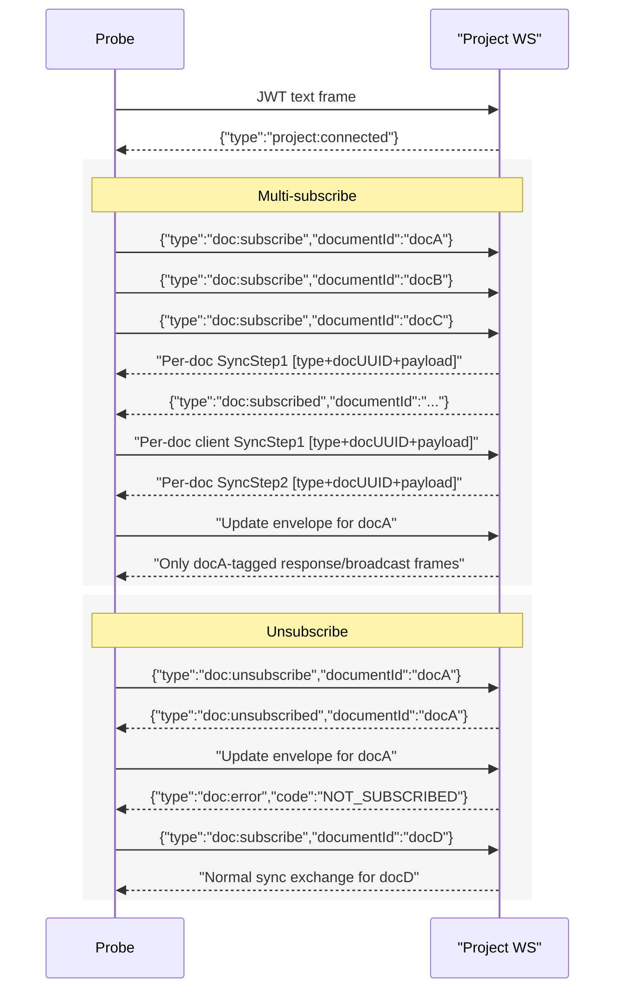

# Collab Multi-Doc Smoke Probe

**Status:** draft

## Problem Statement

Add a project-websocket smoke probe that exercises multi-document subscription routing and unsubscribe behavior on a single WS connection. The probe must cover:

1. subscribe/sync for three documents on one socket
2. unsubscribe followed by traffic for the removed document
3. rapid unsubscribe/resubscribe on the same document
4. unsubscribe for a document that was never subscribed

## Codebase Context

- Existing single-document Yjs handshake probe: [tests/smoke/collab/sync/probe.go](/home/jimyao/gitrepos/meridian-collab/tests/smoke/collab/sync/probe.go)
- Existing standalone probe structure with multiple `--test` cases: [tests/smoke/collab/persistence/probe.go](/home/jimyao/gitrepos/meridian-collab/tests/smoke/collab/persistence/probe.go)
- Existing smoke wrapper pattern: [tests/smoke/collab/handshake/smoke.sh](/home/jimyao/gitrepos/meridian-collab/tests/smoke/collab/handshake/smoke.sh)
- Shared project/document fixture helpers: [tests/smoke/helpers.sh](/home/jimyao/gitrepos/meridian-collab/tests/smoke/helpers.sh)
- Project WS subscribe/unsubscribe transport contract: [backend/internal/handler/collab_project.go](/home/jimyao/gitrepos/meridian-collab/backend/internal/handler/collab_project.go)
- JSON message types and unsubscribed event: [backend/internal/handler/collab_project_subscription.go](/home/jimyao/gitrepos/meridian-collab/backend/internal/handler/collab_project_subscription.go)
- Subscription lifecycle semantics, including idempotent resubscribe after teardown: [backend/internal/service/collab/subscription_service.go](/home/jimyao/gitrepos/meridian-collab/backend/internal/service/collab/subscription_service.go)
- Backend tests confirming `doc:unsubscribe` is safe when not subscribed and post-unsubscribe binary traffic returns `NOT_SUBSCRIBED`: [backend/internal/handler/collab_project_test.go](/home/jimyao/gitrepos/meridian-collab/backend/internal/handler/collab_project_test.go)

## Best Practices

- Reuse the existing probe conventions instead of inventing a second WS client stack. That keeps the smoke probes debuggable and consistent with the current project-WS protocol implementation.
- Track Yjs state per document, not per connection, because the server multiplexes transport but the CRDT state is document-scoped.
- Assert routing using the envelope UUID, not just message order. The handler demultiplexes by framed document UUID before touching the subscription state, so envelope checks are the most direct protocol assertion.

## Alternative Approaches

| Approach | Description | Pros | Cons |
| --- | --- | --- | --- |
| Extend `tests/smoke/collab/sync/probe.go` | Add multi-doc flags and cases into the current sync probe | Reuses existing helper functions directly | Mixes single-doc sync and multi-doc lifecycle concerns into one binary and makes failures harder to localize |
| New dedicated multi-doc probe and wrapper | Add `tests/smoke/collab/multi-doc/probe.go` plus `smoke.sh` | Matches the requested layout, keeps responsibilities narrow, and allows per-case output | Duplicates some handshake helpers from sibling probes |
| Add only backend unit tests | Cover the cases in `collab_project_test.go` instead of a smoke probe | Faster and more deterministic | Misses the end-to-end smoke coverage the task asks for |

## Recommendation

Use a new dedicated multi-doc probe and wrapper.

Why this fits this codebase:

- The repository already uses one probe directory per behavioral area, so `multi-doc` fits the existing organization.
- The requested assertions are protocol-heavy and easier to express in a purpose-built probe than by stretching the single-doc sync CLI.
- The server’s current unsubscribe behavior is observable and stable enough to assert directly: after unsubscribe, a binary frame for that doc produces `doc:error` with `NOT_SUBSCRIBED`, while the socket stays open.

## Planned Changes

1. Add [tests/smoke/collab/multi-doc/probe.go](/home/jimyao/gitrepos/meridian-collab/tests/smoke/collab/multi-doc/probe.go)
   - Follow the existing `package main` + `go run` smoke probe pattern
   - Accept one `--project-url`, one `--token`, and multiple document IDs (`--doc-a`, `--doc-b`, `--doc-c`, plus optional `--doc-d` for follow-up subscribe checks)
   - Implement shared helpers for auth, JSON send/receive, envelope framing, sync payload handling, and per-document Yjs docs
   - Implement `--test=multi-subscribe`, `unsubscribe`, `rapid-sub-unsub`, and `unsubscribe-nonexistent`
   - Print `[probe] PASS` / `[probe] FAIL` lines per case
2. Add [tests/smoke/collab/multi-doc/smoke.sh](/home/jimyao/gitrepos/meridian-collab/tests/smoke/collab/multi-doc/smoke.sh)
   - Source [tests/smoke/helpers.sh](/home/jimyao/gitrepos/meridian-collab/tests/smoke/helpers.sh)
   - Health-check the backend
   - Create one temporary project and at least four documents so one connection can test subscribe, unsubscribe, and follow-up liveness without reusing every document
   - Run the four probe cases against the same project fixtures
3. Verify
   - `go vet tests/smoke/collab/multi-doc/probe.go`
   - `go run tests/smoke/collab/multi-doc/probe.go --help` from `backend/`

## Key Decisions

- For the unsubscribe case, assert `doc:unsubscribed` immediately after the command, then assert a later binary frame for that document receives `doc:error` with code `NOT_SUBSCRIBED`. This matches the current handler behavior in [backend/internal/handler/collab_project.go](/home/jimyao/gitrepos/meridian-collab/backend/internal/handler/collab_project.go) and [backend/internal/handler/collab_project_test.go](/home/jimyao/gitrepos/meridian-collab/backend/internal/handler/collab_project_test.go), even though the original task text described silent drop/ignore.
- For rapid unsubscribe/resubscribe, verify the final subscribe path yields one clean sync exchange for the final subscription attempt and no duplicate terminal `doc:subscribed` or duplicate server `SyncStep1` for that document after the resubscribe boundary.

## Flow

## Open Questions

- None blocking if we align the unsubscribe case to the server’s current `NOT_SUBSCRIBED` response instead of the original silent-drop wording.
