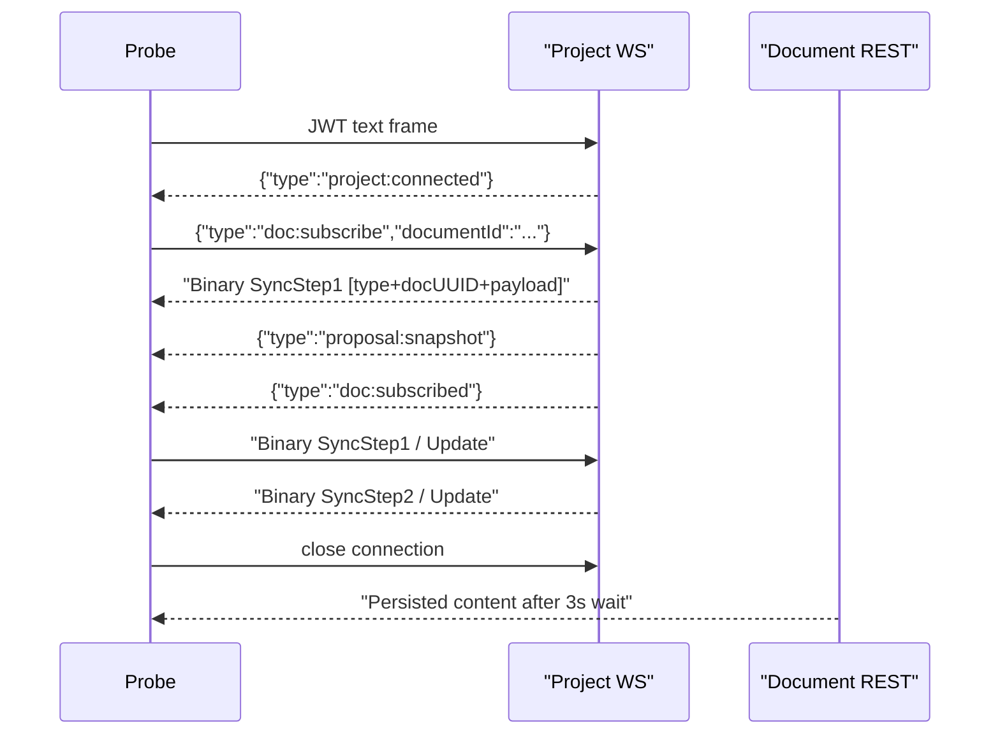

# Collab Persistence Smoke Probe

**Status:** draft

## Goal

Add a project-scoped collab smoke probe that validates Yjs persistence across three cases:

1. debounce persistence after a burst of updates
2. dirty-state flush on disconnect
3. content round-trip across disconnect and reconnect

## Codebase Context

- Existing smoke probe pattern: [tests/smoke/collab/sync/probe.go](/home/jimyao/gitrepos/meridian-collab/tests/smoke/collab/sync/probe.go)
- Existing smoke wrapper pattern: [tests/smoke/collab/sync/smoke.sh](/home/jimyao/gitrepos/meridian-collab/tests/smoke/collab/sync/smoke.sh)
- Shared smoke helpers: [tests/smoke/helpers.sh](/home/jimyao/gitrepos/meridian-collab/tests/smoke/helpers.sh)
- Project-scoped WS protocol: [.meridian/fs/ws-protocol-spec.md](/home/jimyao/gitrepos/meridian-collab/.meridian/fs/ws-protocol-spec.md)
- Envelope framing source of truth: [backend/internal/handler/collab_envelope.go](/home/jimyao/gitrepos/meridian-collab/backend/internal/handler/collab_envelope.go)
- Debounce and disconnect persistence behavior: [backend/internal/service/collab/session_manager.go](/home/jimyao/gitrepos/meridian-collab/backend/internal/service/collab/session_manager.go)

## Alternatives

| Approach | Description | Pros | Cons |
| --- | --- | --- | --- |
| Extend `tests/smoke/collab/sync/probe.go` | Add persistence cases into the existing sync probe with more flags | Reuses existing code directly | Mixes two responsibilities into one probe and makes the CLI harder to reason about |
| New persistence probe + dedicated smoke wrapper | Create `tests/smoke/collab/persistence/probe.go` and `smoke.sh`, reusing the sync probe patterns | Keeps sync and persistence checks separate, matches the requested file layout, and makes failures easier to localize | Small amount of duplicated handshake code unless shared later |
| Pure bash + REST checks | Drive WS with a simpler external client and verify only REST persistence | Minimal Go code | Weakest protocol coverage and does not validate Yjs round-trip state |

## Recommendation

Use a new dedicated persistence probe and smoke wrapper.

Why this fits this codebase:

- The existing sync smoke probe already establishes the correct standalone Go pattern, so a sibling probe can reuse those ideas without overloading the older CLI.
- The persistence cases have different success criteria than the sync probe. Keeping them separate makes failures point directly at debounce or disconnect flush logic instead of generic sync behavior.
- The requested round-trip test needs Yjs-aware verification after reconnect, which is more robust in Go than in shell.

## Planned Changes

1. Add `tests/smoke/collab/persistence/probe.go`
   - Dial `/ws/projects/{projectId}`
   - Send JWT first and wait for `project:connected`
   - Send `doc:subscribe` and drain the mixed subscription sequence until `doc:subscribed`
   - Parse and emit 17-byte `[type][docUUID][payload]` envelopes
   - Complete the Yjs sync handshake with `github.com/skyterra/y-crdt`
   - Implement `--test=debounce`, `--test=disconnect-flush`, and `--test=round-trip`
   - Print probe output that the shell wrapper can use for REST assertions where needed
2. Add `tests/smoke/collab/persistence/smoke.sh`
   - Source `tests/smoke/helpers.sh`
   - Run health check
   - Create one temp project and per-test documents
   - Run the debounce case, sleep 3 seconds, verify REST content is `abcde`
   - Run the disconnect-flush case, sleep 3 seconds, verify REST content is `persist-me`
   - Run the round-trip case and let the probe self-verify the reconnect content
3. Verify
   - `go run tests/smoke/collab/persistence/probe.go --help` from `backend/`
   - `bash tests/smoke/collab/persistence/smoke.sh` if the backend and auth token are available

## Flow

## Open Questions

- None blocking. The current plan assumes REST document reads still surface persisted `content` at `GET /api/documents/{id}`, which matches the existing sync smoke test.
