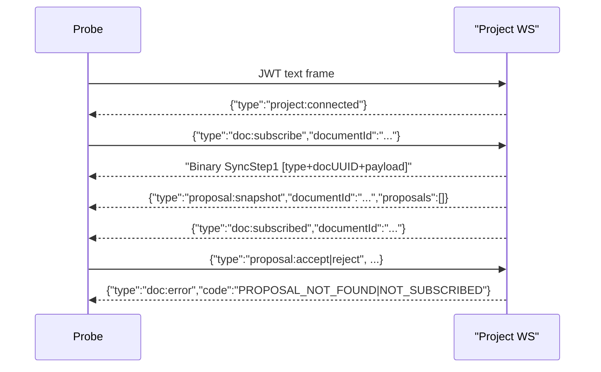

# Collab Proposals Smoke Probe

**Status:** draft

## Problem Statement

Add a project-scoped WebSocket smoke probe that exercises proposal accept/reject error handling without relying on AI proposal creation. The probe must verify the mixed binary/JSON subscribe flow and the expected `doc:error` codes for proposal commands against a temporary document.

## Codebase Context

- `tests/smoke/collab/handshake/probe.go` shows the repository pattern for a standalone Go websocket probe run from `backend` with `go run`.
- `tests/smoke/collab/handshake/smoke.sh` shows the bash wrapper pattern: source `tests/smoke/helpers.sh`, health check, create temporary project/document, run the probe, and print `[smoke] PASS`.
- `.meridian/fs/ws-protocol-spec.md` defines the project websocket flow:
  - JWT text frame
  - `{"type":"project:connected"}`
  - `doc:subscribe`
  - binary SyncStep1 envelope
  - `proposal:snapshot`
  - `doc:subscribed`
- `backend/internal/handler/collab_project.go` enforces `NOT_SUBSCRIBED` before proposal commands are delegated, so the smoke probe should check that error path without assuming proposal service behavior.
- `backend/internal/handler/collab_proposal.go` maps missing proposals to `PROPOSAL_NOT_FOUND`.
- `backend/internal/handler/collab_proposal_test.go` already covers the same semantics in integration tests:
  - empty `proposal:snapshot` after subscribe
  - `PROPOSAL_NOT_FOUND` for missing proposals
  - `NOT_SUBSCRIBED` for proposal commands on an unsubscribed document

## Best Practices

- Reuse the existing smoke-test shape instead of introducing shared probe libraries. These probes are intentionally standalone and easy to run from CI or a shell.
- Parse websocket frames defensively because this endpoint mixes JSON text frames and binary envelopes. The probe should treat any frame beginning with `{` as JSON and validate binary frames by envelope header length and document UUID.
- Match the server’s real sequencing rather than assuming exact adjacency beyond the subscribe contract. The probe should read until it sees the expected event for each case, while tolerating the initial binary sync frame before `proposal:snapshot`.

## Alternative Approaches

### 1. Standalone Go probe plus bash wrapper

Implement `tests/smoke/collab/proposals/probe.go` and `tests/smoke/collab/proposals/smoke.sh`, mirroring the handshake smoke test.

Pros:
- Matches existing smoke-test conventions exactly.
- Keeps protocol parsing in Go, where mixed binary/text websocket handling is straightforward.
- Easy to extend with more proposal cases later.

Cons:
- Duplicates some websocket setup helpers from other probes.

### 2. Extend the existing handshake probe with proposal modes

Add more flags and logic to `tests/smoke/collab/handshake/probe.go`, then call it from a new smoke wrapper.

Pros:
- Reduces duplicated dial/auth code.

Cons:
- Couples unrelated handshake and proposal concerns in one probe.
- Makes the probe harder to reason about and less aligned with the folder-per-scenario smoke layout already used here.

### 3. Bash-only smoke using a generic websocket CLI

Drive the websocket with shell tooling instead of Go.

Pros:
- Less Go code.

Cons:
- Poor fit for mixed binary and JSON frame parsing.
- Adds tool assumptions that do not exist elsewhere in this repo.

## Recommendation

Use approach 1. It is the cleanest fit for the current smoke-test layout and matches both the protocol complexity and the repository’s existing `go run` probe pattern.

## Implementation Plan

1. Create `tests/smoke/collab/proposals/probe.go`.
   - Accept `--project-url`, `--doc-id`, `--origin`, `--token`, `--test`, and `--timeout`.
   - Normalize `http(s)` URLs to `ws(s)`.
   - Dial the project websocket, send the JWT first, and require `project:connected`.
   - Implement mixed-frame readers for JSON events and 17-byte binary envelopes.
   - Add four test modes:
     - `empty-snapshot`
     - `accept-not-found`
     - `reject-not-found`
     - `accept-not-subscribed`
2. Create `tests/smoke/collab/proposals/smoke.sh`.
   - Source `tests/smoke/helpers.sh`.
   - Run the health check.
   - Create a temporary project and document.
   - Build `ws://.../ws/projects/$PROJECT_ID`.
   - Run the probe for each test case and print `[smoke] PASS` per case.
3. Verify locally as far as the sandbox allows.
   - `go run tests/smoke/collab/proposals/probe.go --help`
   - `bash -n tests/smoke/collab/proposals/smoke.sh`
   - If the backend is available with a token, run the smoke script end-to-end.

## Flow

## Open Questions

- None for the requested scope. The task intentionally avoids proposal creation and only validates the transport/error paths already covered by handler tests.
