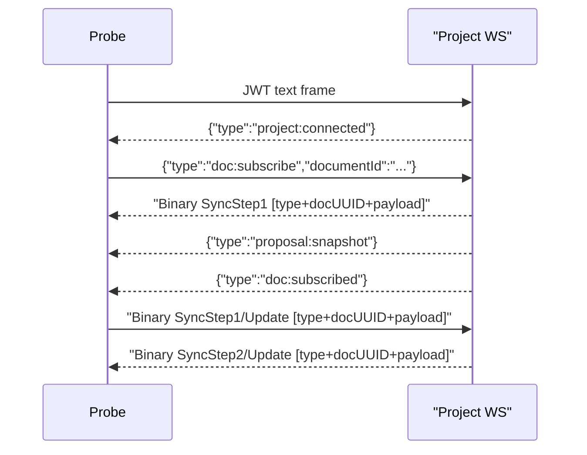

# Collab Sync Probe Project WS Migration

**Status:** approved

## Goal

Migrate the collab sync smoke probe from the removed document-scoped websocket to the project-scoped websocket protocol, including the mixed JSON/binary subscription flow and the new 17-byte document envelope.

## Approach

1. Update `tests/smoke/collab/sync/probe.go` to:
   - dial `/ws/projects/{projectId}`
   - authenticate via first text frame and wait for `project:connected`
   - subscribe with `doc:subscribe`
   - drain mixed JSON/binary frames until `doc:subscribed`
   - perform Yjs sync and update sends using `[type][16-byte doc UUID][payload]`
2. Update `tests/smoke/collab/sync/smoke.sh` to pass the project websocket URL plus document UUID separately.
3. Verify the probe still covers append, reconnect, and REST persistence checks.

## Flow

