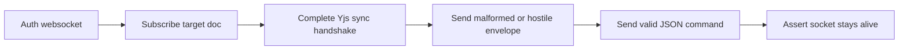

# Envelope Fuzzing Smoke Probe

**Status:** approved

## Goal

Add a collab smoke probe that authenticates, subscribes, completes the Yjs sync handshake, sends malformed or hostile binary envelopes, and verifies the websocket remains usable.

## Flow

## Deliverables

- `tests/smoke/collab/envelope/probe.go`
- `tests/smoke/collab/envelope/smoke.sh`
- Verification: `go vet tests/smoke/collab/envelope/probe.go`
