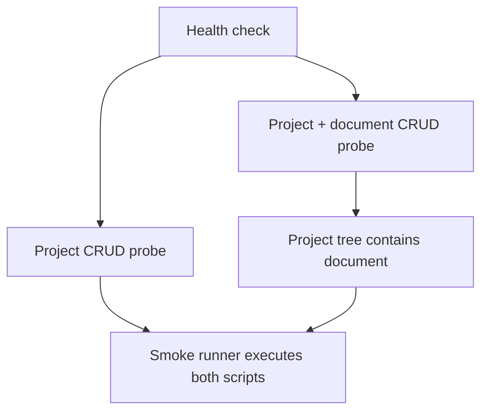

# REST Smoke Probes For Documents And Projects

**Status:** approved

## Goal

Add bash smoke probes for project CRUD and document CRUD against the current REST routes.

## Decisions

- Use `PATCH` for updates because the backend registers `PATCH /api/projects/{id}` and `PATCH /api/documents/{id}`.
- Use `GET /api/projects/{id}/tree` for the project document-list assertion because the backend does not register `GET /api/projects/{id}/documents`.
- Register both probes in `tests/smoke/run.sh`.

## Flow

