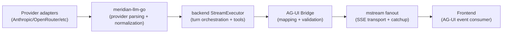

# AG-UI Streaming Bridge (SOLID Refactor)

**Status:** In planning  
**Priority:** High  
**Estimated effort:** 2–5 days (full-stack, breaking changes)

## Problem Statement (WHY)

Meridian currently streams turn updates via a **custom SSE protocol** (`block_start`, `block_delta`, `tool_field_delta`, etc.). We started refactoring `meridian-llm-go` toward AG‑UI, but the result is **partially AG‑UI shaped** and still **mixed with legacy** concepts (e.g., `BlockDelta`).

This causes correctness and design issues:
- **Spec drift:** We are not strictly following the AG‑UI event model end-to-end.
- **Bad ID semantics:** OpenRouter’s `generationId` is incorrectly used as `messageId`, breaking message lifecycle correlation.
- **Hard to extend:** Streaming logic is spread across provider adapters, backend executor, and frontend parsing, making change risky.
- **Thinking streaming must be first-class:** We want thinking to stream reliably (not a side-channel).

Goal: a **SOLID, spec-compliant AG‑UI bridge** from provider adapters → backend streaming → frontend, with **legacy protocol deleted** (Meridian is the only consumer).

## Current State

### What Works ✅
- Providers stream incremental deltas + tool calls; backend fans out to SSE via `mstream`.
- Token finalization for OpenRouter can use `generationId` (via OpenRouter generation endpoint).
- Frontend thread UI can render streaming blocks and progressive tool args.

### What’s Missing / Wrong ❌
- Backend ignores AG‑UI fields in `meridian-llm-go.StreamEvent` and continues emitting custom events.
- `meridian-llm-go` defines its own “AG‑UI” types (subset) instead of using the official SDK.
- OpenRouter incorrectly uses `generationId` as `messageId`.
- AG‑UI lifecycle/step semantics are not modeled (run/step boundaries matter for tool continuations).

## Proposed Architecture (WHAT)

Use the official AG‑UI Go SDK as the canonical event model and implement a bridge with clear responsibilities:



### Design Principles (SOLID)

- **SRP:** Provider adapters parse provider streams only; the bridge owns protocol mapping; the executor owns orchestration (tool loops, cancel, persistence).
- **OCP:** Adding a new provider should not require touching AG‑UI mapping logic.
- **LSP:** Any provider that implements the provider streaming interface should work with the bridge.
- **ISP:** Narrow interfaces: emit events, map events, generate IDs, serialize catchup.
- **DIP:** Backend depends on abstractions (`AGUIEmitter`, `IDFactory`) not concrete SSE implementation details.

## Event Semantics (IDs, Thinking, Metadata)

### IDs

We need two independent identifiers:
- `messageId` (AG‑UI): **assistant message lifecycle** (start/content/end) and **thinking message lifecycle**.
- `generationId` (OpenRouter only): **provider request/run** identifier, used only for token finalization.

Proposed model:
- `runId`: 1 per **Meridian turn execution** (covers tool loops and continuations).
- `stepName`: 1 per **LLM request** inside a run (initial request + each continuation after tool results).
- `messageId`: 1 per **assistant message** for the whole turn.
- `thinkingMessageId`: 1 per **thinking message** for the whole turn (can be absent if provider does not support thinking).

### Provider metadata (OpenRouter `generationId`)

`generationId` must never be used as `messageId`. Instead, emit provider metadata via an AG‑UI `custom` event scoped to `(runId, stepName)`:

```json
{
  "name": "provider_metadata",
  "value": {
    "runId": "run_...",
    "stepName": "llm_request_0",
    "provider": "openrouter",
    "openrouter": { "generationId": "gen_..." }
  }
}
```

This keeps message correlation correct while still enabling token finalization.

### Thinking streaming

Thinking is streamed as AG‑UI thinking events (official SDK types):
- `THINKING_START` / `THINKING_TEXT_MESSAGE_CONTENT` / `THINKING_TEXT_MESSAGE_END`

Frontend can render thinking separately (collapsible), while the assistant text message uses:
- `TEXT_MESSAGE_START` / `TEXT_MESSAGE_CONTENT` / `TEXT_MESSAGE_END`

## Bridge Components (Backend)

Create a small package (name suggestion): `backend/internal/service/llm/streaming/agui/`

- `IDFactory`
  - Inputs: `turnId`, `threadId`, `requestIndex`, `toolIteration`
  - Outputs: `runId`, `stepName`, `messageId`, `thinkingMessageId`
  - Deterministic IDs (debuggable, stable), not time-based.

- `Mapper`
  - Converts provider/library stream signals into AG‑UI SDK events.
  - Owns validation: “exactly one message start per messageId”, “end must exist”, etc.

- `Emitter`
  - Wraps AG‑UI SDK events into `mstream.Event` and writes SSE:
    - SSE `event:` = AG‑UI event type (e.g., `TEXT_MESSAGE_CONTENT`)
    - SSE `data:` = JSON encoded AG‑UI event payload

- `CatchupSerializer`
  - Replays persisted turn state for reconnection using AG‑UI events.
  - MVP: replay as a sequence of “start + full content + end” events per stored block/message, then resume live stream.

## Implementation Plan

### Phase 1: Backend AG‑UI Bridge (1–2 days)
- Add AG‑UI Go SDK dependency and a thin encoder/emitter.
- Implement `IDFactory` + `Mapper` and integrate into `StreamExecutor` emit path.
- Add `custom: provider_metadata` event emission when OpenRouter `generationId` is discovered.
- Add thinking event streaming using `thinkingMessageId`.

### Phase 2: Frontend switch to AG‑UI (0.5–1.5 days)
- Replace `useThreadSSE.ts` parsing of legacy events with AG‑UI event handling.
- Render:
  - assistant message stream
  - thinking message stream
  - tool calls (args streaming + result)
- Confirm tool lifecycle correlation across continuations.

### Phase 3: Delete legacy protocol + legacy library API (0.5–1.5 days)
- Delete backend SSE event types (`block_*`, `tool_input_update`, `tool_field_delta`, etc.) once frontend is migrated.
- Remove/replace `BlockDelta` streaming model in `meridian-llm-go` (stop mixing legacy + “AG‑UI-ish”).
- Fix OpenRouter: ensure `generationId` is stored only as provider metadata, never as `messageId`.
- Ensure provider adapters don’t drop “non-legacy” events (e.g., avoid filtering events based on `Delta/Block/Error`).
- Update any docs referencing legacy streaming.

## Dependencies

- AG‑UI Go SDK (community): `github.com/ag-ui-protocol/ag-ui/sdks/community/go/pkg/...`
- Existing: `meridian-stream-go` (fanout + catchup), current thread persistence model.

## Testing

- Unit: `Mapper` produces correct event sequences for:
  - text only
  - thinking only
  - text + tool call + continuation text
  - multiple tool calls in a single step
- Unit: ID invariants:
  - `messageId` stable for whole turn
  - `generationId` never used as `messageId`
  - `provider_metadata` is scoped to `(runId, stepName)`
- Integration: SSE stream end-to-end rendering in the thread UI (manual + automated if available).
- Cancel paths:
  - hard cancel stops provider stream
  - soft cancel disconnects clients but still finalizes tokens (OpenRouter) using `generationId`.

## Success Criteria

- [ ] Frontend consumes only AG‑UI events for thread streaming.
- [ ] Thinking streams as first-class AG‑UI thinking events.
- [ ] OpenRouter `generationId` stored as provider metadata; message lifecycle uses stable `messageId`.
- [ ] Legacy SSE protocol deleted.
- [ ] `meridian-llm-go` no longer mixes legacy and AG‑UI fields in one event model.

## Risks & Mitigations

| Risk | Mitigation |
|------|------------|
| Catchup/reconnect semantics change | MVP replay via deterministic AG‑UI re-emission from persisted blocks; improve later with snapshots |
| Tool-loop boundaries unclear in UI | Use `runId` + per-request `stepName` and ensure tool call IDs remain stable |
| SDK mismatch / extra event types | Treat AG‑UI SDK as source of truth; use `custom` for Meridian-only extensions |

## Related Documentation

- `_docs/plans/mellow-stirring-leaf.md` (original refactor direction)
- `_docs/technical/llm/streaming/` (existing SSE/streaming notes)
