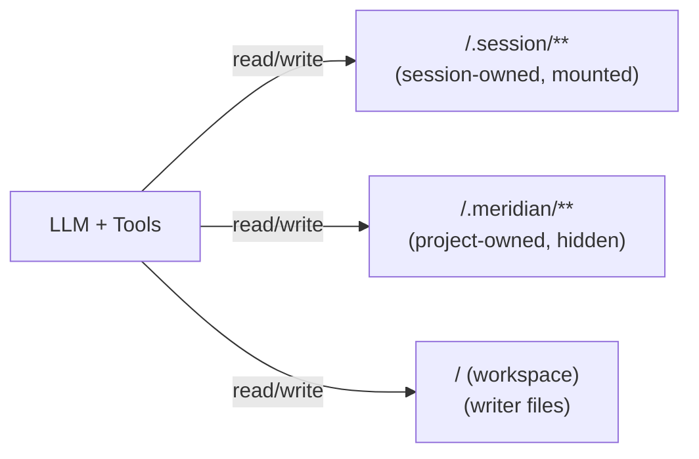
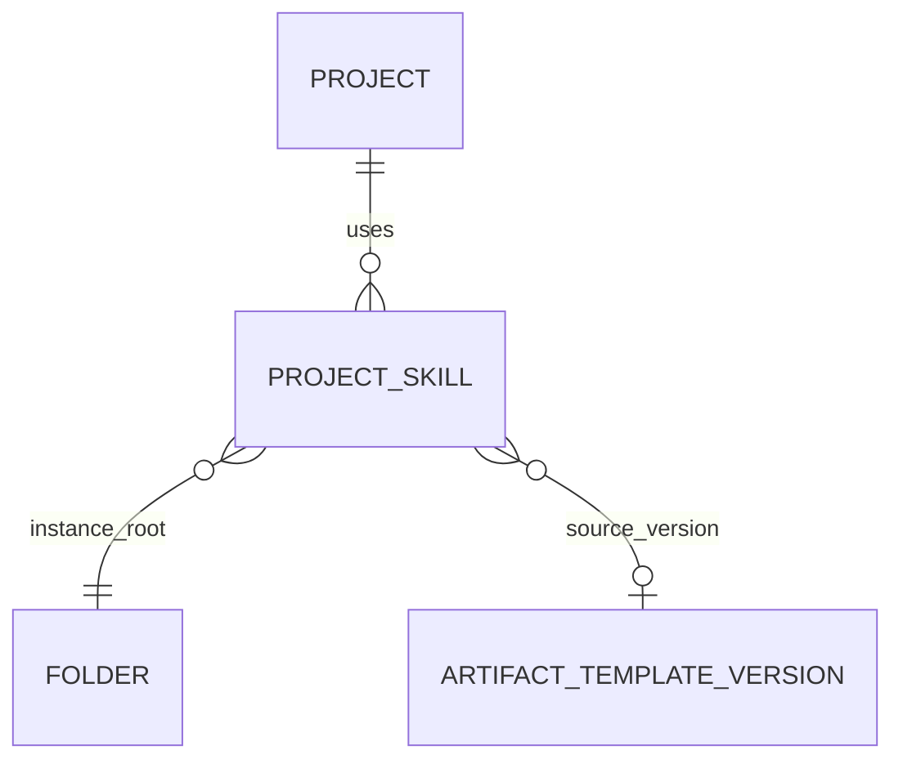

# Project Skills v1 + Artifact Foundations (Drive-like Model)

**Status:** In planning  
**Priority:** High (unblocks “project skills work now”)  
**Estimated effort:** 1–3 days for Project Skills v1 (backend-first)

## Problem Statement (WHY)

We want **project skills** to work immediately (skills influence the AI in a given project), while keeping the database and filesystem model ready for the broader agent framework (skills/personas/agents + sessions + exports).

We want a Drive/Dropbox-like mental model:
- Trees are **stable IDs** (folders/docs), paths are views.
- Sharing is a **permission domain** (projects), not “read my private library”.
- Reuse is **copy/install** (templates -> instances), with optional links for “reload/update”.

## Key Decisions (locked for v1)

1. **AI runtime reads project-owned instances only** (shared-safe, auditable).
2. **Meridian-owned project state lives under `/.meridian/**`** (easy export, no collision with writer files).
3. **Session scratch lives under `/.session/**` as a virtual mount** (thread-owned, writable by AI, not stored under `/.meridian/**` at runtime).
4. **Templates are versioned identities** (public templates are immutable versions). Projects copy templates into instances.
5. **`/.meridian/**` is hidden + gated**: hidden from writer UI by default, and not discoverable/editable by LLM document tools unless explicitly enabled (dedicated editors + approval flow).

## Namespaces (WHAT the AI “sees”)

## Immediate Goal: Project Skills v1

### User-facing behavior
- User can add/reorder/remove **skills used by a project**.
- Skill content lives in `/.meridian/skills/<project-skill-name>/SKILL.md` (+ optional reference docs).
- Prompt resolver loads skills from the project’s configured list and compiles them into the system prompt.

### Non-goals (v1)
- Public template marketplace.
- Cross-project syncing.
- Merge-based “update template into customized instance”.

## Data Model (DB)

## Identifiers + URLs

We should separate **human-friendly naming** from **stable identity**:

- Projects can have a **slug** for nicer URLs and navigation.
  - Recommended route shape: `/projects/<projectId>/<projectSlug>` (load by ID; redirect if slug mismatches).
- Documents should be addressed by **project-relative path** for writer-first navigation.
  - Recommended route shape: `/projects/<projectSlug>/documents/*path` (splat path).
  - `path` is resolved by **exact, single URL-decode** (reject invalid encodings; never double-decode).
  - URL encoding is per-segment; `/` remains a separator (names cannot contain `/`).
  - Canonical URLs should include the full filename **with extension** (e.g., `Chapter 1.md`, `Map.excalidraw`).
    - Optional convenience fallback: if no extension is provided, resolve `<name>.md` only if it exists; otherwise return a helpful error.
  - Rename/move changes the URL; if we later need stable deep links, add a parallel canonical route: `/docs/<documentId>`.
- Project skills (and other `.meridian/**` artifacts) should not rely on slugs as identity.
  - Folder names can be human-friendly (`<project-skill-name>`), but stability comes from IDs stored in metadata.

### Project Skills (instances)

Project skills should point to a **root folder inside the project** (instance). This avoids permission issues for shared projects.

Proposed table (skills-only now; can generalize later):
- `project_skills`
  - `id`
  - `project_id`
  - `instance_folder_id` (FK to project folder root)
  - `display_name` (rename-safe; UI label)
  - `position`
  - `source_template_version_id` (nullable; for “reload/update” later)
  - `sync_state` (`linked|detached`) + `is_dirty` + `last_synced_at` (optional in v1; add now if cheap)
  - timestamps

Notes:
- Enforce per-project uniqueness via folder naming rules (e.g., `Name`, `Name (2)`, ...).
- Prompt resolver uses `project_skills` ordering, not folder listing order.
- Store stable identity in files:
  - `/.meridian/skills/<project-skill-name>/meta.json` includes `project_skill_id` (and template/version linkage).
  - Optional: `/.meridian/manifest.json` indexes all project artifacts for export/debug.

### Template identities (future-proof now)

To avoid painting ourselves into a corner, model template versions without committing to where bytes are stored:
- `artifact_template_versions`
  - `storage_kind`: `embedded|bundle|docsystem_folder`
  - `storage_ref`: JSON/text pointer (e.g. `{key, sha256}` or `{project_id, folder_id}`)

This keeps us sharding-friendly and lets us ship embedded templates first.

## Docsystem Requirements

### Hide Meridian internals in the writer tree

We need to hide `/.meridian/**` from the normal project tree UI.

Minimal requirement:
- Add `is_hidden` to folders (and/or compute hidden-by-prefix at tree build time).

We should avoid hiding via “magic names” only; a boolean is easier to reason about and export.

### Dedicated editors + tool gating

We should treat `/.meridian/**` as internal configuration/state:
- Edit via dedicated UIs (Skill Editor now; Persona/Agent editors later), not the normal writer file tree.
- Default LLM document tools should not scan or mutate `/.meridian/**` except when explicitly allowed for the active task (e.g., “edit this project skill” flow with user confirmation).

## Implementation Plan

### Phase 1: Schema foundations (Project Skills v1) (0.5–1 day)
- Add `is_hidden` column to folders (and ensure tree service can exclude hidden).
- Create `project_skills` table with `instance_folder_id`, ordering, and optional template-link fields.
- (Optional but recommended) Create `artifact_template_versions` table as a thin identity layer (empty at first).

### Phase 1.5: Fix current path-vs-slug gap (frontend + backend) (0.5–1.5 days)

Current state in code:
- Frontend routes already use a splat under `/projects/$slug/documents/$`, but document selection is resolved by comparing the splat to `Document.slug`.
- Backend tree DTO returns `documents[].slug`, but does not return a canonical “exact path” string.

Fix direction:
- Treat the splat as **project-relative path** (exact decode) and resolve documents by **exact path**, not slugified slugs.

Minimal changes:
- Backend:
  - Extend tree API DTO to include `path` for each document (full folder path + filename with extension).
  - Ensure the backend computed `path` uses the same rules as `GetByPath` (folder names + `name + extension`).
- Frontend:
  - Store and use `Document.path` (exact path) for routing/navigation.
  - Update `openDocument(...)` to navigate using `document.path` (encoded per segment).
  - Update WorkspaceLayout to resolve `_splat` to a document by matching against `Document.path` (exact string).

Notes:
- Canonicalize URLs to always include extensions. Keep the `.md` no-extension fallback as compatibility only.

### Phase 2: Project skills CRUD (0.5–1.5 days)
- Service: create/remove/reorder project skills.
- Create skill instance:
  - ensure `/.meridian/` exists (hidden)
  - create `/.meridian/skills/<project-skill-name>/` (hidden, conflict-resolved name)
  - create `SKILL.md` doc inside
  - create `meta.json` with stable IDs + linkage
- List skills: return ordered list with `display_name`, path, and optionally current content.

### Phase 3: Prompt resolver integration (0.5–1 day)
- Compile system prompt from project skills in `project_skills` order.
- Load from instance folders only.
- Add minimal debug trace: list skill slugs + instance folder ids included in a run.

### Phase 3.5: `.meridian/**` hiding + tool gating (required for trust) (0.5–2 days)

We want `/.meridian/**` to be:
- hidden from writer file tree UI, and
- not discoverable/editable by default via LLM document tools.

Work items:
- Add hidden filtering to project tree endpoint (and provide a dedicated “include hidden” endpoint/scope for editor UIs).
- Add tool-level routing/allowlisting so `doc_tree/doc_search/doc_view/doc_edit` cannot enumerate or mutate `/.meridian/**` unless explicitly enabled for an approved “skill editing” flow.
- Provide a narrow “skills surface” for the AI:
  - Either a virtual `.skills/**` mount that only exposes selected project skills, or
  - A controlled “load selected skills” path that does not require `doc_tree` scanning.

### Phase 4: Export format (doc only; implementation later)

Export bundle layout (archive root):
- `workspace/**` (writer files)
- `.meridian/**` (project-owned Meridian state)
- `sessions/<session_id>/threads/**` (thread history)
- `sessions/<session_id>/session_fs/**` (snapshot of mounted `/.session/**` at export time)

## Cleanup Checklist (Prep Work)

To make this “project skills v1” work cleanly (and keep the agent framework model consistent), clean up/standardize:

- **Stop calling paths “slugs”** for documents:
  - Treat document addressing as `projectSlug + path` (`/projects/<projectSlug>/documents/*path`) with exact decode.
- **Centralize encoding/decoding rules** (frontend + backend):
  - Encode per path segment; decode exactly once; reject invalid percent encodings.
  - Add a single helper for path ↔ URL conversions to avoid subtle mismatches.
- **Make “path with extension” canonical**:
  - UI should always generate URLs using `name + extension` (filename).
  - Allow `.md` no-extension only as a convenience fallback (and never for ambiguous matches).
- **Hide `/.meridian/**` by default**:
  - Ensure tree/list endpoints used by the writer UI exclude hidden internals.
  - Add dedicated editor surfaces/APIs for skills (and later personas/agents).
- **Tool gating**:
  - Ensure default LLM document tools can’t enumerate or mutate `/.meridian/**` unless explicitly enabled for the task (approval flow).
- **Naming conflict rules for project skills**:
  - Define deterministic “unique-ish name” behavior (`Name`, `Name (2)`, …) and use it consistently across create/import.

## Alternatives Considered

### “Store project skills in a user library and reference them”
Rejected: breaks shared projects and auditability (permissions + mutable source).

### “Put skills at `/.skills/**`”
Rejected: prefer a single `/.meridian/**` namespace for Meridian-owned state (easier export, fewer collisions).

### “Make sessions live under `/.meridian/.session/**`”
Rejected: sessions are thread-owned and mounted; storing under `/.meridian/**` implies project-owned persistence. Snapshot into exports instead.

## Success Criteria

- [ ] Project skill instances are stored under `/.meridian/skills/**` and hidden from the writer tree.
- [ ] Prompt resolver loads skills from `project_skills` instances only, in stable order.
- [ ] Model is compatible with shared projects and future template registry/store.

## Related Documentation

- `_docs/plans/agents.md`
- `_docs/plans/fb-artifact-templates-and-project-instances.md`
