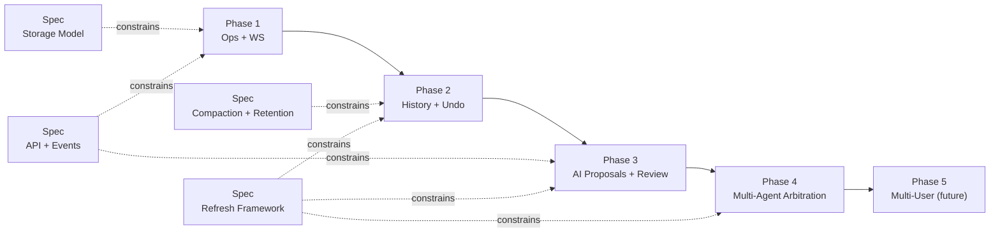

# Collaboration + AI Collaboration Plan Set

This directory splits collaboration docs by responsibility:

- `spec/` = canonical invariants/contracts (what must be true)
- `phase/` = implementation sequencing (how we ship)
- This separation is intentional SRP: specs own policy/contracts, phases own delivery steps.
- Implementation docs depend on spec contracts, not vice versa (DIP-friendly boundary).

Canonical main plan:
- `_docs/plans/fb-realtime-collab-editing.md`

## Spec Index

| Spec | Purpose | Doc |
|---|---|---|
| Storage model | Authoritative stream + proposal stream schema/invariants | `spec/storage-model.md` |
| API/events | WS/REST/event and error contracts | `spec/api-events-contract.md` |
| Compaction/retention | Snapshot, floor, deletion safety, cleanup rules | `spec/compaction-retention.md` |
| Read-model refresh | Freshness/coalescing/trigger baseline | `spec/refresh-read-model-framework.md` |

## Phase Index

| Phase | Purpose | Plan |
|---|---|---|
| 1 | Authoritative editing transport + op log | `phase/phase-1-oplog-transport.md` |
| 2 | Durable writer history + persistent undo | `phase/phase-2-history-and-undo.md` |
| 3 | AI proposal lifecycle + review UX | `phase/phase-3-ai-proposals-and-review.md` |
| 4 | Multi-agent proposal arbitration | `phase/phase-4-multi-agent-arbitration.md` |
| 5 | Multi-user collaboration (future) | `phase/phase-5-multi-user-collaboration.md` |

## Superseded Legacy Plans

- `_docs/plans/fb-document-history-v1.md` -> `phase/phase-2-history-and-undo.md`
- `_docs/plans/fb-tree-ai-suggestions-banner-accept-all.md` -> `phase/phase-3-ai-proposals-and-review.md`
- `_docs/plans/fb-event-driven-refresh-framework.md` -> `spec/refresh-read-model-framework.md`
