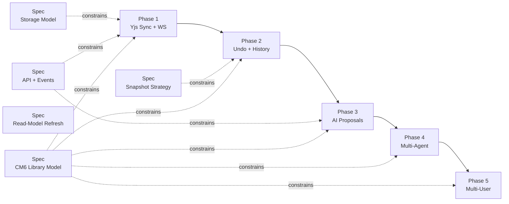

# Collaboration + AI Collaboration Plan Set

This directory splits collaboration docs by responsibility:

- `spec/` = canonical invariants/contracts (what must be true)
- `phase/` = implementation sequencing (how we ship)
- This separation is intentional SRP: specs own policy/contracts, phases own delivery steps.
- Implementation docs depend on spec contracts, not vice versa (DIP-friendly boundary).

Canonical main plan:
- `_docs/plans/fb-realtime-collab-editing.md`

## Architecture: Go-Only with Yjs CRDT

The collaboration model uses **Yjs CRDTs** (not OT) with a **Go-only backend** (no Node service):

```
Browser ──HTTP──> Go Backend ──DB──> Postgres
Browser ──WS────> Go Backend (same process)
```

**One service. One deployment. One database connection pool.**

Key architectural decisions:
- Go uses [`skyterra/y-crdt`](https://github.com/skyterra/y-crdt) (MIT) for server-side Yjs operations
- Single WebSocket per document carries Yjs sync, awareness, and proposal messages
- JWT-in-first-message auth (no ticket table)
- `documents.content` and `documents.ai_content` are derived projections from Yjs state (persisted alongside `yjs_state`, never written independently)
- Accepted/rejected proposals are retained indefinitely as permanent audit records (no TTL purge)
- `y-indexeddb` for offline support from Phase 1
- Interface-based design (`DocumentBroadcaster`, `DocumentStore`) for scaling readiness
- Collab domain follows existing Go backend pattern (`domain/`, `service/`, `repository/`) with `DocumentResolver` as sole cross-domain dependency — designed for easy service extraction
- Comments/annotations are explicitly separate from AI proposals — proposals MODIFY (CRDT mutations), comments ANNOTATE (text anchoring via `Y.RelativePosition`)

This dramatically simplifies the architecture:
- No version allocation or row locks
- No lease fencing
- No compaction pipeline
- No Node service to deploy
- No ticket table/endpoint
- Conflict-free merges by design
- Awareness/presence available from Phase 1

## Network Boundary Quick Map

- Browser HTTP: `/api/*` (Go backend)
- Browser realtime: `/ws/*` (Go backend, same process)

No private service-to-service routes. No Node service.

Canonical route and boundary contract: `spec/api-events-contract.md`

## Spec Index

| Spec | Purpose | Doc |
|---|---|---|
| Storage model | Yjs state persistence + proposal queue schema/invariants | `spec/storage-model.md` |
| API/events | WS/event and error contracts (single WS) | `spec/api-events-contract.md` |
| Snapshot strategy | Snapshot persistence, retention, cleanup rules | `spec/compaction-retention.md` |
| Read-model refresh | Non-collab data freshness | `spec/refresh-read-model-framework.md` |
| CM6 library model | Frontend 1-package boundary (`@meridian/cm6-collab`) and dependency rules | `spec/cm6-library-model.md` |

## Phase Index

| Phase | Purpose | Plan |
|---|---|---|
| 1 | Yjs sync + WS transport (Go-only) | `phase/phase-1-yjs-sync-and-transport.md` |
| 2 | History + session undo + snapshots | `phase/phase-2-history-and-undo.md` |
| 3 | AI proposal lifecycle (Yjs update buffers) + review UX | `phase/phase-3-ai-proposals-and-review.md` |
| 4 | Multi-agent semantic arbitration | `phase/phase-4-multi-agent-arbitration.md` |
| 5 | Multi-user collaboration (native to Yjs) | `phase/phase-5-multi-user-collaboration.md` |



## Superseded Legacy Plans

- `_docs/plans/fb-document-history-v1.md` -> `phase/phase-2-history-and-undo.md`
- `_docs/plans/fb-tree-ai-suggestions-banner-accept-all.md` -> `phase/phase-3-ai-proposals-and-review.md`
- `_docs/plans/fb-event-driven-refresh-framework.md` -> `spec/refresh-read-model-framework.md`
