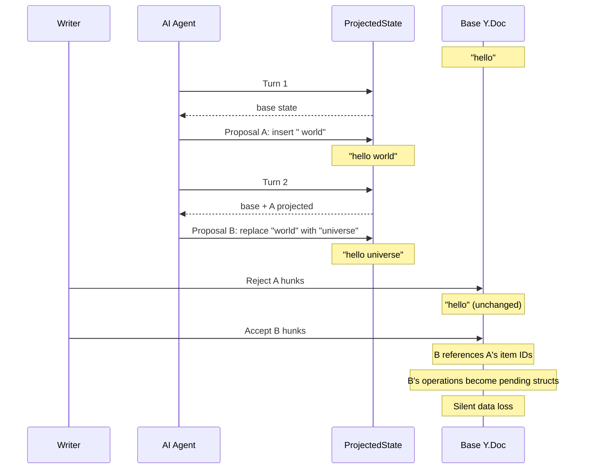
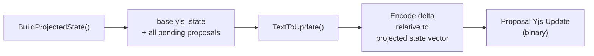
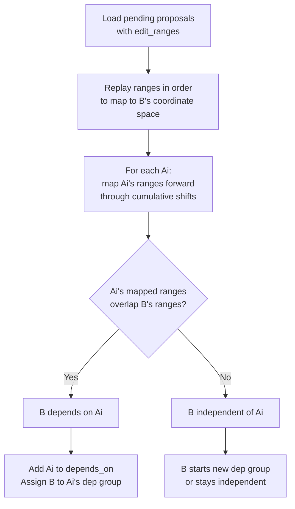
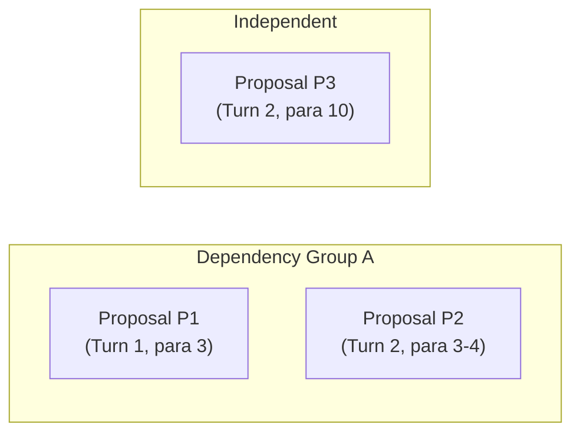
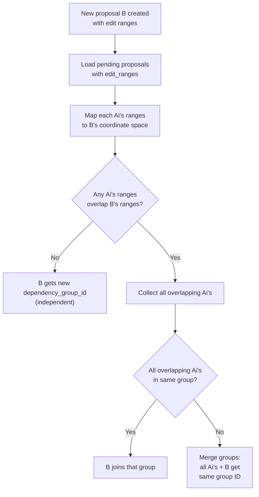
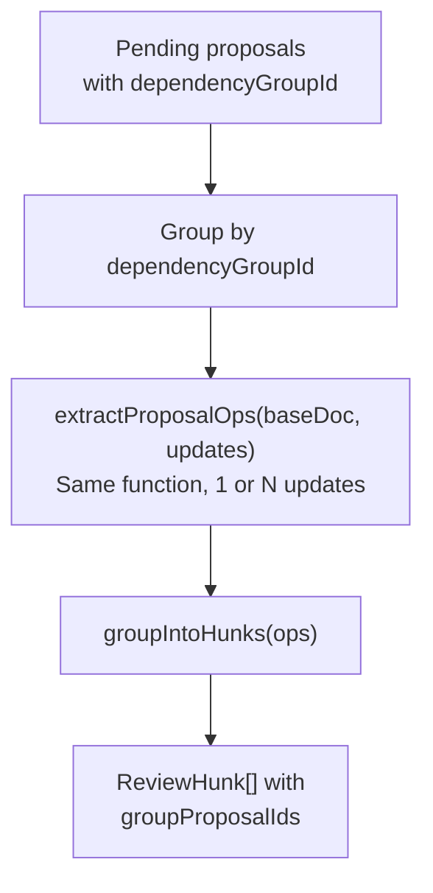
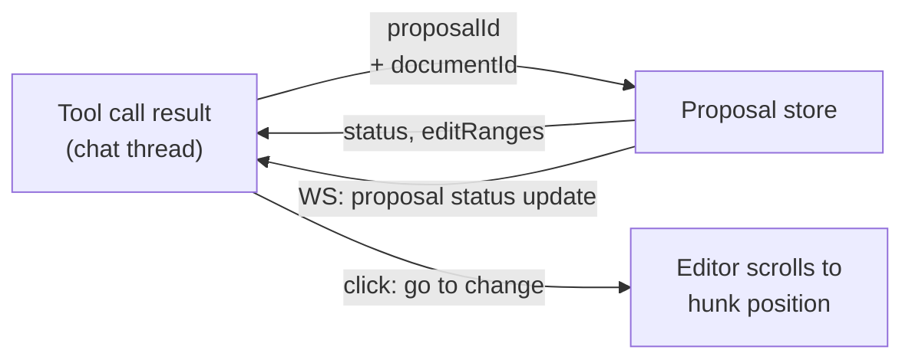

# Design: Cross-Proposal CRDT Dependencies

## Problem

When `autoAcceptProposals` is OFF and multiple AI turns create proposals, later proposals depend on earlier pending proposals at the CRDT level. Rejecting an earlier proposal while keeping a later dependent one causes **silent data loss**.

### How It Happens



### Why It Breaks

Yjs updates encode **implicit dependencies** through:

| Mechanism | What It Stores | Why It Matters |
|-----------|---------------|----------------|
| State vector | `{clientA: 5, clientB: 1}` | B's update says "I've seen A's ops" |
| Item IDs | `(clientID, clock)` tuples | B's delete/insert references A's inserted items |
| Left/right origins | Position anchors | B's insertions anchor relative to A's items |

When proposal B is generated against projected state (base + A), B's Yjs binary update contains references to A's item IDs. If A is rejected (never applied to base), these references point to **non-existent items**. Yjs stores them as permanently pending structs — the operations silently disappear.

### Impact on Current Hunk System

The dependency breaks **three things**:

1. **Hunk derivation**: `extractProposalOps()` clones the base doc and applies B's update. Without A's items, B's dependent operations stay pending and don't appear in the observed delta. B's hunks display **partially or not at all**.

2. **Hunk acceptance**: `buildPartialUpdate()` constructs edits against the current Y.Doc. If A was rejected, positions computed from B's projected-state hunks are **wrong** against actual base.

3. **Finalization**: Even if B's hunks somehow resolve, the proposal-level REJECT sent at finalization closes B, but any pending structs from B's update linger silently in the Y.Doc — **invisible corruption**.

### When This Occurs

Requires ALL of:
- `autoAcceptProposals` is OFF (project setting)
- Multiple AI turns produce proposals for the same document
- User rejects an earlier proposal while later dependent proposals exist
- Later proposals' edits overlap with or are positionally dependent on earlier ones

This is uncommon in the MVP (auto-accept is ON by default), but it's a correctness issue that causes silent data loss when it does occur.

## Current-State Baseline (Smoke-Verified on 2026-02-23)

Before this design is implemented, the current codebase behaves as follows:

- `RejectProposal` is single-proposal only (no dependency-group cascade).
- `GroupAccept` is fail-open for per-proposal errors (skip-and-continue outcomes are possible).
- WS proposal payloads expose `proposalGroupId`, but not `dependencyGroupId` or `editRanges`.
- Frontend review collection excludes ready models with `hunks.length === 0`, so net-zero groups are not auto-closed today.
- `TextEdit.Position` is byte-offset based; UTF-16 conversion happens at converter/Yjs mutation boundaries, not proposal metadata capture.

This baseline is expected pre-implementation and is the delta this plan closes.

## CRDT Dependency Mechanics

### How Proposals Are Generated



`mutation_strategy_collab.go` calls `BuildProjectedState()` which loads base + applies all pending proposals in order. The new proposal's Yjs update is encoded as a delta relative to the projected state vector — meaning it only contains operations **after** all pending proposals.

### State Vector As Dependency Marker

The projected state vector at proposal creation time is a precise record of which proposals were included. If proposal B is created when proposals A1, A2 are pending:

```
B's base state vector = base_sv + A1_ops + A2_ops
B's update = EncodeStateAsUpdate(doc, B's base state vector)
```

B's update is **minimal** — it contains only B's new operations. When applied to a doc that already has A1 + A2, it works perfectly. When applied to a doc missing A1 or A2, operations referencing their items become orphaned.

### Precise Dependency Detection via Edit Range Overlap

**Conservative** (all pending = dependency) over-groups non-overlapping edits. If AI turn 1 edits paragraph 1 and turn 2 edits paragraph 10, conservative grouping forces the writer to accept/reject both as a unit — unnecessarily restrictive.

**Precise** detection checks whether proposals actually edit overlapping text regions. This is feasible and cheap at proposal creation time because:

1. We already have the `TextEdit` (position, old text, new text) when creating a proposal
2. Each pending proposal's edit ranges can be stored as metadata
3. Range overlap is simple arithmetic after coordinate mapping

#### How It Works

Each proposal stores its edit ranges in projected-text coordinates at creation time.

**Canonical coordinate system: UTF-16 code units for dependency metadata.** Yjs text operations are UTF-16-positioned, so all `edit_ranges` positions and lengths MUST be UTF-16 code units. `TextEdit.Position` remains a byte offset in converter/anchor-validation paths; proposal creation converts byte offsets to UTF-16 once at the capture boundary before persisting `edit_ranges`. Overlap detection and coordinate mapping operate only in UTF-16 space. Use distinct types/helpers to prevent byte/UTF-16 mixups. Tests must include multi-byte Unicode content (emoji, CJK, surrogate pairs) to verify correctness.

```
edit_ranges JSONB: [{"position": 42, "oldLength": 15, "newLength": 28}, ...]
// All values in UTF-16 code units
```

When creating proposal B with pending proposals A1, A2:



**Coordinate mapping**: Each proposal shifts subsequent positions by `(newLength - oldLength)`. Process proposals in `created_at` order, accumulate shifts, transform each Ai's ranges to current projected-text coordinates. Then check overlap with B's ranges.

**Performance**: O(N * M) range comparisons where N = pending proposals (typically < 10), M = edits per proposal (typically 1-3). Runs once at proposal creation time. Negligible cost.

**Precision**: Slightly conservative at boundaries — adjacent but non-overlapping edits (e.g., one ends at position 100, next starts at 100) are marked as dependent. This is intentional: adjacent edits may share CRDT item origins even without text overlap.

**Conservative fallback for unknown ranges**: If a proposal cannot provide deterministic edit ranges (e.g., full-document replacement when `FindEditPosition` fails, or a future proposal source that doesn't use `TextEdit`), it MUST fall back to conservative grouping: `depends_on_proposal_ids` = all currently pending proposals. Store `edit_ranges` as `null` (not empty array) to distinguish "unknown" from "no edits." The `assignDependencyGroup` function treats `null` ranges as overlapping with everything — the proposal joins (or merges) all existing groups for that document.

## Recommendation: Composite Hunks with Backend-Computed Dependency Groups

Composite hunks solve the problem at the product level: dependent proposals are presented as a single unit showing the **net effect**, so the invalid state (reject A, keep B) **can't happen**. The writer sees "here's what changed overall" and decides on that.

The backend computes dependency groups using precise edit-range overlap detection at proposal creation time. The frontend receives group IDs and derives composite hunks — no chain-building logic needed on the frontend.

## Design

### Core Concept: Dependency Groups

A **dependency group** is a set of proposals whose edits overlap. The backend assigns a `dependency_group_id` at proposal creation time based on edit-range overlap detection.



- P1 edits paragraph 3. P2 edits paragraphs 3-4. Ranges overlap → same group.
- P3 edits paragraph 10. No overlap with P1 or P2 → independent (own group of 1).
- The writer sees composite hunks for Group A (net effect of P1 + P2) and separate hunks for P3.

### Backend: Dependency Group Assignment

#### Database

```sql
ALTER TABLE proposals ADD COLUMN edit_ranges JSONB;  -- null = unknown (conservative), '[]' = no edits, [...] = known ranges
ALTER TABLE proposals ADD COLUMN dependency_group_id UUID;
ALTER TABLE proposals ADD COLUMN depends_on_proposal_ids UUID[] DEFAULT '{}';
```

- `edit_ranges`: position + lengths in projected-text coordinates at creation time
- `dependency_group_id`: which group this proposal belongs to (assigned at creation time)
- `depends_on_proposal_ids`: which specific proposals this one overlaps with (for backend safety guard)

#### Group Assignment at Proposal Creation



**Group merging**: If B overlaps with A1 (group X) and A2 (group Y), all three merge into one group. This handles transitive dependencies — if A1 and A2 didn't overlap with each other but both overlap with B, they're now connected through B.

**Implementation** in `proposal_service.go` at creation time:

```go
func (s *Service) assignDependencyGroup(ctx context.Context, newProposal *Proposal, pendingProposals []Proposal) error {
    overlapping := findOverlapping(newProposal.EditRanges, pendingProposals)

    if len(overlapping) == 0 {
        // Independent — new group
        newProposal.DependencyGroupID = uuid.New()
        return nil
    }

    // Collect all unique group IDs from overlapping proposals
    groupIDs := uniqueGroupIDs(overlapping)

    if len(groupIDs) == 1 {
        // All overlapping proposals in same group — join it
        newProposal.DependencyGroupID = groupIDs[0]
    } else {
        // Multiple groups need merging — pick one, reassign others
        targetGroupID := groupIDs[0]
        s.store.ReassignDependencyGroup(ctx, groupIDs[1:], targetGroupID)
        newProposal.DependencyGroupID = targetGroupID
    }

    newProposal.DependsOnProposalIDs = extractIDs(overlapping)
    return nil
}
```

#### Edit Range Coordinate Mapping

When checking overlap, we need Ai's ranges in B's projected-text coordinate space. This is a **safety boundary** — approximate mapping can produce false negatives (proposal marked independent when it's actually dependent), reintroducing the exact silent-loss condition this design prevents. Therefore, we require **exact position-sensitive interval transformation** in v1.

Each proposal's edits shift subsequent positions, but only for positions **after** the edit:

```go
// mapRangeForward transforms a range through a single edit.
// If the edit is before the range, shift by (newLength - oldLength).
// If the edit overlaps the range, they're dependent (caller handles).
// If the edit is after the range, no shift.
func mapRangeForward(r EditRange, edit EditRange) (EditRange, bool) {
    editEnd := edit.Position + edit.OldLength
    if editEnd < r.Position {
        // Edit is entirely before range (strict <, adjacent = overlap) — shift
        delta := edit.NewLength - edit.OldLength
        return EditRange{Position: r.Position + delta, OldLength: r.OldLength, NewLength: r.NewLength}, false
    }
    if edit.Position > r.Position + r.NewLength {
        // Edit is entirely after range (strict >, adjacent = overlap) — no shift
        return r, false
    }
    // Overlap or adjacent — dependent
    return r, true
}

// mapRangeThroughProposals transforms Ai's ranges through all proposals
// between Ai and B (exclusive), processing each edit in order.
// Returns (mapped range, true) if any intermediate edit overlaps — caller
// should treat this as a dependency and skip further mapping.
func mapRangeThroughProposals(r EditRange, proposals []Proposal, fromIdx, toIdx int) (EditRange, bool) {
    mapped := r
    for i := fromIdx; i < toIdx; i++ {
        for _, edit := range proposals[i].EditRanges {
            var overlaps bool
            mapped, overlaps = mapRangeForward(mapped, edit)
            if overlaps {
                return mapped, true
            }
        }
    }
    return mapped, false
}
```

**Edge cases that must be tested**:
- Multi-edit proposals: A has edits at positions 10 and 50; B edits position 30 → only the first edit shifts B's range
- Interleaved edits: A edits [10-20], B edits [15-25] → overlap detected before mapping
- Zero-length inserts: A inserts at position 10 (oldLength=0, newLength=5) → positions >= 10 shift by 5
- Adjacent edits: A edits [10-20], B edits [20-30] → treated as dependent (CRDT origins may share boundary items)
- Non-adjacent edits: A edits [10-20], B edits [21-30] → independent, B shifted by A's delta
- Transitive merge: A and B are independent, C overlaps both → all three merge into one group

#### Backend Dependency Invariant (All Decision Paths)

The backend enforces group integrity as an invariant across **all** decision paths — not just reject. Client behavior cannot be the sole invariant keeper. All group membership reads and mutations run within the same transaction, with errors handled fail-closed (error → abort, never proceed with partial state).

**Reject** — cascade to all group members:

```go
func (s *Service) RejectProposal(ctx context.Context, input RejectInput) (RejectResult, error) {
    // All within ExecTx
    proposal := ... // load proposal

    groupMembers, err := s.store.ListByDependencyGroup(txCtx, proposal.DependencyGroupID, StatusProposed)
    if err != nil {
        return RejectResult{}, fmt.Errorf("list group members: %w", err) // fail-closed
    }

    // Cascade: reject all group members, not just the requested one
    for _, member := range groupMembers {
        if err := s.store.MarkRejected(txCtx, member.ID, decision); err != nil {
            return RejectResult{}, fmt.Errorf("reject group member %s: %w", member.ID, err)
        }
    }

    s.aiContentProjector.Recompute(txCtx, proposal.DocumentID)
    return result, nil
}
```

**Accept** — fail-closed for multi-member groups:

```go
func (s *Service) AcceptProposal(ctx context.Context, input AcceptInput) (AcceptResult, error) {
    // All within ExecTx
    proposal := ... // load proposal

    groupMembers, err := s.store.ListByDependencyGroup(txCtx, proposal.DependencyGroupID, StatusProposed)
    if err != nil {
        return AcceptResult{}, fmt.Errorf("list group members: %w", err)
    }

    // Fail-closed: individual accept on a multi-member dependency group
    // is invalid — the frontend uses composite hunks + finalize-as-REJECT,
    // so this path should never fire. If it does, reject rather than
    // risk applying a partial update that references missing CRDT items.
    if len(groupMembers) > 1 {
        return AcceptResult{}, fmt.Errorf(
            "cannot individually accept proposal %s: belongs to dependency group %s with %d pending members; use hunk-level accept via partial updates instead",
            proposal.ID, proposal.DependencyGroupID, len(groupMembers))
    }

    // ... existing accept logic (ApplyUpdate, MarkAccepted, Recompute)
}
```

**GroupAccept** — verify group boundaries:

```go
func (s *Service) GroupAccept(ctx context.Context, input GroupAcceptInput) (GroupAcceptResult, error) {
    // All within ExecTx
    // Existing GroupAccept entrypoint remains proposal_group_id based (AI turn grouping),
    // but enforcement must be dependency-group strict.
    proposals := s.store.ListByProposalGroup(txCtx, input.ProposalGroupID, StatusProposed)

    // Partition by dependency_group_id.
    groups := groupByDependencyGroupID(proposals)

    // Fail-closed invariant: no partial success across dependency groups.
    // If any proposal in the request set is invalid/unavailable, return error
    // and apply NO runtime updates / NO status transitions.
    if violatesDependencyBoundary(groups, input.RequestedProposalIDs) {
        return GroupAcceptResult{}, domain.NewValidationError(
            "groupAccept violates dependency-group boundary; all pending members of each dependency group must be accepted together")
    }

    // Apply all-or-nothing by dependency group.
    // Any apply/mark/recompute error aborts tx; no skipped outcomes.
    applyAndMarkAll(groups)
    return result, nil
}
```

**GroupAccept hard rule**: no skip-and-continue behavior on dependency-managed proposals. Any dependency-boundary violation or per-proposal apply failure is an error that aborts the transaction.

**Concurrency control**: Proposal creation (including group assignment and merges) must be serialized per-document. The existing `acceptGate` only covers accept operations. For creation, use a **document-scoped PostgreSQL advisory lock** (`pg_advisory_xact_lock(document_id_hash)`) within the creation transaction. This ensures that concurrent AI turns creating proposals for the same document see each other's pending proposals and group assignments. The lock is held only for the duration of the transaction (read pending → compute overlap → insert proposal → merge groups if needed), so contention is minimal. `ReassignDependencyGroup` and the new proposal insert remain atomic within the same transaction.

#### WebSocket Events

`proposal:snapshot` and `proposal:new` events include `dependencyGroupId` and `editRanges` in the payload. The frontend groups by `dependencyGroupId` — no chain-building logic needed.

When dependency groups merge, backend sends an immediate merge event:

```json
{
  "type": "proposal:dependencyGroupChanged",
  "documentId": "<uuid>",
  "changes": [
    {
      "proposalId": "<uuid>",
      "oldDependencyGroupId": "<uuid>",
      "newDependencyGroupId": "<uuid>"
    }
  ],
  "at": "2026-02-23T00:00:00Z"
}
```

Contract requirements:
- Event is broadcast in the same logical mutation flow that reassigns groups.
- Client handling is idempotent (`proposalId` reassignment can be applied repeatedly).
- If `proposal:dependencyGroupChanged` arrives before/after `proposal:new`, latest group ID wins.
- Snapshot remains source-of-truth recovery on reconnect.

### Frontend: Composite Hunk Derivation

The frontend receives proposals pre-grouped by the backend. It derives hunks per group using the **same extraction function** — `extractProposalOps` is extended to accept one or many updates.



**Key insight**: No separate code path for single vs composite. The existing Yjs delta observation handles both — apply one update or N updates in order, observe all deltas, compose them into `EditOp[]`. This avoids introducing `diff-match-patch` (which has ambiguity on repeated text) and keeps a single extraction pipeline (SRP).

#### Unified Extraction (Single and Composite)

`extractProposalOps` is extended to accept `Uint8Array | Uint8Array[]`:

```typescript
function extractProposalOps(
  baseDoc: Y.Doc,
  yjsUpdate: Uint8Array | Uint8Array[],  // single or ordered group
  textKey = "content",
): EditOp[] {
  const clone = cloneDoc(baseDoc);
  const text = clone.getText(textKey);
  const baseText = text.toString();

  // Observe deltas across all updates
  const allDeltas: Y.YTextEvent["delta"][] = [];
  text.observe((event) => allDeltas.push(event.delta));

  // Apply one or many updates — observer fires for each
  const updates = Array.isArray(yjsUpdate) ? yjsUpdate : [yjsUpdate];
  for (const update of updates) {
    Y.applyUpdate(clone, update);
  }

  // Compose all deltas into EditOps against base-text positions.
  // Each delta's positions are relative to the text *after* prior deltas,
  // so we track a running offset to map back to base positions.
  return composeDeltas(allDeltas, baseText);
}
```

**`composeDeltas`** walks each delta in order, maintaining a cumulative offset (insertions increase it, deletions decrease it) to map every operation back to base-text coordinates. The result is the same `EditOp[]` that `mergeAdjacentOps` already produces — same downstream path through `groupIntoHunks`, no branching.

#### Hunk Model Extension

```typescript
interface ReviewHunk {
  id: string;                    // `${groupId}-chunk-${index}`
  proposalId: string;            // primary proposal (first in group) for compat
  groupProposalIds: string[];    // ALL proposals in this dependency group
  // ... existing fields unchanged ...
}
```

#### Accept / Reject + Re-Derivation

**Accept composite hunk** — same as current `handleAcceptHunk()`:
1. `buildPartialUpdate(baseDoc, hunk)` — builds Yjs update for this hunk's text change against current base doc
2. Apply to Y.Doc → syncs via collab transport
3. Mark hunk as accepted in CM6 state

**Reject composite hunk** — same as current: mark as rejected, no Y.Doc change.

**Re-derivation after each mutation**: After accepting a hunk, the Y.Doc changes and remaining hunk positions may be stale. The existing hunk system already handles this — `useInlineReview` re-derives all hunks when Y.Doc changes (the "smart carry-over" logic preserves resolutions for hunks that still match). Composite hunks follow the same path: after accepting one composite hunk, the remaining hunks in the same group are re-derived against the new base. `extractProposalOps()` runs again with the updated base doc and remaining updates, producing fresh positions. If a hunk can no longer be cleanly applied (base text at the expected range has changed), it appears as a conflict — the writer sees the mismatch and can reject it.

**Finalization** — `maybeAutoFinalize()` closes resolved groups and auto-closes groups with zero derived hunks (net effect is no visible text change):

```typescript
const allProposalIds = new Set<string>();

for (const group of reviewGroups) {
  if (group.hunks.length === 0) {
    // Net-zero group — no review surface, close immediately.
    for (const pid of group.proposalIds) {
      allProposalIds.add(pid);
    }
    continue;
  }

  if (!group.hunks.every((hunk) => isResolved(hunk.id))) {
    continue;
  }

  for (const hunk of group.hunks) {
    for (const pid of hunk.groupProposalIds) {
      allProposalIds.add(pid);
    }
  }
}

for (const pid of allProposalIds) {
  sendProposalReject(pid);
}
```

Review UI is cleared only when all groups are closed:

```typescript
const allGroupsClosed = reviewGroups.every(
  (group) =>
    group.hunks.length === 0 || group.hunks.every((hunk) => isResolved(hunk.id)),
);
if (allGroupsClosed) {
  clearReviewEffect(view);
}
```

This works because accepted hunks are already applied to Y.Doc via partial updates. The proposal-level REJECT just closes proposals out (same pattern as current single-proposal flow). Net-zero groups must be auto-closed to avoid indefinitely pending proposals with no visible hunks.

**Finalization invariant**: no proposal may remain `proposed` once its dependency group is either:
- fully resolved by hunk decisions, or
- net-zero (`hunks.length === 0` for the group’s combined updates).

### Tool Call Result Integration

Tool results in the chat thread link back to their proposals, giving the writer provenance and navigation.

#### Capabilities

1. **Go to change** (best-effort): From the tool result block, click to navigate to the corresponding hunk in the document editor. Uses `document_id` + `edit_ranges` to scroll to the **approximate** position. Ranges are creation-time projected coordinates and may be stale after accepts/rejects shift positions. Precise remapping (running coordinate shifts through accepted proposals) is a follow-up if writers report frustration.

2. **Status indicator**: The tool result block reflects the proposal's current status (`proposed` / `accepted` / `rejected`). Reactive via existing WS proposal status updates — no polling needed.

3. **No undo**: Undoing an accepted change is the dependency problem in reverse — removing CRDT items that later proposals reference causes the same orphaned-struct corruption. If undo becomes important later, model it as "create a new proposal that reverses this change" (AI-generated), not surgical CRDT removal.

#### Data Flow



#### Model

The tool result block already contains `document_id` from the tool call. Add `proposal_id` to the tool result content when a proposal is created:

```go
// In mutation_strategy_collab.go, after proposal creation
toolResult.Content["proposal_id"] = proposal.ID
toolResult.Content["document_id"] = proposal.DocumentID
```

The frontend tool result renderer uses `proposal_id` to:
- Subscribe to proposal status via the existing proposal store
- Look up `edit_ranges` for scroll-to-position on "go to change" click

### What Changes, What Stays the Same

| Component | Change |
|-----------|--------|
| **Backend** | |
| `proposal.go` (model) | Add `EditRanges`, `DependencyGroupID`, `DependsOnProposalIDs` fields |
| `proposal_store.go` | Persist + query new columns; `ReassignDependencyGroup()` for merges |
| `proposal_service.go` | `assignDependencyGroup()` at creation; safety guard on reject |
| `mutation_strategy_collab.go` | Capture edit ranges with byte→UTF-16 conversion at proposal creation, pass to CreateProposal |
| `collab_proposal.go` | Include `dependencyGroupId` in WS events |
| `ai_content_projector.go` | Return `ProjectedStateResult` with pending proposal IDs |
| `collab_proposal.go` | Broadcast group merge event when `ReassignDependencyGroup` fires |
| **Frontend** | |
| `contracts.ts` | Add `dependencyGroupId`, `groupProposalIds` to types |
| `changeset-extractor.ts` | Extend `extractProposalOps` to accept `Uint8Array | Uint8Array[]`; add `composeDeltas()` |
| `runtime.ts` | Pass grouped updates array to unified `extractProposalOps` |
| `useInlineReview.ts` | Group by `dependencyGroupId`; pass update arrays to `extractProposalOps` |
| `hunk-grouper.ts` | Unchanged — operates on `EditOp[]` regardless of source |
| `partial-apply.ts` | Unchanged — `buildPartialUpdate()` works on current base doc |
| `hover-manager.ts` | Unchanged — operates on hunk IDs regardless of group |
| `ProposalReviewToolbar.tsx` | Show "AI changes (N turns)" for composite hunks |
| Tool result renderer | Add `proposal_id` link, status indicator, "go to change" navigation |
| Backend finalization | No change — still receives individual REJECT per proposal |

## Implementation Plan

### Migration Strategy: Keep `00016`, Rebase `00017`–`00023`

Production and test are still at migration 15. Keep `00016_normalize_legacy_tools.sql` unchanged, then **rebase/squash only `00017`–`00023`** into a clean forward path from 15.

**Rebased chain starts at 00017 and includes:**
- `threads.user_id` TEXT → UUID (from old 00017)
- `yjs_state` + `ai_content` on documents, drop `ai_version`/`ai_version_rev` (from old 00018 + 00023)
- `document_snapshots` table — clean name, expanded `snapshot_type` CHECK (from old 00018 + 00022)
- `turn_document_touches` table (from old 00019)
- `document_edit_proposals` table — clean name, includes `edit_ranges JSONB`, `dependency_group_id UUID`, `depends_on_proposal_ids UUID[]` from the start (from old 00020 + new)
- `proposal_accept_idempotency` table — clean name (from old 00020)
- `auto_accept_proposals` on projects (from old 00021)

**Dev safety note:** do not rely on rolling dev down to 15 before rebasing. `00022` down can fail if rows use new snapshot types. Use a dev reset (`make seed-fresh` / drop-and-recreate prefixed tables + migration tracking) before applying the rebased chain.

**Table renames baked in (no separate Task 0):**

| Old Name (dev migrations) | Final Name |
|---------------------------|------------|
| `collab_document_edit_proposals` | `document_edit_proposals` |
| `collab_request_idempotency` | `proposal_accept_idempotency` |
| `collab_document_snapshots` | `document_snapshots` |

**Go code updates:** Update table name constants in store files to use clean names.

### Task 1: Backend Dependency Group Assignment

**Goal**: Finalize migration history safely (`00016` kept, `00017`–`00023` rebased). Detect edit-range overlap at proposal creation time. Assign `dependency_group_id`. Expose in WS events. Capture `proposal_id` in tool results.

**Files:**
- `backend/migrations/` — keep `00016` as-is; replace old `00017`–`00023` with rebased migrations containing final schema (including dependency columns)
- `backend/internal/domain/models/collab/proposal.go` — add fields + `EditRange` type
- `backend/internal/repository/postgres/collab/proposal_store.go` — persist new columns, `ReassignDependencyGroup()`, `ListByDependencyGroup()`, update table name constants
- `backend/internal/service/collab/proposal_service.go` — `assignDependencyGroup()` with overlap detection + coordinate mapping; safety guard on reject (cascade within group)
- `backend/internal/service/llm/tools/mutation_strategy_collab.go` — capture `TextEdit` position/lengths as `EditRanges` with byte→UTF-16 conversion at capture boundary, pass to CreateProposal; add `proposal_id` + `document_id` to tool result content
- `backend/internal/handler/collab_proposal.go` — include `dependencyGroupId` in `proposal:snapshot`, `proposal:new` payloads; add `proposal:dependencyGroupChanged` payload + broadcast when `ReassignDependencyGroup` fires

**Verification:**
1. `go build ./...` compiles
2. `go test ./...` passes — new tests:
   - Non-overlapping edits → different group IDs
   - Overlapping edits → same group ID
   - Transitive merge: A and B independent, C overlaps both → all three same group
   - Coordinate mapping (exact interval): A inserts 10 chars at pos 50, B edits pos 70 → B's mapped range accounts for A's shift
   - Coordinate mapping: multi-edit proposal (edits at pos 10 and pos 50), new proposal at pos 30 → only first edit shifts the range
   - Coordinate mapping: zero-length insert at pos 10 (oldLength=0, newLength=5) → positions >= 10 shift by 5
   - UTF-16 coordinates: emoji content (surrogate pairs) → byte-offset `TextEdit` values convert to correct UTF-16 `edit_ranges`
   - Conservative fallback: proposal with `null` edit_ranges → joins all existing groups
   - Safety guard (reject): reject one group member → all cascade-rejected
   - Safety guard (accept): individual accept on multi-member group → error returned, no state change
   - Safety guard (fail-closed): group lookup error → operation aborted, not partially applied
   - `GroupAccept` dependency boundary violation → error returned, no partial accepted/skipped mix
   - Snapshot includes `dependencyGroupId`
   - `proposal:dependencyGroupChanged` payload carries `proposalId`, `oldDependencyGroupId`, `newDependencyGroupId`
   - Tool result content includes `proposal_id`
3. Smoke: AI turn 1 edits para 1, turn 2 edits para 1 → same group. Turn 2 edits para 10 → different group.

### Task 2: Frontend Composite Hunks + Tool Call Integration

**Goal**: Group proposals by `dependencyGroupId`, display composite hunks for multi-proposal groups. Proactively fetch group members' updates. Link tool results to proposals with status + navigation.

**Files:**
- **UPDATE** `frontend/src/core/cm6-collab/review/changeset-extractor.ts` — extend `extractProposalOps` to accept `Uint8Array | Uint8Array[]`; add `composeDeltas()` for multi-update delta composition
- **UPDATE** `frontend/src/core/cm6-collab/review/types.ts` — add `groupProposalIds` to `ReviewHunk`
- **UPDATE** `frontend/src/core/cm6-collab/review/runtime.ts` — pass grouped updates to `extractProposalOps` (no separate `deriveGroupOperations`)
- **UPDATE** `frontend/src/features/documents/hooks/useInlineReview.ts`:
  - `collectReadyHunks()` → group by `dependencyGroupId`, pass update arrays to `extractProposalOps`
  - Proactive fetch: when a group with size > 1 is detected, fire `requestProposalUpdate` for any member missing its `yjsUpdate`
  - `maybeAutoFinalize()` → reject all proposals across resolved groups and auto-close net-zero groups
  - Handle `proposal:dependencyGroupChanged` WS event (re-group hunks when `dependencyGroupId` changes)
- **UPDATE** `frontend/src/core/cm6-collab/proposals/contracts.ts` — add `dependencyGroupId` to Proposal type, `groupProposalIds` to ReviewHunk, plus `proposal:dependencyGroupChanged` event contract
- **UPDATE** Tool result renderer (chat thread) — read `proposal_id` from tool result content, subscribe to proposal status, render status indicator + "go to change" button (best-effort scroll to `edit_ranges` position)
- **UPDATE** `frontend/src/core/cm6-collab/review/partial-apply.ts` — add test coverage for `buildEditedHunkUpdate()` with `groupProposalIds` (edit-before-accept on composites)
- **UPDATE** `ProposalReviewToolbar.tsx` — show "AI changes (N turns)" label for composite hunks

**Verification:**
1. `pnpm run lint` passes
2. Unit tests:
   - Single-update `extractProposalOps(baseDoc, update)` → unchanged behavior (no regression)
   - Multi-update `extractProposalOps(baseDoc, [u1, u2])` → correct net `EditOp[]` via composed deltas
   - Multi-update with interleaving positions → `composeDeltas` offset tracking is correct
   - Multi-update with repeated text blocks → positions anchored correctly (Yjs deltas are exact, but verify)
   - Finalization rejects all proposals in all groups
   - Group with zero derived hunks (net-zero) → auto-finalizes and rejects all proposals in that group
   - No stale `proposed` rows remain for groups that are resolved or net-zero
   - Edit-before-accept on composite hunk → `buildEditedHunkUpdate()` handles `groupProposalIds` correctly
3. Smoke test: auto-accept OFF, two AI turns editing same paragraph → single composite hunk with net effect
4. Smoke test: auto-accept OFF, two AI turns editing different paragraphs → separate hunks (different groups)
5. Smoke test: accept composite hunk → partial update applied, all group proposals rejected at finalization
6. Smoke test: reject composite hunk → no Y.Doc change, all group proposals rejected at finalization
7. Smoke test: auto-accept ON → no grouping needed (proposals accepted immediately), no regression
8. Smoke test: tool result in chat → shows proposal status, "go to change" scrolls to correct position
9. Smoke test: group merge WS event → client re-groups hunks correctly

### Smoke Acceptance Checklist (Must Pass Before Merge)

Run disposable probes under `.scratch/code/smoke/` and capture logs/artifacts:

1. Reject-cascade probe: rejecting one member of dependency group rejects all pending members.
2. GroupAccept fail-closed probe: no accepted/skipped mixed outcome when dependency boundary is violated.
3. WS payload probe: `proposal:snapshot`/`proposal:new` include `dependencyGroupId`, and merge emits `proposal:dependencyGroupChanged` with required fields.
4. Zero-hunk closure probe: net-zero dependency groups auto-close and do not leave pending proposals.
5. UTF-16 boundary probe: byte-offset `TextEdit` values are converted at proposal-capture boundary for `edit_ranges`.

## Decisions

1. **Unified extraction over text diff**: Extend `extractProposalOps` to accept one or many updates instead of introducing `diff-match-patch` for composite hunks. Yjs delta observation gives exact CRDT-level positions; text-level diff has ambiguity on repeated substrings and creates a second code path (violates SRP). The `composeDeltas` function handles offset mapping across multiple deltas — same conversion pipeline, no branching.

2. **Group merge broadcasts**: **Push WS event immediately.** When proposal C merges groups X and Y, broadcast a typed `proposal:dependencyGroupChanged` event with `{proposalId, oldDependencyGroupId, newDependencyGroupId}` so clients re-group hunks in real time. The whole point of this design is preventing the invalid state (reject A, keep B) — relying on eventual consistency via reconnect undermines the guarantee. The race window (writer rejecting hunks during a merge) is small but the consequence (unexpected cascade) is confusing.

3. **Composite hunk toolbar label**: Show **"AI changes (N turns)"** for composite hunks. Enough context for the writer to understand why the diff is larger than a single turn, without cluttering the UI with specific turn numbers.

4. **Edit-before-accept on composites**: `buildEditedHunkUpdate()` likely works as-is (operates on current base doc and hunk text ranges, doesn't care about proposal count), but **add explicit test coverage** for the `groupProposalIds` path before shipping. This is a data-integrity code path — a test is cheap insurance.

5. **Group with missing yjsUpdate**: **Proactively fetch all group members' updates.** When a group with size > 1 is detected, fire `requestProposalUpdate` for any member missing its `yjsUpdate`. The fetch mechanism already exists; it's just triggered earlier. Better UX than blocking the whole group with a loading spinner.

6. **Accept path fail-closed**: Individual `AcceptProposal` on a multi-member dependency group returns an error instead of warn-and-proceed. `GroupAccept` also enforces dependency boundaries as all-or-nothing (no accepted/skipped mix for dependency-managed proposals). The frontend uses composite hunks with `buildPartialUpdate` against current base — it never sends proposal-level ACCEPT for grouped proposals. If these paths fire unexpectedly, something is wrong; proceeding risks applying partial updates referencing missing CRDT items.

7. **Creation concurrency**: Document-scoped PostgreSQL advisory lock (`pg_advisory_xact_lock`) during proposal creation, covering read-pending → overlap-check → insert → merge as an atomic unit. The existing `acceptGate` only covers accept operations and is insufficient for creation serialization.

8. **Migration safety**: **Keep `00016` separate; rebase `00017`–`00023`.** Production and test remain at 15 and will follow the rebased chain forward. Dev databases must be reset before applying the rebased files (do not depend on rollback through old `00022`).

9. **Coordinate strategy (long-term)**: Keep `TextEdit.Position` as byte offset for converter anchor validation and existing string operations. Persist dependency metadata (`edit_ranges`) only in UTF-16, converting at proposal-creation capture boundary. Define separate types/helpers for byte vs UTF-16 offsets to prevent accidental mixing.

10. **Zero-hunk dependency groups**: Auto-close dependency groups whose combined updates produce no reviewable hunks (net-zero visible effect). Send REJECT for all proposals in the group and clear review UI when all groups are closed.

## Pre-existing Issues (Out of Scope)

- **Runtime mutation inside DB tx**: `proposal_service.go` calls `runtime.ApplyUpdate` inside `ExecTx`. On rollback, runtime is mutated but DB is not.
- **Race between offline apply and session acquire**: Can lose updates if session bootstrap overlaps with offline accept.
- Both tracked in the original fix plan as backlog candidates.

## Related

- [Phase 5: Proposal Review Redesign](../phase/phase-5-proposal-review-redesign.md) — hunk system architecture
- [Phase 4.5: AI Collab Bridge](../phase/phase-4.5-ai-collab-bridge.md) — proposal creation pipeline
- Fix: TextToUpdate Bootstrap Panic (historical `.claude` plan, not in this repo) — the bug fix that surfaced this issue
- Feature docs: [b-collab-arbitration](../../../features/b-collab-arbitration/README.md), [fb-collab-ai-bridge](../../../features/fb-collab-ai-bridge/README.md)
