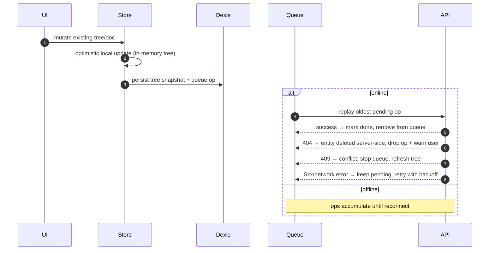

# Phase 4.7: Offline-First Architecture

## Status: IMPLEMENTED (2026-02-19)

## Problem

Writers need reliable offline editing. Today, document content has partial offline behavior, but tree/thread/project reads and mutation retries are inconsistent across reloads.

## 1. Validated Current State

| Area | Current Behavior | Offline Impact |
|---|---|---|
| `useEditorStore` | Uses `loadWithPolicy(new ReconcileNewestPolicy())` over `db.documents` + REST | Cached docs can render; non-collab save retries are in-memory only (lost on reload) |
| `useTreeStore` | Always fetches `/api/projects/{id}/tree`; caches document content to `db.documents` but does NOT cache tree metadata (folders, doc metadata) | Tree is empty on cold offline start |
| `useProjectStore` | Zustand `persist` stores project list + current project in localStorage | Project list can render offline; mutations still fail offline |
| `useThreadStore` | Network-driven; no Dexie reads/writes; persist `partialize: () => ({})` | No durable offline thread cache |
| `useUIStore` | localStorage-only UI preferences/state | Works offline (UI only) |
| Collab (`useDocumentCollab` + cm6 runtime) | `IndexeddbPersistence` (`y-indexeddb`) is active; runtime bootstraps REST text only when Yjs doc is empty | Local Yjs edits persist offline; sync resumes on re-subscribe |
| Connectivity UI | `useErrorStore` + `ErrorProvider` + `NetworkStatusBanner` already handle `online/offline` | Existing offline banner exists; no need for a second connectivity store |

### Current tree mutation pattern (all methods in `useTreeStore`)

Every mutation follows the same flow:
1. `set({ error: null })` — clear error state
2. `await api.<entity>.<verb>(...)` — call REST API (no optimistic update)
3. `await loadTree(projectId)` — full tree reload from server

No optimistic local state updates exist today. All mutations fail immediately if offline.

## 2. Corrections Applied to This Plan

1. `y-indexeddb` is already in production use (`useDocumentCollab.ts`), not planned/future.
2. `ReconcileNewestPolicy` is correctly "cache first, server reconcile, local wins on tie".
3. Dexie `threads`/`messages` tables exist but are currently unused by `useThreadStore`.
4. `y-indexeddb` is separate IndexedDB storage, not a Dexie table relationship.
5. Collab docs do not use REST save path while collab is enabled (`useDocumentSync` is disabled in `EditorPanel`).
6. Connectivity baseline already exists; do not add a parallel `useConnectivityStore`.
7. `useTreeStore` caches document **content** to `db.documents` during `loadTree`, but does NOT cache tree metadata (folders, document metadata without content). The plan previously conflated these.
8. Current `RetryScheduler` (in `retry.ts`) uses an in-memory `Map`, ticks every 1000ms, max 3 attempts with jittered backoff. The persistent save retry (Slice 2) replaces this Map with Dexie while keeping the same scheduler interface.

## 3. Scope (Phase 4.7)

### In Scope

| Capability | Why |
|---|---|
| Persist non-collab document save retries across reload | Fixes current data-loss window in `sync.ts` retry queue |
| Tree offline read from IndexedDB | Removes "empty tree on cold offline start" |
| Offline queue for tree mutations on existing entities (rename/move/delete docs/folders) | High writer value without temp-ID complexity |
| Reconnect drain/reconcile for queued mutations | Makes offline mutations durable |
| Reuse existing offline UI + collab connection indicators | Avoid duplicate connectivity systems |

### Deferred (Out of Scope for 4.7)

| Deferred Item | Reason |
|---|---|
| Offline create doc/folder with temp UUID mapping | High complexity; requires local ID remap + URL/routing migration work |
| Offline project mutations | Lower writer-critical value vs docs/tree |
| Thread/turn offline cache | Large store (`useThreadStore`) with separate pagination complexity |
| Service worker/PWA layer | Not required for data durability goals |
| Backend ETag/If-Modified-Since work | Optimization, not prerequisite for offline correctness |
| Dexie cache eviction for stale project trees | Low risk (tree snapshots are small); add eviction if/when needed |

## 4. Target Architecture (4.7 Scope)

### Data Ownership

| Data | Source of Truth | Local Persistence |
|---|---|---|
| Non-collab document content | REST document + local optimistic writes | Dexie `documents` + persistent save-op queue |
| Collab doc content (`.md`, `.markdown`, `.txt`) | Yjs CRDT (`CollabSyncRuntime`) | `y-indexeddb` (separate from Dexie) |
| Tree metadata | REST tree endpoint | Dexie `projectTrees` cache snapshot (blob per project) |
| UI connectivity | Existing `useErrorStore` + collab state | localStorage (UI) + runtime state |

### Dexie Schema Changes (v4 → v5)

Current schema (v4):
```
documents: "id, projectId, folderId, updatedAt"
threads:   "id, projectId, createdAt"
messages:  "id, threadId, createdAt, lastAccessedAt"
```

New in v5 (additive only — existing tables unchanged):

| Table | Shape | Indexes | Purpose |
|---|---|---|---|
| `projectTrees` | `{ projectId, folders, documents, updatedAt }` | `projectId` (primary key) | Cached tree snapshot as blob per project. `folders: Folder[]`, `documents: Document[]` (without content). One row per project. |
| `pendingDocumentSaves` | `{ documentId, content, createdAt }` | `documentId` (primary key) | Durable retry for non-collab content saves. Keyed by documentId so newer saves overwrite older (last-write-wins). |
| `pendingTreeOps` | `{ id, projectId, opType, entityType, entityId, params, createdAt, status }` | `++id, projectId, [projectId+status]` | Durable queue for offline tree mutations. `opType`: `'rename'|'move'|'delete'`. `entityType`: `'document'|'folder'`. `params`: operation-specific data (e.g., `{name}` for rename, `{folderId}` for move). `status`: `'pending'|'done'|'failed'`. |

Design notes:
- **`projectTrees` stores a blob, not decomposed rows.** The tree is always fetched whole from the API and always consumed whole by `buildTree()`. Decomposing into per-folder/per-doc rows adds query complexity without benefit — we never read individual folders from cache. One row per project keeps reads and writes simple.
- **`pendingDocumentSaves` uses `documentId` as primary key** (not auto-increment). Only the latest content matters — newer saves overwrite stale ones. This avoids queue growth during long offline typing sessions.
- **`pendingTreeOps` uses `++id` for ordering.** Tree ops must replay in FIFO order. The compound index `[projectId+status]` allows efficient "drain all pending ops for this project" queries.
- **Separate tables for doc saves vs tree ops.** They have different shapes, different drain strategies (doc saves are idempotent last-write-wins; tree ops are ordered and non-idempotent), and different conflict resolution. Merging them would violate ISP.

### Write Flow (Scoped)



### Tree Mutation Pattern (Offline-Aware)

When a user triggers a tree mutation (rename/move/delete) in `useTreeStore`:

```
1. Update in-memory store state optimistically
   (update folders/documents arrays → rebuild tree via buildTree())
2. Write updated tree snapshot to Dexie projectTrees
3. IF online:
     a. Call REST API directly (existing pattern)
     b. On success: loadTree() to reconcile with server state
     c. On failure: queue op to pendingTreeOps, keep optimistic state
4. IF offline:
     a. Queue op to pendingTreeOps
     b. No API call (user sees optimistic state until reconnect)
```

This replaces the current pattern (no optimistic update → API call → full reload).

### Queue Drain Strategy

The drain runs when transitioning from offline to online:

1. **Trigger:** Listen to `window.addEventListener('online', ...)` via existing `useErrorStore`. Also tick on a safety-net interval (every 30s when online) in case the `online` event is missed.
2. **Pre-drain:** Refresh tree from server to get authoritative state.
3. **Drain loop:** Process `pendingTreeOps` in FIFO order (by `++id`):
   - **Success (2xx):** Mark op as `done`, remove from Dexie.
   - **404 (entity gone):** Drop op, log warning. Entity was deleted server-side while offline — no user action needed beyond a notification.
   - **409 (conflict):** Stop drain. Refresh tree from server. Surface conflict to user (e.g., "Offline changes to [name] conflict with server. Server version kept.").
   - **4xx (400, 403):** Drop op as permanent failure. Log error.
   - **5xx / network error:** Stop drain. Retry on next tick.
4. **Post-drain:** Refresh tree from server to reconcile fully.
5. **For `pendingDocumentSaves`:** Drain independently (simpler — each save is idempotent). On reconnect, iterate all rows, call `syncDocument()` for each, remove on success. Failure = keep for next retry.

### Online vs Queued Op Race Prevention

When the user performs a tree mutation **while online** and there are queued ops for the same entity:

1. Before executing the direct API call, check `pendingTreeOps` for ops targeting the same `entityId`.
2. If found: drain those ops first (or discard them if the new online action supersedes them).
3. Rule: **online user intent always wins over stale queued ops.** A rename queued offline followed by a rename online → discard the offline rename.

Coalescing rules for queued ops:
- Rename A → "X", then rename A → "Y": keep only the second rename.
- Move A to B, then move A to C: keep only the second move.
- Rename A, then delete A: keep only the delete.
- Multiple ops on different entities: preserve all (no coalescing across entities).

### Conflict Resolution: Queued Op vs Server-Side Change

| Queued Op | Server State | Resolution |
|---|---|---|
| Rename doc A | Doc A exists | Apply rename (server accepts) |
| Rename doc A | Doc A deleted by another user | API returns 404 → drop op, notify user: "Document was deleted while offline" |
| Delete folder X | Folder X has new children | API returns 409 → stop drain, refresh tree, notify user |
| Move doc A to folder B | Folder B deleted | API returns 404 for target → drop op, notify user |
| Rename doc A | Doc A renamed by another user | API accepts (last-write-wins at API level) |

## 5. Slice Plan

| # | Slice | Depends On | Key Files | Exit Criteria |
|---|---|---|---|---|
| 1 | Dexie schema v5 + op models + types | - | `frontend/src/core/lib/db.ts`, new `frontend/src/core/lib/offlineTypes.ts` | New tables migrate cleanly (v4 → v5); TypeScript types for `PendingDocumentSave`, `PendingTreeOp`, `ProjectTreeCache` exported; no runtime behavior change |
| 2 | Persistent non-collab save retry | 1 | `frontend/src/core/lib/sync.ts`, `frontend/src/core/services/documentSyncService.ts`, `frontend/src/core/components/SyncProvider.tsx` | `documentSyncService.save()` writes to `pendingDocumentSaves` on network error instead of in-memory map; `SyncProvider` drains `pendingDocumentSaves` on startup + `online` event; retries survive reload |
| 3 | Tree cache read + write | 1 | `frontend/src/core/stores/useTreeStore.ts` | `loadTree()` writes to `projectTrees` on success; on cold start (offline or slow network), reads cached tree from `projectTrees` and emits immediately (like `ReconcileNewestPolicy`: cache first, then server reconcile); cold offline start renders last cached tree |
| 4 | Offline tree mutation queue + optimistic updates | 1, 3 | `frontend/src/core/stores/useTreeStore.ts`, new `frontend/src/core/services/treeSyncService.ts` | Rename/move/delete update in-memory tree optimistically, write snapshot to `projectTrees`, queue op to `pendingTreeOps` when offline; online mutations still call API directly; new `treeSyncService` owns queue CRUD |
| 5 | Queue drain + reconciliation | 2, 4 | `frontend/src/core/services/treeSyncService.ts`, `frontend/src/core/lib/sync.ts`, `frontend/src/core/components/SyncProvider.tsx` | On reconnect: drain `pendingTreeOps` FIFO with conflict handling (404 drop, 409 stop+refresh, 5xx retry); drain `pendingDocumentSaves`; coalesce redundant ops before drain; online mutations discard stale queued ops for same entity |
| 6 | Connectivity/status UX integration | 2, 5 | `frontend/src/shared/components/NetworkStatusBanner.tsx`, `frontend/src/features/documents/components/CollabConnectionIndicator.tsx` | Banner shows "X changes pending" count from Dexie queues; syncing indicator during drain; no new stores |
| 7 | Tests + docs | 1-6 | `frontend/tests/**`, `_docs/features/**`, `_docs/plans/**` | Unit tests for queue CRUD, coalescing, drain conflict handling; integration test for reload-survives-retry; feature docs updated; plan marked IMPLEMENTED |

### Slice sizing notes

- **Slices 2 and 3 are independent** and can be implemented in parallel after Slice 1 lands.
- **Slice 4 is the largest slice.** It adds optimistic tree updates (changing every mutation method in `useTreeStore`) plus queue writes. Consider splitting into 4a (optimistic updates only, no queue) and 4b (add queue) if it's too large during implementation.
- **Slice 7 is intentionally test + docs only.** Tests for individual slice behavior should be written alongside each slice (not deferred to 7). Slice 7 covers integration-level tests and documentation sync.

## 6. Risks and Mitigations

| Risk | Likelihood | Impact | Mitigation |
|---|---|---|---|
| Stale queued op conflicts with newer server state | Medium | High | Pre-drain tree refresh; stop on 409; 404 = drop + notify; coalesce before drain |
| Online mutation races with queued op for same entity | Medium | High | Check queue before online API call; discard stale queued ops; online intent always wins |
| Queue growth during long offline sessions | Medium | Medium | Hard cap (100 ops max) + user warning; coalesce redundant ops (rename+rename → keep last) |
| Divergence between cached tree and server after reconnect | Medium | Medium | Always refresh tree after drain completes (post-drain reconcile) |
| Non-collab retry queue corruption | Low | High | Strict schema, migration tests, fail-fast logging |
| Optimistic tree state visible but mutation fails on reconnect | Medium | Medium | Post-drain tree refresh corrects optimistic state; user notification for dropped ops |

## 7. Rollout

All changes in Phase 4.7 are **additive** and do not modify existing online-first behavior:

- New Dexie tables are inert until code writes to them.
- Tree cache read is a new code path before the existing API fetch — if cache is empty, existing behavior is unchanged.
- Optimistic tree updates only differ from current behavior when offline (online mutations still call API + reload).
- Queue drain only activates when there are pending ops.

Therefore, **no feature flag is needed**. The new code paths activate naturally when offline conditions occur. If a regression is found, the fix is to revert the specific slice — the Dexie tables remain inert.

### Rollback

1. Revert the offending slice's code changes.
2. New Dexie tables remain in schema (empty/inert — no destructive migration needed).
3. Existing online-first behavior is preserved as the fallback.
