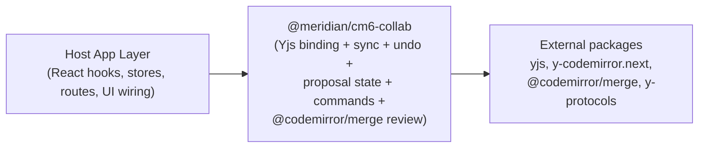

# Collaboration Spec: CM6 Library Model

**Status:** Draft
**Purpose:** Enforce a reusable CM6 library boundary for Yjs collaboration + AI proposal handling.

## Key Simplification (Yjs + Go-Only)

The OT plan required 4 CM6 packages with 9 port interfaces. With Yjs and a single-WS Go backend, this collapses to **1 package** (`@meridian/cm6-collab`) because:
- Yjs handles most of what the ports abstracted (version tracking, operation read/write, conflict resolution).
- No separate Node service means no adapter package for ticket/auth/ws wiring.
- All transport goes through one WebSocket — no REST endpoints for proposals.
- The proposal system fundamentally depends on the Yjs doc (`accept = Y.applyUpdate`), making a separate proposal package an artificial boundary.

## Layer Contract (Required)



Required dependency direction:
- `@meridian/cm6-collab` must not import app framework code (`react`, app stores, router, feature hooks).
- Host app layer may import the CM6 package; the CM6 package must not import host app modules.
- Transport/auth details are isolated in the host app layer, not in the CM6 package.

## Internal Module Structure

```
packages/cm6-collab/src/
├── sync/        # Yjs binding (y-codemirror.next), sync state tracking (connected/syncing/disconnected), Y.UndoManager
├── proposals/   # Proposal domain state, proposal event callbacks (invoked by host), accept/reject commands
└── review/      # @codemirror/merge review integration, presentation policy
```

Internal modules are implementation detail — the package exposes a unified public API.

## Package Responsibilities (Required)

| Concern | Owns | Must Not Own |
|---|---|---|
| Sync | Yjs binding (`y-codemirror.next`), `Y.UndoManager` integration, sync state tracking (connected/syncing/disconnected), awareness wiring, transport-agnostic message handling (via injected callbacks) | React hooks, app stores, WS connection lifecycle |
| Proposals | Proposal domain state, proposal event callbacks (host invokes on WS JSON receipt), accept/reject commands | Router coupling, app-specific UI components |
| Review | `@codemirror/merge` review integration, `ReviewPresentationPolicy` | App-specific review chrome |
| Host app | Hooks, stores, page composition, project navigation, permissions UI, JWT auth | Reimplementation of CM6 core/proposal/review algorithms |

### Why 1 Package Instead of 4

| OT Plan Package | Current Plan | Reason |
|---|---|---|
| `cm6-collab-core` | `@meridian/cm6-collab` (sync module) | Renamed; Yjs binding replaces OT extension |
| `cm6-ai-proposals` | `@meridian/cm6-collab` (proposals module) | Merged; proposals depend on `Y.Doc` for accept (`Y.applyUpdate`) — separate package creates artificial boundary |
| `cm6-ai-review` | `@meridian/cm6-collab` (review module) | Merged; review is tightly coupled to proposal state |
| `cm6-meridian-adapter` | **Removed** | No separate Node service to adapt to. WS connection + JWT auth handled in host app layer. Single WS eliminates ticket/auth adapter complexity. |

### Port Interfaces Removed

The 9 port interfaces from the OT plan collapse because Yjs handles their responsibilities:

| OT Port | Yjs Replacement |
|---|---|
| `OperationWriter` | Yjs internal (binary updates) |
| `OperationReader` | Yjs internal (state vector sync) |
| `OperationCleaner` | Not needed — no op log |
| `SnapshotPort` | Simple binary read/write |
| `CollabTransportPort` | Single WS connection in host app |
| `ConflictPolicy` | Not needed — CRDTs are conflict-free |

Remaining interfaces (kept, simplified):
- `ProposalQueryPort`: proposal state from WS JSON frames (no HTTP queries).
- `ProposalCommandPort`: accept/reject commands sent as WS JSON frames with idempotency-key passthrough.
- `ReviewPresentationPolicy`: sentence/paragraph chunking and low-noise diff heuristics.

## Substitutability Rules (Required)

- Replacing the Yjs provider (e.g., `y-websocket` -> Hocuspocus) must not change `@meridian/cm6-collab` behavior contracts.
- Replacing review UI implementation must preserve proposal state transitions and command outcomes.
- Package replacements must keep API key casing contract unchanged (`camelCase` outward).

## Exit Criteria Impact

Phase gates must verify:
- Phase 1: Yjs editor works using `@meridian/cm6-collab` sync module with no app-specific imports in the package. Offline persistence via `y-indexeddb`.
- Phase 2: persistent undo uses `Y.UndoManager` via `@meridian/cm6-collab`, not app-local forked undo logic.
- Phase 3: proposal review works using `@meridian/cm6-collab` proposals/review modules, while host app hooks remain thin orchestration adapters.
- Phase 4: arbitration-related proposal behavior changes are exposed via package interfaces and do not force app-level business-logic forks.
- Phase 5: multi-user presence/cursor/permission UX builds on package-owned editor state modules, not app-local reimplementation.

## Related

- `_docs/plans/fb-realtime-collab-editing.md`
- `_docs/plans/collab-ai/spec/api-events-contract.md`
- `_docs/plans/collab-ai/spec/refresh-read-model-framework.md`
- `_docs/plans/collab-ai/phase/phase-1-yjs-sync-and-transport.md`
- `_docs/plans/collab-ai/phase/phase-3-ai-proposals-and-review.md`
