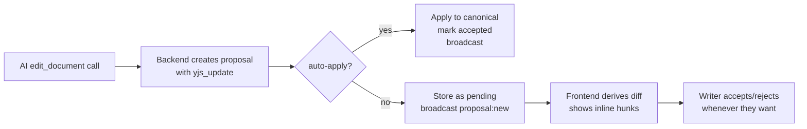
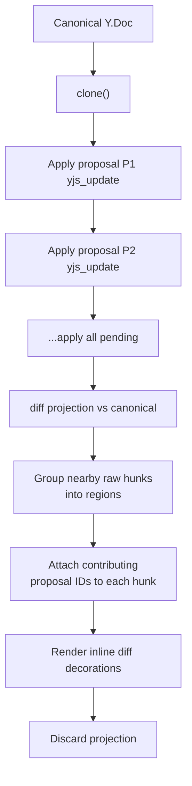
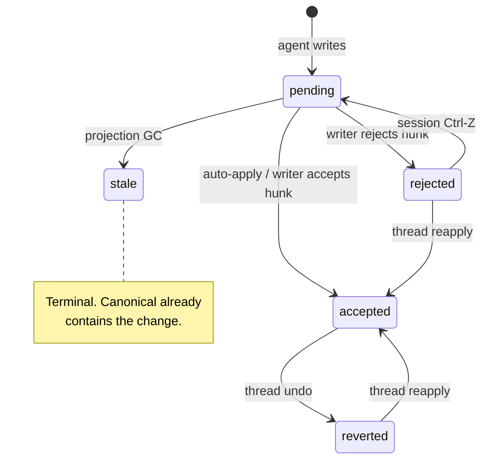

# Architecture: Collab Data Model Evolution

## Overview

This plan covers core data model changes to the collaboration system and an improved manual-path experience for writers who want to review agent changes before they land.

### What's Changing

1. **Append-only persistence** — replace `documents.yjs_state` overwrite with an update log, checkpoints, and bookmarks.
2. **Proposal payload model** — proposals store `yjs_update` (binary Yjs operation) instead of derived text diffs.
3. **Decision state in Yjs** — `Y.Map('_proposal_status')` on canonical Y.Doc tracks accept/reject/stale per proposal, enabling undo and sync.
4. **Ephemeral projection** — no persistent AI document. Diff view is computed on demand from canonical + pending proposals, then discarded.
5. **Projection GC** — auto-resolves proposals whose changes are already in canonical.

### Two Collaboration Modes

Agents write through the same pipeline regardless of mode. The mode determines when changes land on canonical.

| Mode | When agent writes... | Writer experience |
|------|---------------------|-------------------|
| **Auto-apply** (existing) | yjs_update applied to canonical immediately, proposal marked `accepted` | Changes appear inline. Writer can revert via thread undo. |
| **Manual** | yjs_update stored as `pending` proposal | Writer sees diff hunks, accepts/rejects/edits when ready. No session — changes accumulate continuously. |

Both modes are continuous. There is no "review session" with entry/exit. In manual mode, pending proposals are always visible as inline diffs whenever they exist.



## Core Data Flow (Manual Path)

| Step | Operation | Persisted outcome |
|------|-----------|-------------------|
| Derive diff | Clone canonical, apply each `pending` proposal update, diff, group nearby regions | None (ephemeral) |
| Projection GC | Pending proposal yields no diff — mark `stale` | `_proposal_status` entry + proposal row |
| Accept hunk | Apply grouped hunk proposal updates to canonical + set `_proposal_status` to `accepted` in one transaction | Canonical text + status entries |
| Reject hunk | Set `_proposal_status` to `rejected` for each proposal in hunk | Status entries only |
| Edit | User types after reject, or modifies after accept (`ORIGIN_HUMAN`) | Canonical text mutation |
| Session undo | `undoManager.undo()` on unified stack | Reverts most recent tracked transaction |
| Thread undo | Find/replace (`region_text_after` -> `region_text_before`) + proposal row `reverted` | Canonical text + proposal row |
| Thread reapply | Find/replace (`region_text_before` -> `region_text_after`) + proposal row `accepted` | Canonical text + proposal row |
| Backend mirror | Observe `_proposal_status` deltas from Yjs sync | `proposals.status` mirrored |

### Projection Pipeline



### Example: Ephemeral Projection

Canonical document:

```
The cat sat on the mat.
```

Two pending proposals from different agents:

- **P1** (yjs_update): insert "black " before "cat" → `The black cat sat on the mat.`
- **P2** (yjs_update): replace "mat" with "rug" → `The cat sat on the rug.`

Projection pipeline:

1. Clone canonical → `The cat sat on the mat.`
2. Apply P1 → `The black cat sat on the mat.`
3. Apply P2 → `The black cat sat on the rug.`
4. Diff vs canonical → two raw hunks: insert "black " at pos 4, replace "mat" with "rug" at pos 24
5. These are far apart → two separate hunk regions
6. Hunk A carries `[P1]`, Hunk B carries `[P2]`
7. Writer sees two inline diffs, acts on each independently

If P1 and P2 edited adjacent text (e.g., both touching "cat sat"), they'd merge into one grouped hunk carrying `[P1, P2]` — accepting that hunk applies both.

### Example: Projection GC (Stale Proposal)

Canonical (writer already typed "black"):

```
The black cat sat on the mat.
```

Agent P3 proposes: insert "black " before "cat" — but the canonical already has it.

1. Clone canonical → `The black cat sat on the mat.`
2. Apply P3 yjs_update → `The black cat sat on the mat.` (no change — Yjs is idempotent for already-applied content)
3. Diff vs canonical → empty
4. P3 is auto-marked `stale` (uses `ORIGIN_GC`, not tracked by UndoManager)
5. Thread UI shows "No longer relevant" — no hunk rendered

## State Model

| Layer | Authority | Shape |
|------|-----------|-------|
| Canonical document | Yjs | `Y.Text('content')` |
| Decision state | Yjs | `Y.Map('_proposal_status'): proposalId -> status` |
| Diff hunks | Frontend only | Ephemeral grouped regions from projection |
| Proposal row | Backend | `pending | accepted | rejected | stale | reverted` |

## Proposal Statuses



| Status | Meaning | Undo/Redo? |
|--------|---------|-----------|
| `pending` | Agent wrote, waiting for writer action | N/A |
| `accepted` | Writer accepted (or auto-applied) | Thread undo |
| `rejected` | Writer rejected | Session Ctrl-Z while in stack, or thread reapply |
| `stale` | Canonical already contains the change — auto-resolved by projection GC | No |
| `reverted` | Was accepted, then thread-undone | Thread reapply |

### Example: Why Reject Needs Y.Map

Reject doesn't change the document text — the proposal was never applied to canonical. So how is Ctrl-Z possible?

Canonical: `The cat sat on the mat.`
Pending P1: insert "black " → would produce `The black cat sat on the mat.`

**Writer rejects P1:**

```
Transaction (ORIGIN_REJECT):
  Y.Text('content'):       unchanged — "The cat sat on the mat."
  Y.Map('_proposal_status'): set(P1, 'rejected')
```

The text didn't change, but the Y.Map mutation IS a Yjs operation. UndoManager tracks it.

**Writer presses Ctrl-Z:**

```
UndoManager reverses the transaction:
  Y.Map('_proposal_status'): delete(P1) → back to no entry = pending
  Projection re-derives → P1 reappears as a diff hunk
```

Without Y.Map, reject would be invisible to Yjs and un-undoable.

### Example: Accept Then Undo

Canonical: `The cat sat on the mat.`
Pending P1: insert "black "

**Writer accepts:**

```
Transaction (ORIGIN_ACCEPT):
  Y.Text('content'):       "The cat sat" → "The black cat sat on the mat."
  Y.Map('_proposal_status'): set(P1, 'accepted')
```

Both mutations in one transaction = one undo entry.

**Writer presses Ctrl-Z:**

```
UndoManager reverses:
  Y.Text('content'):       "The black cat sat" → "The cat sat on the mat."
  Y.Map('_proposal_status'): delete(P1) → back to pending
  P1 reappears as a diff hunk
```

## Edit Tool Linkage

- Every AI `edit_document` call creates one proposal row with `status = 'pending'` and its `yjs_update`.
- `edit_tool -> proposal -> yjs_update -> status` chain stays current after every recompute and action.
- Projection GC marks no-diff pending proposals as `stale` on every derive.
- Thread UI reads proposal row status to show `accepted`, `rejected`, `stale`, `reverted`.

## Key Decisions

| Decision | Rationale |
|----------|-----------|
| No persistent AI document | Removes stale state and convergence machinery. Diff is computed on demand. |
| Proposals store `yjs_update` | Binary Yjs operations compose cleanly. No text-diff translation layer. |
| `_proposal_status` in Y.Doc | Enables Ctrl-Z for reject (Y.Map mutation is tracked by UndoManager) and delta-based backend sync. |
| Grouped region hunks | Writers act on visible regions, not individual proposals. Multiple proposals can contribute to one hunk. |
| Immediate actions | No finalization step. Accept/reject are durable immediately. |
| Projection GC | Stale proposals are cleaned up automatically — no manual resolution needed. |
| Edit is plain typing | No separate status. User types with `ORIGIN_HUMAN` after accept or reject. |
| Single UndoManager | One stack across `Y.Text` + `Y.Map`. `clear()` isolates undo history at mode transitions. |
| Append-only persistence | Update log with checkpoints and bookmarks. Foundation for timeline features. |

## Scope

**In scope:**
- Append-only persistence (update log, checkpoints, bookmarks)
- Ephemeral projection + diff pipeline for manual path
- Grouped hunk accept/reject as immediate Yjs transactions
- Projection GC for stale proposal auto-resolution
- `_proposal_status` Y.Map semantics, undo, and backend sync
- Thread-level undo/reapply via stored before/after text

**Out of scope:**
- Multi-user concurrent conflict policy
- Backend hunk derivation or persistence
- Persistent AI-version Y.Doc

## Cross-References

- [Append-Only Persistence](append-only-persistence.md)
- [Dual-Version Yjs Model](dual-version-yjs-model.md)
- [Frontend Diff Model](frontend-diff-model.md)
- [Local-First Authority](local-first-authority.md)
- [Session Undo Design](session-undo-design.md)
- [Schema Design](schema-design.md)
- [Thread-Level Undo](thread-level-undo.md)
- [Implementation Plan](plan.md)
