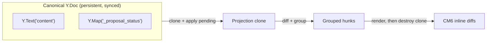

# Dual-Version Yjs Model: Canonical + Ephemeral Projection

## Mental Model

There is one materialized document authority: canonical `Y.Doc`. The projection is ephemeral and computed wherever needed — frontend for diff UI, backend for AI document context.



- `Y.Text('content')` stores canonical text.
- `Y.Map('_proposal_status')` stores decision state by proposal.
- Projection is a throwaway clone. No projection state is stored in Postgres or Yjs.
- Projection is per-user: only pending proposals where `created_by_user_id = current_user` are applied.
- Frontend uses projection for diff UI (hunk rendering). Backend uses projection to give the AI the document view its owner sees.

### Example: What Lives Where

```
Canonical Y.Doc at some point in time:

  Y.Text('content'): "The cat sat on the mat."

  Y.Map('_proposal_status'):
    P1 → 'accepted'     (writer accepted earlier)
    P3 → 'rejected'     (writer rejected earlier)
    (P5 has no entry)   → means pending

Pending proposals in DB (status = 'pending'):
  P5: yjs_update that inserts "fluffy " before "cat"

Projection (ephemeral):
  1. clone → "The cat sat on the mat."
  2. apply P5 → "The fluffy cat sat on the mat."
  3. diff → one hunk: insert "fluffy " at pos 4, carries [P5]
  4. writer sees inline diff, acts when ready
  5. clone destroyed
```

P1 and P3 are skipped because they already have decisions. Only `pending` proposals feed the projection.

## Data Structures

| Structure | Lifetime | Purpose |
|-----------|----------|---------|
| Canonical Y.Doc | Persistent | Shared document state |
| `_proposal_status` Y.Map | Persistent | Proposal decision state |
| Projection Y.Doc clone | Ephemeral | Diff derivation input |
| Raw hunks | Ephemeral | Direct diff output before grouping |
| Grouped hunks | Ephemeral | UI rendering regions mapped to proposal sets |

## Projection Computation

```typescript
const projection = cloneDoc(canonicalDoc);
const proposalTouches = new Map<ProposalId, TextRegionSet>();

for (const proposal of proposals) {
  if (proposal.status === 'pending') {
    const touched = applyUpdateAndTrackRegions(projection, proposal.yjs_update);
    proposalTouches.set(proposal.id, touched);
  }
}

const rawHunks = deriveRawHunks(
  toPlainText(canonicalDoc.getText('content')),
  toPlainText(projection.getText('content'))
);

const groupedHunks = groupNearbyOrOverlapping(rawHunks);
attachContributingProposals(groupedHunks, proposalTouches);
autoResolveStaleProposals(groupedHunks, proposals);

projection.destroy();
```

## Immediate Resolution Effects

- Accept hunk applies all contributing proposal updates to canonical and sets `_proposal_status[proposalId]='accepted'` for each proposal atomically.
- Reject hunk sets `_proposal_status[proposalId]='rejected'` for each contributing proposal atomically.
- Edit is plain `ORIGIN_HUMAN` typing after reject, or modification after accept.
- Projection GC marks pending proposals as `stale` when their update yields no remaining diff.

Accept/reject and stale-GC writes are normal Yjs transactions and therefore sync through existing collab transport.

## Undo Integration

The same UndoManager tracks:

- canonical text mutations
- `_proposal_status` mutations

This gives one chronological undo stack for typing + hunk actions.

## Backend Mirror

Backend listens to synced canonical state changes and mirrors `_proposal_status` values into proposal-row status for querying/reporting. Thread undo/reapply also writes to `_proposal_status`, so all status changes flow through the same mirror path.

## Backend Projection for AI Context

When an AI agent reads the document (e.g., to generate its next `edit_document` call), the backend computes the same projection:

1. Load canonical Y.Doc state
2. Clone
3. Apply pending proposals where `created_by_user_id = thread_owner`
4. Extract text — this is what the AI sees

This ensures the AI works against the same view its owner sees. Without this, an AI in manual mode would propose edits against canonical text that doesn't include its own pending proposals — leading to conflicts and incoherent edits.

## Multi-User Hunk Visibility

One projection includes all pending proposals for the current user. In multi-user collaboration, other users' pending proposals are not in your projection. However, the frontend can query all pending proposals to render awareness indicators ("User B's AI edited near paragraph 3") without showing the actual content — see [Architecture](architecture.md).

## What Does Not Exist

- No persistent AI-version Y.Doc or Y.Text
- No `ai_content` column
- No backend hunk table
- No one-proposal-to-one-hunk identity
- No separate review-edit proposal status value
- No extra review command protocol

## Cross-References

- [Architecture](architecture.md)
- [Frontend Diff Model](frontend-diff-model.md)
- [Local-First Authority](local-first-authority.md)
- [Session Undo Design](session-undo-design.md)
- [Schema Design](schema-design.md)
