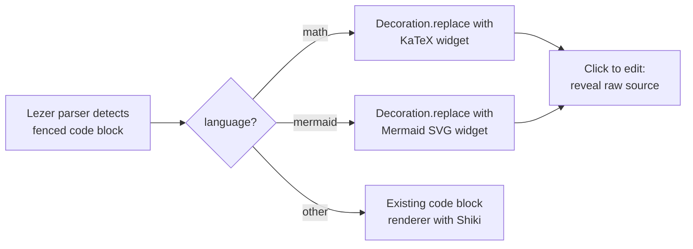
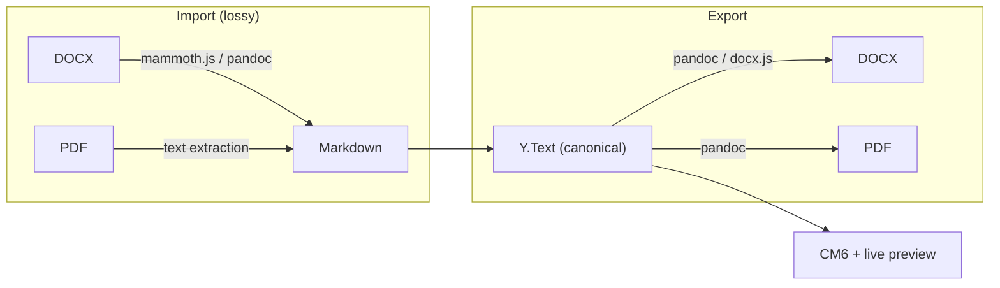

# Editor Strategy

## Decision: Stay on CM6

CodeMirror 6 remains the editor foundation. The canonical document model remains **markdown text in a `Y.Text`**.

### Why Not Switch to ProseMirror/Tiptap

| Concern | CM6 (current) | ProseMirror/Tiptap |
|---------|---------------|-------------------|
| Canonical model | Markdown text (`Y.Text`) | Structured doc tree (`Y.XmlFragment`) |
| AI proposals | Text find-replace, `region_text_before`/`after` | Tree-level operations, more complex diffing |
| Thread undo | String search -- simple, survives compaction | Node-level operations, needs different approach |
| Yjs binding | `y-codemirror.next` (mature) | `y-prosemirror` (also mature, but different CRDT type) |
| Live preview | Custom decoration layer (built, working) | Native rich rendering (would get for free) |
| Migration cost | None | Rewrite 95 files, entire `@meridian/cm6-collab` package |

The v2 collab model (proposals, projection, undo, compaction) is built around text-level operations. Switching editors would require rethinking the data model, not just swapping a rendering layer.

### Why Not WYSIWYG

Full WYSIWYG on CM6 means hiding all markdown syntax via `Decoration.replace()` with atomic cursor skipping. This creates an irreconcilable gap: the user's mental model ("editing formatted text") diverges from CM6's reality (cursor moves through a text buffer with hidden characters). Every edit operation -- backspace, selection, copy/paste, nested formatting -- needs interception to maintain the illusion.

The current live preview (Obsidian-style: hide syntax when cursor is away, reveal on proximity) is the right tradeoff. It's 95% WYSIWYG without the edge-case explosion.

### What Would Force a Revisit

- Block-level editing (Notion-style drag/drop) becoming a core requirement
- DOCX round-trip fidelity becoming critical (not just import/export)
- Live preview bugs becoming untenable despite the renderer registry architecture

None of these are currently on the roadmap.

## Block Rendering Extensions

Extend the live preview renderer registry with rich block renderers. Same architecture as existing heading/emphasis/code renderers -- no new editor infrastructure needed.



### Planned Renderers

| Block type | Syntax | Renderer | Priority |
|-----------|--------|----------|----------|
| Equations | ` ```math ` or `$$...$$` | KaTeX | Now |
| Diagrams | ` ```mermaid ` | Mermaid.js | Now |
| Images | `` | Native `` widget | Near-term |
| Embeds | TBD | iframe/custom widget | Future |

### Undo Interaction

Block rendering does not affect undo. Decorations are derived state -- a pure function of the current markdown text. When `Y.UndoManager` reverts a text operation, the Lezer tree re-parses and decorations rebuild automatically. No block-specific undo logic needed.

### Edit Interaction

"Click to edit" pattern for complex blocks:

1. Block renders as widget (KaTeX formula, Mermaid SVG)
2. User clicks the widget
3. Widget replaced with raw fenced code block (source editing)
4. User edits the source
5. User clicks away or presses Escape
6. Source re-renders as widget

The transition is purely a decoration toggle -- the underlying `Y.Text` always contains the raw markdown.

## DOCX/PDF Import/Export

Markdown remains canonical. DOCX and PDF are conversion formats at the edges, not editing formats.



### Design Principles

- **Content in, content out** -- not "preserve every Word style." Writers import content into a collaborative AI writing environment, then export a clean formatted document.
- **Lossy import is acceptable** -- complex DOCX formatting (styles, track changes, headers/footers, field codes) does not survive round-trip. The writer reformats in Meridian.
- **Template-based export** -- clean DOCX output using templates (e.g., academic styles: APA, IEEE). Better than trying to preserve original formatting.

### What This Covers

- Researcher workflow: import paper draft, collaborate with AI, export clean DOCX for journal submission
- General writing: write in markdown, export to DOCX/PDF for sharing

### What This Does Not Cover

- Faithful DOCX round-trip (preserving all styles, track changes, comments)
- Editing DOCX natively (would require a different document model)
- PDF editing (PDF is a layout format, not an editing format)

### Equation Export

LaTeX equations in markdown map cleanly to DOCX via pandoc:

```
Markdown:  $E = mc^2$  or ```math block
  -> pandoc -> OMML (Word equation format)
  -> pandoc -> PDF (native LaTeX rendering)
```

This is a strength of keeping LaTeX in markdown rather than a proprietary equation format.

## Cross-References

- [Architecture](architecture.md) -- canonical model, projection pipeline
- [Frontend Diff Model](frontend-diff-model.md) -- CM6 decoration rendering
- [Undo Design](undo.md) -- UndoManager, session + thread undo
- `_docs/features/f-document-editor/rich-text-features.md` -- current live preview renderers
- `_docs/plans/collab-ai/spec/cm6-library-model.md` -- CM6 package boundary
