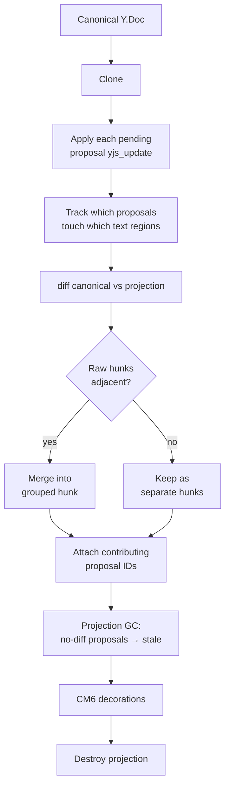

# Frontend Diff Model

## Overview

The frontend derives diff hunks by comparing canonical text with an ephemeral projection. The projection is per-user: only pending proposals where `created_by_user_id = current_user` are applied. Hunks are grouped text regions — the writer acts on what they see, not on individual proposals.

The projection computation itself is shared logic (frontend for diff UI, backend for AI context -- see [Architecture](architecture.md)). This spec covers the frontend-specific diff and rendering pipeline on top of it.

## Derivation Pipeline



Full re-derive triggers: `_proposal_status` map change or proposal-set change. Canonical text changes (user typing) only remap existing decoration positions via CM6 `map()` — no re-derive needed.

## Grouped Hunk Identity

Each hunk represents one visible region that may include one or more proposals. The writer acts on regions, not on proposal rows.

### Example: Hunk Grouping

```
Canonical: "She walked to the store and bought some milk."

Pending proposals:
  P1: replace "walked" with "ran"         (chars 4-10)
  P2: replace "store" with "market"       (chars 18-23)
  P3: replace "milk" with "oat milk"      (chars 40-44)

After projection + diff:
  Raw hunk A: "walked" → "ran"       at 4-10    [P1]
  Raw hunk B: "store" → "market"     at 18-23   [P2]
  Raw hunk C: "milk" → "oat milk"    at 40-44   [P3]

Grouping (nearby threshold ~20 chars):
  A and B are 8 chars apart → MERGE into one grouped hunk [P1, P2]
  C is 17 chars away from B → separate hunk [P3]
```

What the writer sees in the editor:

```
Hunk 1:  "She [walked→ran] to the [store→market] and bought some milk."
         Accept = applies both P1 and P2
         Reject = rejects both P1 and P2

Hunk 2:  "...bought some [milk→oat milk]."
         Accept = applies only P3
```

The writer never needs to know how many proposals contributed. They see regions and act on them.

## Projection GC and Stale Proposals

During projection recompute:

- If applying a pending proposal yields no diff in any grouped hunk, that proposal is stale.
- Stale proposals are auto-resolved to `stale` and never rendered as hunks.
- Thread UI shows stale proposals as "No longer relevant".

## Hunk Actions

| User action | Canonical/map mutation | Next derive result |
|-------------|------------------------|--------------------|
| Accept hunk | Apply all hunk proposal updates + set each proposal status `accepted` in one transaction | Hunk disappears (canonical catches up) |
| Reject hunk | Set each hunk proposal status `rejected` in one transaction | Hunk disappears (pending set shrinks) |
| Edit hunk | Reject then type, or accept then modify (`ORIGIN_HUMAN`) | Hunk disappears or reshapes around new canonical text |
| Undo accept hunk | Revert full transaction | Entire hunk reappears as one undo step |
| Undo reject hunk | Revert full transaction | Entire hunk reappears as one undo step |

## CM6 Rendering

Hunk rendering remains decoration-based:

- Deletions: mark decorations on canonical ranges.
- Insertions: widget decorations for inserted text.
- Replacements: deletion mark + insertion widget.
- Action controls: Keep / Edit / Discard widgets bound to grouped hunk region data.

## Performance

| Workload | Expected cost |
|----------|---------------|
| Clone + apply updates | ~2ms |
| Diff (~2000 words) | ~3-10ms |
| Group + decorate | ~1-3ms |
| Total derive cycle | ~5-15ms |

### Re-Derive Strategy

The full clone/apply/diff pipeline only runs on **proposal events**, not on every keystroke:

| Trigger | Action |
|---------|--------|
| New proposal arrives | Full re-derive |
| Proposal status changes (accept/reject/stale) | Full re-derive |
| User types (canonical text change, no proposal change) | CM6 decoration `map()` shifts hunk positions — no re-derive |

CM6 decorations automatically remap their positions when the document changes via `map()`. User typing shifts existing hunk positions without recomputing the diff. The expensive pipeline only runs when the set of pending proposals or their statuses change.

If proposal events arrive in bursts (e.g., AI streaming multiple `edit_document` calls), debounce re-derive by 50-100ms. Decoration updates lagging by one frame are invisible to the writer. When no proposals are pending, the pipeline is skipped entirely.

## Cross-References

- [Architecture](architecture.md)
- [Local-First Authority](local-first-authority.md)
- [Undo Design](undo.md)
- [Implementation Plan](plan.md)
