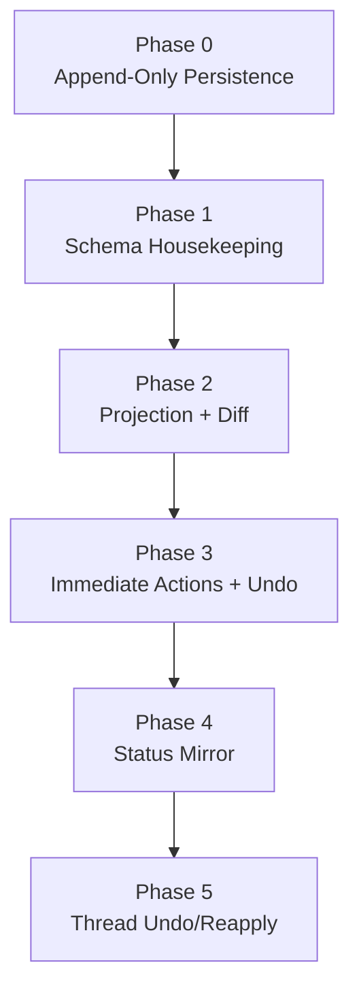

# Implementation Plan

**Status:** draft

## Locked Decisions

| #   | Decision                 | Detail                                                                                                                        |
| --- | ------------------------ | ----------------------------------------------------------------------------------------------------------------------------- |
| 1   | One canonical Y.Doc      | Canonical state lives in `Y.Text('content')` and `Y.Map('_proposal_status')`.                                                   |
| 2   | Ephemeral projection     | Diff view is `clone(canonical) + apply(pending proposal updates) + diff + group`.                                             |
| 3   | Hunk identity            | Hunks are grouped text regions with contributing proposal sets.                                                               |
| 4   | Accept is immediate      | Apply all grouped hunk proposal updates and set `_proposal_status[proposalId]='accepted'` in one transaction.                   |
| 5   | Reject is immediate      | Set `_proposal_status[proposalId]='rejected'` for all proposals in the grouped hunk.                                            |
| 6   | Edit is plain typing     | Edit is reject + type or accept + modify with `ORIGIN_HUMAN`; no separate review-edit status value.                           |
| 7   | Unified UndoManager      | One stack over `[Y.Text('content'), Y.Map('_proposal_status')]`.                                                                |
| 8   | Undo boundaries          | Keep single UndoManager; call `clear()` when collaboration mode changes (auto-apply to manual or vice versa).                 |
| 9   | Projection GC            | Every recompute auto-marks no-diff pending proposals as `stale`.                                                              |
| 10  | Status chain             | `edit_tool -> proposal -> yjs_update -> status` is always current in backend row and thread UI.                               |
| 11  | Thread undo/reapply      | Use `region_text_before/after` text replacement for undo, reapply (from reverted), and reapply (from rejected).               |
| 12  | Thread undo map behavior | Thread undo/reapply writes to both canonical text and `_proposal_status` Y.Map in one transaction (`ORIGIN_THREAD`).           |
| 13  | Immutable thread history | Thread messages are never modified. Tool call status is a UI-only overlay derived from proposal row status.                    |

## Phases

### Phase 0: Append-Only Persistence

Goal: keep existing append-only checkpoint model workstream as foundation.

### Phase 1: Schema Housekeeping

Tasks:

1. Ensure proposal table supports `pending`, `accepted`, `rejected`, `stale`, `reverted`.
2. Add `created_by_user_id` to proposal schema.
3. Ensure `region_text_before` and `region_text_after` are present and documented as captured at proposal creation.
4. Remove `ai_content` from document schema and consumers.

### Phase 2: Projection + Diff Pipeline

Tasks:

1. Implement projection derivation from canonical + pending proposal updates with region tracking.
2. Diff into raw hunks, then group nearby/overlapping hunks into user-facing regions.
3. Attach contributing proposal sets and update references to each grouped hunk.
4. Re-derive on `_proposal_status` or proposal-set changes. Canonical text changes (user typing) only remap decoration positions via CM6 `map()`.
5. Run projection GC on each recompute and auto-mark no-diff proposals as `stale`.
6. Render CM6 decorations for grouped hunk actions.

### Phase 3: Immediate Hunk Actions + Session Undo

Tasks:

1. Wire grouped hunk accept/reject to immediate Yjs transactions.
2. Ensure hunk accept performs multi-update text apply + status writes atomically.
3. Wire auto-apply mode: apply yjs_update to canonical and mark proposal `accepted` on creation.
4. Initialize a single UndoManager over text + status map.
5. Call `undoManager.clear()` on collaboration mode changes (auto-apply to manual or vice versa).
6. Verify one Ctrl-Z undoes the whole grouped hunk transaction.
7. Verify interleaved undo/redo across typing and hunk actions.

### Phase 4: Backend Status Mirror

Tasks:

1. Mirror `_proposal_status` changes into proposal row status.
2. Verify status mirroring is driven by `_proposal_status` key deltas from Yjs sync.
3. Verify row status stays current for `pending`, `accepted`, `rejected`, `stale`, `reverted`.

### Phase 5: Thread-Level Undo/Reapply

Tasks:

1. Implement `thread:undo` (`accepted -> reverted`) via `region_text_after -> region_text_before` replacement.
2. Implement `thread:reapply` (`reverted -> accepted` and `rejected -> accepted`) via `region_text_before -> region_text_after` replacement.
3. Implement `thread:undo_all` — iterate accepted proposals in a thread, undo each independently, return per-proposal results.
4. Apply undo/reapply as canonical Yjs updates appended to `document_updates`.
5. Return conflict when target region no longer exists.
6. Thread UI renders proposal status as overlay on tool calls — no thread message mutation.

## Dependency Graph

## Risk Summary

| Phase | Risk   | Notes                                                 |
| ----- | ------ | ----------------------------------------------------- |
| 1     | Low    | Mostly schema cleanup                                 |
| 2     | Medium | Diff quality and UI derivation correctness            |
| 3     | Medium | Transaction and undo boundary correctness             |
| 4     | Medium | Status mirror consistency                             |
| 5     | Low    | Deterministic text replacement with conflict handling |

## Cross-References

- [Architecture](architecture.md)
- [Frontend Diff Model](frontend-diff-model.md)
- [Local-First Authority](local-first-authority.md)
- [Undo Design](undo.md)
- [Schema Design](schema-design.md)

