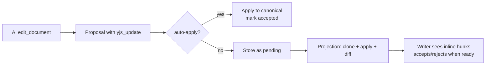

# Collab Data Model v2

**Status:** draft

## Why

The v1 collab design accumulated unnecessary complexity: legacy text-derived hunk identity, extra review-state indirection, delayed resolution semantics, and a persistent AI document. v2 simplifies to one canonical Y.Doc, ephemeral projection, and immediate undoable actions.

This plan covers core data model changes (append-only persistence, yjs_update proposals, decision state in Yjs) and an improved manual-path experience for the writer. Both auto-apply and manual modes are continuous — agents write autonomously, writers manage changes when they want.

## Core Model

- One canonical Y.Doc: `Y.Text('content')` + `Y.Map('_review_status')`
- Proposals store `yjs_update` (binary Yjs operations)
- Diff is ephemeral: clone canonical, apply pending proposals, diff, group into hunks, discard
- Actions are immediate: accept/reject are Yjs transactions, undoable via Ctrl-Z
- Projection GC auto-marks stale proposals (no remaining diff)
- Thread-level undo: revert any individual AI edit through the thread UI, in either mode

## Spec Documents

| Doc | Purpose |
|-----|---------|
| [Architecture](spec/architecture.md) | Data model evolution, two modes, key decisions |
| [Append-Only Persistence](spec/append-only-persistence.md) | Update log, checkpoints, bookmarks, compaction |
| [Dual-Version Yjs Model](spec/dual-version-yjs-model.md) | Canonical Y.Doc + ephemeral projection mental model |
| [Frontend Diff Model](spec/frontend-diff-model.md) | Projection/diff pipeline and grouped region hunks |
| [Local-First Authority](spec/local-first-authority.md) | Immediate local actions and backend status mirroring |
| [Session Undo Design](spec/session-undo-design.md) | Single UndoManager across text + status map |
| [Schema Design](spec/schema-design.md) | Database schema, dual authority, eliminated complexity |
| [Thread-Level Undo](spec/thread-level-undo.md) | Per-proposal undo/redo via stored before/after text |
| [Implementation Plan](spec/plan.md) | Phased execution plan and dependencies |

## Dependencies

- **Yjs collab foundation complete** -- canonical Y.Doc sync is the transport foundation.
- **Current proposal system stable** -- this redesign refines proposal resolution behavior.

## Relationship to Existing Plans

- **Supersedes** v1 specs (`backend-hunk-authority.md`, `proposal-undo.md`)
- **References** `_docs/technical/collab/` for current implementation docs
