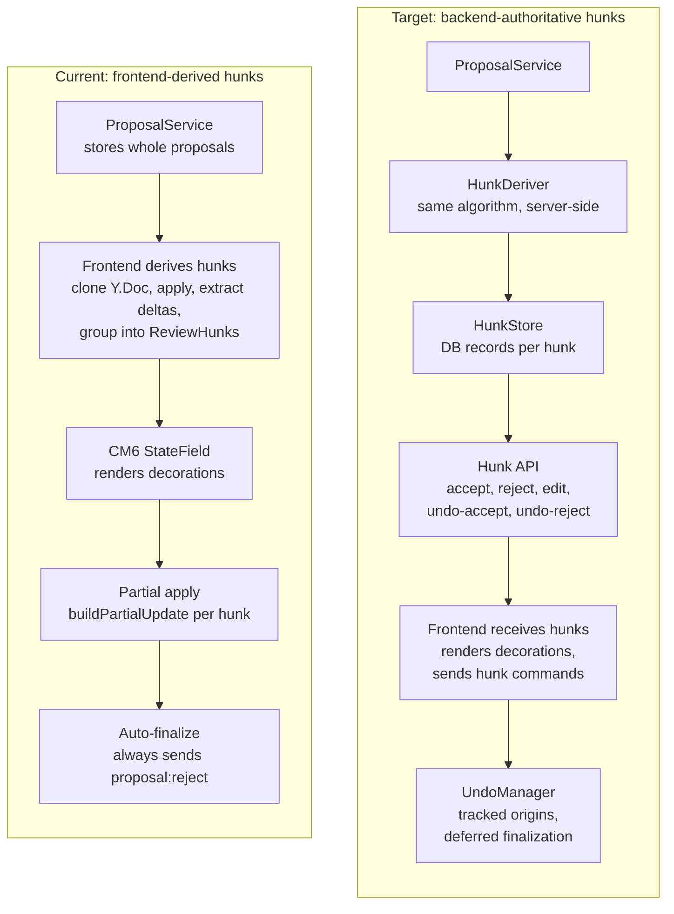
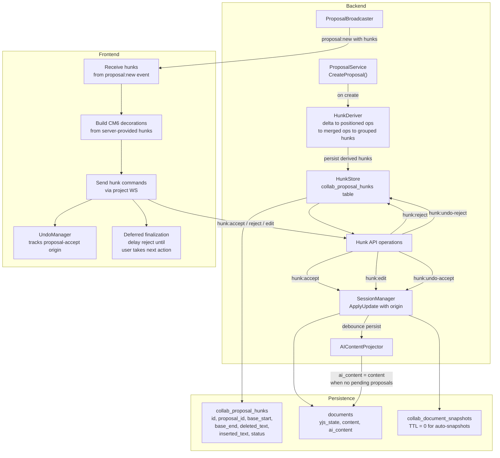
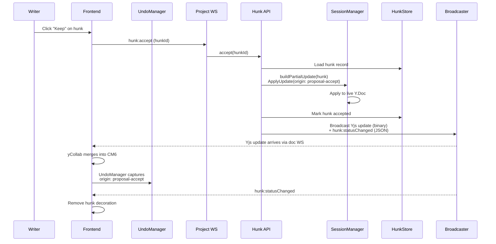
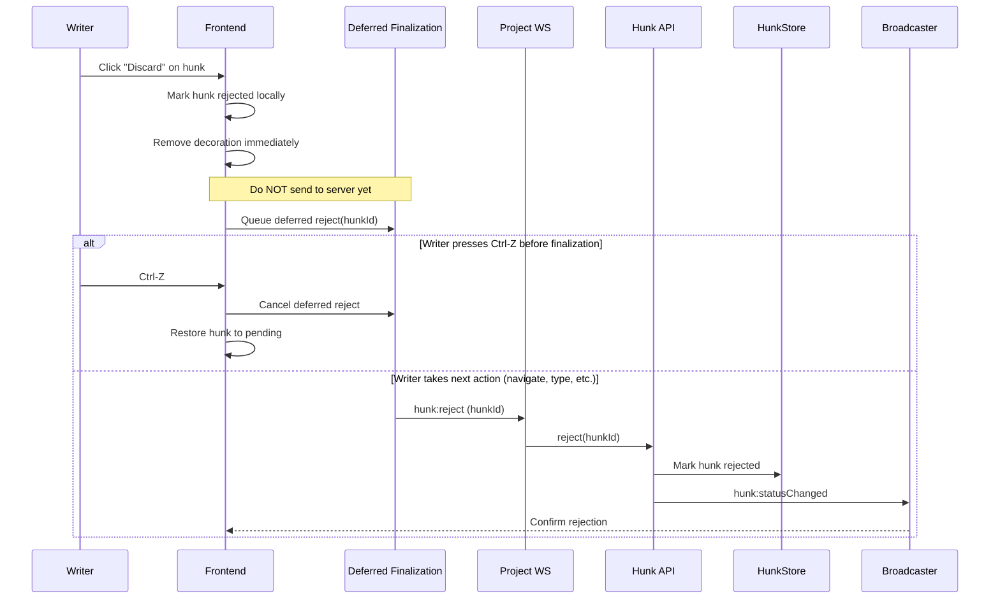
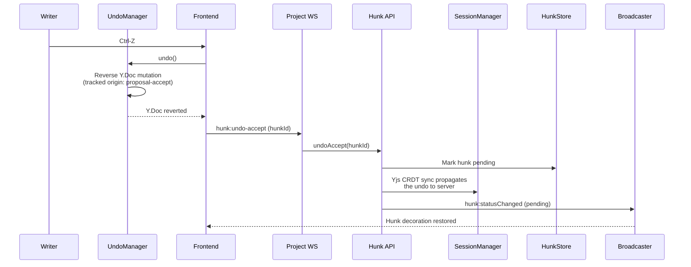

# Collab Review v2: Target Architecture

**Status**: draft

## Overview

This redesign moves hunk derivation and state from the frontend to the backend, making the server the authority on review hunks. It adds undo support for hunk accept/reject via Yjs `UndoManager` with tracked origins and deferred finalization. It also fixes `ai_content` staleness during human editing and removes the aggressive 7-day TTL on auto-snapshots.

## Current vs Target Architecture

## Target Architecture Diagram

## Data Flow: Accept Hunk

## Data Flow: Reject Hunk

## Data Flow: Undo Accept

## Key Design Decisions

| Decision | Rationale |
|----------|-----------|
| Backend derives hunks on proposal create | Single source of truth. Two clients always see identical hunks. Enables server-side undo and hunk history. |
| Hunk records stored in DB | Server authority on hunk state. Supports `undo-accept`, `undo-reject`, and future per-hunk audit trail. |
| Same derivation algorithm (delta to ops to hunks) | Proven correct on frontend. Porting to Go avoids inventing a new grouping strategy. |
| `proposal:reject` replaced by per-hunk operations | Current finalization always sends `proposal:reject` regardless of hunk decisions. Per-hunk ops give the server accurate state. Proposal-level finalization becomes a server-side concern (all hunks resolved = proposal closed). |
| UndoManager with tracked origin `proposal-accept` | Yjs UndoManager natively supports selective undo by origin. Only proposal-accept mutations are reversible via Ctrl-Z; normal typing is unaffected. |
| Deferred finalization for reject | Reject has no Y.Doc mutation to undo. Deferring the server call lets Ctrl-Z flip a rejected hunk back to pending without a round-trip. Auto-finalizes when the writer moves on. |
| `ai_content = content` during persist when no pending proposals | Fixes staleness when auto-accept is ON (common case). Human typing between AI edits no longer desynchronizes `ai_content`. |
| Auto-snapshot TTL set to 0 (infinite) | Fiction writers may need to recover deleted scenes months later. Storage cost is negligible for text documents. |
| Frontend still renders decorations from hunk data | Server provides the hunk records; frontend maps them to CM6 decorations. No change to the decoration/rendering pipeline. |
| Proposal-level finalization is server-side | When all hunks in a proposal are resolved (accepted, rejected, or edited), the server closes the proposal automatically. Frontend does not need to track cross-hunk completion. |

## Scope

This redesign covers:
- Backend hunk derivation, storage, and API
- Hunk-level accept/reject/edit/undo operations
- UndoManager integration with tracked origins
- Deferred finalization for reject undo
- `ai_content` consistency fix during persistence
- Auto-snapshot TTL removal

This redesign does NOT cover:

| Out of scope | Why |
|-------------|-----|
| Suggestion mode UI (tracked-changes rendering) | Separate UX project; see `_docs/technical/collab/ideal-state.md` Priority 3 |
| Comment threads on hunks | Future feature; hunk records enable it but it is not part of this redesign |
| Transport unification (single WS) | Tracked separately in `_docs/plans/ws-transport-v2/` |
| Multi-user concurrent review | Hunk records support it structurally, but the UX for conflict resolution is a separate design |
| AI rationale per hunk | Requires LLM integration changes beyond the review system |
| Hunk edit UI (inline editing of proposed text) | The `hunk:edit` API operation is defined here, but the editor UI for modifying proposed text is a separate effort |

## Related

- [inline-review.md](../../../technical/collab/inline-review.md) -- Current frontend hunk derivation pipeline
- [ai-edit-flow.md](../../../technical/collab/ai-edit-flow.md) -- End-to-end AI edit flow
- [ai-content-projection.md](../../../technical/collab/ai-content-projection.md) -- Current ai_content recompute triggers
- [yjs-state-lifecycle.md](../../../technical/collab/yjs-state-lifecycle.md) -- Session manager, persistence, snapshots
- [ideal-state.md](../../../technical/collab/ideal-state.md) -- Long-term collab vision
- [ws-transport-v2 architecture](../../ws-transport-v2/spec/architecture.md) -- Transport redesign (separate effort)
