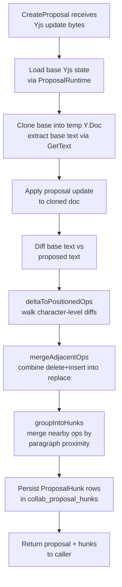
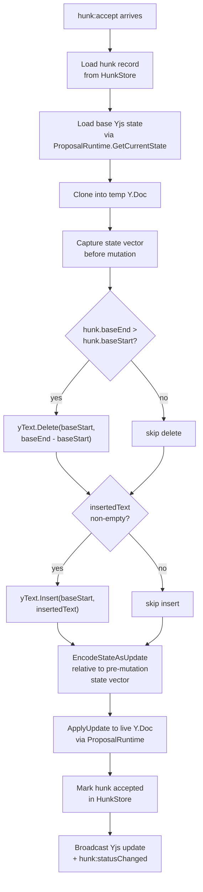
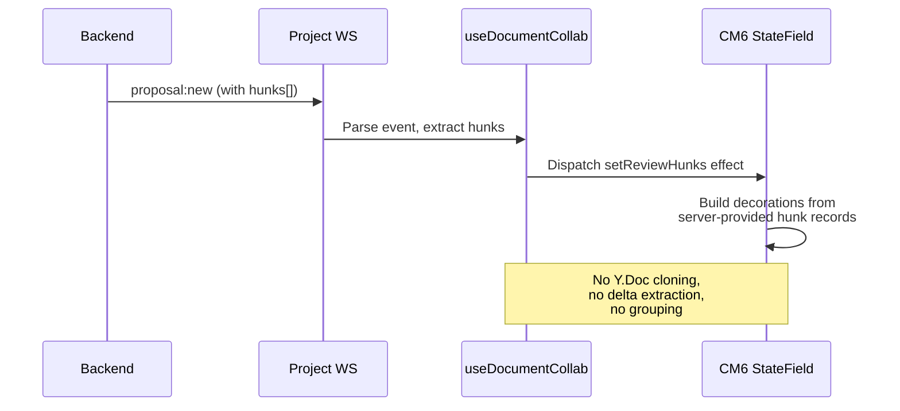

# Backend Hunk Authority

**Status**: draft

## Why Move Hunks to Backend

| Problem (current) | Solution (backend hunks) |
|---|---|
| Two clients derive different hunks if they have different Y.Doc timing | Single derivation at proposal creation; all clients see identical hunks |
| Frontend clones Y.Doc per proposal just to extract diffs (expensive for large documents) | Derivation happens once on the server; frontend receives finished hunk records |
| No undo authority: hunk accept is a fire-and-forget Y.Doc mutation | Server tracks hunk status; `undo-accept` reverses a known mutation |
| No hunk history trail: frontend discards hunk data after finalization | `collab_proposal_hunks` table retains accepted/rejected state for audit |
| Partial-accept logic (buildPartialUpdate) runs on every client independently | Server builds the partial Yjs update once; broadcast propagates it |
| `ai_content` cannot account for individual hunk decisions | Server recomputes `ai_content` after each hunk resolution |

## Data Model

### New Table: `collab_proposal_hunks`

```sql
CREATE TABLE ${TABLE_PREFIX}collab_proposal_hunks (
    id            UUID PRIMARY KEY DEFAULT uuid_generate_v4(),
    proposal_id   UUID NOT NULL
        REFERENCES ${TABLE_PREFIX}collab_document_edit_proposals(id) ON DELETE CASCADE,
    document_id   UUID NOT NULL
        REFERENCES ${TABLE_PREFIX}documents(id) ON DELETE CASCADE,
    hunk_index    INTEGER NOT NULL,
    base_start    INTEGER NOT NULL,
    base_end      INTEGER NOT NULL,
    deleted_text  TEXT,
    inserted_text TEXT,
    status        TEXT NOT NULL DEFAULT 'pending'
        CHECK (status IN ('pending', 'accepted', 'rejected')),
    created_at    TIMESTAMPTZ NOT NULL DEFAULT NOW(),
    updated_at    TIMESTAMPTZ NOT NULL DEFAULT NOW()
);

CREATE UNIQUE INDEX idx_${TABLE_PREFIX}prop_hunk_proposal_index
    ON ${TABLE_PREFIX}collab_proposal_hunks(proposal_id, hunk_index);

CREATE INDEX idx_${TABLE_PREFIX}prop_hunk_doc_status
    ON ${TABLE_PREFIX}collab_proposal_hunks(document_id, status);
```

Column semantics match the frontend `ReviewHunk` type (see `frontend/src/core/cm6-collab/review/types.ts`):
- `base_start` / `base_end` are character offsets in the base text at proposal creation time.
- For pure inserts: `base_start == base_end`, `deleted_text IS NULL`.
- For pure deletes: `inserted_text IS NULL`.

### Domain Model

New file: `backend/internal/domain/models/collab/proposal_hunk.go`

```go
type HunkStatus string

const (
    HunkStatusPending  HunkStatus = "pending"
    HunkStatusAccepted HunkStatus = "accepted"
    HunkStatusRejected HunkStatus = "rejected"
)

type ProposalHunk struct {
    ID           uuid.UUID   `json:"id"`
    ProposalID   uuid.UUID   `json:"proposal_id"`
    DocumentID   uuid.UUID   `json:"document_id"`
    HunkIndex    int         `json:"hunk_index"`
    BaseStart    int         `json:"base_start"`
    BaseEnd      int         `json:"base_end"`
    DeletedText  *string     `json:"deleted_text,omitempty"`
    InsertedText *string     `json:"inserted_text,omitempty"`
    Status       HunkStatus  `json:"status"`
    CreatedAt    time.Time   `json:"created_at"`
    UpdatedAt    time.Time   `json:"updated_at"`
}
```

### Table Name Registration

Add `CollabProposalHunks` to `TableNames` in `backend/internal/repository/postgres/connection.go`, following the existing `CollabDocumentProposals` pattern:

```
CollabProposalHunks: fmt.Sprintf("%scollab_proposal_hunks", prefix),
```

## Hunk Derivation Pipeline

Derivation runs inside `ProposalService.CreateProposal` after the proposal row is persisted, within the same transaction.



### Algorithm Port: Go Equivalent

The frontend pipeline has three stages (see code references below). The Go port replicates the same logic using plain string comparison instead of Y.Text delta observation, because the Go `y-crdt` library (`github.com/haowjy/y-crdt v0.0.2`) does not expose an `observe` callback.

**Stage 1 -- Text diff instead of delta observation.**
The frontend captures Yjs deltas via `ytext.observe()` (`changeset-extractor.ts:61-63`). The Go equivalent:

1. Clone base Y.Doc, call `GetText("content").ToString()` to get `baseText`.
2. Apply proposal update to the clone, call `GetText("content").ToString()` to get `proposedText`.
3. Run a character-level diff (Myers or similar) on `baseText` vs `proposedText` to produce positioned ops.

This is equivalent to `deltaToPositionedOps` (`changeset-extractor.ts:89-110`) but driven by text diff instead of CRDT delta.

**Stage 2 -- Merge adjacent ops.**
Direct port of `mergeAdjacentOps` (`changeset-extractor.ts:126-191`): walk the positioned ops list and combine adjacent delete+insert at the same base position into replace ops.

**Stage 3 -- Group into hunks.**
Direct port of `groupIntoHunks` (`hunk-grouper.ts:15-38`) and `mergeNearby` (`hunk-grouper.ts:92-132`): sort by `baseStart`, merge consecutive hunks whose gap text has `<= 2` newline-separated segments.

### Diff Library

Use `github.com/sergi/go-diff/diffmatchpatch` (widely used, MIT licensed) for character-level diffing. The `DiffMain` function produces a list of `(DiffEqual, DiffInsert, DiffDelete)` tuples that map directly to positioned ops.

### New Service: `HunkDeriver`

New file: `backend/internal/service/collab/hunk_deriver.go`

Interface in `backend/internal/domain/services/collab/collab.go`:

```go
type HunkDeriver interface {
    DeriveHunks(ctx context.Context, baseState []byte, yjsUpdate []byte) ([]collabModels.ProposalHunk, error)
}
```

The deriver is stateless -- it takes raw bytes and returns hunk records (without IDs/timestamps; those are set during persistence).

## API Operations

All hunk operations are sent via the project WebSocket, matching the existing proposal command pattern in `frontend/src/core/cm6-collab/proposals/contracts.ts`.

### Commands (client to server)

| Command | Fields | Effect |
|---------|--------|--------|
| `hunk:accept` | `hunkId`, `idempotencyKey` | Build partial Yjs update, apply to Y.Doc, mark hunk accepted |
| `hunk:reject` | `hunkId` | Mark hunk rejected (no Y.Doc mutation) |
| `hunk:edit` | `hunkId`, `insertedText`, `idempotencyKey` | Build partial update with overridden text, apply, mark accepted |
| `hunk:undo-accept` | `hunkId` | Reverse the Yjs mutation (UndoManager on frontend already reverted Y.Doc), mark hunk pending |
| `hunk:undo-reject` | `hunkId` | Mark hunk pending (no Y.Doc mutation to reverse) |
| `hunk:accept-all` | `proposalId`, `idempotencyKey` | Batch accept all pending hunks in the proposal |
| `hunk:reject-all` | `proposalId` | Batch reject all pending hunks in the proposal |

### Message Formats

```jsonc
// hunk:accept
{
  "type": "hunk:accept",
  "documentId": "uuid",
  "hunkId": "uuid",
  "idempotencyKey": "client-generated-uuid"
}

// hunk:reject
{
  "type": "hunk:reject",
  "documentId": "uuid",
  "hunkId": "uuid"
}

// hunk:edit (accept with modified inserted text)
{
  "type": "hunk:edit",
  "documentId": "uuid",
  "hunkId": "uuid",
  "insertedText": "modified text",
  "idempotencyKey": "client-generated-uuid"
}

// hunk:undo-accept
{
  "type": "hunk:undo-accept",
  "documentId": "uuid",
  "hunkId": "uuid"
}

// hunk:undo-reject
{
  "type": "hunk:undo-reject",
  "documentId": "uuid",
  "hunkId": "uuid"
}

// hunk:accept-all
{
  "type": "hunk:accept-all",
  "documentId": "uuid",
  "proposalId": "uuid",
  "idempotencyKey": "client-generated-uuid"
}

// hunk:reject-all
{
  "type": "hunk:reject-all",
  "documentId": "uuid",
  "proposalId": "uuid"
}
```

### Events (server to client)

```jsonc
// Hunks delivered with proposal (extends existing proposal:new)
{
  "type": "proposal:new",
  "proposal": { /* existing fields */ },
  "hunks": [
    {
      "id": "uuid",
      "proposalId": "uuid",
      "hunkIndex": 0,
      "baseStart": 42,
      "baseEnd": 67,
      "deletedText": "old paragraph text",
      "insertedText": "rewritten paragraph text",
      "status": "pending"
    }
  ]
}

// Single hunk status change
{
  "type": "hunk:statusChanged",
  "documentId": "uuid",
  "hunkId": "uuid",
  "proposalId": "uuid",
  "status": "accepted" | "rejected" | "pending"
}

// Batch result for accept-all / reject-all
{
  "type": "hunk:batchResult",
  "documentId": "uuid",
  "proposalId": "uuid",
  "outcomes": [
    { "hunkId": "uuid", "status": "accepted" },
    { "hunkId": "uuid", "status": "accepted" }
  ]
}
```

## Partial Apply on Backend

When a hunk is accepted, the server builds a partial Yjs update that applies only that hunk's text change. This is the Go equivalent of `buildPartialUpdate` in `frontend/src/core/cm6-collab/review/partial-apply.ts`.

### Algorithm



### Go Implementation Sketch

New file: `backend/internal/service/collab/hunk_applier.go`

The core function mirrors `partial-apply.ts:31-54`:

```go
func buildPartialHunkUpdate(baseState []byte, hunk *collabModels.ProposalHunk, insertedTextOverride *string) ([]byte, error) {
    // 1. Clone base state into temp doc
    // 2. Capture state vector before edit
    // 3. Delete [baseStart, baseEnd) if range is non-empty
    // 4. Insert text at baseStart if non-empty
    // 5. EncodeStateAsUpdate relative to pre-edit state vector
}
```

**UTF-16 conversion**: Y.Text positions in the Go library (`y-crdt`) use UTF-16 code units, same as the JS Yjs library. The `utf16Len` helper already exists in `backend/internal/service/collab/yjs_text_converter.go:131-141`. Hunk `baseStart`/`baseEnd` are character offsets from the text diff, so they must be converted to UTF-16 offsets before calling `yText.Delete`/`yText.Insert`.

**For `hunk:edit`**: uses the same function with `insertedTextOverride` set to the client-provided modified text.

### Idempotency

`hunk:accept` and `hunk:edit` produce Y.Doc mutations and use idempotency keys, following the same `collab_request_idempotency` pattern as `proposal:accept` (see `proposal_service.go:196-291`). New scope value: `hunk_accept`.

`hunk:reject`, `hunk:undo-accept`, `hunk:undo-reject` are idempotent by nature (status transition is guarded by current status check) and do not need idempotency keys.

## Auto-Finalization

When all hunks for a proposal reach a terminal status (accepted or rejected), the proposal itself must be finalized.

### Rules

| Condition | Proposal Status | Action |
|-----------|----------------|--------|
| All hunks rejected | `rejected` | No Y.Doc mutation needed |
| Any hunk accepted (rest rejected) | `partially_applied` | New status value |
| All hunks accepted | `accepted` | Equivalent to current whole-proposal accept |

### New Proposal Status

Add `partially_applied` to `ProposalStatus` enum in `backend/internal/domain/models/collab/proposal.go` and to the SQL CHECK constraint.

### Deferred Finalization

Do not finalize the proposal immediately when the last hunk is resolved. Instead:

1. After each hunk status change, check if all hunks are resolved.
2. If yes, schedule finalization after a configurable delay (default: 5 seconds).
3. During the delay window, `hunk:undo-accept` or `hunk:undo-reject` can flip a hunk back to pending, canceling finalization.
4. After the delay, transition the proposal to its final status and recompute `ai_content`.

Implementation: use a `time.AfterFunc` per proposal, tracked in a map guarded by the existing `proposalDocumentGate` mutex pattern. Cancel on any hunk status change that returns a hunk to pending.

### `ai_content` Recompute

On finalization, call `AIContentProjector.Recompute` (same as current proposal accept/reject). The projector already handles mixed proposal states correctly -- it applies all `proposed` status proposals on top of the base state.

During the review window (hunks being resolved one by one), `ai_content` is NOT recomputed per-hunk. The base Y.Doc already reflects accepted hunk mutations (they are applied via `ApplyUpdate`), so `content` stays current. `ai_content` is recomputed on finalization when the proposal leaves `proposed` status.

## Frontend Changes

### Remove

| File | Reason |
|------|--------|
| `changeset-extractor.ts` | Hunk derivation moves to backend `HunkDeriver` |
| `hunk-grouper.ts` | Hunk grouping moves to backend `HunkDeriver` |
| `partial-apply.ts` | Partial apply moves to backend `hunk_applier.go` |
| `applyHunkUpdate()` in `useDocumentCollab.ts` | Replaced by `hunk:accept` / `hunk:edit` WS commands |

### Keep

| File | Reason |
|------|--------|
| `inline-review.ts` | CM6 decoration rendering, unchanged |
| `state.ts` | CM6 state field for review hunks, unchanged |
| `hover-manager.ts` | Hunk hover/click UI, unchanged |
| `hunk-editor.ts` | Inline edit UI for modifying proposed text, unchanged |
| `types.ts` | `ReviewHunk` type -- keep but align fields with server response |

### Modify

| File | Change |
|------|--------|
| `contracts.ts` | Add `hunk:*` command types and builders. Add `hunks` field to `ProposalNewEvent`. Add `HunkStatusChangedEvent` and `HunkBatchResultEvent`. |
| `useDocumentCollab.ts` | Replace local hunk derivation with server-provided hunks from `proposal:new` event. Replace `applyHunkUpdate` with WS command dispatch. |
| `useInlineReview.ts` | Source hunks from server data instead of local extraction. |

### New Data Flow



## Migration Path

**Hard cutover** -- no deployed users means no backward compatibility needed.

### Steps

1. Add `collab_proposal_hunks` migration (new migration file `00024_collab_proposal_hunks.sql`).
2. Add `partially_applied` to proposal status CHECK constraint (same migration or a follow-up).
3. Implement `HunkDeriver` and `HunkStore` on backend.
4. Modify `ProposalService.CreateProposal` to call `HunkDeriver` and persist hunks.
5. Implement `hunk_applier.go` for partial apply.
6. Add hunk command handlers to the project WS handler.
7. Extend `proposal:new` broadcast to include hunks.
8. Update frontend: replace local derivation with server-provided hunks, replace local partial-apply with WS commands.
9. Delete `changeset-extractor.ts`, `hunk-grouper.ts`, `partial-apply.ts`.
10. Run `pnpm run lint` and `pnpm run build` to verify no dead imports.

## Edge Cases

### Base text changes between proposal creation and hunk accept

Hunk `baseStart`/`baseEnd` are offsets in the base text at derivation time. If the base text changes (e.g., the writer types between proposal creation and hunk review), positions may be stale.

**Mitigation**: The base Y.Doc is the authoritative state. When `buildPartialHunkUpdate` runs, it reads the *current* base text and validates that the text at `[baseStart, baseEnd)` still matches `hunk.deletedText`. If it does not match, the hunk accept fails with a validation error, and the frontend shows a conflict indicator. The writer can dismiss the stale hunk (auto-reject).

This is identical to the current frontend invariant documented in `partial-apply.ts:21-24`.

### Multiple proposals with overlapping hunks

Two proposals may touch the same text region. After accepting hunk A from proposal 1, hunk B from proposal 2 may have stale positions.

**Mitigation**: Same text-validation guard as above. Additionally, `HunkDeriver` records the base text snapshot hash at derivation time. When a hunk accept finds a mismatch, the server can optionally re-derive remaining pending hunks for the same proposal against the new base text (future enhancement, not required for v1).

### Concurrent hunk accept from two clients

Two clients click "accept" on different hunks of the same proposal simultaneously.

**Mitigation**: The existing `proposalAcceptGate` (per-document mutex in `proposal_service.go:35`) serializes all mutations for a document. Hunk accepts reuse the same gate. The second accept sees the Y.Doc state that includes the first accept's mutation, and position validation catches any resulting conflicts.

### Hunk accept after proposal auto-finalization

A delayed finalization fires while a client is still reviewing. The client sends `hunk:accept` for a hunk whose proposal is already finalized.

**Mitigation**: Hunk status transition guards reject the operation if the proposal is no longer in `proposed` status. The client receives an error event and refreshes its hunk state.

## Related

- [architecture.md](./architecture.md) -- Target architecture overview and sequence diagrams
- `frontend/src/core/cm6-collab/review/changeset-extractor.ts` -- Current frontend delta extraction
- `frontend/src/core/cm6-collab/review/hunk-grouper.ts` -- Current frontend hunk grouping
- `frontend/src/core/cm6-collab/review/partial-apply.ts` -- Current frontend partial apply
- `backend/internal/service/collab/proposal_service.go` -- Current proposal lifecycle
- `backend/internal/service/collab/ai_content_projector.go` -- ai_content recompute
- `backend/internal/service/collab/yjs_text_converter.go` -- Existing Go Y.Text manipulation patterns
