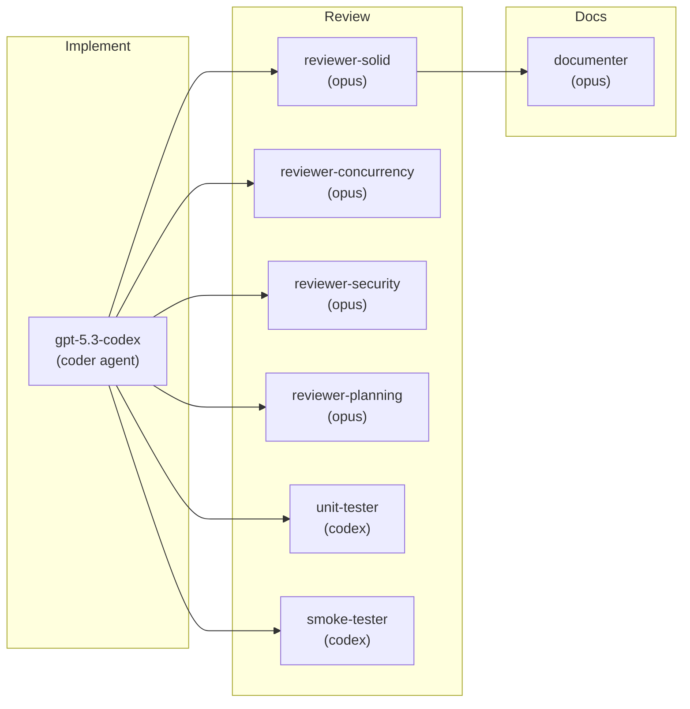
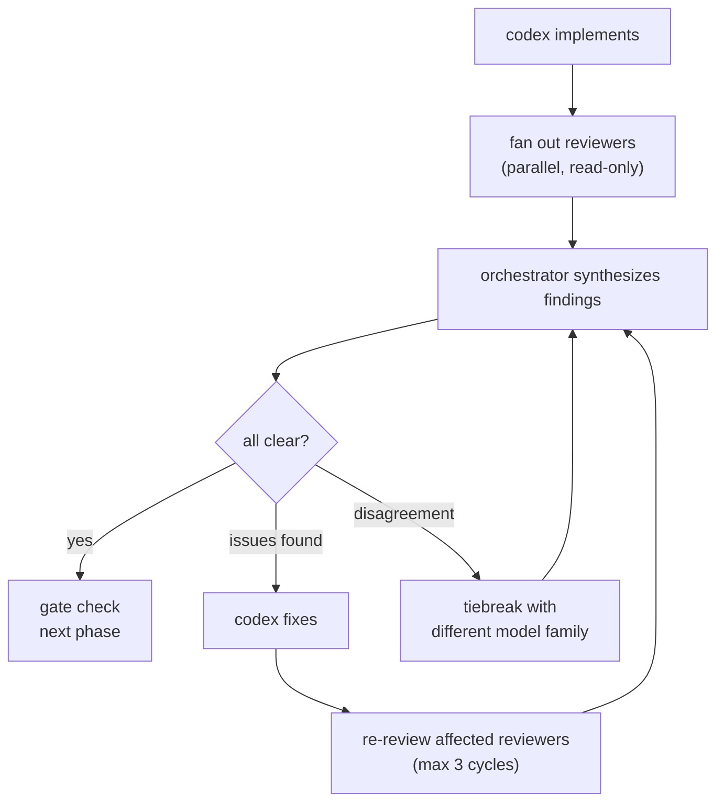
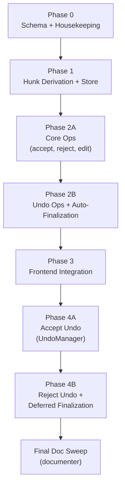

# Collab Review v2: Implementation Plan

**Status:** draft

## Overview

~5,500 lines across ~35 files (15 new, 12 modified, 5 deleted). Split into 5 phases with clear boundaries.

Design docs: `architecture.md` (target architecture), `backend-hunk-authority.md` (data model + API), `proposal-undo.md` (undo system).

## Agent Staffing

### Implementer

All implementation phases use **gpt-5.3-codex** (`codex` alias) via the `coder` agent profile with model override:

```bash
meridian spawn -a coder -m codex -p "Phase N task description" \
  -f _docs/plans/collab-review-v2/spec/plan.md \
  -f _docs/plans/collab-review-v2/spec/backend-hunk-authority.md
```

### Reviewers

Reviewers fan out in parallel after each phase. The reviewer set scales with risk:

| Phase | Risk | Reviewer Agents | Headcount |
|-------|------|-----------------|-----------|
| Phase 0 | Low | reviewer-solid, unit-tester | 2 |
| Phase 1 | Medium | reviewer-solid, reviewer-concurrency, unit-tester, reviewer-planning | 4 |
| Phase 2 | High | reviewer-solid, reviewer-concurrency, reviewer-security, unit-tester, smoke-tester, reviewer-planning | 6 |
| Phase 3 | Medium | reviewer-solid, unit-tester, smoke-tester, reviewer-planning | 4 |
| Phase 4 | High | reviewer-solid, reviewer-concurrency, unit-tester, smoke-tester, reviewer-planning | 5 |
| Final | -- | documenter | 1 |



Reviewer model selection:
- `reviewer-solid`, `reviewer-planning`, `documenter` -- default model (opus)
- `reviewer-concurrency`, `reviewer-security` -- opus (reasoning-heavy)
- `unit-tester`, `smoke-tester` -- codex (needs to write + run code)

### Total Agent Spawns per Phase

| Phase | Implement | Review | Fix | Re-review | Total (est.) |
|-------|-----------|--------|-----|-----------|-------------|
| Phase 0 | 1 | 2 | 0-1 | 0-2 | 3-6 |
| Phase 1 | 1 | 4 | 1 | 2-4 | 8-10 |
| Phase 2 | 2 | 6 | 1-2 | 3-6 | 12-16 |
| Phase 3 | 1 | 4 | 1 | 2-4 | 8-10 |
| Phase 4 | 2 | 5 | 1-2 | 3-5 | 11-14 |
| Final | 0 | 1 | 0 | 0 | 1 |
| **Total** | **7-8** | **22** | **4-7** | **10-21** | **43-57** |

## Review Loop

Every phase follows: implement -> fan out reviewers -> synthesize -> fix -> re-review. Phase gate = reviewer consensus (no blocking issues).



## Phase 0: Schema + Housekeeping (sequential, must complete first)

No hunk logic. Database migration, snapshot TTL fix, ai_content consistency fix.

Tasks:
1. **Migration: `collab_proposal_hunks` table** -- new table with indexes per `backend-hunk-authority.md` data model section. New migration file `NNNN_collab_proposal_hunks.sql`.
2. **Migration: `partially_applied` proposal status** -- add to CHECK constraint on `collab_document_edit_proposals.status`. Same or follow-up migration.
3. **Domain model: `ProposalHunk`** -- new file `backend/internal/domain/models/collab/proposal_hunk.go` with struct and constants per spec.
4. **Table name registration** -- add `CollabProposalHunks` to `TableNames` in `connection.go`.
5. **Snapshot TTL fix** -- remove auto-snapshot cleanup in the cleanup job. Auto-snapshots kept indefinitely.
6. **ai_content consistency** -- in `session_manager.go` persist path: when no pending proposals exist, set `ai_content = content`.

Files: 1-2 new migration files, `proposal_hunk.go` (new), `connection.go`, session manager, cleanup job
Est. lines: ~300

Reviewers:
- `reviewer-solid` -- schema design, domain model consistency with existing patterns
- `unit-tester` -- migration runs clean, domain model serialization

## Phase 1: Backend Hunk Derivation + Store (sequential after Phase 0)

Port the frontend hunk derivation algorithm to Go. Persist hunk records.

Tasks:
1. **go.mod: add diff library** -- `github.com/sergi/go-diff/diffmatchpatch` for character-level diffing
2. **HunkDeriver service** -- new file `backend/internal/service/collab/hunk_deriver.go`. Implements the 3-stage pipeline: text diff -> positioned ops -> merged ops -> grouped hunks. Stateless: takes base Y.Doc bytes + proposal update bytes, returns `[]ProposalHunk`. Per `backend-hunk-authority.md` "Algorithm Port" section.
3. **HunkStore repository** -- new file `backend/internal/repository/postgres/collab_proposal_hunk_store.go`. CRUD for `collab_proposal_hunks` table. Methods: `CreateBatch`, `GetByProposal`, `GetByID`, `UpdateStatus`, `GetPendingCountByProposal`.
4. **Domain interface** -- add `HunkDeriver` and `HunkStore` interfaces to `backend/internal/domain/services/collab/collab.go`.
5. **Wire into ProposalService.CreateProposal** -- after proposal row is persisted, call `HunkDeriver.DeriveHunks`, then `HunkStore.CreateBatch` within the same transaction.
6. **Extend proposal:new broadcast** -- include `hunks[]` array in the `proposal:new` event JSON per spec message format.

Files: `hunk_deriver.go` (new), `hunk_deriver_test.go` (new), `collab_proposal_hunk_store.go` (new), `collab.go`, `proposal_service.go`, `proposal_broadcaster.go`
Est. lines: ~900

Reviewers:
- `reviewer-solid` -- algorithm correctness, interface design, existing pattern consistency
- `reviewer-concurrency` -- transaction boundaries, Y.Doc cloning thread safety
- `unit-tester` -- hunk derivation tests: pure inserts, pure deletes, replacements, adjacent merge, paragraph grouping, UTF-16 edge cases
- `reviewer-planning` -- does the derivation output match what Phase 2 API needs? Does the broadcast format match what Phase 3 frontend expects?

## Phase 2: Hunk API Operations (sequential after Phase 1)

Implement all 7 hunk commands and auto-finalization. This is the highest-risk phase.

Split into two implementation tasks:

**Task 2A: Core operations (accept, reject, edit)**
1. **Hunk applier** -- new file `backend/internal/service/collab/hunk_applier.go`. Port of `buildPartialUpdate` from `partial-apply.ts`. Builds partial Yjs update for a single hunk, applies to live Y.Doc. Handles UTF-16 conversion, text validation (deleted_text matches current doc). Per `backend-hunk-authority.md` "Partial Apply on Backend" section.
2. **Command handlers** -- add `hunk:accept`, `hunk:reject`, `hunk:edit` handlers to project WS handler (alongside existing proposal command handlers in `collab_project.go` or new `collab_hunk_handler.go`).
3. **Idempotency** -- `hunk:accept` and `hunk:edit` use idempotency keys with scope `hunk_accept`, following `collab_request_idempotency` pattern.
4. **Status broadcast** -- `hunk:statusChanged` event after each operation.

**Task 2B: Undo operations + auto-finalization**
1. **Undo handlers** -- `hunk:undo-accept` (mark hunk pending, Y.Doc already reverted by client UndoManager), `hunk:undo-reject` (mark hunk pending).
2. **Batch operations** -- `hunk:accept-all`, `hunk:reject-all` with `hunk:batchResult` event.
3. **Auto-finalization** -- `time.AfterFunc` per proposal when all hunks resolved. Configurable delay (default 5s). Cancel on any hunk returning to pending. Transition proposal to final status (`accepted`, `rejected`, or `partially_applied`). Trigger `ai_content` recompute. Per `backend-hunk-authority.md` "Auto-Finalization" section.
4. **Finalization map** -- track pending finalizations in a map guarded by `proposalDocumentGate` mutex.

Files: `hunk_applier.go` (new), `hunk_applier_test.go` (new), `collab_hunk_handler.go` (new), `collab_project.go`, `proposal_service.go`, `ai_content_projector.go`
Est. lines: ~1400

Reviewers:
- `reviewer-solid` -- handler structure, error handling, code reuse
- `reviewer-concurrency` -- `proposalDocumentGate` usage, `time.AfterFunc` lifecycle, finalization map races, concurrent accept on same proposal
- `reviewer-security` -- input validation (hunkId ownership, document access), idempotency key abuse
- `unit-tester` -- hunk applier tests (text validation, UTF-16, partial update correctness), handler tests (status transitions, idempotency), finalization timer tests
- `smoke-tester` -- end-to-end: create proposal -> accept hunk -> verify Y.Doc state -> verify hunk status. Reject hunk -> finalization fires. Mixed accept/reject -> `partially_applied`.
- `reviewer-planning` -- API contract stability for Phase 3 frontend. Does finalization interact correctly with existing proposal lifecycle?

## Phase 3: Frontend Integration (after Phase 2 API is stable)

Replace frontend-local hunk derivation with server-provided hunks. Replace local partial-apply with WS commands.

Tasks:
1. **Update contracts.ts** -- add `hunk:*` command types and builders. Add `hunks` field to `ProposalNewEvent`. Add `HunkStatusChangedEvent`, `HunkBatchResultEvent` types.
2. **Update useDocumentCollab.ts** -- replace local hunk derivation (Y.Doc clone + delta extraction) with reading `hunks[]` from `proposal:new` event. Replace `applyHunkUpdate` calls with `hunk:accept` / `hunk:edit` / `hunk:reject` WS commands.
3. **Update useInlineReview.ts** -- source hunks from server data instead of local extraction. Handle `hunk:statusChanged` events from server.
4. **Align ReviewHunk type** -- update `types.ts` to match server hunk fields (add `id`, `proposalId`, `status`; keep CM6-specific fields like `decorationFrom`/`decorationTo` as frontend-only enrichment).
5. **Delete dead code** -- remove `changeset-extractor.ts`, `hunk-grouper.ts`, `partial-apply.ts`, `applyHunkUpdate()`.
6. **Lint + build** -- `pnpm run lint`, `pnpm run build` to verify no dead imports.

Files: `contracts.ts`, `useDocumentCollab.ts`, `useInlineReview.ts`, `types.ts`, 3 files deleted
Est. lines: ~800 (mix of additions and deletions)

Reviewers:
- `reviewer-solid` -- React/TS patterns, store consistency, clean deletion
- `unit-tester` -- contract type tests, mock WS message parsing
- `smoke-tester` -- browser test: create AI edit -> verify hunks render -> accept/reject -> verify decorations update
- `reviewer-planning` -- does frontend correctly consume Phase 2 API? Ready for Phase 4 undo integration?

## Phase 4: Undo System (after Phase 3)

Implement UndoManager integration, deferred finalization, reject undo stack. Per `proposal-undo.md`.

Split into two implementation tasks:

**Task 4A: Accept undo (UndoManager)**
1. **Tracked origin** -- in `runtime.ts`, add `"proposal-accept"` to UndoManager `trackedOrigins`.
2. **Apply with origin** -- in `useDocumentCollab.ts`, on receiving `hunk:statusChanged(accepted)` confirmation, apply the partial update locally with `doc.transact(() => { ... }, "proposal-accept")` so UndoManager captures it.
3. **Stack-item metadata** -- attach `hunkId`/`proposalId` to stack items via `stack-item-added` event. Read on `stack-item-popped`.
4. **Unresolve effect** -- add `unresolveHunk` StateEffect to `review/state.ts`. Wire `stack-item-popped` to dispatch `unresolveHunk` + send `hunk:undo-accept` WS command.

**Task 4B: Reject undo + deferred finalization**
1. **Reject undo stack** -- lightweight local stack in `useInlineReview`. On reject: push `{ type, hunkId, proposalId, timestamp }`. On Ctrl-Z: compare timestamps with UndoManager top to determine which to pop.
2. **Deferred finalization** -- replace `maybeAutoFinalize` with `enterAllResolvedState` (starts deferral window) and `finalize` (actual cleanup). Triggers: navigate away, first keystroke, explicit button, 30s timeout. Per `proposal-undo.md` "Deferred Finalization" section.
3. **Review lifecycle state machine** -- Idle -> Reviewing -> AllResolved -> Finalized. AllResolved -> Reviewing on undo.
4. **Cleanup on finalize** -- clear reject undo stack, clear CM6 review state, clear `activeProposalIdsRef`.

Files: `runtime.ts`, `useDocumentCollab.ts`, `useInlineReview.ts`, `review/state.ts`
Est. lines: ~700

Reviewers:
- `reviewer-solid` -- state machine clarity, hook complexity, clean separation
- `reviewer-concurrency` -- timer lifecycle, race between undo and finalization, race between UndoManager pop and WS confirmation
- `unit-tester` -- undo ordering tests (accept A -> accept B -> undo = B undone), mixed accept/reject undo (accept A -> reject B -> undo = B restored), finalization trigger tests
- `smoke-tester` -- browser test: accept hunk -> Ctrl-Z -> hunk reappears. Reject hunk -> Ctrl-Z -> hunk reappears. All resolved -> wait 30s -> finalized.
- `reviewer-planning` -- does the undo system work correctly with backend hunk authority from Phase 2? Edge cases from `proposal-undo.md` covered?

## Dependency Graph



All phases are sequential. Within Phase 2 and Phase 4, tasks A and B are sequential (B depends on A). No parallel phases -- each phase changes the same core files.

## Total Estimates

| Phase | Est. Lines | Risk |
|-------|-----------|------|
| Phase 0 | ~300 | Low |
| Phase 1 | ~900 | Medium |
| Phase 2 | ~1400 | High |
| Phase 3 | ~800 | Medium |
| Phase 4 | ~700 | High |
| **Total** | **~4100 net** | |

## Execution Strategy

1. **One worktree, sequential phases.** No parallel branches -- the phases modify overlapping files and each builds on the previous.
2. **Review gates are reviewer consensus.** All reviewers for a phase must report no blocking issues before proceeding to the next phase.
3. **Fix cycles capped at 3.** If a phase does not converge after 3 implement-review-fix cycles, escalate to the user for a design decision.
4. **Smoke tests run against a live dev server.** The smoke-tester agent uses `./scripts/restart-server.sh` and curl/browser automation to verify end-to-end behavior.
5. **Final doc sweep.** After Phase 4, a documenter agent updates `_docs/technical/collab/` to reflect the new architecture (inline-review.md, ai-edit-flow.md, ai-content-projection.md, yjs-state-lifecycle.md).

## Pre-Requisites

- **ws-transport-v2 Stage 1** must be complete (per-document WS is the transport for hunk-level events). Currently in-progress on a separate branch.
- **Dev environment running** with local Supabase for migration testing.

## Related

- [architecture.md](./architecture.md) -- Target architecture and sequence diagrams
- [backend-hunk-authority.md](./backend-hunk-authority.md) -- Backend hunk data model and API spec
- [proposal-undo.md](./proposal-undo.md) -- Undo system design
- [ws-transport-v2 plan](../../ws-transport-v2/spec/plan.md) -- Transport prerequisite (template for this plan)
