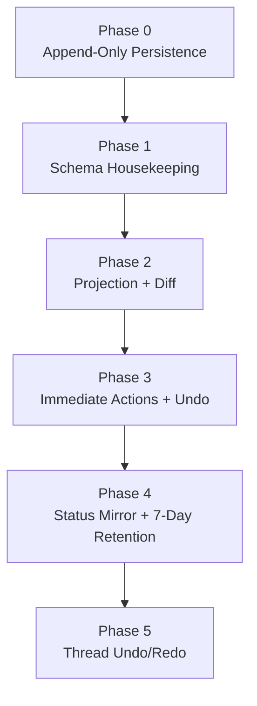

# Implementation Plan

**Status:** draft

## Locked Decisions

| # | Decision | Detail |
|---|----------|--------|
| 1 | One canonical Y.Doc | Canonical state lives in `Y.Text('content')` and `Y.Map('_review_status')`. |
| 2 | Ephemeral projection | Diff view is `clone(canonical) + apply(pending proposal updates) + diff + group`. |
| 3 | Hunk identity | Hunks are grouped text regions with contributing proposal sets. |
| 4 | Accept is immediate | Apply all grouped hunk proposal updates and set `_review_status[proposalId]='accepted'` in one transaction. |
| 5 | Reject is immediate | Set `_review_status[proposalId]='rejected'` for all proposals in the grouped hunk. |
| 6 | Edit is plain typing | Edit is reject + type or accept + modify with `ORIGIN_HUMAN`; no separate review-edit status value. |
| 7 | Unified UndoManager | One stack over `[Y.Text('content'), Y.Map('_review_status')]`. |
| 8 | Undo boundaries | Keep single UndoManager; call `clear()` on review mode entry and exit. |
| 9 | Projection GC | Every recompute auto-marks no-diff pending proposals as `stale`. |
| 10 | Status chain | `edit_tool -> proposal -> yjs_update -> status` is always current in backend row and thread UI. |
| 11 | 7-day retention | Server job removes old `_review_status` entries older than 7 days. |
| 12 | Thread undo | Use `region_text_before/after` text replacement; no Yjs inverse/snapshot dependency. |
| 13 | Thread undo map behavior | Thread undo/redo does not mutate `_review_status`; it mutates canonical text and proposal row status (`reverted`/`accepted`). |

## Phases

### Phase 0: Append-Only Persistence

Goal: keep existing append-only checkpoint model workstream as foundation.

### Phase 1: Schema Housekeeping

Tasks:
1. Ensure proposal table supports `pending`, `accepted`, `rejected`, `stale`, `reverted`.
2. Add `created_by_user_id` and `decided_at` to proposal schema.
3. Ensure `region_text_before` and `region_text_after` are present and documented as captured at proposal creation.
4. Remove `ai_content` from document schema and consumers.

### Phase 2: Projection + Diff Pipeline

Tasks:
1. Implement projection derivation from canonical + pending proposal updates with region tracking.
2. Diff into raw hunks, then group nearby/overlapping hunks into user-facing regions.
3. Attach contributing proposal sets and update references to each grouped hunk.
4. Re-derive on canonical text, `_review_status`, or proposal-set changes.
5. Run projection GC on each recompute and auto-mark no-diff proposals as `stale`.
6. Render CM6 decorations for grouped hunk actions.

### Phase 3: Immediate Review Actions + Session Undo

Tasks:
1. Wire grouped hunk accept/reject to immediate Yjs transactions.
2. Ensure hunk accept performs multi-update text apply + status writes atomically.
3. Initialize a single UndoManager over text + status map.
4. Keep `undoManager.clear()` on review mode entry/exit.
5. Verify one Ctrl-Z undoes the whole grouped hunk transaction.
6. Verify interleaved undo/redo across typing and review actions.

### Phase 4: Backend Status Mirror + 7-Day Retention

Tasks:
1. Mirror `_review_status` changes into proposal row status.
2. Persist decision timestamps for retention eligibility.
3. Implement background cleanup that removes `_review_status` entries older than 7 days.
4. Verify aged-out reject undo attempts no-op safely.

### Phase 5: Thread-Level Undo/Redo

Tasks:
1. Implement `thread:undo` (`accepted -> reverted`) via `region_text_after -> region_text_before` replacement.
2. Implement `thread:redo` (`reverted -> accepted`) via reverse replacement.
3. Apply undo/redo as canonical Yjs updates appended to `document_updates`.
4. Return conflict when target region no longer exists.

## Dependency Graph

## Risk Summary

| Phase | Risk | Notes |
|------|------|-------|
| 1 | Low | Mostly schema cleanup |
| 2 | Medium | Diff quality and UI derivation correctness |
| 3 | Medium | Transaction and undo boundary correctness |
| 4 | Medium | Status mirror consistency and retention safety |
| 5 | Low | Deterministic text replacement with conflict handling |

## Cross-References

- [Architecture](architecture.md)
- [Dual-Version Yjs Model](dual-version-yjs-model.md)
- [Frontend Diff Model](frontend-diff-model.md)
- [Local-First Authority](local-first-authority.md)
- [Review Undo Design](review-undo-design.md)
- [Schema Design](schema-design.md)
- [Thread-Level Undo](thread-level-undo.md)
