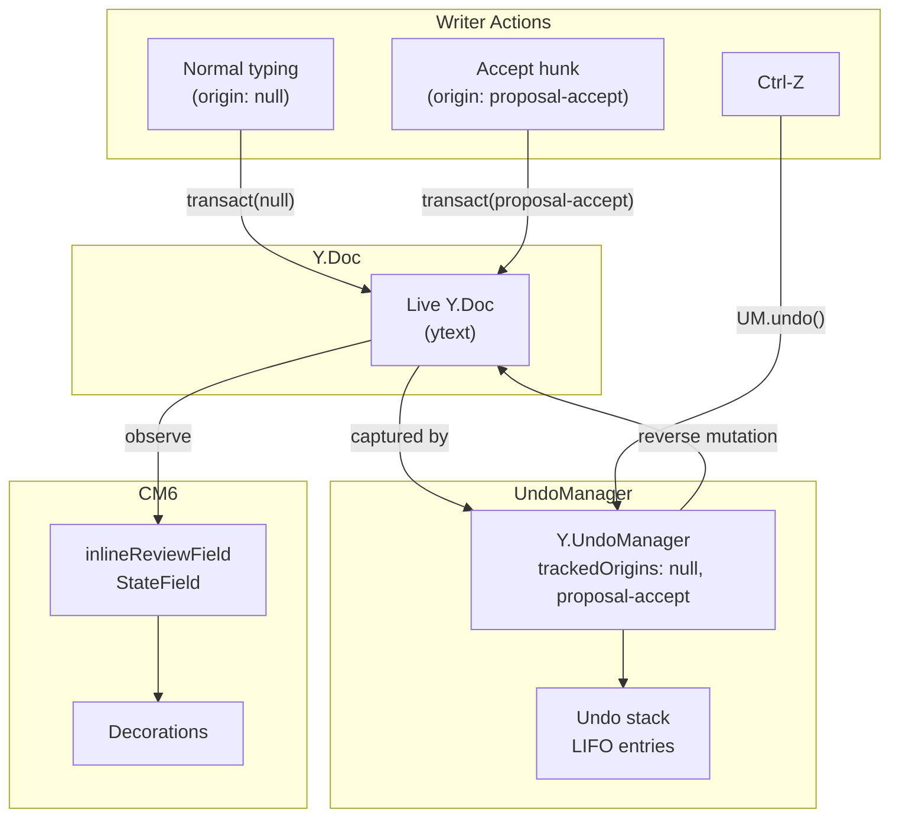
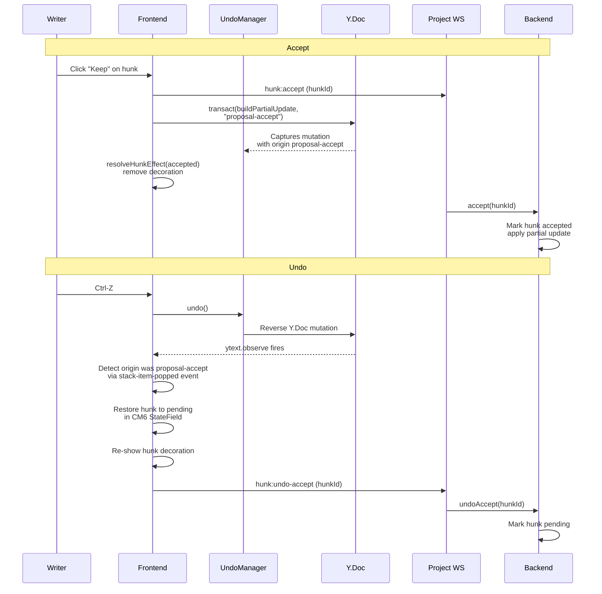
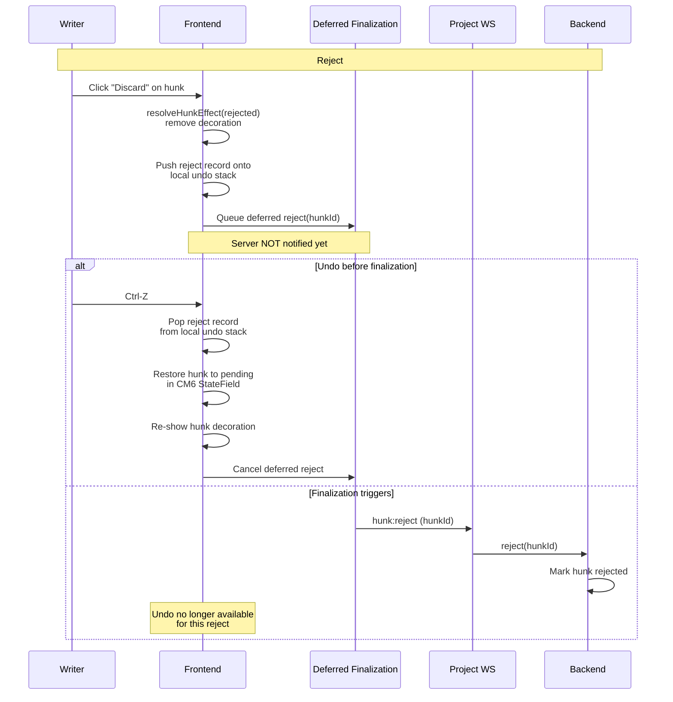
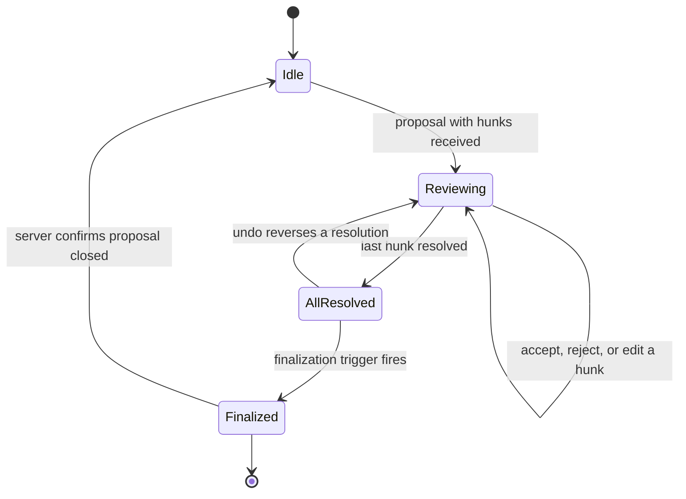

# Proposal Undo System

**Status**: draft

## Why Undo Matters for Fiction Writers

Fiction review is iterative. A writer accepts an AI rewrite of a paragraph, reads it in context, and realizes the original voice was better. Or they reject a hunk, reconsider, and want it back. Without undo, every hunk decision is permanent -- the writer must manually retype deleted text or re-request the AI edit. This breaks creative flow and makes writers conservative about accepting changes.

Three scenarios drive this design:

1. **Accidental accept** -- the writer clicks "Keep" on a bad AI rewrite. The original text is gone from the Y.Doc. Today there is no recovery short of a snapshot restore.
2. **Compare before/after** -- the writer wants to toggle between the original and proposed text to judge which reads better. Undo/redo provides this naturally.
3. **Iterative review** -- accept a hunk, read surrounding context, decide it does not work, undo, try the next hunk instead. This is how writers actually review edits.

## Current State

| Operation | What happens today | Undo support |
|-----------|-------------------|--------------|
| Accept hunk | `buildPartialUpdate()` creates a Yjs update, `Y.applyUpdate(doc, update)` applies it with no origin | None -- mutation is permanent |
| Reject hunk | `resolveHunkEffect(view, id, "rejected")` in CM6 state only. No Y.Doc mutation | None -- `maybeAutoFinalize` sends `proposal:reject` immediately |
| Edit hunk | Same as accept but with `buildEditedHunkUpdate()` | None |
| All resolved | `maybeAutoFinalize` sends `proposal:reject` and calls `clearReviewEffect` | State is gone |

Key code locations:

- `Y.applyUpdate` without origin: `frontend/src/features/documents/hooks/useDocumentCollab.ts:465`
- `maybeAutoFinalize`: `frontend/src/features/documents/hooks/useInlineReview.ts:228-282`
- Existing `UndoManager` (tracks only normal typing): `frontend/src/core/cm6-collab/sync/runtime.ts:98`

## UndoManager Integration

### Existing UndoManager

The `CollabSyncRuntime` already creates a `Y.UndoManager` for normal typing undo:

```
// runtime.ts:98
this.undoManager = new Y.UndoManager(this.ytext);
```

This UndoManager tracks changes with no explicit origin (the default `null` origin), which covers all normal typing through `y-codemirror.next`. The `yUndoManagerKeymap` binds Ctrl-Z / Ctrl-Shift-Z to this UndoManager.

### Adding Proposal-Accept Tracking

To make proposal-accept mutations undoable, the existing UndoManager needs to also track the `"proposal-accept"` origin:

```
this.undoManager = new Y.UndoManager(this.ytext, {
  trackedOrigins: new Set([null, "proposal-accept"]),
});
```

When `applyHunkUpdate` applies a partial update, it must use `doc.transact()` with this origin instead of bare `Y.applyUpdate()`:

```
// Instead of: Y.applyUpdate(doc, update)
doc.transact(() => {
  Y.applyUpdate(doc, update);
}, "proposal-accept");
```

### Single Stack vs Separate Stacks

**Decision: single unified stack.**

| Option | Pros | Cons |
|--------|------|------|
| Single stack | Ctrl-Z always undoes the most recent action (intuitive). No special keybinding needed. Writer does not need to learn two undo systems. | Typing interleaved with accepts creates mixed undo entries. |
| Separate stacks | Proposal undo never interferes with typing undo. | Requires a separate keybinding (e.g. Ctrl-Alt-Z). Writers must remember which undo to use. |

The single stack is correct because the Yjs UndoManager's `captureTimeout` (default 500ms) naturally groups rapid keystrokes into one undo entry. A hunk accept is a discrete action separated in time from typing, so it gets its own stack entry. The LIFO ordering is exactly what the writer expects: accept hunk A, accept hunk B, Ctrl-Z undoes B, Ctrl-Z again undoes A.

### Undo Data Flow



## Accept then Undo Accept Flow



### Identifying Which Hunk Was Undone

When the UndoManager pops a stack item, the frontend needs to know which hunk it corresponds to. Use the `stack-item-added` event to attach hunk metadata:

```
undoManager.on("stack-item-added", (event) => {
  if (event.origin === "proposal-accept") {
    event.stackItem.meta.set("hunkId", currentHunkId);
    event.stackItem.meta.set("proposalId", currentProposalId);
  }
});
```

On `stack-item-popped`, read the metadata to determine which hunk to restore to pending.

## Reject then Undo Reject Flow

Reject never mutates the Y.Doc, so the UndoManager is not involved. Instead, undo relies on **deferred finalization** -- the server is not notified of the rejection until the writer moves on.



### Reject Undo Stack

Since reject has no Y.Doc mutation, the Yjs UndoManager cannot track it. A separate lightweight stack in the `useInlineReview` hook tracks reject operations:

- On reject: push `{ type: "reject", hunkId, proposalId, timestamp }` onto the reject undo stack.
- On Ctrl-Z: check the reject undo stack first. If the top entry is more recent than the UndoManager's top entry, pop the reject stack instead of calling `undoManager.undo()`.
- This ensures LIFO ordering across both accept and reject undos: accept A, reject B, Ctrl-Z undoes the reject of B, Ctrl-Z again undoes the accept of A.

## Deferred Finalization

### Problem

Today, `maybeAutoFinalize` (see `useInlineReview.ts:228`) immediately sends `proposal:reject` when all hunks are resolved. This destroys all review state, making undo impossible.

### Design

Replace immediate finalization with a deferred model. When all hunks are resolved, enter an "all-resolved" state but do not close the proposal on the server. Keep the review data available for undo operations.

### Finalization Triggers

| Trigger | Description |
|---------|-------------|
| User navigates away | Document switch or route change |
| User starts typing new content | First keystroke after all-resolved (not an undo) |
| Explicit "Done reviewing" | Button in the review toolbar |
| Timeout | 30 seconds of inactivity after all-resolved |

### Review Lifecycle State Machine



### What Finalization Does

1. Send per-hunk status to the server (accepted hunks are already applied via Yjs sync; server closes proposal when all hunks are resolved).
2. Clear the Yjs UndoManager entries for proposal-accept origins (call `undoManager.clear()` is too aggressive -- instead, allow them to age out naturally or be overwritten).
3. Clear the reject undo stack.
4. Clear CM6 review state via `clearReviewEffect`.
5. Clear `activeProposalIdsRef`.

### Implementation Location

The deferred finalization timer and trigger detection live in `useInlineReview`. The `maybeAutoFinalize` function is replaced by `enterAllResolvedState` which starts the deferral window, and `finalize` which performs the actual cleanup.

## CM6 State Integration

### Problem

When the UndoManager reverses a Y.Doc mutation (undo-accept), or when a reject is undone from the local stack, the CM6 `inlineReviewField` must restore the hunk to pending and re-show its decorations. The field currently has no mechanism for this.

### Approach: New StateEffect for Undo

Add a new `unresolveHunk` StateEffect to the existing effect set in `review/state.ts`:

```
export const unresolveHunk = StateEffect.define<{ hunkId: string }>();
```

The `inlineReviewField` update function handles this by removing the hunk from the `resolutions` map, restoring it to pending.

### Wiring UndoManager Events to CM6

The `useInlineReview` hook listens for `stack-item-popped` on the UndoManager. When a popped item has `meta.get("hunkId")`, the hook dispatches `unresolveHunk` to the CM6 state and sends `hunk:undo-accept` to the server.

For reject undo, the hook's own reject undo stack triggers the same `unresolveHunk` dispatch directly.

### Sequence: Undo Accept Restoring Decorations

1. `undoManager.undo()` reverses the Y.Doc mutation.
2. `stack-item-popped` event fires with `{ meta: { hunkId, proposalId } }`.
3. Hook reads hunkId from meta, dispatches `unresolveHunk({ hunkId })`.
4. `inlineReviewField` removes hunkId from `resolutions` map.
5. Decoration provider sees the hunk is no longer resolved, rebuilds decorations for it.
6. Hunk decoration re-appears in the editor.

## Edge Cases

### Typing Between Accept and Undo

**Scenario**: Writer accepts hunk A (inserts 50 chars), types 10 chars of new text, presses Ctrl-Z.

**Behavior**: The first Ctrl-Z undoes the typing (the UndoManager's most recent entry is the typing batch). The second Ctrl-Z undoes hunk A's accept. This is correct LIFO behavior -- the writer's own typing is reversed first, then the hunk accept.

The `captureTimeout` (500ms) ensures the typing is captured as a separate entry from the hunk accept, since the accept and the first keystroke are separated by at least the time it takes the writer to move their hands from mouse to keyboard.

### Undo Ordering: Accept A, Accept B, Ctrl-Z

**Behavior**: Ctrl-Z undoes B (LIFO). The UndoManager stack contains `[..., A-accept, B-accept]`. Popping reverses B's Y.Doc mutation. The `stack-item-popped` event carries B's hunkId via meta, so the hook knows to unresolve B specifically.

### Accept A, Reject B, Ctrl-Z

**Behavior**: The reject undo stack has `[B-reject]` and the UndoManager stack has `[..., A-accept]`. The reject of B happened after the accept of A (by timestamp). The hook compares timestamps: reject B's timestamp > UndoManager top entry timestamp, so Ctrl-Z pops the reject stack (undoes B's reject). Next Ctrl-Z pops the UndoManager (undoes A's accept).

### Undo Window Expiration During Review

**Scenario**: Writer resolves all hunks, walks away, comes back after the 30s timeout.

**Behavior**: The deferred finalization timer fires, sending all hunk statuses to the server and clearing review state. Ctrl-Z now operates on the normal typing undo stack only. The hunk accept mutations remain in the UndoManager's undo stack (Yjs does not distinguish them from typing after finalization), but undoing them would create an inconsistent state since the server has already closed the proposal.

**Mitigation**: On finalization, call `undoManager.stopCapturing()` to ensure a clean break. The proposal-accept entries naturally age out of the stack as the writer continues typing. Optionally, the hook can clear UndoManager entries with proposal-accept meta if the Yjs API supports selective removal (it does not today -- entries age out via the stack's natural LIFO behavior).

### Network Failure During Undo

**Scenario**: Writer presses Ctrl-Z to undo an accept. The Y.Doc mutation is reversed locally (UndoManager operates on the local doc). The `hunk:undo-accept` message fails to send.

**Behavior**: The local Y.Doc state is correct (mutation reversed). The Yjs CRDT sync will propagate the reversal to the server on next successful binary frame -- the undo is itself a Y.Doc mutation that flows through the normal sync channel. The `hunk:undo-accept` WS command is for the hunk status record only. If it fails, add it to a retry queue (similar to `pendingRejectsRef` pattern in `useDocumentCollab.ts:118`).

### Concurrent Edits During Review

**Scenario**: Another user (or a second tab) edits the document while hunks are pending.

**Behavior**: Yjs CRDTs handle concurrent edits. The UndoManager's undo correctly reverses only the tracked operations, even if other operations were interleaved. This is a core Yjs guarantee -- the UndoManager uses operation-level tracking, not snapshot diffing.

## Interaction with Backend Hunk Authority

The target architecture (see `_docs/plans/collab-review-v2/spec/architecture.md`) moves hunk derivation and state to the backend. This affects undo in several ways:

| Aspect | Frontend-only (current) | Backend-authoritative (target) |
|--------|------------------------|-------------------------------|
| Accept mutation | Frontend builds partial update, applies locally | Backend builds partial update, applies to server Y.Doc, broadcasts via Yjs sync |
| UndoManager captures | Frontend-side Y.Doc mutation with tracked origin | Remote update arrives -- UndoManager does NOT capture remote updates by default |
| Undo mechanism | `undoManager.undo()` reverses local mutation | Must use server-side undo or client-side tracked origin on the apply |
| Reject state | CM6 StateField only | Backend hunk record |

### Key Implication

In the backend-authoritative model, the partial update arrives as a remote Yjs sync message, not a local transaction. The UndoManager does not track remote updates. Two approaches:

1. **Client-side re-apply with origin**: The backend broadcasts the hunk status change. The frontend, on receiving confirmation, applies the partial update locally with `"proposal-accept"` origin so the UndoManager captures it. The backend's Yjs update and the frontend's local apply produce the same CRDT state (idempotent).

2. **Server-side undo**: The `hunk:undo-accept` command triggers the backend to reverse the partial update on the server Y.Doc. The reversal propagates via Yjs sync. No client-side UndoManager needed for proposal operations.

**Recommendation**: Option 1 for the initial implementation. It reuses the existing UndoManager infrastructure and keeps undo latency low (no round-trip). Option 2 can be added later for multi-user scenarios where the server must be the undo authority.

## Implementation Phases

| Phase | Scope | Depends on |
|-------|-------|-----------|
| 1. Tracked origin for accept | Add `"proposal-accept"` origin to `applyHunkUpdate`. Add origin to UndoManager `trackedOrigins`. | None -- can ship independently |
| 2. Stack-item metadata | Attach hunkId/proposalId to UndoManager stack items via `stack-item-added`. Read on `stack-item-popped`. | Phase 1 |
| 3. Unresolve effect | Add `unresolveHunk` StateEffect. Wire UndoManager pop events to CM6 dispatch. | Phase 2 |
| 4. Deferred finalization | Replace `maybeAutoFinalize` with deferred model. Implement triggers and timer. | Phase 3 |
| 5. Reject undo stack | Add lightweight reject undo stack. Implement timestamp-based interleaving with UndoManager. | Phase 4 |
| 6. Backend hunk authority integration | Adapt undo to work with server-provided hunk status changes. | Phases 1-5 + backend hunk API |

## Files Changed

| File | Change |
|------|--------|
| `frontend/src/core/cm6-collab/sync/runtime.ts` | Add `"proposal-accept"` to `trackedOrigins` in UndoManager constructor |
| `frontend/src/features/documents/hooks/useDocumentCollab.ts` | Wrap `Y.applyUpdate` in `doc.transact()` with `"proposal-accept"` origin |
| `frontend/src/core/cm6-collab/review/state.ts` | Add `unresolveHunk` StateEffect and handler in `inlineReviewField` |
| `frontend/src/features/documents/hooks/useInlineReview.ts` | Replace `maybeAutoFinalize` with deferred model. Add UndoManager event listeners. Add reject undo stack. |
| `frontend/src/core/cm6-collab/review/partial-apply.ts` | Accept an optional `origin` parameter to pass through to `transact()` |

## Related

- [architecture.md](./architecture.md) -- Target architecture with backend hunk authority
- [phase-2-history-and-undo.md](../../collab-ai/phase/phase-2-history-and-undo.md) -- Original UndoManager implementation
- [phase-5-proposal-review-redesign.md](../../collab-ai/phase/phase-5-proposal-review-redesign.md) -- Inline review UI that this builds on
