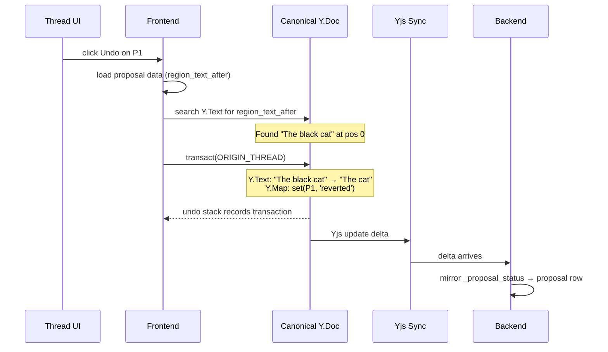

# Thread-Level Undo

## Overview

Thread-level undo lets the writer revert or reapply any individual AI edit through the conversation thread UI. Each AI `edit_document` call produces one proposal — the writer can undo or reapply that specific proposal at any time, regardless of how it was originally applied.

This works in both collaboration modes:
- **Auto-apply**: the edit landed automatically — writer clicks undo in thread UI to revert it
- **Manual**: the writer accepted or rejected a hunk containing the proposal — later clicks undo/reapply in thread UI

It persists across sessions and works days or weeks later, as long as the target text hasn't been modified.



Thread ops are **local-first** — the frontend applies the transaction directly, same as accept/reject hunk. `ORIGIN_THREAD` is tracked by UndoManager, so the operation enters the session undo stack. Auto-apply (AI writing) arrives as a remote update and is NOT in the undo stack.

It is separate from session Ctrl-Z:
- Session Ctrl-Z uses local UndoManager state and is ephemeral.
- Thread-level undo/reapply uses persisted proposal text regions and status-gated backend commands.

## Storage

Thread-level operations use fields on `${TABLE_PREFIX}proposals`:

| Column | Type | Purpose |
|---|---|---|
| `region_text_before` | `TEXT NULL` | Captured at proposal creation from `edit_document` find text |
| `region_text_after` | `TEXT NULL` | Captured at proposal creation from `edit_document` replacement text |
| `status` | `TEXT` | Gates which operations are available |

No dedicated thread-undo table is required.

## Operations

All thread operations use the same text find-and-replace mechanism:

| Operation | Source status | Find | Replace with | Target status |
|-----------|-------------|------|-------------|---------------|
| Undo | `accepted` | `region_text_after` | `region_text_before` | `reverted` |
| Reapply | `reverted` | `region_text_before` | `region_text_after` | `accepted` |
| Reapply | `rejected` | `region_text_before` | `region_text_after` | `accepted` |

All three operations are the same mechanism with different source/target statuses. If the find text is not found in canonical, the operation returns a conflict.

## Undo Flow (`accepted -> reverted`)

1. User clicks Undo on tool call in thread UI.
2. Frontend loads proposal data (`region_text_after`, `region_text_before`).
3. Search local `Y.Text('content')` for `region_text_after`.
4. If found, transact with `ORIGIN_THREAD`:
   - Delete match and insert `region_text_before` on `Y.Text('content')`.
   - Set `_proposal_status[proposalId] = 'reverted'` on `Y.Map('_proposal_status')`.
5. Transaction enters session undo stack (Ctrl-Z can reverse it).
6. Yjs sync delivers delta to backend; backend mirrors status to proposal row.
7. If not found, show conflict in thread UI.

## Reapply Flow (`reverted -> accepted` or `rejected -> accepted`)

1. User clicks Reapply on tool call in thread UI.
2. Frontend loads proposal data (`region_text_before`, `region_text_after`).
3. Search local `Y.Text('content')` for `region_text_before`.
4. If found, transact with `ORIGIN_THREAD`:
   - Delete match and insert `region_text_after` on `Y.Text('content')`.
   - Set `_proposal_status[proposalId] = 'accepted'` on `Y.Map('_proposal_status')`.
5. Transaction enters session undo stack (Ctrl-Z can reverse it).
6. Yjs sync delivers delta to backend; backend mirrors status to proposal row.
7. If not found, show conflict in thread UI.

## Thread-Level Undo All

Writers can undo all proposals in a thread at once. This iterates through each `accepted` proposal in the thread in **reverse chronological order** (newest first) and attempts to undo it individually.

- Reverse order minimizes avoidable conflicts — a later proposal may have edited text introduced by an earlier one, so undoing newest first succeeds where oldest first would conflict.
- Each proposal is independent — some may succeed while others conflict.
- Per-proposal results (success or conflict) are returned to the UI.
- Proposals that conflict stay `accepted`; successfully undone proposals become `reverted`.

## Thread UI: Immutable History + Status Overlay

Thread messages (tool_use, tool_result) are **immutable**. Thread-level undo/reapply does not modify conversation history. This preserves prompt caching and conversation integrity.

Instead, the thread UI renders a **status overlay** on each `edit_document` tool call by reading the associated proposal's current status from the proposal row:

```
Tool call: edit_document("insert black before cat")
  tool_result: "Edit applied successfully"     ← immutable, never changes
  overlay: [Undo]                               ← from proposal.status = 'accepted'

After writer clicks Undo:
  tool_result: "Edit applied successfully"     ← still immutable
  overlay: [Undone] [Reapply]                   ← from proposal.status = 'reverted'

After conflict:
  tool_result: "Edit applied successfully"     ← still immutable
  overlay: [Undo failed — text was edited]      ← transient UI state
```

The overlay is purely derived from proposal row status. No writes to thread/message storage.

## Relationship to `_proposal_status`

Thread-level undo/reapply writes to `_proposal_status` Y.Map in the same transaction as the text mutation. This keeps the Y.Map, proposal row (via backend mirror), and canonical text in sync.

- `_proposal_status` values: `accepted`, `rejected`, `stale`, `reverted`
- Thread undo sets `_proposal_status[P1] = 'reverted'`
- Thread reapply sets `_proposal_status[P1] = 'accepted'`
- Backend mirrors the Y.Map change to the proposal row through the standard sync path — no direct row writes needed

Reverted proposals are not projection inputs. After accept, proposal CRDT items were already applied to canonical; thread undo then replaces canonical text. There is no remaining pending proposal update to project.

## Differences from Session Ctrl-Z

| Concern | Session Ctrl-Z | Thread-level undo/reapply |
|---|---|---|
| Trigger | Editor keyboard action | Click in thread UI |
| Scope | Recent local history | One persisted proposal |
| Mechanism | UndoManager over Yjs shared types | Text find-and-replace using stored regions |
| Origin | `ORIGIN_HUMAN`, `ORIGIN_ACCEPT`, `ORIGIN_REJECT` | `ORIGIN_THREAD` |
| Status writes | `_proposal_status` Y.Map | `_proposal_status` Y.Map (same) |
| In undo stack | Yes | Yes (user-initiated, tracked origin) |
| Thread history | N/A | Immutable — status shown as UI overlay |
| Persistence | No (undo stack is session-scoped) | Yes (Y.Map + text change persist via Yjs sync) |
| Failure mode | No-op on empty stack | Conflict when target region missing |

### Example: Undo, Reapply, and Conflict

```
Original: "The cat sat on the mat."
Agent proposes P1: insert "black " → region_text_before="The cat", region_text_after="The black cat"
Writer accepts P1 (or auto-applied).
Canonical: "The black cat sat on the mat."
```

**Undo (days later):**

```
1. Load P1 (status = accepted)
2. Search canonical for "The black cat" → found at pos 0
3. Replace with "The cat"
4. Canonical: "The cat sat on the mat."
5. P1 status → reverted
6. Thread UI: tool call shows [Undone] [Reapply]
```

**Reapply (from reverted):**

```
1. Load P1 (status = reverted)
2. Search canonical for "The cat" → found at pos 0
3. Replace with "The black cat"
4. Canonical: "The black cat sat on the mat."
5. P1 status → accepted
6. Thread UI: tool call shows [Undo]
```

**Reapply (from rejected):**

```
Writer rejected P1 in manual mode. Canonical still has "The cat".
Writer later clicks Reapply in thread UI:
  1. Load P1 (status = rejected)
  2. Search canonical for "The cat" → found at pos 0
  3. Replace with "The black cat"
  4. Canonical: "The black cat sat on the mat."
  5. P1 status → accepted
  6. Thread UI: tool call shows [Undo]
```

**Conflict (writer edited the region):**

```
After accepting P1, writer manually changed "black cat" to "big black cat."
Canonical: "The big black cat sat on the mat."

Writer clicks Undo for P1:
  1. Search for "The black cat" → NOT FOUND
  2. Return conflict: text has been modified since accept
  3. Thread UI: tool call shows [Undo failed — text was edited]
```

## Design Rationale: Text Search over Yjs Inverse

Thread-level undo uses text find-and-replace rather than Yjs inverse operations because:

- **Survives compaction**: text search only needs current document content, while Yjs inverse depends on CRDT item IDs that may be GC'd during compaction
- **Natural conflict detection**: text not found = conflict, no additional checks needed
- **Simple implementation**: string search vs hooking into Yjs UndoManager internals

The tradeoff is ambiguity when identical text appears multiple times (rare for fiction writing, mitigated by storing sufficient context in region strings).

## Cross-References

- [Session Undo Design](session-undo-design.md)
- [Architecture](architecture.md)
- [Schema Design](schema-design.md)
- [Implementation Plan](plan.md)
